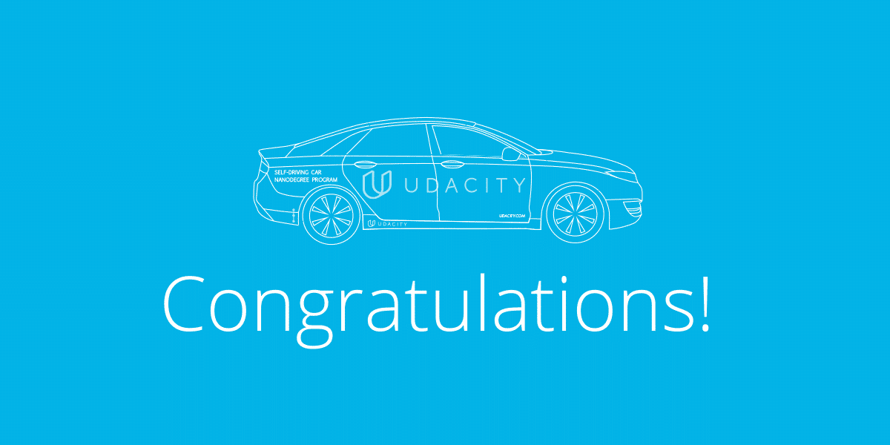
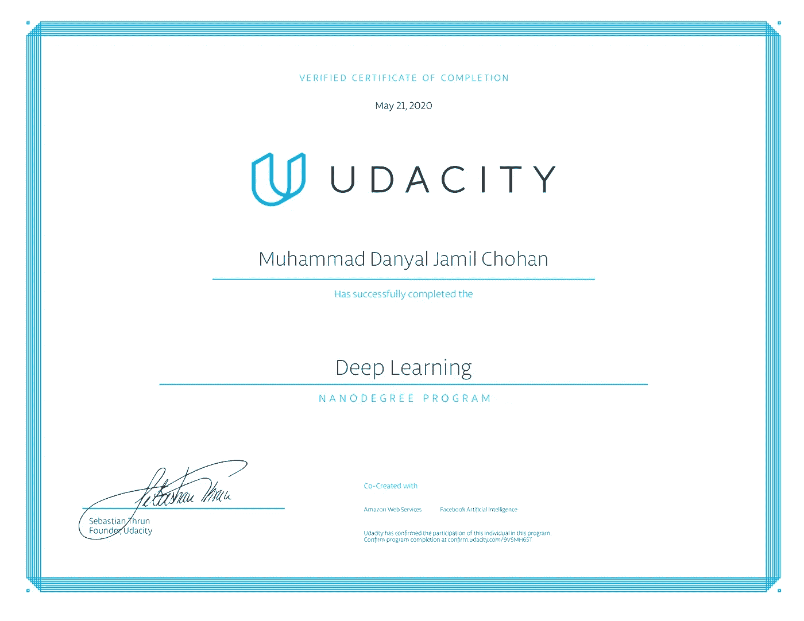

# 21 天深度学习纳米学位？！

> 原文：<https://medium.com/quick-code/deep-learning-nanodegree-in-21-days-5f82f3437cad?source=collection_archive---------2----------------------->

和我一起庆祝吧。

欢迎欢迎欢迎你们。这是我的第十五篇文章，也可能是这方面的最后一篇，因为我终于从 Udacity 的深度学习纳米学位毕业了。

# 我的旅程

想了解我开始攻读学位时的想法吗？它们在下面的这篇文章里，如果你喜欢，可以读一读。

 [## 一个月完成深度学习纳米学位

### 所以，这个故事是从我在 2019 年 11 月开始了解深度学习纳米学位开始的。我看到了…

medium.com](/@D3nii/completing-the-deep-learning-nanodegree-in-a-month-387ed91b43e8) 

## 我

现在让我告诉你们更多关于我的事情。作为一名大一软件工程专业的学生，我几乎没有接触过这个世界，我总是认为纳米学位对我来说是不可完成的事情，因为它需要一个人对我当时甚至没有听说过的概念有基本的理解。

我曾经在网上搜索人们在完成学位后的想法，我读得越多，就越觉得自己不配拥有 T11。我在 *Quora* 和 *Medium* 上读过一些文章，其中大部分都是这样写的:“*为了解决困难，你必须在数学、概率等等方面有所突破”。现在，我既不是爱因斯坦，也不是安德鲁·吴(Andrew NG)*的好朋友。我几乎不知道概率如何应用于现实世界，微分方程也是我讨厌的课程之一。所以，读了大部分文章后，它们通常会让我失去动力，以至于我开始质疑自己的存在。

## 希望？

就像其他任何一天一样，我滚动着我的脸书，嘲笑着迷因，然后我看到一个朋友的帖子，Udacity 在疫情的这个时候向学生提供免费的纳米学位注册，以提高生产力，更好地利用隔离区，但注册只会持续 30 天，然后开始收费。这点燃了我的希望，我在 Udacity 的网页上读到了这个消息。看完之后，我知道我只有 30 天的时间来完成课程。起初，我对此持怀疑态度，因为我知道课程最初被设计为在 3-4 个月内涵盖的内容。但后来我告诉自己试试看，因为我没有什么可失去的，我可以随时取消订阅。因此，我决定开始攻读纳米学位，每天至少 4 小时**，我知道每天 4 小时是一个很大的目标，但我必须计划一些大的事情来接近实现这个目标。**

## **现在**

**从 4 月 27 日到今天，我花了整整 21 天完成了纳米学位，我对事情的结果非常非常满意。正如在上面的文章中，我说过我做过很多关于这个主题的在线课程，但是让我告诉你这是我参加过的*在线课程*的**最好的学习经历**。我认为在线课程更侧重于理论，而不是将其应用到现实世界中，但当我开始 *Udacity 的项目*时，这种想法发生了变化。**

## **项目**

**天哪，哦天哪，这可能是我将来注册另一个纳米学位的唯一原因。纳米学位的项目几乎是教授概念的真实应用。**

****

**在这个纳米学位中，有 5 个课程项目和 2 个职业项目。**

**课程项目:**

*   **[预测自行车共享模式](https://github.com/D3nii/Deep-Learning-Nanodegree---Udacity/tree/master/Project%201%20-%20MLPs/Your_first_neural_network)**
*   **[犬种分类器](https://github.com/D3nii/Deep-Learning-Nanodegree---Udacity/tree/master/Project%202%20-%20CNNs)**
*   **[生成电视脚本](https://github.com/D3nii/Deep-Learning-Nanodegree---Udacity/tree/master/Project%203%20-%20RNNs)**
*   **[生成面](https://github.com/D3nii/Deep-Learning-Nanodegree---Udacity/tree/master/Project%204%20-%20GANs)**
*   **部署情感分析模型**

**职业项目:**

*   **优化您的 GitHub 档案**
*   **花 30 分钟改善你的 LinkedIn**

## **最好的部分**

**这个纳米学位有 6 个模块，但我最喜欢的一个模块是关于 GANs，*生成对抗网络*。这是我在整个程序和' ***生成人脸*** '的项目中最喜欢的事情，就像来吧兄弟，只是名字太有趣了，项目和结果会是什么。**

****

**这篇文章的链接如下:**

** [## 生成对抗网络指南

### 第 18 天

medium.com](/swlh/a-guide-to-generative-adversarial-networks-gans-b3e445c34933) 

## 相对糟糕的日子

好吧，我们都知道这个世界是如何运作的，有好事就有坏事。所以，有了这次令人敬畏的经历，就没有不好的经历了。对我来说，最糟糕的模块不是一个，而是两个。

第一个**是“*循环神经网络*”，我遇到的唯一问题是没有足够的解释，事情很快开始失控，因为事实上没有任何种类的小测验或测试。只是越来越多的东西需要被填充到头脑中，如果一个人在任何地方失去了踪迹，就很难回到计划中来。它的文章在这里。**

** [## 步入递归神经网络

### 大家好！这是我在一个月内完成深度学习 Nanodegree 的旅程中的第九篇写作！我已经做了…

medium.com](/analytics-vidhya/stepping-into-recurrent-neural-networks-54b2a0190239) 

第二个**第一个**是“*部署一个模型*”，这其中的障碍是，该模块开始时你必须请求 Udacity 为你提供推广代码，你可以使用这些代码来访问 AWS 服务，但课程仍在继续，当你只是观看视频而自己不做任何事情时，就没有什么可学的了。这正是所发生的事情，我请求代码，请求花了 4 天时间，我不得不等待和浪费 4 天时间，然后我才能自己做事情。为此，我没有写任何文章，因为我不认为我已经学到了足够的东西来写它。

## 是什么让我坚持下去？

所以，我已经告诉你们我对即将到来的数学是多么的没有准备好，你们一定想知道我是如何一直保持一致的。所以，每当我想放弃的时候，我就把这个证书带进我的脑海，它和我在学习过程中获得的乐趣一起，让我经历了我遇到的一切。

**你的数学不适合机器学习。**'，是啊，*他们是对的*但是肯定不代表你不能 ***学它******潜*** 进机器学习。这就是我所做的。每当我觉得有些事情超出了我的知识范围，我会先停下来深入了解。听说过 [youtube](https://www.youtube.com) 吗？是的，当**无聊的时候你会在那个网站上看视频**，我用那个网站进行**教育**。*惊讶？是啊。我需要的最好的 youtube 页面是 [*3Blue1Brown*](https://www.youtube.com/channel/UCYO_jab_esuFRV4b17AJtAw) 。这个家伙，页面背后的人，肯定是一个*策划者*，他解释东西如此容易，你会得到概念，*保证*。*

现在，做完这一切后，让我给你看我梦寐以求的证书。这值得一个 ***击鼓*** 。

My life. ❤

Tadaa。我知道这对你来说不会像对我来说那么激动人心，但是该死的！这个仅仅是 pdf 的文件对我来说是如此的重要。** 

## **后续步骤**

**在这个项目的过程中，我了解到我对自己设计的开放式项目最感兴趣，所以我将继续追求更多的顶点级项目。**

**毕业后，我立即开始了 Andrew NG 的[机器学习](https://www.coursera.org/learn/machine-learning)课程。我会跟进 [Fast.ai](http://www.fast.ai) 的深度学习课程。我也会参加 Kaggle 比赛挑战自己。最后，我将很快开始寻找实习和工作。**

**我在这个项目上的经历帮助我学会了如何自己研究、实验和完成一个开放式的机器学习项目。评论者非常有帮助，在反馈过程中给我指出了许多有用的书籍和资源。这帮助我探索更高级的主题。总的来说，这对我来说是一次很棒的经历，我希望它能帮助我开始我的机器学习生涯。**

**好了，本文到此结束。谢谢你读到这里，如果你想联系，这是我的 [LinkedIn](https://www.linkedin.com/in/d3ni/) 。祝你好运，身体健康。**

> ***Chao y'all。*****