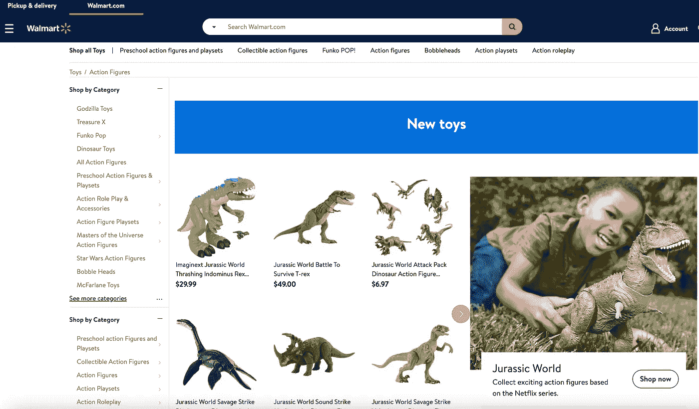
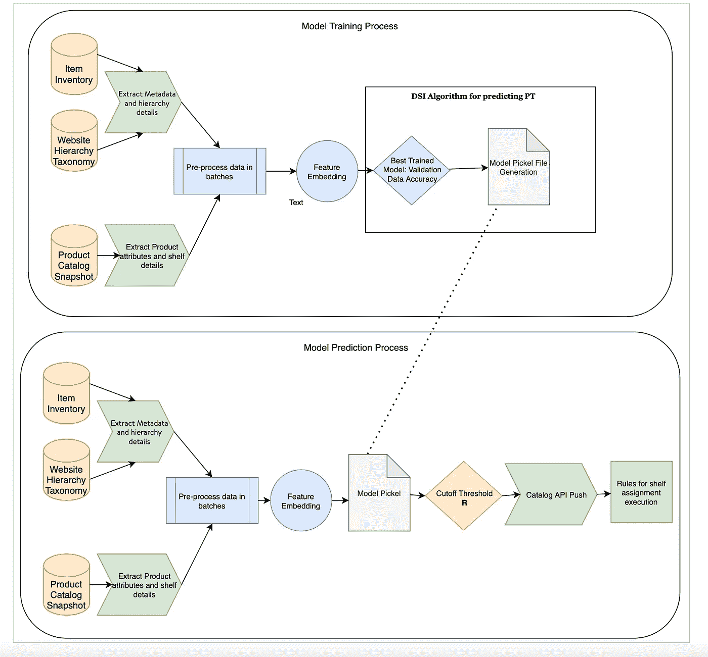
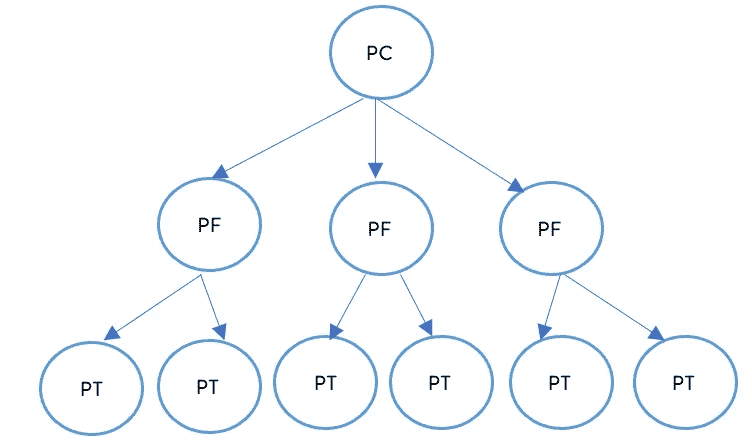
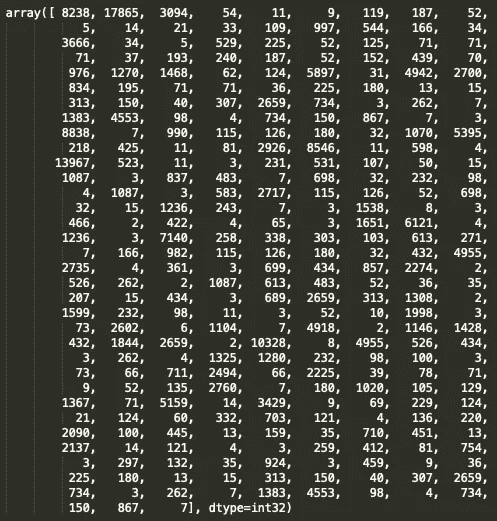
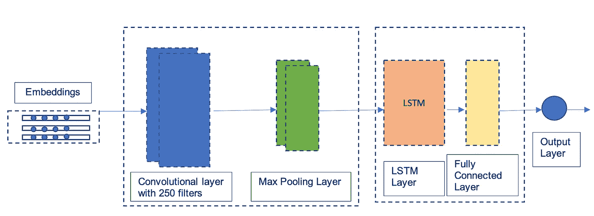
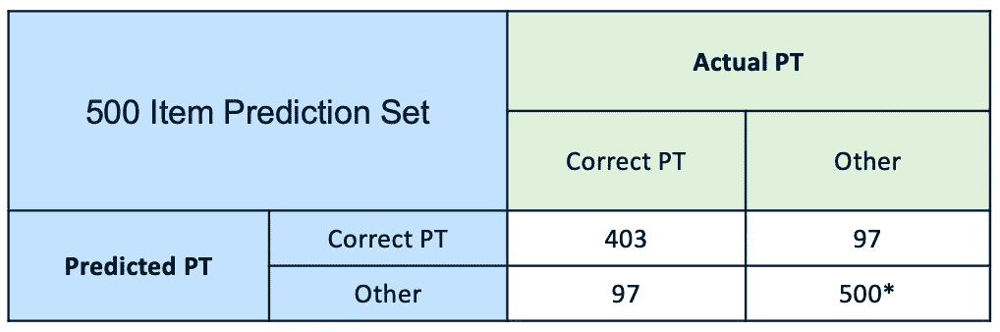

# 深度学习:产品分类和搁置

> 原文：<https://medium.com/walmartglobaltech/deep-learning-product-categorization-and-shelving-630571e81e96?source=collection_archive---------0----------------------->

## 沃尔玛电子商务平台正在不断发展，每天都有数千种产品添加到网站上。启动产品到站点的平稳过渡是一个复杂且不断发展的过程。产品的成功上架至关重要，取决于产品分类的正确和完整设置。产品的适当搁置意味着产品将有更好的搜索引擎优化(SEO)曝光率和更好的整体产品可发现性。

## 问题陈述

为什么在 Walmart.com 上搜索产品时没有显示出来？产品的可发现性取决于货架的正确分配和产品的排名。沃尔玛有基于产品等级的内部规则来执行商品上架。但是分配正确的产品层次结构是具有挑战性的。产品可以有一个默认的层次结构，默认的层次结构会导致产品丢失货架和较低的 SEO 曝光率。在这篇博客中，我们将重点关注分配正确的产品分类层次结构，以提高产品的可发现性和 SEO。

Example of product taxonomy hierarchy

> 产品类型:人偶&产品系列:玩具

## 建模方法

为了提高产品的可发现性，我们将使用最先进的技术，专注于找到正确的产品层次结构。该问题分为 3 个任务:

1.  使用默认分类层次结构标识项目。
2.  预处理和建模。
3.  分配货架的规则执行。

Modeling Framework

卖家在沃尔玛注册产品，指定所售产品的类型，当前的算法利用这些信息来确定报告层级。结合这些信息，我们关注具有默认层次结构的项目。

例如，我们关注在目录数据源中具有产品类别(PC)、产品系列(PF)、产品类型(PT)和 UNNAV 缺省货架默认值的产品。

> **预处理**

我们正在部门一级处理这个问题。每个部门都有三个层次的分类法:PC、PF 和 PT。选择训练样本，以便包括所有级别。我们将构建一个模型来预测每个默认项目的 PT，并基于当前的分类层次映射来映射 PF 和 PC。

Structure of Product Hierarchy Taxonomy

*例如:玩具部门有一台 PC 和八个 PF，总共有 200 多个 PT 标签。*

项目可以属于多个部门:例如:儿童自行车。这种产品可以落入自行车下的玩具以及运动和户外。在当前阶段，将该产品分配给任何一个部门都有效。但作为未来的范围，一个通用的和可扩展的解决方案正在进展中。

为每个部门创建一个涵盖所有 pt 的培训样本。我们正在利用产品描述和产品名称，删除不需要的特殊字符和表情符号。这些产品属性有助于模型理解产品的 PT。

**产品示例**:

Beginner Classical Ukulele Guitar Educational Musical Instrument Toys for Kids

产品名称:Vithconl 初学古典尤克里里吉他儿童益智乐器玩具，品牌:Vithconl

使用 Keras Tokenizer 将所有特征连接在一起并进行标记化，以根据清理后的属性创建嵌入内容，并将其输入算法。

多属性预处理后的样本数据示例:

> **建模**

硬件要求:支持 GPU 的服务器

训练数据按 70:30 的比例分为训练和验证数据集的分层样本。

训练多类分类模型(CNN，Bi-LSTM，CNN-LSTM)以评估对确认数据的性能，最后，基于评估选择 CNN-LSTM 模型。CNN-LSTM 模型被训练用于多个时期，并且用 min_delta 提前停止以防止过度拟合。使用 Keras 的 ModelCheckpoint 将模型的权重保存到 save_best_only。

下面是模型的示例架构。

CNN — LSTM

最佳训练的模型权重用于预测验证数据集的 PT。模型对验证数据的准确率达到 88%。基于 PT 概率的不同四分位数内的准确度来最终确定截止阈值。

预测数据是从每个部门内没有货架的默认 PT 项目中抽取的。预测数据根据库存进行细分。数据被清理、处理并嵌入到训练好的保存模型中。预测文件是基于截止阈值和新分配的产品分类生成的，并被推送到目录 API。货架分配规则根据预先确定的频率执行，以正确的产品属性和层次将产品放在货架上。

> **对子集 500 项进行手工验证的策略**

从 80%以上的不同概率阈值中选择 500 个子集的产品。对每个部门 500 件产品的预测进行手动验证。

Manual validation results

对于具有 200+ PT 标签的玩具部门，所选 500 种产品的 PT 预测准确率达到 80%。

*举例*:

Beginner Classical Ukulele Guitar Educational Musical Instrument Toys for Kids

该模型预测 PT 为玩具乐器，并且该产品被搁置在儿童乐器下。

## **结论**

上述特征和模型是基于模型对验证数据的准确性而选择的。主要目标是从产品属性中提取重要信息，并分配产品分类层次结构，规则可以利用该层次结构将产品放到货架上。我们正在两个部门试行这种方法，并验证分配的产品分类层次结构。

## 承认

这项工作正在沃尔玛全球技术公司的 eComm Ops 分析、目录和数字战略与洞察团队之间进行。特别感谢 [Srujana Kaddevarmuth](https://medium.com/u/787269b21342?source=post_page-----630571e81e96--------------------------------) 的倡议， [Abin Abraham](https://medium.com/u/e9b6ea0ee89?source=post_page-----630571e81e96--------------------------------) 的贡献和支持，以及 eComm Ops Analytics 的目录团队在整个过程中给予的帮助。

## 参考

[使用区域 CNN-LSTM 模型的维度情感分析](https://www.aclweb.org/anthology/P16-2037)。