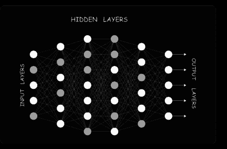

# Python 深度学习——深度学习综合指南

> 原文：<https://medium.com/edureka/deep-learning-with-python-2adbf6e9437d?source=collection_archive---------0----------------------->


Deep Learning with Python - Edureka

**深度学习**是 2018-19 年最热门的话题之一，理由很充分。在工业中已经有了如此多的进步，其中机器或计算机程序实际上代替人类的时代已经到来。这篇使用 Python 的 ***深度学习*** 文章将帮助您了解深度学习到底是什么，以及这种转变是如何实现的。在本文中，我将涉及以下主题:

*   数据科学及其组成部分
*   对深度学习的需求
*   什么是深度学习？
*   感知器和人工神经网络
*   深度学习的应用
*   为什么用 Python 做深度学习？
*   使用 Python 进行深度学习:感知器示例
*   用 Python 进行深度学习:创建深度神经网络

# 数据科学及其组成部分

数据科学已经存在很长时间了。数据科学是通过使用不同的技术和算法从数据中提取知识。


人工智能是一种使机器能够模仿人类行为的技术。人工智能背后的想法相当简单却又令人着迷，那就是制造能够自己做出决定的智能机器。多年来，人们认为计算机永远比不上人脑的能力。


嗯，当时我们没有足够的数据和计算能力，但现在随着大数据的出现和 GPU 的出现，人工智能成为可能。

**机器学习**是人工智能技术的一个子集，它使用统计方法使机器能够随着经验而改进。

**深度学习**是 ML 的子集，使得多层神经网络的计算变得可行。它使用神经网络来模拟类似人类的决策。

# 对深度学习的需求

迈向人工智能的一步是机器学习。机器学习是人工智能的一个子集，它基于这样一种想法，即机器应该能够访问数据，应该能够自己学习和探索。它处理从大型数据集中提取模式。处理大型数据集不是问题。

*   机器学习算法**无法处理高维数据**——我们有大量的输入和输出:对数千维进行舍入。处理和加工这种类型的数据变得非常复杂，而且会耗尽资源。这被称为**维数灾难。**


*   面临的另一个挑战是，指定要提取的**特征**。这在预测结果以及实现更高的准确性方面起着重要的作用。因此，如果没有特征提取，对程序员的挑战会增加，因为算法的有效性在很大程度上取决于程序员的洞察力。

现在，这就是深度学习来拯救我们的地方。深度学习**能够处理高维数据**，并且在**专注于正确的特征**方面也很有效。

# 什么是深度学习？

深度学习是机器学习的一个子集，其中类似的机器学习算法用于训练**深度神经网络**，以便在前者表现不达标的情况下实现更好的准确性。基本上，**深度学习模仿我们大脑的运作方式**，即它从经验中学习。


如你所知，我们的大脑是由数十亿个神经元组成的，这些神经元让我们能够做出惊人的事情。即使小孩子的大脑也能解决复杂的问题，而这些问题即使使用超级计算机也很难解决。那么，我们如何在一个程序中实现同样的功能呢？现在，这就是我们理解**人工神经元(感知器)**和**人工神经网络的地方。**

# 感知器和人工神经网络

深度学习研究大脑的基本单元，称为脑细胞或神经元。现在，让我们了解生物神经元的功能，以及我们如何在感知或人工神经元中模仿这种功能。


*   **树突:**接收来自其他神经元的信号
*   **单元体:**对所有输入求和
*   **轴突:**用于向其他细胞传递信号

人工神经元或**感知器**是用于二元分类的线性模型。它模拟了一个有一组输入的神经元，每个输入都有一个特定的权重。神经元对这些**加权**输入计算一些函数，并给出输出。


它接收 n 个输入(对应于每个特征)。然后，它将这些输入相加，应用一个变换并产生一个输出。它有两个功能:

*   总和
*   转化(激活)

权重显示了特定输入的有效性。**输入的权重越多，对神经网络的影响就越大**。另一方面， **Bias** 是感知器中的一个**附加参数**,用于调整输出以及神经元输入的加权和，这有助于模型最适合给定数据。

**激活功能**将输入转化为输出。它使用阈值来产生输出。有许多功能可用作激活功能，例如:

*   线性或恒等式
*   单位或二进制步长
*   乙状结肠或逻辑
*   双曲正切
*   热卢
*   Softmax

好吧。如果你认为感知器解决了问题，那你就错了。有两个主要问题:

*   单层感知器**无法对非线性可分离数据点**进行分类。
*   涉及**大量参数**的复杂问题是单层感知器无法解决的。

考虑一下这个例子，以及营销团队做出决策所涉及的参数的复杂性。


一个神经元不能接受这么多的输入，这就是为什么要用一个以上的神经元来解决这个问题。神经网络实际上只是感知器的**组合，以不同的方式**连接，并对不同的激活功能进行操作。



*   **输入节点**向网络提供来自外界的信息，统称为“输入层”。
*   **隐藏节点**执行计算并将信息从输入节点传输到输出节点。隐藏节点的集合形成了“隐藏层”。
*   **输出节点**统称为“输出层”，负责计算并将信息从网络传输到外部世界。

现在你对感知机的行为方式、涉及的不同参数和神经网络的不同层有了一个概念，让我们通过 Python 博客继续这个深度学习，看看深度学习的一些很酷的应用。

# 深度学习的应用

深度学习在行业中有各种各样的应用，这里有几个在我们日常任务中存在的重要应用。

*   **语音识别**


*   **机器翻译**


*   **面部识别和自动标记**


*   **虚拟个人助理**


*   **自动驾驶汽车**


*   **聊天机器人**


# 为什么用 Python 做深度学习？

*   Python 就是这样一种工具，它有一个独特的属性，即作为一种通用编程语言，在进行分析和定量计算时容易使用。
*   很容易理解
*   Python 是**动态类型的**
*   巨大的**社区支持**
*   各种不同用途的库，如 Numpy、Seaborn、Matplotlib、Pandas 和 Scikit-learn


现在，理论已经足够了，让我们看看如何通过一个小而令人兴奋的例子开始用 Python 进行深度学习。

# 感知器示例

现在我相信你们一定很熟悉“**或“**门”的工作原理。如果任何输入也是 **1，则输出为 **1** 。**


因此，感知器可用作分隔符或判定线，将 or 门的输入集分为两类:

**第 1 类:**输出为 0 的输入位于判定线以下。
**第 2 类:**输入输出为 1，位于判定线或分隔符之上。

到目前为止，我们知道线性感知器可以用来将输入数据集分为两类。但是，它是如何对数据进行分类的呢？


在数学上，感知器可以被认为是一个权重、输入和偏差的等式。

## 步骤 1:导入所有需要的库

这里我将只导入一个库，即。张量流

```
import tensorflow as tf
```

## 步骤 2:定义输入和输出的向量变量

接下来，我们需要创建变量来存储感知器的输入、输出和偏差。

```
train_in = [
[0,0,1],
[0,1,1],
[1,0,1],
[1,1,1]]

train_out = [
[0],
[1],
[1],
[1]]
```

## 步骤 3:定义权重变量

这里，我们将为我们的权重定义形状为 3×1 的张量变量，并最初为其分配一些随机值。

```
w = tf.Variable(tf.random_normal([3, 1], seed=15))
```

## 步骤 4:为输入和输出定义占位符

我们需要定义占位符，以便它们可以在运行时接受外部输入。

```
x = tf.placeholder(tf.float32,[None,3])
y = tf.placeholder(tf.float32,[None,1])
```

## 步骤 5:计算输出和激活函数

如前所述，感知器接收的输入首先乘以各自的权重，然后，所有这些加权的输入相加在一起。然后，该求和值被馈送到激活，以获得最终结果。


```
output = tf.nn.relu(tf.matmul(x, w))
```

注意:在这种情况下，我使用了 ***relu*** 作为我的激活函数。您可以根据需要自由使用任何激活功能。

## 第六步:计算成本或误差

我们需要计算成本=均方差，也就是感知器输出和期望输出之差的平方。

```
loss = tf.reduce_sum(tf.square(output - y))
```

## 第七步:尽量减少错误

感知器的目标是最小化损失或成本或错误。这里我们将使用梯度下降优化器。

```
optimizer = tf.train.GradientDescentOptimizer(0.01)
train = optimizer.minimize(loss)
```

## 步骤 8:初始化所有变量

变量只能用 *tf.Variable.* 来定义，所以，我们需要初始化定义的变量。

```
init = tf.global_variables_initializer()
sess = tf.Session()
sess.run(init)
```

## 步骤 9:在迭代中训练感知器

我们需要训练我们的感知器，即在连续迭代中更新权重和偏差的值，以最小化误差或损失。在这里，我将用 100 个纪元来训练我们的感知机。

```
for i in range(100):
sess.run(train, {x:train_in,y:train_out})
cost = sess.run(loss,feed_dict={x:train_in,y:train_out})
print('Epoch--',i,'--loss--',cost)
```

## 第十步:输出


如你所见，损失开始于 **2.07** ，结束于 **0.27**

# 创建一个深度神经网络

现在，我们已经成功地创建了一个感知器，并训练它用于或门。让我们继续这篇文章，看看如何可以从头开始创建我们自己的神经网络，我们将创建一个输入层，隐藏层和输出层。

我们将使用 MNIST 的数据集。MNIST 数据集由 **60，000 个训练**样本和 **10，000 个手写数字图像测试**样本组成。图像尺寸为 **28×28 像素**，输出可以在**0–9**之间。

**这里的任务是训练一个模型，它可以准确地识别图像上出现的数字**


首先，我们将使用下面的导入将打印功能从 Python 3 引入 Python 2.6+。__future__ 语句需要放在文件的顶部附近，因为它们改变了语言的基本特性，所以编译器需要从一开始就了解它们

```
from __future__ import print_function
```

**下面是每一步都有注释的代码**

```
# Import MNIST data
from tensorflow.examples.tutorials.mnist import input_data
mnist = input_data.read_data_sets("/tmp/data/", one_hot=True)

import tensorflow as tf
import matplotlib.pyplot as plt

# Parameters
learning_rate = 0.001
training_epochs = 15
batch_size = 100
display_step = 1

# Network Parameters
n_hidden_1 = 256 # 1st layer number of features
n_hidden_2 = 256 # 2nd layer number of features
n_input = 784 # MNIST data input (img shape: 28*28)
n_classes = 10 # MNIST total classes (0-9 digits)

# tf Graph input
x = tf.placeholder("float", [None, n_input])
y = tf.placeholder("float", [None, n_classes])

# Create model
def multilayer_perceptron(x, weights, biases):
    # Hidden layer with RELU activation
    layer_1 = tf.add(tf.matmul(x, weights['h1']), biases['b1'])
    layer_1 = tf.nn.relu(layer_1)
    # Hidden layer with RELU activation
    layer_2 = tf.add(tf.matmul(layer_1, weights['h2']), biases['b2'])
    layer_2 = tf.nn.relu(layer_2)
    # Output layer with linear activation
    out_layer = tf.matmul(layer_2, weights['out']) + biases['out']
    return out_layer

# Store layers weight & bias
weights = {
    'h1': tf.Variable(tf.random_normal([n_input, n_hidden_1])),
    'h2': tf.Variable(tf.random_normal([n_hidden_1, n_hidden_2])),
    'out': tf.Variable(tf.random_normal([n_hidden_2, n_classes]))
}

biases = {
    'b1': tf.Variable(tf.random_normal([n_hidden_1])),
    'b2': tf.Variable(tf.random_normal([n_hidden_2])),
    'out': tf.Variable(tf.random_normal([n_classes]))
}

# Construct model
pred = multilayer_perceptron(x, weights, biases)

# Define loss and optimizer
cost = tf.reduce_mean(tf.nn.softmax_cross_entropy_with_logits(logits=pred, labels=y))
optimizer = tf.train.AdamOptimizer(learning_rate=learning_rate).minimize(cost)

# Initializing the variables
init = tf.global_variables_initializer()

#create an empty list to store the cost history and accuracy history
cost_history = []
accuracy_history = []

# Launch the graph
with tf.Session() as sess:
    sess.run(init)

    # Training cycle
    for epoch in range(training_epochs):
        avg_cost = 0.
        total_batch = int(mnist.train.num_examples/batch_size)
        # Loop over all batches
        for i in range(total_batch):
            batch_x, batch_y = mnist.train.next_batch(batch_size)

            # Run optimization op (backprop) and cost op (to get loss value)
            _, c = sess.run([optimizer, cost], feed_dict={x: batch_x,y: batch_y})
            # Compute average loss
            avg_cost += c / total_batch
        # Display logs per epoch step
        if epoch % display_step == 0:

            correct_prediction = tf.equal(tf.argmax(pred, 1), tf.argmax(y, 1))
            # Calculate accuracy
            accuracy = tf.reduce_mean(tf.cast(correct_prediction, "float"))
            acu_temp = accuracy.eval({x: mnist.test.images, y: mnist.test.labels})
            #append the accuracy to the list
            accuracy_history.append(acu_temp)
            #append the cost history
            cost_history.append(avg_cost)
            print("Epoch:", '%04d' % (epoch + 1), "- cost=", "{:.9f}".format(avg_cost), "- Accuracy=",acu_temp)

    print("Optimization Finished!")
    #plot the cost history
    plt.plot(cost_history)
    plt.show()
    #plot the accuracy history
    plt.plot(accuracy_history)
    plt.show()

    # Test model
    correct_prediction = tf.equal(tf.argmax(pred, 1), tf.argmax(y, 1))
    # Calculate accuracy
    accuracy = tf.reduce_mean(tf.cast(correct_prediction, "float"))
    print("Accuracy:", accuracy.eval({x: mnist.test.images, y: mnist.test.labels}))
```

**输出:**


至此，我们结束了这篇关于 Python 深度学习的文章。我希望你理解了深度学习的各个组成部分，它是如何开始的，以及我们如何使用 Python 来创建简单的感知机和深度神经网络。

如果你想查看更多关于人工智能、DevOps、道德黑客等市场最热门技术的文章，你可以参考 Edureka 的官方网站。

请留意本系列中的其他文章，它们将解释深度学习的各个其他方面。

> 1. [TensorFlow 教程](/edureka/tensorflow-tutorial-ba142ae96bca)
> 
> 2. [PyTorch 教程](/edureka/pytorch-tutorial-9971d66f6893)
> 
> 3.[感知器学习算法](/edureka/perceptron-learning-algorithm-d30e8b99b156)
> 
> 4.[神经网络教程](/edureka/neural-network-tutorial-2a46b22394c9)
> 
> 5.[什么是反向传播？](/edureka/backpropagation-bd2cf8fdde81)
> 
> 6.[卷积神经网络](/edureka/convolutional-neural-network-3f2c5b9c4778)
> 
> 7.[胶囊神经网络](/edureka/capsule-networks-d7acd437c9e)
> 
> 8.[递归神经网络](/edureka/recurrent-neural-networks-df945afd7441)
> 
> 9.[自动编码器教程](/edureka/autoencoders-tutorial-cfdcebdefe37)
> 
> 10.[受限玻尔兹曼机教程](/edureka/restricted-boltzmann-machine-tutorial-991ae688c154)
> 
> 11. [PyTorch vs TensorFlow](/edureka/pytorch-vs-tensorflow-252fc6675dd7)
> 
> 12.[tensor flow 中的对象检测](/edureka/tensorflow-object-detection-tutorial-8d6942e73adc)
> 
> 13.[人工智能教程](/edureka/artificial-intelligence-tutorial-4257c66f5bb1)
> 
> 14.[张量流图像分类](/edureka/tensorflow-image-classification-19b63b7bfd95)
> 
> 15.[人工智能应用](/edureka/artificial-intelligence-applications-7b93b91150e3)
> 
> 16.[如何成为一名人工智能工程师？](/edureka/become-artificial-intelligence-engineer-5ac2ede99907)
> 
> 17.[问学](/edureka/q-learning-592524c3ecfc)
> 
> 18. [Apriori 算法](/edureka/apriori-algorithm-d7cc648d4f1e)
> 
> 19.[用 Python 实现马尔可夫链](/edureka/introduction-to-markov-chains-c6cb4bcd5723)
> 
> 20.[人工智能算法](/edureka/artificial-intelligence-algorithms-fad283a0d8e2)
> 
> 21.[机器学习的最佳笔记本电脑](/edureka/best-laptop-for-machine-learning-a4a5f8ba5b)
> 
> 22.[12 大人工智能工具](/edureka/top-artificial-intelligence-tools-36418e47bf2a)
> 
> 23.[人工智能(AI)面试问题](/edureka/artificial-intelligence-interview-questions-872d85387b19)
> 
> 24. [Theano vs TensorFlow](/edureka/theano-vs-tensorflow-15f30216b3bc)
> 
> 25.[什么是神经网络？](/edureka/what-is-a-neural-network-56ae7338b92d)
> 
> 26.[模式识别](/edureka/pattern-recognition-5e2d30ab68b9)
> 
> 27.[人工智能中的阿尔法贝塔剪枝](/edureka/alpha-beta-pruning-in-ai-b47ee5500f9a)

*原载于 2019 年 2 月 19 日*[*www.edureka.co*](https://www.edureka.co/blog/deep-learning-with-python/)*。*