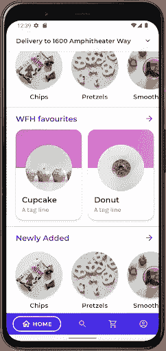
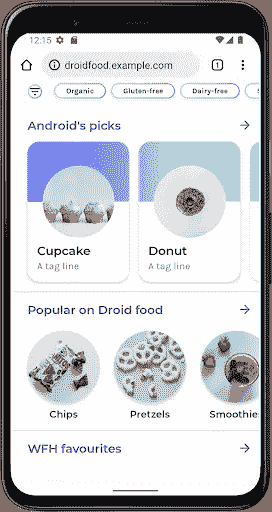
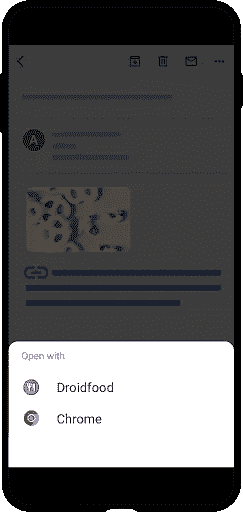

# 深层链接速成班:第 3 部分深层链接故障排除

> 原文：<https://medium.com/androiddevelopers/deep-links-crash-course-part-3-troubleshooting-your-deep-links-61329fecb93?source=collection_archive---------0----------------------->


# 介绍

当你的 Android 应用程序链接不按你想要的方式工作时，你会怎么做？Google 提供了许多工具来帮助您，例如 [Play Console 深层链接](https://play.google.com/console/about/deeplinks/)页面，它为您提供了一个查看和解决许多应用程序链接常见问题的单一位置。在 Play 控制台中收到问题通知后，您可以按照以下步骤调试您的 Android 应用程序链接。这篇博文将带您使用 adb 调试应用程序中的深层链接，使用 curl 检查您的数字资产链接文件，并演示如何在设备上处理用户体验。

让我们启动终端。我们正在运行 adb 命令！

# 症状 1:链接从不工作

如果用户点击链接，而他们没有在你的应用程序中打开，那么你的意图过滤器可能有问题。您可以使用命令`[adb shell am start](https://developer.android.com/training/app-links/deep-linking#testing-filters)`和一个[视图](https://developer.android.com/reference/android/content/Intent#ACTION_VIEW)动作、一个深度链接的 URL 和包 id 来测试您的意图过滤器。这将检查应用程序是否可以处理显式发送给它的深层链接。

如果应用程序的意图过滤器配置正确，这个命令应该可以打开应用程序。但是，如果您看到如下所示的错误，您应该检查`AndroidManifest.xml`文件并仔细检查它的配置。

```
Error: Activity not started, unable to resolve Intent { act=android.intent.action.VIEW dat=https://droidfood.example.com/... flg=0x10000000 pkg=com.example.droidfood }
```

在 Android 应用的`AndroidManifest.xml`文件中，Android 应用链接被声明为`intent-filter`元素。当它们被正确配置后，Android 应用程序将成为匹配意图过滤参数的链接的默认处理程序。

正确配置这些参数包括:

*   将`intent-filter`元素的`[autoVerify](https://developer.android.com/reference/android/R.styleable#AndroidManifestIntentFilter_autoVerify)`属性设置为`true`
*   将带有名称属性的`action`元素设置为[视图](https://developer.android.com/reference/android/content/Intent#ACTION_VIEW)
*   将 name 属性的`category`元素设置为[可浏览](https://developer.android.com/reference/android/content/Intent#CATEGORY_BROWSABLE)
*   将具有名称属性的第二个`category`元素设置为[默认值](https://developer.android.com/reference/android/content/Intent#CATEGORY_DEFAULT)
*   包括至少一个方案属性为“HTTP”或“HTTPS”的`data`元素
*   包括一个带有“`host`”属性的数据元素，该属性设置为您托管深层链接的域
*   具有自定义方案的`no data`元素

例如，下面是一个正确配置的意图过滤器，用于处理与[https://droidfood.example.com](https://food.example.com)匹配的深层链接:



一旦正确配置了应用程序的意图过滤器，重新运行 adb 命令并确保应用程序正确打开。

一旦出现这种情况，请在没有显式包名“com.example.droidfood”的情况下再次尝试该命令。这测试了 Android 可以正确地打开带有链接的应用程序。

如果应用程序打开，那么你已经解决了问题！如下图所示，如果系统 web 浏览器打开了链接，您还需要做更多的调试工作。



# 症状 2:链接在浏览器中打开(但使用 ADB)

系统 web 浏览器已经处理了该链接。Android 12 中引入的下面两个命令应该有助于诊断发生了什么:。

*   `adb shell pm verify-app-links -- re-verify`强制 Android 操作系统[验证应用程序和 web 主机之间的站点关联](https://developer.android.com/training/app-links/verify-site-associations)。这是一个异步命令，可能需要几分钟才能完成。
*   `adb shell pm get-app-links`列出清单中声明的 Android 应用链接及其验证状态。

在 Android 中，HTTP 链接必须经过验证，应用程序才能成为深度链接的默认处理程序。这两个命令都将应用程序的包名作为参数。为应用程序运行这些命令会得到以下结果:

链接是安卓应用链接；然而，它们不是“经过验证的”Android 应用程序链接，该应用程序不会成为 droidfood.example.com 主机链接的默认处理程序。Android 开发者文档提供了[验证结果](https://developer.android.com/training/app-links/verify-site-associations#review-results)的完整列表以及如何解释它们。

Android 使用[数字资产链接 API](https://developers.google.com/digital-asset-links) 在网络域和应用程序之间建立信任。实际上，这意味着 AndroidManifest.xml 中应用程序的一组`intent-filter`元素中的每个主机都服务于/ `.well-known` /路径中的 assetlinks.json 文件。

assetlinks.json 文件通过提供以下信息来建立信任:

*   Android 应用程序的包名
*   标识应用程序的签名密钥证书指纹的数组
*   应用程序签名密钥证书指纹必须与该数组中的指纹相匹配

`curl`命令可以很容易地从主机获取文件，并可以用来检查文件的内容。

此外，文件的托管必须满足几个标准:

*   assetlinks.json 必须公开提供，不能在身份验证或 VPN 之后
*   主机必须使用安全的 HTTPS 连接来提供文件
*   重定向不能用于访问 assetlinks.json
*   文件的`Content-Type` HTTP 头必须是`application/json`

`curl`也可用于检查文件是否被正确托管。应该使用`-i`选项来打印 HTTP 头，可以检查其正确性

assetlinks.json 文件似乎被正确托管，内容看起来一目了然。有几项检查可以缩小可能导致链路故障的问题范围。如果文件没有正确托管，请查看“第 3 节:诊断其他问题”以了解更多信息。

# 确认我们的签名密钥

[https://](https://food.example.com)[droid](https://example.com/.well-known/assetlinks.json)[food.example.com](https://food.example.com)的 assetlinks.json 文件引用了证书指纹“4C:D7:E4:04:B8:54:04:A0:5F:50:35:38:CF:B6:89:3D:35:CE:54:C7:01:8E:ED:78:7A:50:9B:4A:2E:A8:BE:B4”。

在 Android 应用程序的开发生命周期中，许多密钥用于对应用程序进行签名。一个常见的错误来源是在 Play Store 中签署 APK 时使用的密钥与 assetlinks.json 文件中引用的密钥不匹配。

> “如果您正在使用 [Play App Signing](https://support.google.com/googleplay/android-developer/answer/9842756) 为您的应用程序签名，那么在本地运行 keytool 生成的证书指纹通常不会与用户设备上的指纹相匹配。您可以在**发布>设置>应用完整性**下的 [Play Console](https://play.google.com/console/) 开发者账户中验证您是否在使用 Play App Signing for your app 如果你这样做了，那么你也会在同一个页面上为你的应用找到正确的数字资产链接 JSON 片段。"

命令`adb shell pm get-app-links`显示 Android 用来验证链接的证书指纹，这可以与 assetlinks.json 中使用的证书进行比较:

在这个例子中，指纹不匹配。要修复该错误，请将正确的指纹需求应用到 assetlinks.json 文件。要测试修复，请使用 adb 命令重新验证链接:

更新`assetlinks.json`文件中的证书指纹已修复该问题！现在，当您的应用程序接收到查看意图时，应该会打开应用程序而不是浏览器。这可以通过 adb 使用我们在第 1 节中使用的相同命令进行测试:


有关密钥生成的更多信息，请参见 developer.android.com 上的“[签署您的应用](https://developer.android.com/studio/publish/app-signing)”。

# 症状 3:你的链接曾经可以工作，但是现在不行了

有许多不同的提供商、服务和服务器应用程序可能会托管`assetlinks.json`。此外，可能存在可能干扰链接验证的内容传递网络或其他类似服务。接下来的几节将展示如何检测这些故障，但不研究如何解决它们。这项任务更适合主机运营团队，而不是 Android 应用开发者。

每个例子都使用了`curl`工具，并强调了在托管错误的情况下需要注意的输出。

# 不正确托管的文件(使用重定向)

如上所示的 301 重定向将导致验证失败。当一个`assetlinks.json`文件被托管在一个有一个域的服务器上，但是应用程序的`intent-filter`处理一个不同的域时，通常会出现这种情况。例如，Android 应用程序链接可能会处理“example.com”，但内容会重定向到“[droid food](https://example.com/.well-known/assetlinks.json)[. example . com](http://www.example.com)”。

还有其他几种常见的重定向头也会阻止验证。IETF HTTP RFC 指定了可能遇到的其他 3xx 重定向。记住，`assetlinks.json`文件必须返回 HTTP 状态 200 才能成功验证。

# 失踪的 HTTPS

端口 443 是加密 HTTPS 通信的标准端口。上面的输出演示了加载`assetlinks.json`文件的失败，因为服务器没有使用 HTTPS。如果使用未加密的 HTTP 协议，Android 将不会验证链接。

# 不正确的内容类型标题

在上面的例子中，文件将`content-type`头设置为`text/plain`(明文)，而不是 JSON。Android 应用程序链接要求使用 HTTP Content-Type 头值`application/json`来提供`assetlinks.json`文件。

# 私有 assetlinks.json 文件

`assetlinks.json`文件必须是公共的。开发、测试和调试通常在连接到办公室 VPN 时进行。这可能会造成一种情况，即在测试和调试期间，应用程序维护人员可以访问文件，但公众无法访问。要验证您的应用程序可以加载`assetlinks.json`文件，请使用没有 VPN 连接的公共网络。这些网络的示例包括:手机蜂窝网络、家庭连接和当地咖啡店的 Wi-Fi 网络。

# assetlinks.json 文件丢失或放错位置

在`AndroidManifest.xml`文件中将`autoVerify`属性设置为`true`的意图过滤器所引用的每个主机也必须有一个`assetlinks.json`文件，该文件在该域和应用程序之间建立关联。此外，如果在意图过滤器元素中使用通配符，那么`assetlinks.json`文件必须在主机的顶级`/.well-known/`目录中可用。例如，如果`example.com`没有托管`assetlinks.json`文件，那么`*.example.com`将无法通过验证。

# 其他服务器错误

我们展示了开发人员报告的常见问题。，检查您的服务器是否存在可能影响`assetlinks.json`验证的其他类型的意外行为

# 症状 4:出现歧义消除对话框

当 Android 系统无法确定哪个应用程序活动应该处理一个意图时，就会出现消除歧义对话框。即使在确认所有链接都有正确的意图过滤器，所有主机都有`assetlinks.json`文件，并且这些文件被正确托管后，消除歧义对话框可能会出现。本节描述了 Android 系统无法确定正确活动的常见情况。您可以使用这些信息来减少用户看到消除歧义对话框的次数。



# 意图冲突

下面的例子定义了两个活动:`DessertActivity`和`FoodActivity`。两者都处理深层链接“https://droid food . example . com/food/dessert ”,因为这个链接匹配它们的两个`pathPrefix`属性。

当一个应用程序中的多个活动为同一个链接定义意图过滤器时，会出现消除歧义对话框。意图过滤器不应该在不同的活动中重叠，如果这是应用程序的一个有意的特性，那么应该设置“activity”元素上的“label”属性来区分哪个活动将处理链接意图。

# Android 12 的变化

在 Android 12 之前，如果你的应用中的 ***任何*** 链接验证失败，或者 ***所有意向过滤器*** 缺少`autoVerify=true`，那么这些 Android 应用链接会显示消歧对话框。然而，在 Android 12 中，这些链接将改为由默认的 web 浏览器处理(参见 Android 12[Web intent resolution](https://developer.android.com/about/versions/12/behavior-changes-all#web-intent-resolution)行为变化)。为了避免早期版本 Android 上的歧义对话框，请确保您的所有 Android 应用程序链接都可以被验证，并从您的 AndroidManifest.xml 中删除测试意图过滤器。

# 其他应用程序处理相同的链接

有时，用户会安装第三方应用程序，该应用程序处理与另一个应用程序相同的链接。如果两个应用程序都使用匹配的自定义方案，则会出现消除歧义对话框。为了避免这种情况，使用带有`autoVerify=”true”`设置的 web 链接，并将`assetlinks.json`文件添加到每个托管 Android 应用链接的域中。

# 用户选择了不同的默认应用程序

用户可以选择让一个链接总是由一个特定的应用程序打开。您的应用程序可以检测到这一点，并显示一个教育用户界面，建议用户将自己与这些深层链接相关联。

以下示例显示了如何检测包 id 为“com.example.droidfood”的应用程序是否是链接“https://droid food . example . com/about”的默认处理程序。

这段代码使用 [PackageManager](https://developer.android.com/reference/android/content/pm/PackageManager) 来查找您期望处理的链接的默认处理程序。然后，代码将这个包名与我们的应用程序的包名进行比较。如果名称匹配，那么用户已经选择了我们的应用程序来处理“【https://droidfood.example.com/about】”域名的安卓应用程序链接。否则，用户会更改他们的默认处理程序。

# 继续学习

这篇文章展示了如何检测和处理深层链接的常见错误。在未来，我们还将探索新的深度链接播放控制台，它为开发人员提供关于他们的深度链接性能和常见错误的实时反馈，就像本文中的那些。有许多 UX 设计模式和最佳实践——shell pm verify-app-links——重新验证我们在 DAC 中记录的内容，以帮助您将应用做到最好！

*   **Part 1:** [深度链接能做什么？](/androiddevelopers/the-deep-links-crash-course-part-1-introduction-to-deep-links-2189e509e269)
*   **第二部:** [从零到英雄的深度链接](/androiddevelopers/the-deep-links-crash-course-part2-deep-links-from-zero-to-hero-37f94cc8fb88)
*   **第三部分:** *克服挑战创建安卓应用链接*
*   **第 4 部分:**为您的企业提供深层链接
*   [创建应用内容的深度链接| Android 开发者](https://developer.android.com/training/app-links/deep-linking)
*   [Google Play 控制台深度链接仪表盘](https://play.google.com/console/about/deeplinks/)
*   [安卓调试桥](https://developer.android.com/studio/command-line/adb)

链接愉快！