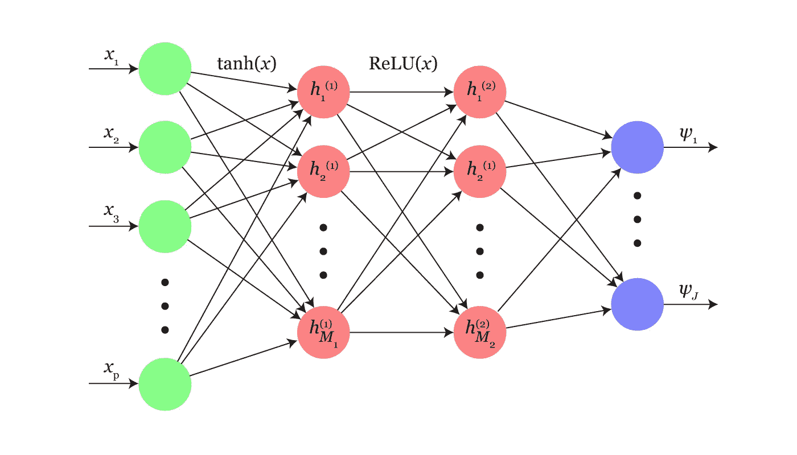

# 深度学习+生存分析:我们的多任务框架方法

> 原文：<https://medium.com/square-corner-blog/deep-neural-networks-for-survival-analysis-based-on-a-multi-task-framework-ded8697be85c?source=collection_archive---------3----------------------->

> 注意，我们已经行动了！如果您想继续了解 Square 的最新技术内容，请访问我们的新家[https://developer.squareup.com/blog](https://developer.squareup.com/blog)

在 Square，我们用生存分析模型进行了实验，以预测各种结果:从卖家流失和产品转化，到资本贷款违约。预测卖家一生中的这些关键事件，可以让我们为卖家提供更好的用户体验，并降低我们自己的信用和违约损失风险。我们很高兴分享我们目前在生存分析模型和深度学习方面的一些工作。

生存分析是统计学中的一个领域，用于预测*感兴趣的特定事件何时会发生。这个领域起源于医学研究，作为一种模拟病人生存的方法——因此有术语“生存分析”。传统的生存分析模型，如 Kaplan-Meier (KM)和 Cox 比例风险(CoxPH)模型，都有一些非常严格的假设和限制，例如，CoxPH 模型假设风险函数是个人特征的严格线性组合，根据您的特征空间，这可能不正确。*

我们提出了一种新的模型，该模型对特征空间及其底层数据集中的非线性依赖性具有鲁棒性:**神经多任务逻辑回归** (N-MTLR)。N-MTLR 与传统的多任务逻辑回归(MTLR)模型的区别在于增加了一个多层感知器，它允许进一步的灵活性，而没有考克斯夫和 MTLR 模型所具有的严格的线性假设。我们发现，当数据集似乎不包含任何明显的非线性依赖关系时，N-MTLR 模型的表现与考克斯报告和传统的 MTLR 模型大致相同。

Representation of a 2-hidden layer transformation within the N-MTLR

然而，N-MTLR 模型真正闪光的地方在于它比 MTLR 和考克斯夫模型更胜一筹，非线性依赖性存在于特征空间中。

简而言之，当你几乎可以保证你的特征空间呈现非线性行为(例如，你的一些特征呈现幂律分布)时，N-MTLR 模型为生存建模提供了一个很好的解决方案。非线性特征分布在卖家行为中非常普遍，因此使用 N-MTLR 模型可以让我们更好地模拟卖家的流失和转换事件。

最后，我们非常高兴向更大的数据科学社区开源这项研究，因为我们相信更多的研究合作会为我们的用户带来更好的模型、最佳实践和最终产品。更详细的研究论文链接如下——欢迎反馈！