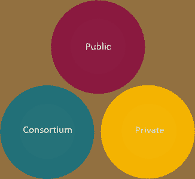

# 定义区块链技术

> 原文：<https://medium.com/edureka/defining-blockchain-technology-b1b16ed95492?source=collection_archive---------6----------------------->

对加密货币的崛起感到兴奋吗？想知道区块链技术是如何工作的？你来对地方了。这篇文章可以理清你的思路，让你对区块链有更好的了解。

**以下是本博客的学习内容:**

*   定义区块链技术
*   简单的比特币交易
*   区块链:一组技术
*   区块链类型
*   区块链技术的用例
*   可能的区块链构造转变

**在我开始之前，请注意！！**

曾经想象过一个如此安全和强大的系统，可以改变我们的经济、治理系统、商业运作的方式，并可能改变我们对贸易、所有权和信任的概念。嗯，这样的技术已经存在，叫做**区块链**。

**似乎很吸引人？让我们一起来揭开这个谜团……**

# 定义区块链技术

区块链是一个反向链接、去中心化和分布式的加密记录数据库。

好吧，如果这些话看起来令人困惑，那么让我来给你解释一下:

*   这是一种数据结构，其中每个块都按照**时间戳**时间顺序链接到另一个块
*   这是一个**只追加的事务数据库**，不是传统数据库的替代品
*   每个节点都保留一份过去发生的所有交易的副本，这些交易受到加密保护
*   所有存储在分类帐中的信息都是可验证和可审计的，但**不可编辑**
*   高度**容错**，因为**没有单点故障**

由于区块链本身并没有将它概念化为一个单独的实体，它是比特币的主干技术，所以我们将尝试用比特币的用例来理解它&它如何帮助安全地转移这种“**数字黄金**”。

# 简单的比特币交易

考虑一个比特币交易，在那里，詹姆斯在网络中转账**5**24】BTC 他的朋友凯文。

现在，这个交易被广播到**比特币区块链网络**，被称为**矿工**的特殊节点从*未确认交易*的池中拿起这个交易，验证它并将其添加到他们的区块中。

在这里，假设 Lisa 和 Robert 是矿工，他们验证网络中的交易，并将验证的交易分组到一个块中，并开始竞争解决一个名为 ***的复杂数学难题，工作证明*** 。

如果丽莎先解决了这个难题，她会向整个网络广播这个区块。其他挖掘者验证该块，并且每个节点一致同意分类帐的当前状态，每个节点独立地更新记录。因此，James 和 Kevin 收到一条确认消息，表明交易已经完成。

交易因此成为通用 ***分布式账本*** (或区块链)的一部分。而且，由于她的计算工作，丽莎获得了新创造的比特币(因此有了术语*采矿*)。目前每块奖励 12.5 比特币。

因此，数字货币可以从一个人转移到另一个人，而不需要我们在传统系统中使用的第三方。是不是很神奇？!"

**然而，区块链技术尽管有其优点，但并不是一项新技术。**

顺便说一句，这是以一种新的方式融合了有效的技术。

# 区块链:一组技术

## 加密算法:

区块链是安全的强大的国家最先进的加密机制。区块链上存储的一切都是加密的。

为了让你更好地了解区块链是如何使用的，让我们回到我们之前讨论的例子，凯文将 5 BTC 转移给詹姆斯。这种交易以加密信息的形式进入网络。该消息对于每笔交易都是唯一的。

现在，你可能会问是什么让这个信息变得独一无二？这是因为交易是由发送方的唯一密钥**、**签名的，因此有了**、*数字签名*。**该机制看起来像这样:

**矿工验证该数字签名以确认网络中的交易。**

酷毙了。不是吗？让我告诉你一些更有趣的事情。以前见过这些数字:**09 bed8e 02e 49277378 f 256 c 9d 93 ba 4 e 408771088483 f 3955 c 6b 1186 AC 8 c 7630 a**。看起来像胡言乱语，对吗？嗯，它叫做安全散列算法 **(SHA-256)** 。

这个功能非常强大，如果你通过这个算法传递任何东西，它会给你一个该输入的 ***数字指纹*** 。即使改变了一个空格，指纹也会完全改变。

**想知道在区块链上是怎么用的？记得我告诉过你，在区块链中，区块是相互反向链接的。好吧，这就对了。如果你对一堆交易进行哈希运算，也就是说，给整个交易“块”一个唯一的指纹！就是这样。**

现在，您的下一个事务块有了新的事务— *加上来自前一个块的散列。*

这就是如何使区块链系统*密码安全*。

## 分布式网络:

区块链使用分布式网络，其中两个或更多节点以协调的方式相互合作，以实现共同的结果。x 区块链上的所有用户都是维护自己账本的节点(或对等体)。

*   在分布式体系结构中，事务是对等传输的
*   交易在网络上的传输大约需要 1-2 秒

更快的交易流程使得同行的验证过程变得更快。这最终会加快数字资产的传输速度。

## 程序(区块链协议):

区块链使用网络服务协议来实现系统的平稳安全运行。这些节点通过维护交易记录来服务于网络。可以为每个区块链定制验证流程。基本上，管理区块链网络的是**共识机制**。*比特币区块链工作证明示例。*

共识做两件事:

*   它确保了区块链的下一个街区是真相的唯一版本
*   它防止强大的对手破坏系统

更快的交易过程使得对等体的验证过程更快。这最终会加快数字资产的传输速度。

我猜现在你知道这些传统概念是如何在区块链技术中使用的了。让我向你展示这个系统是如何工作的

好了，让我们继续讨论区块链的类型。

# 区块链类型:

***Public:*** Public 区块链的分类帐对互联网上的每个人都是可见的，任何人都可以验证并向区块链添加一批交易。

**示例—** 比特币、以太坊、Dash、Factom

***私有:*** 所有权限集中到一个组织。私有区块链仅允许组织中的特定人员验证和添加交易块，但互联网上的每个人通常都可以查看它们。

**示例-** 多链、块堆栈

***财团:*** 由财团成员控制。唯一预定义的节点集有权写入数据或数据块。

**例题-** 纹波，R3 &超标 1.0

# 区块链技术的使用案例:

*货币方面只是区块链技术的冰山一角。区块链是一项突破性的技术，金钱只是其中一种可能的应用。*

**以下是区块链的一些现实应用:**

现在让我向你展示区块链技术在不久的将来将带领我们走向何方。

# 可能的区块链结构转变:

根据世界经济论坛的调查，区块链技术有望取得以下进步。

我们的区块链技术博客到此结束。我希望你喜欢阅读这个博客，并发现它的信息量。要了解更多关于区块链的信息，请观看我们关于“区块链技术”的视频。如果你想查看更多关于人工智能、DevOps、道德黑客等市场最热门技术的文章，你可以参考 Edureka 的官方网站。

请留意本系列中解释区块链其他各方面的其他文章。

> *1。* [*以太坊教程*](/edureka/ethereum-tutorial-with-smart-contracts-db7f80175646)
> 
> *2。* [*以太坊专用网络*](/edureka/ethereum-private-network-tutorial-22ef4119e4c3)
> 
> *3。* [*什么是智能合约？*](/edureka/smart-contracts-301d39565b76)
> 
> *4。* [*坚实度教程*](/edureka/solidity-tutorial-ca49906bdd47)
> 
> *5。* [*松露以太坊教程*](/edureka/developing-ethereum-dapps-with-truffle-7533289c8b2)
> 
> *6。* [*最好的以太坊开发工具*](/edureka/ethereum-development-tools-7175503a1ac7)
> 
> *7。* [*超帐面料*](/edureka/hyperledger-fabric-184667460-edc184667460)
> 
> *8。* [*Hyperledge vs 以太坊*](/edureka/hyperledger-vs-ethereum-bdc868e10817)

我们的区块链技术博客到此结束。我希望你喜欢阅读这个博客，并发现它的信息量。要了解更多关于区块链的信息，请观看我们关于“区块链技术”的视频

# 区块链技术|区块链讲解|区块链教程| Edureka

有问题要问我们吗？请在评论区提到它，我们会尽快回复您。

*如果您希望了解区块链技术，并掌握密码学、区块链网络、智能合同、以太坊和 Hyperledger 的概念，请查看我们的互动在线直播* [***Edureka 区块链认证培训***](https://www.edureka.co/blockchain-training) *在这里，它将提供 24*7 支持，在整个学习期间为您提供指导。*

*原载于 2017 年 8 月 24 日*[*【https://www.edureka.co】*](https://www.edureka.co/blog/blockchain-technology/)*。*