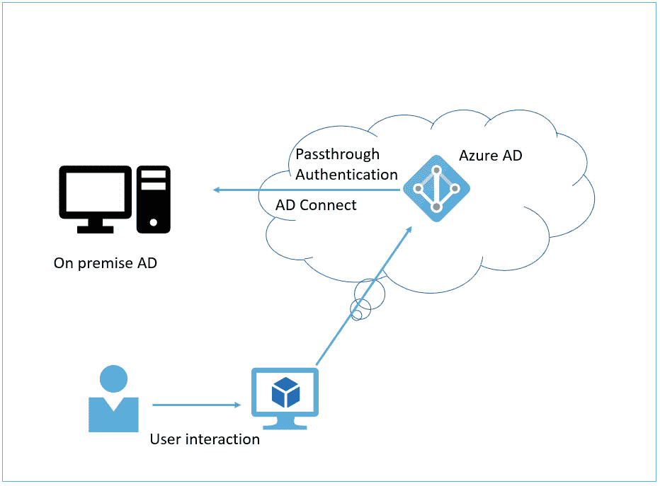
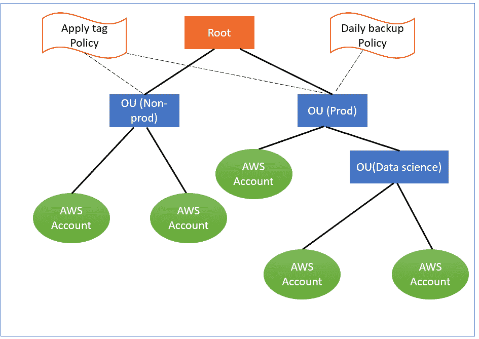
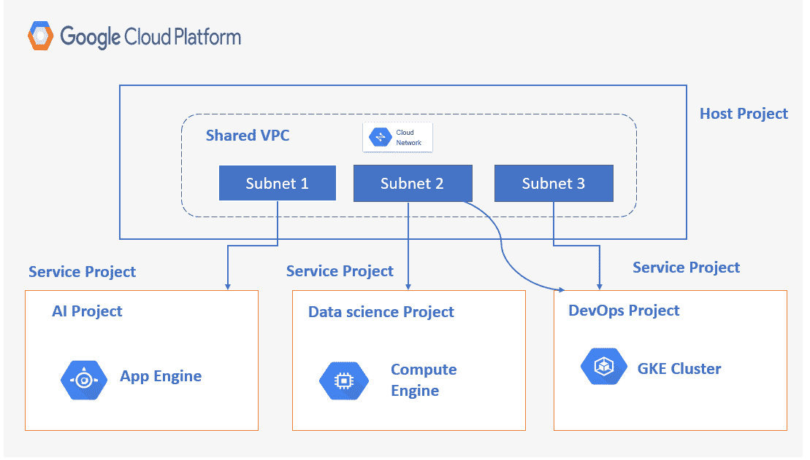
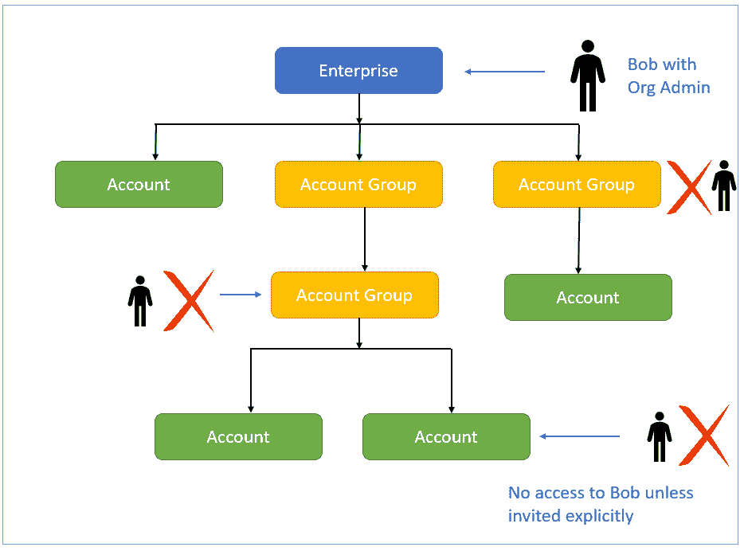

# 在公共云平台上定义组织/资源层级

> 原文：<https://medium.com/globant/defining-organization-resource-hierarchy-on-public-cloud-platforms-5d4b215008fc?source=collection_archive---------0----------------------->

大多数公共云供应商首先提供免费层，允许个人尝试不同的服务产品，并在此过程中学习它们。这是很好的尝试和测试的东西。当您尝试为您的组织设置帐户和组织资源时会发生什么情况。你真的能采用与免费层账户相同的方法吗？答案是否定的。

它需要一套规程和指南来为任何云供应商设计和设置企业帐户。我们需要了解不同的因素，比如-

*   使用此类帐户的用例
*   使用水平
*   组织政策和法规遵从性需求
*   目标受众等。

这篇文章背后的动机是帮助所有那些想了解如何着手*组织*帐户供应以及这样做时要考虑的事情的人。**给你一个忠告:以这篇文章为指导，实现最适合你需求的东西。这里提到的东西不一定都符合你的要求。**

我们将讨论四个主要的公共云供应商(至少我知道)，同时讨论最佳实践，以便每个人都容易理解。

# 定义组织层级的机制

任何企业的一般要求是将其资源和项目组织成一个逻辑顺序。*公共*云提供商提供不同的机制来满足这一需求。在典型的云计算平台中，组织或企业节点是最顶层的实体，它充当所有其他实体或资源的父节点。这是管理和控制层次结构中发生的动作的节点。

术语因供应商而异，例如在 AWS 中，我们在顶部有一个根组织节点，下面是组织单位。在 GCP，我们的文件夹资源以组织节点为父节点。下面是一个对比图-

这就把我们带到了云供应商遵循的继承模型的话题，它通常是自顶向下的。然而，也有一些例外。例如，在 IBM 的情况下(在撰写本文时)，一个组织节点仅用于维护账单、应用订阅信用等。

# 定义组织层次结构时要考虑的因素

记住这一点，让我们看看在为您选择的公共云供应商定义组织/资源层级时需要考虑的一些因素— **身份验证和用户管理、补救方法和策略实施、网络布局、访问/权限继承和计费**。

# 1]认证和用户管理-

我们不需要强调这对于决定您的云帐户的身份验证流程有多重要。大多数云提供商都有 IAM(身份和访问管理)作为单独的服务，负责用户管理，并帮助您定义身份验证和授权部分。有两种实现 IAM 的首选方法

**a .本地用户管理** —这是设置用户管理最基本、最简单的方法。这包括使用上述服务创建和维护用户、组、策略和角色。这种方法的优点是尽可能快地让您的用户加入进来，并保持关注点的[分离](https://softwareengineering.stackexchange.com/questions/32581/how-do-you-explain-separation-of-concerns-to-others)。这种方法的缺点是，它涉及大量基于组织中新进用户或离职用户的手工工作。

这样做的第二个主要缺点是为您采用的新云平台定义和维护一个单独的用户管理流程。想象一下，一个拥有 5000 到 10000 用户的组织与 4 到 5 个不同的云供应商打交道。尤其是当权限、网络攻击、跨供应商资源共享等方面出现问题时，这会变得多么乏味

**b. Federation** — IdaaS(身份即服务)提供托管解决方案来维护您的组织数据库。一些组织可能选择使用现有身份并联合它来认证云平台中的用户。下图描述了一个示例实现。

例如，Microsoft Azure AD 提供了密码哈希同步或通过 Azure AD connect 传递身份验证等功能，用户可以决定在本地(现有 AD)进行身份验证，或将用户的密码存储到 Azure active directory 中，并在发生更改时与现有 AD 同步。另一个例子是 AWS 提供的 AD connect，用于同步 AWS 云中的 AD 对象。这减少了认证呼叫，从而提供了更快的响应。

因此，在您落笔之前，请考虑一点，这将有助于您获得以下问题答案

*   我的身份验证和用户管理流程支持整个组织还是资源层次结构中的所有级别？
*   如果将来增加，这种模式是否可以扩展以支持其他云供应商？
*   该模型是否可持续、无缝，添加或删除新组件会如何影响整个身份认证流程？

# 2]补救方法和政策实施

这里的策略术语不是指与用户相关的策略或权限。您希望在顶层(在组织节点)控制和实施一些策略，以便您配置或设置的任何内容都可以在子节点/实体处继承。

例如，一项组织法规遵从性要求规定，不会使用公共 IP 启动任何虚拟机，或者虚拟机的实例类型/SKU 不应大于 2 个 vCPU 和 4 GiB RAM。在 MS Azure 中，可以使用本地策略或定义一个自定义策略，并将其放在根管理节点，以便所有子资源——管理组、订阅、资源组、资源——都将继承它，并强制每个用户都这样做。

当人们希望设计一种补救方法时，它起着至关重要的作用，这样，即使事情由于未知的原因而出错，也有一种安全措施来取消事情并保持标准的环境。解释这一点的一个很好的例子是实现资源的标记。每个资源(由任何人创建)都应该有一组与之相关联的标签，如所有者姓名、部门/项目名称、目的等。这是为了跟踪所有权，并有助于计费，以便发票可以发送到适当的部门或项目。

如果用户忘记这样做，有一个适当的政策，将执行这个和**附加**至少基本的标签，并发出通知给管理员。与 IBM cloud 相比，Azure 和 GCP 拥有非常成熟的解决方案，IBM cloud 正在开发类似的服务。

简而言之，当您了解并清晰地定义您的组织的策略和补救方法时，它可以帮助您减少不想要的和不愉快的场景(可能是有意的或无意的)，并在资源层次结构的所有级别维护标准和安全的托管环境。

# 3]网络布局

考虑当前和未来需求的网络布局设计是一个重要部分，因为这是一项不能反复进行的活动。因此，必须与不同的部门/团队(如 IT 安全、监控团队等)进行透彻的理解和详细的讨论。

设计还应涵盖您对内部环境连接的要求(或者可能是第二家云供应商)。例如，具有有限许可证的反病毒服务器或漏洞扫描器存在于内部环境中，其可用于在云环境中执行扫描。因此，在层级结构的每个级别上共享这些资源以及它们将被消耗的方式是至关重要的。

让我们以 GCP 为例，它提供在一个项目(主机项目)中创建的子网，供多个其他项目(服务项目)共享。要在不同项目之间实现这种共享，需要在层次结构中进行权限管理。

与您的网络团队(如果有)进行详细讨论将有助于您针对云资源消耗规划网络和组织层次结构，并在不破坏或影响现有功能的情况下有效地使用 ip 地址等最宝贵的资源。

# 4]访问/权限继承

本节介绍与用户帐户、组等相关的权限/策略。在组织节点应用的权限/策略通常会被继承。但是，了解在不同级别应用时，用户的有效策略/权限是什么是很重要的。考虑以下 GCP 的例子。

如果一个名为 Bob 的人被授予 folder-Data science 部门的项目编辑职责，那么他将拥有资源层次结构中所有项目 A、B、C 的编辑职责。此外，即使您删除了他在项目级别的编辑角色，他仍将获得从文件夹—数据科学部门继承的编辑角色。

然而，在 IBM 的案例中，这并不成立。例如，考虑下面的例子。

在企业节点授予用户 A 的权限不允许他创建或操作资源或帐户级别。用户需要被专门邀请才能访问该帐户。

因此，绝对有必要了解谁(用户)需要对哪个资源的什么访问权限(角色)。参考并了解给定云供应商提供的资源层次结构是否遵循 IAM 策略的类似层次结构。这确保了每个人都有适当级别(最低特权)的访问权限来履行他/她的职责。

因此，研究、理解和定义每个级别所需的权限级别(记住最小权限原则)将有助于您定义您的组织层次结构，这将满足用户的访问需求，而不会阻碍(和妨碍)他们使用云资源。

# 5]计费-

正如本文开头所提到的，几乎每个云提供商都提供一个免费的层帐户来试用这些东西，并适应所提供的服务。

除了免费层之外，我们通常会看到按需付费、基于订阅的定价模式，这种模式允许您消费服务并按月或根据您的使用情况支付账单。

可以使用成本控制机制来控制计费因素，这是每个个人或企业关注的焦点，因为它有助于节省可以更好利用的资金。不同的云提供商提供不同的结构来设置计费或应用可用于资源消耗的订阅/信用。例如，AWS 有一个[合并计费](https://docs.aws.amazon.com/awsaccountbilling/latest/aboutv2/consolidated-billing.html)的概念，即在一个主账户(也称为付款人账户)中为所有成员(关联)账户付款。这样，您就可以在一个地方查看子账户/关联账户中发生的所有支出。

这与 IBM cloud 所提供的形成了对比。在 IBM cloud 中，如果您有一个基于订阅的模型(通常建议用于企业帐户)，一组信用将应用于组织节点(基于您的公司和 IBM cloud 之间的协议)，然后可以由所有子节点(如帐户组和帐户)使用。可以在个人帐户级别设置资源配额，以控制每个帐户的支出。一旦所有的点数都用完了(并且您没有申请新的点数)，您的帐户就会变成现收现付模式。

在 Azure 的情况下，计费层次结构不同于资源层次结构，在资源层次结构中有注册、部门、帐户、订阅，如这里的[所述](https://docs.microsoft.com/en-us/azure/cost-management-billing/manage/ea-portal-get-started)。

因此，了解各个云供应商提供的计费选项以及它如何影响您的资源层级是绝对必要的。在此基础上，人们可以设计和实现组织/资源层次结构来最好地满足需求。

**结论**

虽然云提供商为用户提供了组织和控制企业级资源的机制，但架构师和设计师必须考虑多种因素，如身份验证和用户管理、策略合规性、网络布局、访问/权限继承和计费，以定义最适合组织的最佳设计。