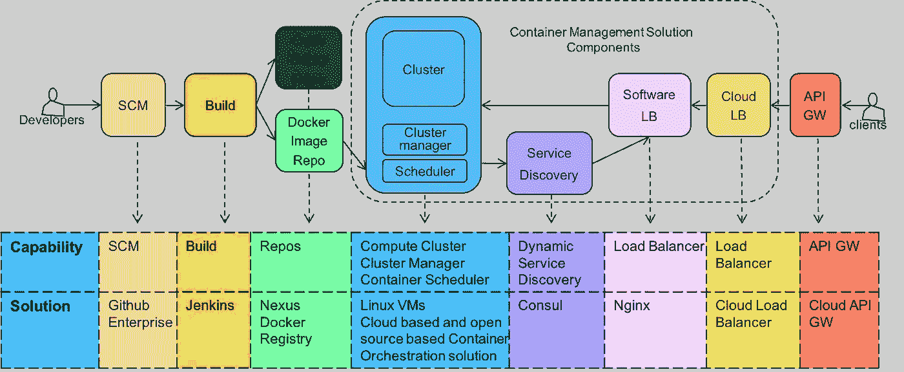
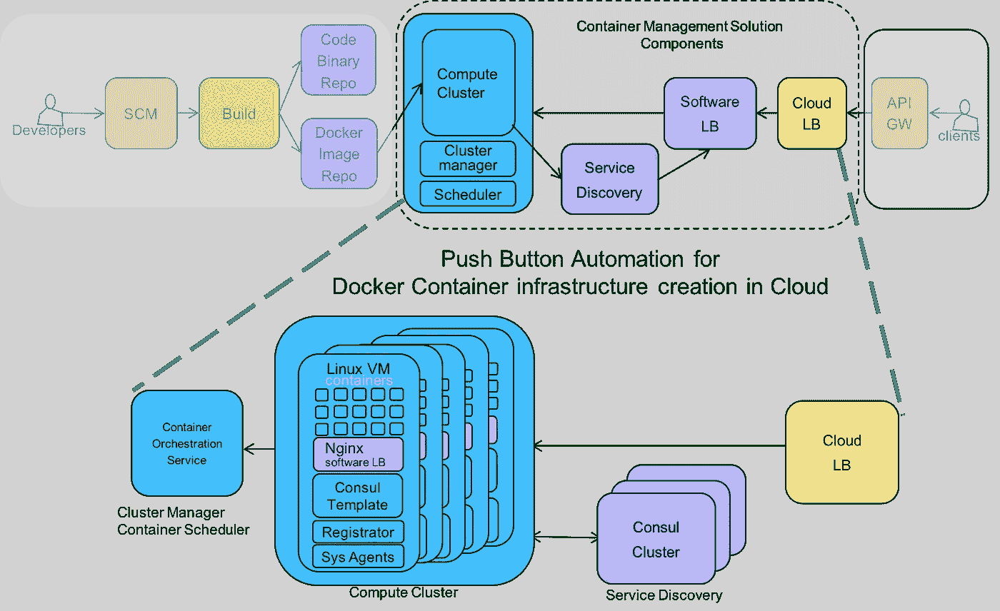

# 借助 DevOps 为企业提供微服务

> 原文：<https://medium.com/capital-one-tech/delivering-microservices-for-enterprise-with-devops-fd253a6c2f1e?source=collection_archive---------1----------------------->

在 Capital One 的技术部门工作是一件令人兴奋的事情，因为我们正在利用开源软件和新兴的云技术来构建优秀的数字产品和世界级的开发人员体验。作为一名架构师，我与开发团队合作，帮助实现下一代架构，如微服务、云原生应用和 DevOps。

大约一年前，我们的团队利用我们先进的 API 开发实践着手开发新的微服务架构。Capital One 已经有了 API 编码框架，数百个 API 投入生产，甚至还举办了几次 API 峰会。为了促进微服务的采用，我们必须清楚地描述我们的微服务的特征，它们与现有 API 的比较，并通过开发几个概念证明来展示价值主张。

对于推进微服务架构的采用，Capital One 充分利用云技术的时机再好不过了。

**微服务特征**

在这个过程中，我们的第一步是定义可量化的微服务特征，并开始与采用微服务架构的 API 实践进行比较。微服务的特征是:

**1。** **微服务小，专注做好一件事**

Capital One 的 RESTful API 本体实践和领域驱动设计(DDD)原则使得服务的范围很小。对于 Capital One 来说，代码行数对于确定微服务范围的方法来说是次要的。重要的是功能在范围上是有限的。

**2。** **微服务运行在自己的容器中**

一个应用服务器通常运行许多 API 服务，从而形成一个单一的应用服务器。一个有故障的服务就可能导致整个应用服务器和其上运行的所有服务停止运行。微服务的不同之处在于，每个服务都在自己的容器中运行。

**3。** **微服务自有数据**

微服务拥有它们的数据，或者在一个单独的数据库中，或者在一个更大的数据库的一个分区中。这不同于在多个 API 之间共享大型数据库的 API。在微服务架构中，数据访问通过拥有数据的微服务 API 进行。使用云技术允许利用托管数据库，使得每个微服务在操作上有可能拥有自己的数据库。

**4。** **微服务通过与语言无关的 API 进行通信**

Capital One 将 RESTful APIs 与 JSON 有效负载结合使用的做法符合微服务架构。

**5。** **微服务使用事件将数据变更传播给其他服务**

微服务利用消息传递和事件驱动架构在微服务之间共享数据。通过服务间消息传递总线的异步事件提高了可伸缩性和容错能力。

**6。** **微服务可独立部署和扩展，完全自动化**

作为微服务采用之旅的一部分，Capital One 开发了用于创建云基础架构堆栈、构建和部署微服务以及根据使用情况进行扩展的自动化工具。

## **DDD 和 devo PS——微服务硬币的两面**

领域驱动设计和 API 本体实践有助于设计微服务的范围和规模。 [Eric Evans 的领域驱动设计](https://domainlanguage.com/ddd/#https://domainlanguage.com/ddd/)这本书是将应用领域分解为可构成微服务范围基础的集合的绝佳参考。虽然我们不完全遵循他的建议，但我们相信分解应用程序并将其集成到我们的架构中的重要性。

创建我们的微服务架构的一部分包括为我们的微服务开发基础设施自动化、容器管理解决方案和 DevOps 管道。我们看到不同抽象层次的容器，如虚拟机、JVM 和 Docker 容器，并在适当的时候使用它们。Docker 和容器管理解决方案提高了基础设施资源利用率，加快了开发速度，并将应用程序层与基础设施分离。

在我们的架构团队中，我们一直在与几家内部客户合作，试行微服务的 DDD 原则和微服务 DevOps 管道的容器管理解决方案。这些试点有望改变我们开发和实施的系统数量。

## **工具发生变化，转而关注 DevOps 管道功能**

在我们的微服务试点中，我们重点关注微服务 DevOps 管道组件的功能，并为每个组件开发了一个操作简单的解决方案。组件通过 API 松散耦合，并且是为替换而构建的。

我们面向微服务的 DevOps 管道组件包括源代码管理(SCM)、构建服务器、代码报告、映像报告、集群管理器、容器调度器、动态服务发现、软件负载平衡器和云负载平衡器。

如上所示，该堆栈包括用于 SCM 的 Github、用于 Build 的 Jenkins、用于代码报告的 Nexus、用于图像报告的 Docker Registry，这些都是我们的标准企业开发运维工具。

Docker 将微服务打包，可以作为软件容器在任何 Linux 机器上运行。但是容器本身并没有那么有用。正是这个 DevOps 管道和我们的容器管理解决方案提供了企业级的微服务。

我们的团队试验了几种开源的、基于云的集群管理器和容器调度器解决方案。这些解决方案中的每一个都有一套很好的功能，并且具有不同级别的操作复杂性。

根据我们的试点结果，内部团队开始采用基于云的容器编排解决方案，以简化操作。我们也有团队运行基于开源的容器编排解决方案。

我们使用 Consul 进行动态服务发现。Nginx 用作反向代理，通过 Consul 模板动态配置 Docker 容器端点。

我们的目标是为管道中的每个组件构建一个解决方案，并知道稍后会有更好的解决方案来取代它。当这种情况发生时，这将是一个简单的组件交换，而不会影响整个管道。

## **自动化加速采用**

Capital One 是一个联合组织，具有“您构建它，您拥有它”的文化，为交付团队提供自主权和速度。我们不会为整个企业运行一个大型集群。为了让联合团队在他们自己的堆栈中运行他们的微服务，我们需要自动化容器管理堆栈创建的能力。

为了实现这一点，我们使用 Hashicorp 的 Terraform 开发了按钮自动化工具来创建容器堆栈。我们的自动化工具创建了高度可用的云计算集群、用于服务发现的 Consul 集群以及其他所需的系统组件。

我们的联合团队使用这些自动化工具来创建容器栈，提供一个参数文件作为输入。参数文件捕获在云基础架构中创建堆栈所需的配置信息。

对于我们的团队来说，开发自动化工具来创建高度可用、可伸缩和容错的分布式容器堆栈既具有挑战性，又令人兴奋。举个例子，当我们用 300 多个容器为 60 个服务运行 50 多个 Linux 虚拟机时，我们遇到了不稳定的 consul 集群和摇摆不定的领导者选举。执政官对大量执政官模板上的手表项目的读取压力导致了不稳定。我们升级到了 Consul 的最新版本，并重新设计了我们的 Consul 模板，以减轻观察压力并解决问题。

## **激动人心的未来在前方**

将应用开发为微服务的集合并作为容器运行，可以提高资源利用率并降低我们的云成本。我们目前利用微服务架构在云中开发新的应用程序，以及通过将大型本地应用程序逐步分解为微服务来将其迁移到云中。我们在微服务和容器管理领域的工程和自动化工作正在加速我们的云之旅，并改善我们的开发人员体验。

