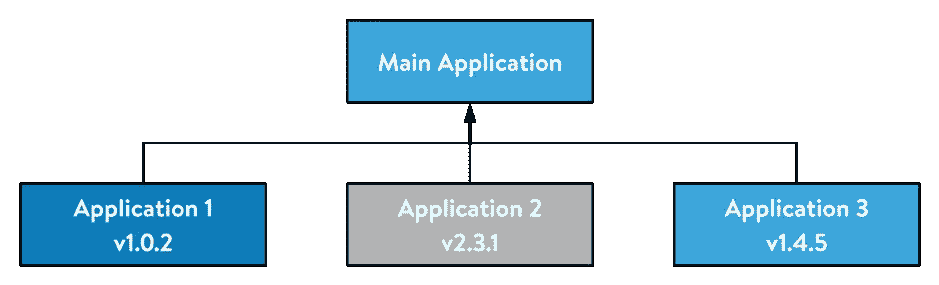
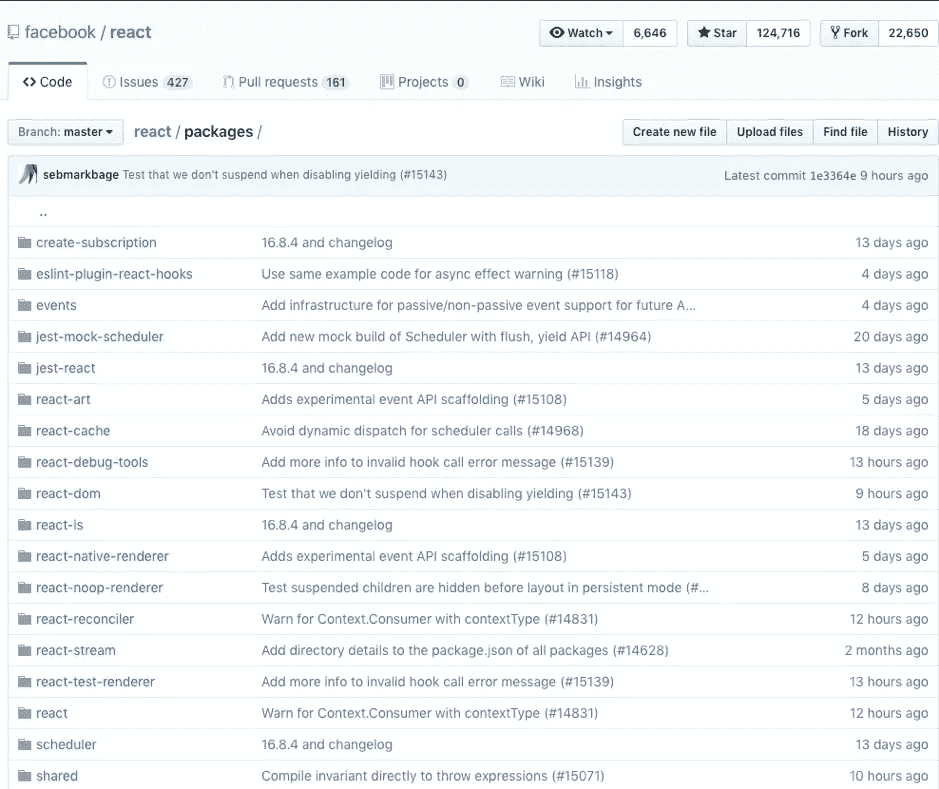
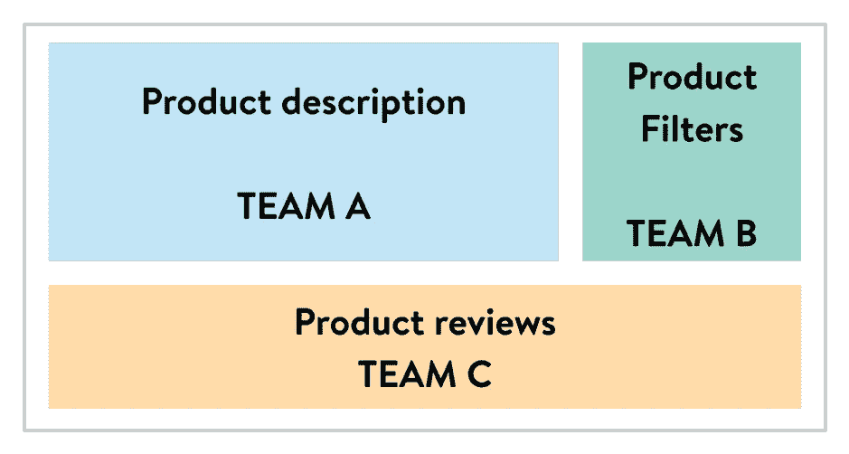
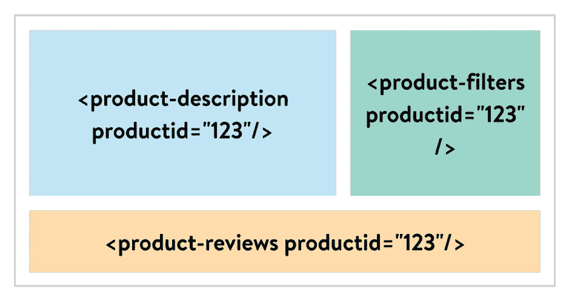
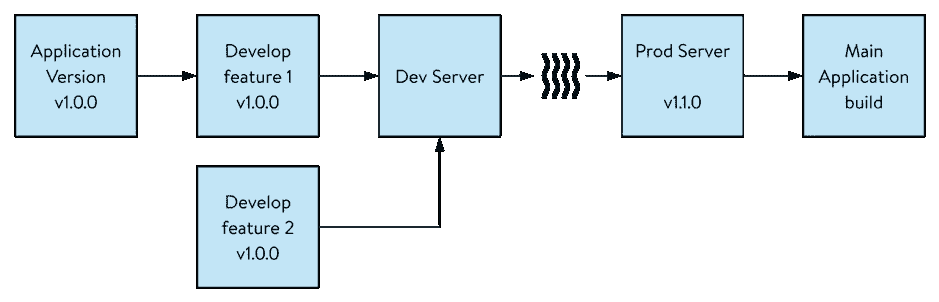

# 大规模交付 ReactJS 应用

> 原文：<https://medium.com/walmartglobaltech/delivering-reactjs-applications-at-scale-5cb8a363f99?source=collection_archive---------3----------------------->

[https://pixabay.com/photos/business-cellphone-codes-coding-1839876/](https://pixabay.com/photos/business-cellphone-codes-coding-1839876/)

# 介绍

应用程序的可伸缩性是应用程序设计的重要部分。有多种方法可以扩展应用程序。可以通过编写高性能和高效的代码，或者通过添加更多的服务器实例来扩展应用程序。在这篇博客中，我们将探讨如何扩展由不同团队构建的多个应用程序，以及支持这些应用程序的健壮 CI/CD。

# 问题陈述

当您必须在单个实体下支持多个应用程序的开发和发布时，需要考虑许多方面，即可伸缩性、发布策略、性能、安全性、SSO、授权等。这些应用程序有独立的团队在独立的发布周期中开发他们的产品路线图。为了解决上述问题，我们构建了一个托管解决方案来帮助开发多个应用程序。让我们来看看解决方案的体系结构。

# 体系结构

为了支持多个应用程序的开发和发布，我们遵循模块注入方法，其中应用程序作为 npm 模块构建，并作为依赖项添加到主父应用程序中。

Main application and child applications with different versions

如上图所示，子应用程序由不同的团队构建，并作为 npm 模块导出。根据 npm 的语义版本，应用程序可以是任何版本。

## Monorepos

如果你查看 GitHub 中许多流行的 JavaScript 框架/库的源代码，你会发现多个包是使用一个 GitHub 库开发的。下面是 [React GitHub 库](https://github.com/facebook/react)中 packages 文件夹的截图。

Facebook’s React codebase [https://github.com/facebook/react](https://github.com/facebook/react)

所有这些软件包都是不同版本的 npm 软件包。如果每个包都有一个单独的 GitHub 库，那么跟踪多个 GitHub 库将会很困难。在进行 bug 修复或特性更新时，单独增加软件包也是一个挑战。通过将所有这些包放在一个存储库中，开发和跟踪这些包变得更加容易。

这个概念被称为 Monorepos。在开源仓库中有很多 monorepos 这样的例子。

> Yarn 默认支持在单个存储库中开发包，并具有一个名为“工作区”的特性。如果你使用 NPM，那么你可以使用 [Lerna](https://github.com/lerna/lerna) 库来管理软件包。

## 与微前端方法的比较

以上感觉和 micro frontend 的做法差不多，但是有细微的区别。在微前端方法中，应用被分成多个应用。这些应用程序都是作为定制元素开发的，通常由独立的 scrum 团队开发。下面是一个应用程序及其微前端方法的示例。

Different sections of “Product” application

上面的例子是一个关于产品的应用程序，分为三个独立的应用程序——产品描述、产品过滤器和产品评论。假设这个应用程序是由三个不同的 scrum 团队开发的——A、B 和 c。这些团队将开发定制元素，如下图所示。

Custom elements for the “Product” application

微前端方法和 npm 方法之间的一个区别是，我们在 npm 方法中的应用程序层次结构中寻找更高的层次。在微前端方法中，应用程序是根据多个独立的应用程序开发的，使用 DOM 作为数据通道层。

在我们的方法中，我们将应用程序用作 npm 模块。应用程序可以开发为微前端或单片。它不会影响我们使用应用程序的方式。

类似地，应用程序团队可以自由选择任何适合他们开发的分支策略——git flow 或基于主干的开发。

# 使用 npm 模块的优势

npm 模块方法具有内置的依赖性管理和版本控制能力的框架。子应用程序可以根据变更增加它们的版本——bug 修复、功能更新或可中断的变更。主应用程序添加子应用程序的 npm 包作为依赖项，并在更新时获取最新版本。

使用 npm 模块的另一个优点是依赖关系可以在应用程序之间共享。每当用户从一个应用程序转到另一个应用程序时，不需要再次下载公共依赖关系。此外，通过使用公共的依赖关系，例如，所有的应用程序都使用单一版本的 UI 库，应用程序的外观和感觉都是一致的。

# 应用程序发布流程

为了促进包的开发，我们向应用程序团队提供样板文件。这个样板文件内置了代码质量检查，并初始化了 Monorepos。开发团队必须复制样板文件，并开始开发他们的应用程序。一旦在本地开发和测试了应用程序，开发人员就向他们的 Git 存储库发送 Pull 请求(PR)。这个 PR 将运行代码质量检查，并对他们编写的 delta 代码进行测试。一旦 PR 被审查和合并，代码质量检查和集成测试套件在整个代码基础上运行。应用程序进展到更高的环境(开发、QA、阶段等。)，最后将被构建为一个 npm 模块。

该 npm 模块发布到沃尔玛的内部仓库。npm 模块的版本将基于应用程序中的变更类型而增加，即针对 bug 修复的补丁版本更新、针对功能开发的次要版本更新以及针对可中断变更的主要版本更新。

一旦 npm 模块被发布到内部存储库，它将触发主应用程序的构建。这确保子应用程序的最新版本在主应用程序中可用。

# 持续集成和部署

为了支持作为 npm 包的应用程序的开发，我们需要一个健壮的 CI/CD 流程。这个 CI/CD 过程检查代码质量、测试覆盖率，并创建应用程序的 npm 包。以下是 CI/CD 流程示例。

Sample CI/CD diagram

这里的应用程序版本是 1.0.0。开发人员开始并行开发特性 1 和特性 2。这两个特性都作为 pull 请求发送到 dev 服务器，在那里它们被合并。然后，它进入不同的阶段，如 QA、Stage 和 Prod，并最终构建为 npm 模块。

# 结论

*   *—代码库是独立的，但是应用程序被托管在一起*
*   ****模块化代码* —** 我们遵循了基于 npm 的版本化和依赖性管理方法*
*   ****公共依赖*** —应用程序之间共享库*
*   ****DevX*** —改善开发人员体验，加快上市时间*