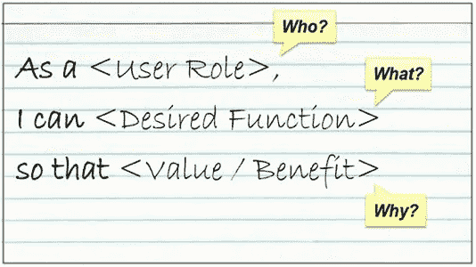
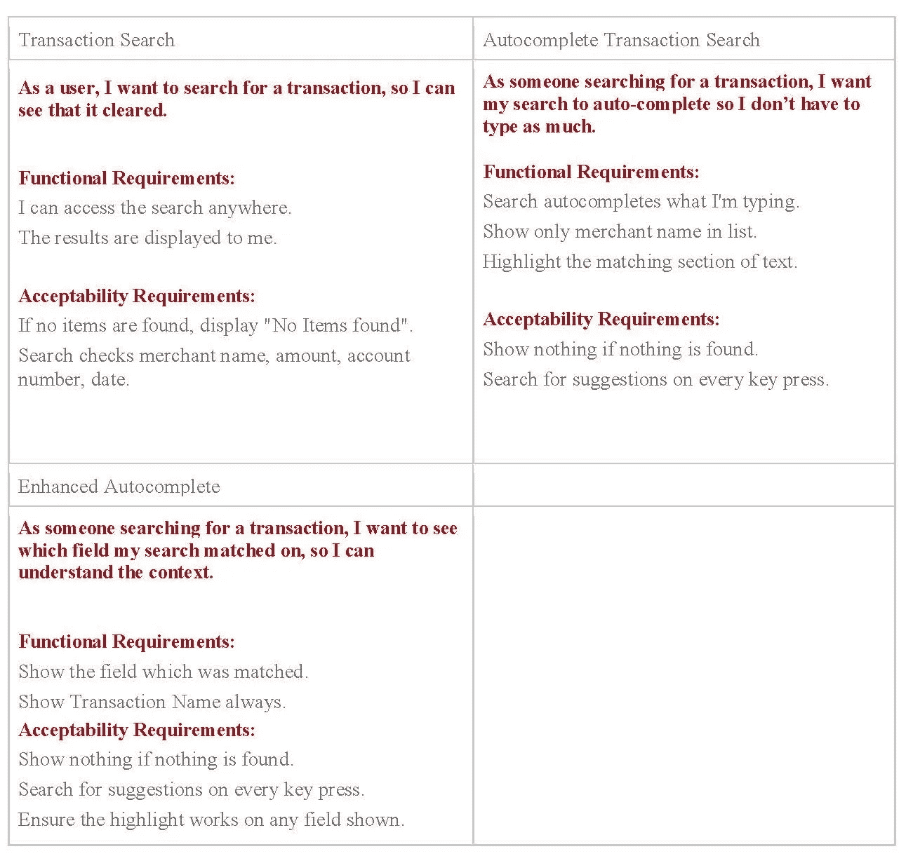
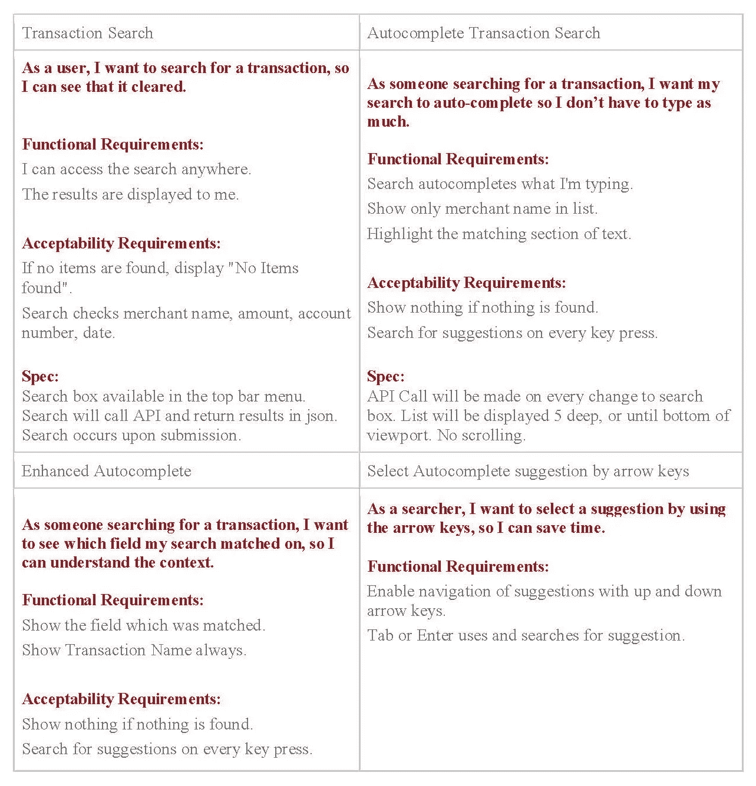

# 通过用户故事传递价值——最终的对话开始

> 原文：<https://medium.com/capital-one-tech/delivering-value-with-user-stories-the-ultimate-conversation-starter-1f1244baf17?source=collection_archive---------1----------------------->

在其核心，敏捷是关于交付价值，获得反馈，并尽可能快地重复过程。在大多数敏捷组织中，价值是在用户故事中描述的。在我领导软件和产品开发团队的这些年里，我看到了许多不同的用户故事排列，不同的风格适用于不同的团队。无论您使用哪种用户故事排列，都有一个问题:

***一个用户故事的真正动机是什么？***

在最基本的层面上，用户故事是一个*对话的开始*。第一个目标是让开发团队和产品所有者(或客户)谈论期望的结果。如果在这个阶段缺乏沟通，交付的结果可能会与预期大相径庭。通过与团队进行对话并分享愿景，他们可以开始了解客户的需求。对于整个团队来说，参与这次对话是非常重要的，因为每个人都可以带来有价值的观点，从而激发更多的讨论。

> **敏捷蔻驰:** *好了，让我们来讨论一下待办事项中最重要的是什么。*
> 
> **PO:** *对我来说最重要的就是这个新的交易搜索。我们的应用程序的用户真的没有办法发现细节或调查他们的交易。根据一些用户组的投票，我们知道这对他们很重要。我认为，如果我们能够做到这一点，我们真的可以增加用户的快乐和满意度。*
> 
> **Dev 3:** *听起来很有意思。* **Dev 1:** *用户目前如何找到自己交易的信息？*
> **PO:** *现在，他们必须滚动浏览他们的交易列表，如果不打开交易的细节，就无法知道交易的细节。真的是很差的体验。*
> 
> 是的，这听起来的确令人沮丧。你有什么想法让它变得更好？

团队*希望*交付正确的价值；这种对话有助于减少或消除需求和交付之间的差距。

用户故事的第二个目标是理解所涉及的工作。在这里，对话集中在开发团队问尽可能多的问题，相对于他们已经完成的其他用户故事来确定用户故事的大小。这种相对规模对于帮助产品负责人区分优先级和回答*“x 什么时候完成？”*

规模只是优先级等式的一部分，业务价值是另一部分。这两者结合起来可以让产品所有者尽快获得最大的回报。因为调整是基于努力而不是时间，所以无法回答*【多长时间】*。

不同的团队对他们想要什么有不同的观点。我所在的团队使用了共同故事点，而其他团队则使用了 t 恤尺寸。

> **Dev 1:** *听起来像是加大码。* **Dev 3:** *好吧，如果我们把它与我们上一次做的 XL 相比，我认为它更努力，所以我会说是 XXL。*
> 
> **PO:** *好的，听起来蛮大的。我回去看看我能做些什么来打破它。*

请记住，每个团队都有自己的尺度，因此尺度的值并不重要，并且您不能将一个团队的值与另一个团队的值进行比较。例如:

> 戴夫 2: *我觉得这听起来很容易。* **Dev 4:** *嗯，如果我们把它比作我们做的最后一个香蕉，我认为它更费力气，所以我会说是一个哈密瓜。*
> 
> **PO:** *好的，听起来很大。我回去看看我能做些什么来打破它。*

或者

> 对我来说，那听起来像只松鼠。
> **Dev 4:** *好吧如果我们把它比作我们做的上一只松鼠，我觉得它更努力，所以我会说是一只浣熊。*
> 
> **PO:** *好的，听起来很大。我回去看看我能做些什么来打破它。*

重要的是用户情景之间的相对大小。故事 B 比故事 a 付出的努力少，差不多，还是更多。

除了作为讨论和提问的起点之外，对于用户故事应该是什么或者包含什么，没有单一的规定。让我分享一下我的经验，当谈到创建用户故事时，我发现什么是最有价值的。

**1。** **值语句(作为<角色>我想将<功能>使<值> )**

**2。** **功能需求清单**

**3。** **可接受性要求清单**

**4。** **简单规格**

**5。** **线框/模型**

你可能会说" *WOAH！对于一个用户故事来说，这是很多东西！”但是如果用户故事的范围适当的小，最终也会很小。让我们以创建一个简单的事务搜索为例，对此进行一些分析:*

你在上面看到的是我所期望的采购订单。或者，在某些情况下，PO 和开发团队在一起讨论故事之后。在某些情况下，以上可能被认为是足够的。“好吧，看起来我们都明白这里的价值，它看起来相当小。”

在其他国家，也许不是。*“我认为这比看起来要大。我有些担心…”*

让我们在 PO 和开发团队之间的故事讨论中探索这个用户故事如何发展。同样，这样做的目的是减少不确定性，消除范围蔓延，并通过使每个用户故事变得更小和更容易理解来帮助提高可预测性。

> **Dev 1:** *自动完成应该显示什么？*
> 
> **PO:** *匹配用户输入的任何内容。*
> 
> **Dev 2:** *什么意思什么意思？什么领域？商家？金额？*
> 
> **PO:** *Hmmm。是的，商户名称、金额、账号和日期。*
> 
> **Dev 1:** *好了，这些都要一起列出来吗？自动完成过程中需要显示所有这些字段吗？*
> 
> **PO:** *是的，对于搜索到的每个项目，所有搜索到的字段都应显示在自动完成列表中。*
> 
> **Dev 2** : *好的，所以需要一个下拉列表，显示一个项目的所有可能匹配的字段。* *我们是否突出显示匹配的字段？*
> 
> 是的，我们要那个。
> 
> 我认为这个太大了。我们需要将一些搜索功能拆分成单独的用户故事。
> 
> **Dev 3:** *我同意。*
> 
> **Dev 2:** *同意。*

为什么开发人员要将它拆分出来？什么被认为是太大？东西有可能太小吗？

一般来说，一个故事应该不超过一个 sprint 持续时间的 1/4。也就是说，不管 sprint 持续多长时间，我告诉我的团队目标最大规模应该是两天左右，没有最小规模。在这种情况下，通过询问一些澄清性的问题，开发团队发现有一些隐含的预期功能，这些功能在最初的用户故事中没有描述。

尽管如此，需要记住的非常重要的一点是**尺寸！=持续时间**。就像你可以告诉我一颗葡萄比一颗草莓小一样(大多数时候)，一个开发团队可以说一个用户故事比一个已经完成的用户故事付出的努力多还是少；大多数时候。

通过将用户故事分割成更小的用户故事，团队可以更清楚地了解需求，产品负责人可以获得更多的优先级选项。

现在，让我们看看讨论是如何发展这个故事的。

> **PO:** *好的，我们可以进行交易搜索，并且在没有自动完成部分的情况下仍然可以交付价值。*
> 
> 对，但是我还有一些问题。
> 
> **Dev 3:** *我也是。*
> **Dev 2** : *当你说从任何地方都可以访问时，你指的是什么？*
> **PO:** *顶部菜单中的搜索应该可用，或者在手机上显示汉堡时。*
> 
> **Dev 1:** *Ok 没问题。*
> 
> **Dev 3:** *我想说说自动完成。我认为这里有两个部分。一个是在任何匹配中显示事务名称，另一个是在下拉列表中适当显示所有字段。实在没有太多的空间来始终显示四个字段并突出显示它们。我认为一些更智能的东西，只显示字段，也许其他信息的子集会更好。Dev 2: *是的，这需要做一些工作。* **Dev 3:** *同意。*
> **阿宝:** *你知道，有道理。不如我们把这个故事分成只显示商家名称，然后另一个处理显示更多增强信息的故事。**

当团队的不同成员考虑期望结果的不同部分时，他们发现了原始用户故事中没有描述的额外范围，并且这个范围是很重要的。团队的每个成员都有不同的视角，如果没有这些视角，团队交付错误的东西的机会就会增加。如果团队没有提出“增强的自动完成”功能，并将其作为一个单独的用户故事，产品负责人可能会惊讶于该功能没有在 sprint 结束时完成。

如果您将这些与我上面的原始列表进行比较，您会发现我们已经涵盖了价值陈述、功能需求列表和可接受性需求列表。我们仍然缺少两项— *简单规范和线框。*

让我们看看球队是如何处理这些事情的。

> 好吧，我们都同意这些是合理大小的故事。先说需要完成的事情。
> 
> PO: *我这里有线框，我会把它们附在故事上。*
> 
> **Dev 2:** *对于交易搜索规范，顶栏菜单中的“搜索框可用”怎么样。搜索将调用 API 并返回 json 中的结果”。*
> **Dev 1:** *我觉得应该加上“提交时发生搜索”。*
> **Dev 3:** *适合我。*
> **Dev 1:** *对于自动完成功能，每次更改搜索框时都会调用 API。列表将显示五层，或直到视窗底部。不滚动。方向键可以选择一个建议"*
> **Dev 3:** *我觉得方向键选择某个东西应该是另外一个故事。这似乎很简单，但我认为其中有一些微妙之处。*
> **Dev 2:** *我同意。*
> 
> **PO:** *工作真的那么多吗？*
> 
> 是的，我认为它会让用户故事比其他任何故事都要大。
> 
> **PO:** *好吧。*

注意产品负责人是如何惊讶于有些东西需要更多的工作。记住，开发团队完全有权在他们的迭代中接受或拒绝任何用户故事。由他们来决定一个用户故事是否太大，而不是其他人。然后，产品负责人被授权决定用户故事将交付的价值，使他能够挑选具有最高优先级的内容。

你可以看到一些被认为是理所当然的小事是如何被分解成一个新的用户故事的。

在整个过程中，团队从对需求价值的模糊认识，发展到对需求价值更具体的理解。通过对话，该团队能够将一个用户故事分解为四个用户故事，详细说明用户将如何与产品交互。用户故事没有完全定义用户应该如何与产品交互的目标。

你可能已经注意到一些用户故事没有规格。规格并不总是必要的，尽管它们可能非常有用。我发现上面简单的风格规范有助于提醒最终参与用户故事的团队成员记住讨论的内容。如果事情足够琐碎，或者很容易理解，团队可能会选择跳过这一步。

这就是我们将我们的规范与完整的技术规范区分开来的地方，完整的技术规范在历史上详细描述了完整的实施指南。*简单的 spec 不是架构。*在 sprint 中，架构应该在人们执行故事的过程中出现。通过帮助定义所讨论的实现，规范可以帮助指导这些决策。

我提到了线框，但没有显示任何。这些不必复杂，但我相信它们对任何用户界面都非常重要。一些简单的事情，比如在一张纸上快速画一个草图，或者像其他人描述的那样，一张餐巾纸的背面，足以指导团队如何实现事情。理想情况下，最终的 UX 设计工作将作为用户故事实现的一部分。

在敏捷开发中，保持范围小而简单是很重要的。如果用户故事太大，就很难确定规模或设定期望值。用户故事让产品所有者和开发人员之间的对话开始，提供了利用强大的协作团队来关注和完善该范围的机会。不同的团队对用户故事包含的内容会有不同的理解，但重点是一样的——开始一场对话，这样你就可以尽快交付价值，衡量和适应，冲洗和重复。

***披露声明:以上观点为作者个人观点。除非本帖中另有说明，否则 Capital One 不属于所提及的任何公司，也不被其认可。使用或展示的所有商标和其他知识产权都是其各自所有者的所有权。本文为 2017 首都一。***

***欲了解更多关于 Capital One 的 API、开源、社区活动和开发人员文化，请访问我们的一站式开发人员门户 DevExchange。***[***developer.capitalone.com/***](https://developer.capitalone.com/)

## 相关链接

*   [垂直切片，一些实用的想法](https://developer.capitalone.com/blog-post/vertical-slicing-some-practical-ideas/)