# Azure 数据块中的增量克隆

> 原文：<https://medium.com/globant/delta-cloning-in-azure-databricks-7e86d21b2606?source=collection_archive---------0----------------------->


Photo by [Possessed Photography](https://unsplash.com/@possessedphotography?utm_source=medium&utm_medium=referral) on [Unsplash](https://unsplash.com?utm_source=medium&utm_medium=referral)

当我们处理数据时，各种场景都需要您创建数据的副本。数据存档、单元测试、培训和机器学习的测试数据是一些用例。到目前为止，您可能已经使用了各种方法来创建数据的副本，例如 CTA(创建表为)、Insert Select、Insert Overwrite 等。这些是创建拷贝的常规方法，除了创建数据副本之外，没有提供任何优势。

在这篇文章中，我将向你展示 Azure [Databricks](https://www.databricks.com/product/data-lakehouse) 提供的一个特性，来创建你的数据的克隆。

# 增量克隆

让我们设想一个功能，它将自动考虑完整的元数据，包括约束和分区，并以不同的时间间隔维护副本的各种版本。如果我说它将增量处理您的副本，而不是每次都进行完整加载，会怎么样？

是的，的δ克隆就是实现这一点的方法。[数据块](https://www.databricks.com/product/data-lakehouse)增量提供了一种高效且有组织的方式来创建表副本。

增量克隆有两种类型，*浅层克隆*和*深层克隆*。让我们详细讨论每一个。

# 浅层克隆

在浅层克隆中，将制作源表元数据的副本，但是它将引用来自源表本身的文件；文件不会被复制到新的表格位置。因此，要在任何时间点使用浅层克隆的目标表，源表文件应该总是可用的。如果源表文件被删除/清空，克隆将变得不可用。

在浅层克隆的情况下，当您在克隆的表上执行 select 语句时，它将引用源表的数据并为您获取输出。然而，用`update`语句更新克隆的表将在克隆的表目录中创建新文件。它不会更新源表的数据文件。

这是意料之中的吗？是的，因为浅层克隆概念是为短期用例设计的，在这种情况下，我们可以在用例完成后删除克隆。在这种情况下，如果我们改变源表中的数据文件，我们在使用后删除文件的目标将无法实现。因此，更改后的文件被写入克隆的表位置。当你不需要这些文件/数据的时候，删掉，你就好了。

让我们看一个浅克隆的实际例子。考虑下面名为 student 的源表。它包含五条记录，如下所示:

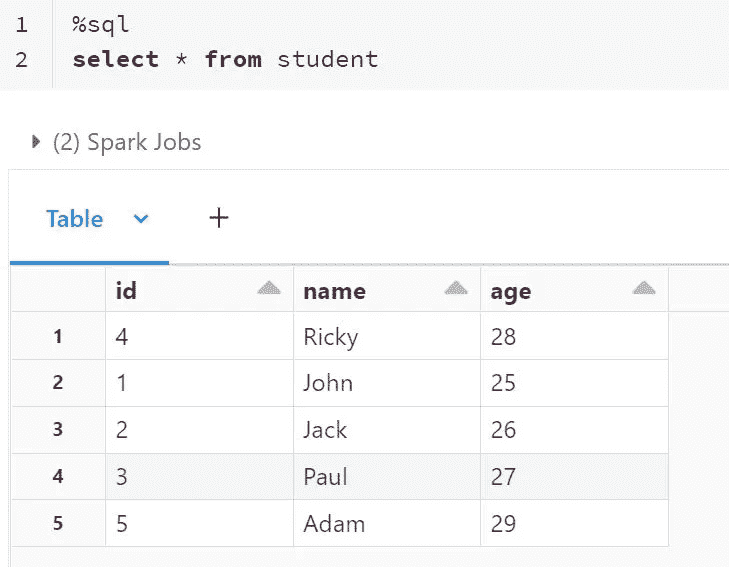

Student table's data

让我们创建一个数据库，所有的浅层克隆(备份)表都将驻留在这个数据库中(这是一个推荐的方法)。在真实的云场景中，这将是存在于不同区域的数据库。

```
%sql
create database db_shallow_clone location '/FileStore/shallow_clone'
```

现在，让我们使用下面的命令查看学生源数据的简单克隆，并观察输出:

```
%sql
CREATE TABLE IF NOT EXISTS db_shallow_clone.student
SHALLOW CLONE student
```

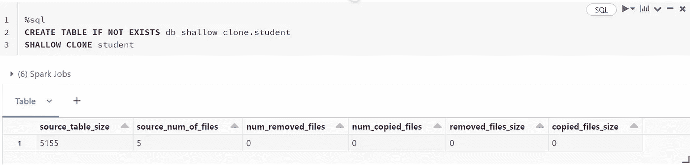

The output of shallow clone query

如前所述，在使用浅层克隆的克隆表上执行下面的查询将引用源表的数据并给出输出。

```
%sql
SELECT *,input_file_name() from db_shallow_clone.student.
```

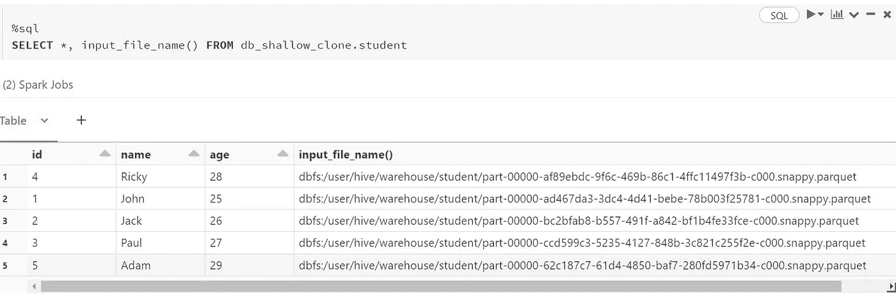

Data from shallow cloned table

所有记录都指向源表，如果研究上面的输出，就可以看到这一点。在我们的例子中，它是在默认 DB 中创建的，默认 DB 指向 hive warehouse 路径。如果您尝试在克隆路径中查看 student 表的目录，我们会看到它是空的。这是因为在克隆表之后，没有文件被复制到新的表目录中，并且我的克隆表仍然引用源表文件。

```
%fs ls FileStore/shallow_clone/student
```

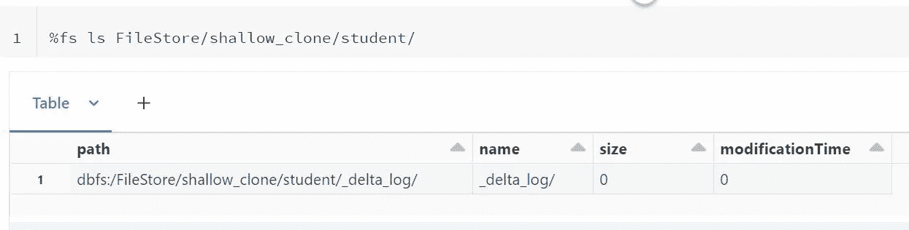

Delta log directory of shallow cloned table

现在，让我们看看我的日志是什么样子的。如果您仔细分析这个日志，有几件事情会引起我们的兴趣。

```
"isShallow": true
```

这告诉我们，它是一个浅薄的克隆体。

```
"numCopiedFiles": "0"
```

这告诉我们，在克隆操作期间，我们没有复制任何文件。

```
"operation": "CLONE"
```

这告诉我们，我们已经在这个表上执行了克隆操作。当我们看看这张桌子的历史，我们就会知道为什么这很重要。

```
%fs head FileStore/shallow_clone/student/_delta_log/0000000000000000000.json
```

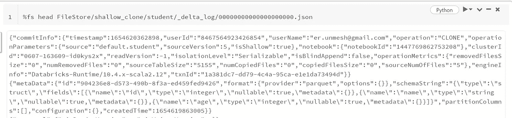

Log file content

假设我们遇到一个场景，我们需要将学生的年龄更新为 30 岁，以便执行一些操作。我们可以直接在源表上这样做吗？不要！！我们的克隆人先生说，“嘿，伙计！我是来帮你的。让我们为克隆先生的主动性说句公道话，并更新一项记录，将一个名叫亚当的学生的年龄定为 30 岁。

```
%sql
update db_shallow_clone.student set age=30 where name='Adam'
```

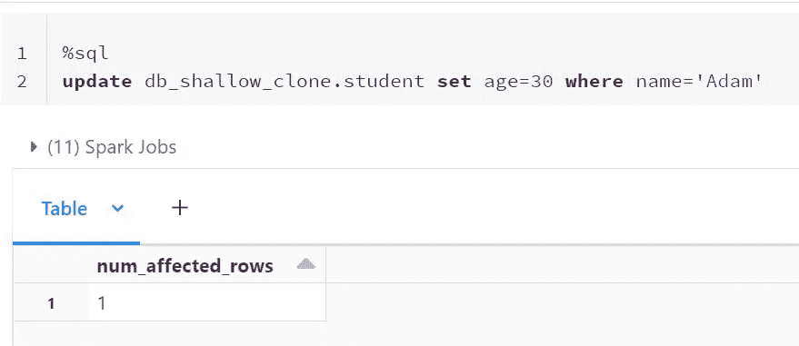

Update query

如果您观察，我们在学生目录中的 shallow_clone 下有一条记录。还记得我们之前讨论的吗？如果用 update 语句更新克隆表，它将直接在克隆表中创建新文件，而不会更新源表的数据文件。

这正是正在发生的情况。虽然您的克隆表引用源表的数据文件，但是一旦在克隆表上执行了 update 语句，它会将更新的文件复制到克隆表目录中，而不是动态更新源表数据文件。这正是我们的源表保持完整的地方。我们可以避免实际数据的意外更新。你不认为这将是在生产上进行测试时的一种方便的方法吗？

```
%fs ls FileStore/shallow_clone/student/
```

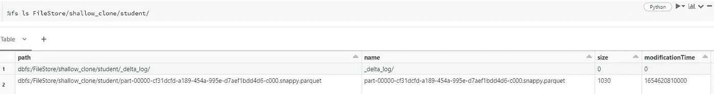

Shallow cloned table's directory

让我们观察对应于记录的文件名。我们的前四条记录仍然指向源表的数据文件，但是更新后的记录指向浅层克隆目录中的数据文件。它将复制已执行操作的数据，而不是所有文件。这种方法节省了环境中的大量存储，从而节约了成本。

```
%sql
SELECT *,input_file_name() FROM db_shallow_clone.student
```

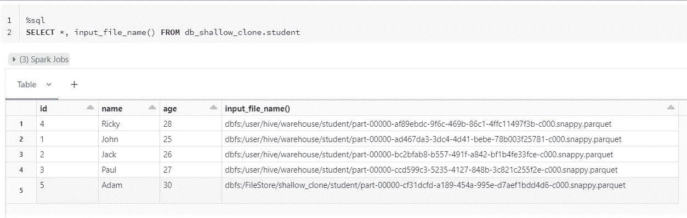

Shallow cloned table content

浅层克隆用于短期情况，例如在开发中测试或主要在生产中测试，在这种情况下，您不希望主表受到影响。深度克隆通常是 CTA，但是增加了版本控制和增量加载的功能，这使得它们不是 CTAs。浅层克隆不会将任何数据复制到克隆的目录中；因此，与深度克隆不同，创建和开始工作通常会更快。

# 深层克隆

在深度克隆中，源表数据文件与元数据一起被复制到目标表。因此，创建了数据文件的独立副本。因此，目标表表现为独立的表，源表数据的删除/清空不会影响目标表。

让我们看一个深度克隆的实际例子。我们将从创建一个存储所有深层克隆(备份)的数据库开始。

```
%sql
create database db_deep_clone location '/FileStore/deep_clone'
```

以下命令将帮助我们创建数据的深层克隆:

```
%sql
CREATE TABLE IF NOT EXISTS db_deep_clone.student
DEEP CLONE student
```

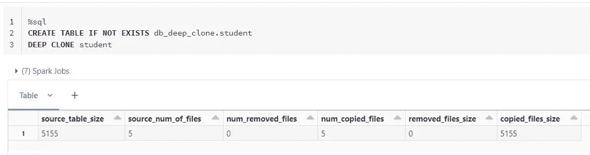

The output of the deep clone query

如果您看到这里的输出，它告诉我们五个大小为 5155 字节的文件被复制到克隆的目录中。让我们检查这个克隆表的目录来验证这一点:

```
%fs ls FileStore/deep_clone_student
```

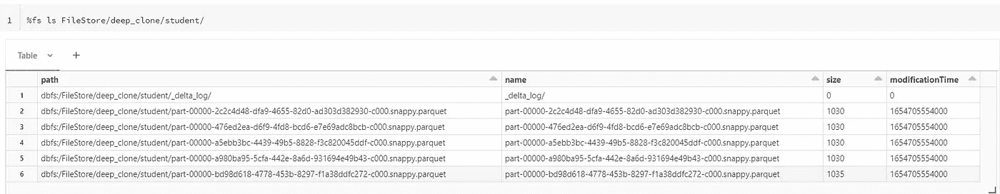

Deep clone directory content

给你。目录中有五个文件，不像浅层克隆那样，目录是空的。

现在，如果您从深度克隆的学生表中选择数据并检查相应的文件，路径将指向深度克隆的增量表，而不是源表。如果你已经猜到了，因为文件是复制的，那么你是对的😊。

```
SELECT *, input_file_name() FROM db_deep_clone.student
```

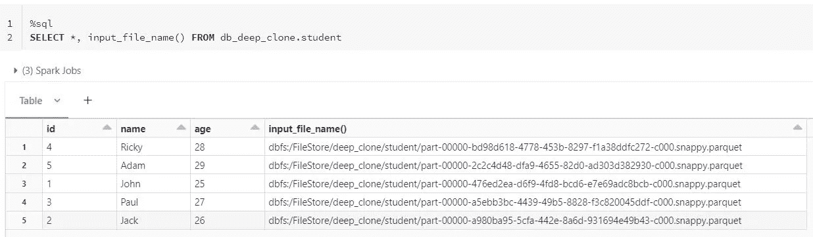

Deep clone table content

如果在源表中再输入一条记录并执行克隆命令，将会复制这条新记录，而不是再次复制所有记录。这是深度克隆增量处理数据负载的地方，因此在不同的时间间隔维护不同版本的数据。

利用此功能的最佳方式之一是将数据从一个环境复制到另一个环境。

假设您希望测试环境中的数据执行测试，并且您的数据存储在 Azure 存储容器中。最好的方法之一是在测试环境中安装这个 dev 存储容器，并执行下面的命令。

```
CREATE OR REPLACE TABLE db_clone.clone_table_name DEEP CLONE delta.`/mount/path/to/table/data`
```

如果您将该命令安排为每 1 或 2 小时运行一次，它会将更新的数据复制到克隆表中，测试团队可以出于测试目的访问该克隆表。可以根据您的情况调整该计划间隔。

如果您在不同的区域创建 Azure Databricks 表的深层克隆副本，整个过程将充当灾难恢复。

# 摘要

现在，我们知道了如何使用浅层克隆和深层克隆来创建数据的副本。所以，下次你需要创建一个克隆体的时候，请使用 Databricks 提供的这个奇妙的特性。