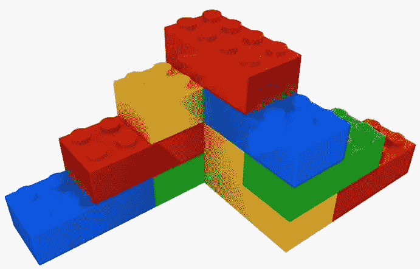
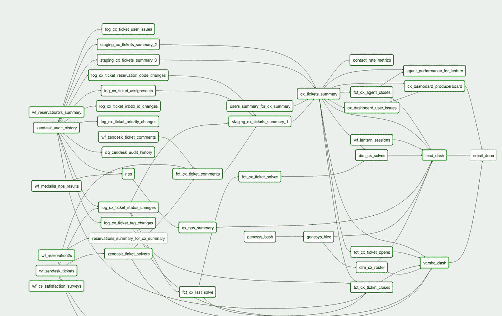
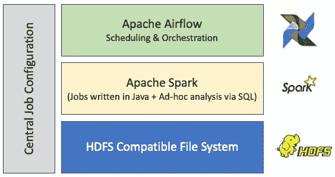
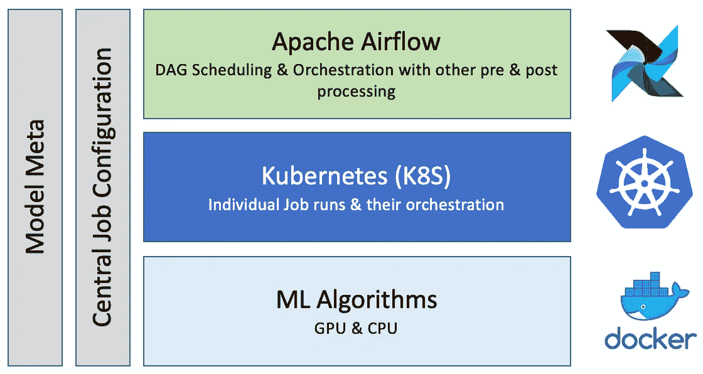
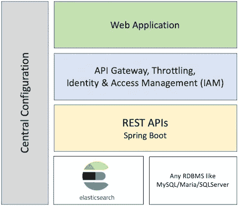

# 需求预测技术栈@沃尔玛

> 原文：<https://medium.com/walmartglobaltech/demand-forecasting-tech-stack-walmart-539d17f385db?source=collection_archive---------0----------------------->

Image Source: [free3d.com](https://free3d.com/3d-model/lego-bricks-shape-1-2485.html)

## 为沃尔玛最大的预测平台选择正确的基础元素

继续沃尔玛需求预测的[支柱中开始的讨论，你在任何产品中做出的技术选择将大大有助于确保你有一个坚实的基础来实现基于它的功能。](/walmartlabs/pillars-of-walmarts-demand-forecasting-f6722de86e1a)

在本帖中，我们将看看在选择技术组件时不应该忽视的最重要的方面

# 整体产品需求

*   用于生成预测的不可协商的运行时 SLA(每天少于 4 小时)
*   为 Demand Workbench 托管数百个数十亿的数据点，服务 SLA 低于 100 毫秒
*   数据科学家试验不同算法的灵活运行时间
*   云原生方法，支持将(少数或所有组件)装载到私有或公共云中

# 选择技术组合的指导原则

*   明确你在寻找什么。写下非功能性需求(如 SLA、延迟、吞吐量等。)
*   更喜欢有良好社区支持的开源软件。但是，评估支持选项。在你的团队中很难拥有所有组件的专业知识，即使是开源的。
*   首选采用横向扩展设计构建的组件
*   始终进行概念验证(POC)来检查您的产品需求。永远不要去看任何博客或技术文章的评估。
*   保持核心功能与云无关
*   大多数基础架构组件的按需扩展
*   可配置的遥测技术可确保我们获取系统运行状况和性能的关键指标

# 数据工程

## 我们需要什么

*   可扩展的分布式存储，支持各种数据集，而不仅仅是 SQL 表
*   支持多种计算引擎，如 Spark 和 Hive
*   数据工程管道的调度和编排
*   更喜欢程序员友好的工具，而不是配置驱动的。
*   易于监控。网络界面更好
*   对操作的访问控制。例如:谁可以监控管道，谁可以按需触发

## 批处理数据存储

*   Hadoop 分布式文件系统 **(HDFS)** 兼容存储是强有力的竞争者&可能是最容易的决定。
*   此外，许多云提供商提供 HDFS 兼容的文件系统( *Azure Blob，S3，谷歌云商店*等)。).
*   ***镶花*** 与**爽快**压缩相比也更好。我们也可以选择 ORC，但我们只是坚持使用 parquet，因为我们没有发现使用这两种格式的作业在性能上有任何重大差异。顺便说一句，有很多文章比较这两种格式，选择一种而不是另一种。但是请记住使用您的用例&选择进行试驾。

## 计算

*Map/Reduce* 是所有支持大数据工作负载的引擎中最受欢迎的&最老的。多年来，它很好地实现了自己的目标&现在是向前看的时候了。

*Hive* 可能是大数据工作负载最常用的计算引擎。使用 Hive，我们必须始终将作业表示为 SQL 查询。虽然构建复杂的 SQL 并非不可能，但它也有自己的挑战，

1.  不是所有的操作都可以通过 SQL 轻松表达。例如:递归
2.  使执行可配置的唯一方法是模板化 SQL 代码或通过代码生成查询。
3.  这不仅使开发变得复杂，而且使代码库很难维护
4.  跨越几百行的 SQL 查询并不少见！

***Spark*** 无需介绍&彻底改变了数据工程在处理大数据的产品中的实现方式。它还支持 SQL &由一个强大的社区支持(不断增长)。

还有，我们选择了 ***Java*** 作为我们的主流编程语言。考虑到使用 Spark 编写工作负载时 Scala 是多么受欢迎，这是一个有趣的选择。

一些考虑因素(有争议😃)在我们用例中最受欢迎的 Java 是，

1.  虽然函数式编程很棒，但 Scala 并不是一门纯粹的函数式语言。你可以很容易地用 scala 编写 Java 代码。
2.  与雇佣具有函数式编程技能的优秀 Scala 开发人员相比，雇佣 Java 工程师相对容易。
3.  我同意 Java 非常冗长(当我们使用 Spark 的时候)，但是我们最初的大多数工程师都是来自 Map/Reduce 时代的非常优秀的 Java 程序员。

现在，经过两年多的开发和生产运行，当你看到代码库和添加更多的功能，我们并不后悔我们的决定

## 调度和编排

大多数早期的数据工程工作负载都遵循配置管道的设计，而不是将它们编写为代码。他们中的一些人在设计用户界面方面走在了前面，通过拖放来支持开发。虽然这种方法已经为数据工程社区服务了一段时间&一些企业工具今天仍在大量使用，但是社区正在向对程序员更友好的工具转变。

Oozie 可能是调度&编排中使用最广泛的工具。但是 Oozie 的问题是它不能编程动态地创建 dags 依赖关系，而是以编程的方式。

***阿帕奇气流*** 前来救援。这是一个艰难的决定，在最终确定之前，我们确实试用了这个工具将近一个月。

一些**积极的**首先，

1.  非常容易监控工作流程和管理它们的运行。您不需要离开 Web UI 来调试问题
2.  可编程的工作流程。我们也可以使用 Jinja 模板。此外，基于某些配置生成 DAG。
3.  高度可定制。您可以定义自己的运算符。
4.  对大数据工作负载的良好支持，但也可用于任何工作流(非数据工作流)
5.  根据时间或数据可用性安排 Dag(通过传感器)
6.  丰富的客户端和体面的休息支持

Courtesy: [Airflow official documentation](https://airflow.apache.org/)

一些**缺点**现在，

1.  一个以上的调度程序会造成混乱。因此，要实现高可用性，你需要使用主动-被动设计(由[团队千里眼](https://github.com/teamclairvoyant/airflow-scheduler-failover-controller)实现)
2.  设置有许多活动部件(RabbitMQ/Redis、MySQL、Celery 等)。)有点吓人，尤其是在一个非容器的世界里。对于 Kubernetes 世界，你一定会爱上[气流舵图](https://github.com/helm/charts/tree/master/stable/airflow)
3.  如果你没有很好地理解一些概念，你很容易在你的数据中制造混乱。
4.  回填在很多情况下非常有用，但也很容易出错
5.  假设一个 DAG(带有 Cron 计划)关闭了几天(不管出于什么原因)&一旦重新启用，catchup 将运行每个错过的计划。
6.  如果你的工作不是为等幂而设计的，上帝会拯救你！

## 技术堆栈

# ML 工程

## 我们需要什么

*   开发工作区允许科学家单独测试他们的代码
*   ***模型传播*** 。这就像 ML 模型的 CI/CD。
*   能够运行需要不同运行时间的不同算法，如 R、Py、C++等。
*   以沃尔玛的规模扩展和运行模型(至少 30000 个集群进行训练和评分)

可以通过两种方式扩展我们的生产工作负载，

1.  **分布式**。像 Tensorflow 这样的框架允许这样做
2.  **平行。**当我们可以单独运行一组时，我们也可以并行运行 **N** ，前提是我们可以协调运行

划分商店项目(通过合适的聚类算法)然后对每个项目进行训练或评分的方法很好地满足了我们的需求。

## 运行时间

***【Docker】***容器允许我们灵活地隔离不同的算法环境。

从很高的层面来看，我们最终为每种类型的运行时拥有不同的基础 dockers 用我们的算法代码扩展它们

1.  基于 GPU(包括 NVIDIA 库和自定义 GPU 算法)
2.  基于 CPU(包括自定义算法和相关库)

## 管弦乐编曲

***K8S(Kubernetes)***允许我们调度&编排 Docker 容器如下图。

1.  使用 *kubectl* 命令创建工作规范(包括运行什么代码、资源需求等)
2.  通过工长向 K8S 提交工作规范
3.  然后，Master 将接管这些作业的调度和运行
4.  监控作业运行并采取措施确保作业完成

我们每天都在运行近 30，000 个作业，这些作业在 2-3 小时内完成，用于生成所有预测。

## 模型和元商店

*   模型是训练的结果，必须被存储。这些是将在评分过程中使用的计算的序列化版本。
*   尽管它们具有斑点的性质，但它们的尺寸可以大得多。将它们存储在 MySQL 等传统数据库中可能并不总是好的
*   由于训练数据和特征来自多年的历史数据馈送，因此大小可以从几百 MB 到几 GB 不等
*   将实际的 blob 存储在对象存储中(如 OpenStack swift 或 Azure Blob) &将它们的位置与其他元信息(如日期/时间、容器细节等)一起保存更有意义

## 技术堆栈

# 需求工作台

## 我们需要什么

*   支持一些描述性分析应用程序的 API，包括我们自己的需求工作台
*   能够记录交易，如管理预测
*   吞吐量至少为 ***5000 RPS*** (每秒请求数)
*   所有 API 的延迟小于**100 毫秒 T7**
*   可能用在一些不能容忍高延迟的实时执行管道中
*   更喜欢 ***多语种*** ，而不是尝试*一个数据库适合所有人*的方法

## 工作量

**事务性**

*   大多数事务数据本质上也是关系型的&符合 ACID
*   适合任何 RDBMS 系统，如***MySQL/Maria db***

**分析型**

*   数据集的大小( **5 亿+** 商店项目指标&**1000 亿+** 个数据点，总计为**50-60tb**的原始数据)
*   多种形式的搜索(通常针对一个项目/商店属性的 5 个以上的字段)
*   需要更快的不同维度的动态聚合
*   一些事实(甚至历史！)&尺寸每天都在变，有些每周都在变
*   加载吞吐量在 ***范围内每秒 150 万个文档***

这些独特的需求使我们不得不考虑像 Cassandra、Solr & Elastic 这样的系统。

最后，在模拟真实工作负载的彻底概念验证之后，我们选择了 ***弹性*** 来满足我们的需求。Elastic 不仅允许我们建立索引，我们通常可以在索引中搜索大量的商品/商店属性&，还可以在*100 毫秒内聚合结果*。

## 技术堆栈

# 下一步怎么样

在这篇文章中，我们看到了在沃尔玛最苛刻的预测应用中考虑技术堆栈的所有因素。

在随后的文章中，我将介绍我们在构建和操作这个应用程序的过程中学到的一些最佳实践。