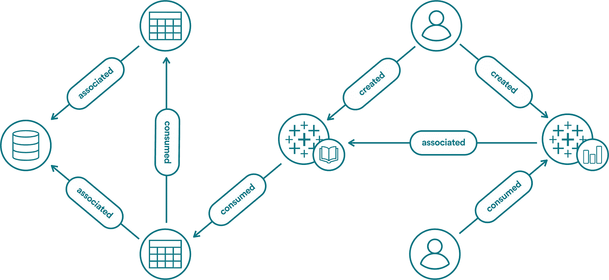
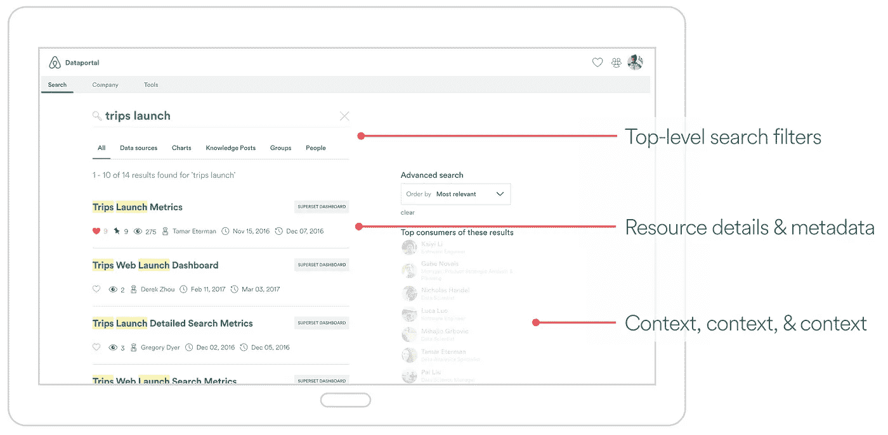
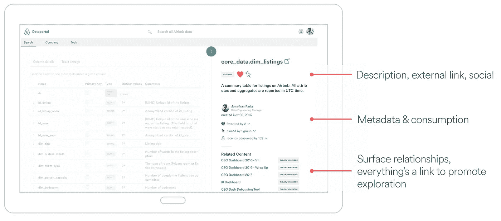
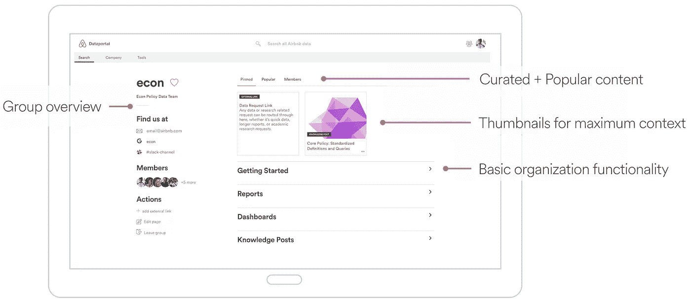

# Airbnb 的数据民主化

> 原文：<https://medium.com/airbnb-engineering/democratizing-data-at-airbnb-852d76c51770?source=collection_archive---------1----------------------->

由[克里斯·威廉姆斯](https://twitter.com/ccardwilliams)、[伊莱·布伦博](https://twitter.com/elibrumbaugh)、[杰夫·冯](https://twitter.com/jtfeng)、[约翰·博德利](mailto:john.bodley@airbnb.com)和[米歇尔·托马斯](/@michelleethomas)

像许多创业公司一样，Airbnb 的员工数量在过去几年中大幅增长。与此同时，我们看到了数据量和内部数据资源数量的爆炸式增长:数据表、仪表板、报告、指标定义等。一方面，数据资源的增长是健康的，反映了我们在数据工具方面的大量投资，以促进基于数据的决策。然而，这也带来了新的挑战:有效地在质量、复杂性、相关性和可信度各不相同的数据资源海洋中导航。在这篇文章中，我们描述了我们对这个问题的观察和 Dataportal，一个解决这个问题的新颖的数据资源搜索和发现工具。

数据门户的首要目标是使数据民主化，并通过帮助数据探索、发现和信任，使 Airbnb 员工能够了解数据。

# **我们是谁？**

我们的团队由一群不适合数据的人组成:了解与数据相关的众多棘手问题的恢复数据科学家，以及专门从事数据通信的可视化工程师。我们花时间在战壕里，经常在一个反动的、时间紧迫的空间里工作。我们希望设计和构建*主动*解决方案，帮助缓解常见的、明确定义的数据问题。

# **专为所有人设计**

我们对数据前景的看法只是众多观点中的一个。为了确保我们开发的数据产品能够提供普遍价值，我们与不同部门、角色、任期和数据素养水平的员工进行了交谈，以更好地了解他们在数据方面的痛点和顾虑。

一个不变的主题出现了:用户经常不得不询问其他人在哪里可以找到合适的资源，因为很难浏览数据景观。此外，元数据和上下文的缺乏使得很难信任数据。这种信任的缺乏阻止了员工使用他们知识范围之外的资源，使他们害怕意外使用过时或不正确的信息。这导致人们创造了额外的资源，进一步混淆了景观。

# **碎片化数据环境的复杂性**

随着 Airbnb 的发展，围绕数据量、复杂性和模糊性的挑战也在增加。信息和人员变得孤立起来，这就需要浏览一个看不见的部落知识景观。对于旅途中的人和指路人来说，这是一种低效的时间利用。

抛开规模不谈，数据通常是由工具或团队隔离的，每个工具或团队都提供了数据空间的短视的局部视图，而缺乏全局背景。例如，仪表板在数据来源方面是幼稚的，数据表缺乏与下游可视化工具相关的上下文。此外，许多数据工具具有复杂的权限规则，这进一步分割了共享和理解。

对*整个*数据生态系统的理解，从事件日志的生成到其在可视化中的使用，比其各个部分的总和提供了更多的价值。

# **确定前进的道路**

很明显，我们需要开发一个能够转变思维的系统。仅仅依靠部落知识会扼杀数据发现，因此我们寻求开发一个自助服务系统，为我们复杂且通常模糊的数据环境提供透明度。

我们希望将人们从考虑一个单独的数据源转向一个*集成数据空间*的概念；数据空间呈现了数据的整体视图，从而为人们了解数据提供了必要的环境。

数据门户为数据的最佳实践提供了一个框架，在必要的地方提供了防护栏。我们的希望是，任何员工，无论其职位如何，都可以轻松地找到或发现数据，并对其可信度和相关性充满信心。

从透明的角度来看，我们打算通过提供尽可能多的上下文，同时观察对底层数据的每个工具的访问控制，使我们的数据空间有一个单一的视角。

# **模拟生态系统**

我们的生态系统最好用图表来表示，我们在数据门户中利用它，如下所述。节点是各种资源:数据表、仪表板、报告、用户、团队、业务成果等。它们的连通性反映了它们之间的关系:消费、生产、关联等。

*An example of a hypothetical sub-graph consisting of databases, tables, Tableau, and user nodes with possible relationships.*

在我们的模型中，关系就像节点一样相关。知道谁生产或消费了一种资源和资源本身一样有价值。关系在我们孤立的数据组件和理解整个数据空间的能力之间提供了必要的联系。

人也是数据资源。找到使用或拥有给定数据资源的员工可以提高知识共享的效率。

生态系统图的价值远远超出了跟踪血统和跨职能信息。数据是公司运营的代理。分析网络有助于发现通信线路，识别层面或断开的信息。

# **进入数据端口**

为了解决上述痛点，我们构建了一个数据工具来提高 Airbnb 中的数据可发现性和探索性。为了实现这一目标，我们构建了四个主要产品功能:

**我)搜索**

Dataportal 最重要的功能是跨我们整个数据生态系统的统一搜索。员工可以搜索日志模式、数据表、图表、仪表板、员工和团队。我们在搜索卡中展示尽可能多的关于资源的元数据，以建立上下文和信任。

我们利用图的拓扑来提高搜索相关性，使用 PageRank 来推广高质量的相关资源。良好记录和频繁消费的资源将导致较高的分数，这有助于确保搜索驱动用户最想要的实体。

**ii)上下文和元数据**

从搜索中，用户可以通过访问资源的详细内容页面来进一步探索资源。没有上下文的数据通常毫无意义，并可能导致不明智和代价高昂的决策。因此，内容页面显示了我们在数据工具中拥有的资源的所有信息，以显示它如何适应整个数据生态系统:*谁*使用了资源，*谁* *创建了*资源，*何时*创建了*或*更新了*，它与哪些其他资源相关，等等。*

更多的元数据意味着更多的数据信息。对于数据表来说尤其如此，数据表是任何数据仓库的基础。容易编辑的元数据促进了表描述和列注释的更新，绕过了复杂的和用户受限的命令。呈现表沿袭提供了数据环境的附加上下文。

我们还展示了低基数列的列流行度和列值的分布，这有助于突出上下文。通常连接的表、相关查询等。在我们的路线图上，并将提供更多的背景信息。

**iii)以员工为中心的数据**

员工是部落知识的最终持有者，因此我们创建了一个专门的用户页面来反映这一点。我们整合员工创建、使用或收藏的所有数据资源。公司中的任何员工都可以查看任何其他员工的页面，这从生产和消费的角度都提高了透明度。

**iv)以团队为中心的数据**

Airbnb 内部部落知识的另一个来源是团队。团队有他们查询的表格，他们创建和查看的仪表板，他们跟踪的团队度量，等等。我们发现员工花很多时间告诉人们相同的资源，所以我们设计了一种方法让他们链接和管理这些受欢迎的项目。

# **一瞥技术堆栈**

假设我们的生态系统被表示为一个图形，那么使用图形数据库来存储数据既符合逻辑又具有高性能。我们选择 [Neo4j](https://neo4j.com/) 是因为它与[elastic search](https://www.elastic.co/)(Airbnb 上常见的)集成得很好，而且它有 Python 绑定。我们使用 [Flask](http://flask.pocoo.org/) 作为 API 的轻量级 Python web 框架，它与许多开源 Airbnb 数据工具一致，如 [Airflow](https://github.com/apache/incubator-airflow) 、[知识库](https://github.com/airbnb/knowledge-repo)和[超集](https://github.com/airbnb/superset)。单页 web 应用利用 [React](https://facebook.github.io/react/) 和 [Redux](http://redux.js.org/) 。

我们的项目目标之一是帮助建立对数据的信任。因此，我们从一开始就接受了产品思维，以确保周到的用户界面和 UX，并最终构建一个令人愉快的数据产品来实现这一目标。

# **学习+未来工作**

我们创造自助式数据文化的工作还没有结束。员工需要时间来改变习惯并将新工具融入他们的工作流程。尽管向同事询问数据很容易，但在大规模情况下效率非常低。重新训练自己独立搜索数据可能很难。关于数据和数据门户的教育正在进行中。

我们未来的工作将侧重于通过以特定于用户的建议和通知的形式从图表中展现洞察力来改进发现。为了进一步解决信任问题，我们计划为认证者和内容创建一个数据认证流程。认证内容的排名将提高，以帮助促进其相关性。