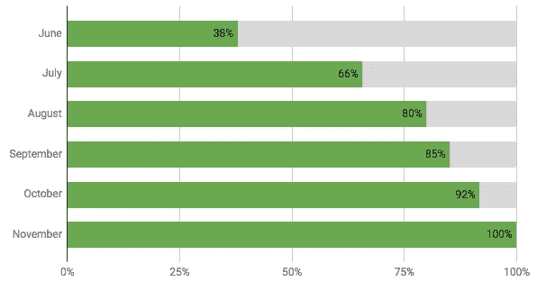

# 超过截止日期的演示

> 原文：<https://medium.com/javascript-scene/demos-over-deadlines-8ed8dcdecb6?source=collection_archive---------0----------------------->

Image: Smoke Art Cubes to Smoke — MattysFlicks — (CC BY 2.0)

> 这篇文章是管理软件系列的一部分。
> [<上一张](/javascript-scene/why-development-teams-are-slow-89107985c75c)

作为一名工程师，我服务于许多团队:一些非常高效和实用，一些则不那么高效和实用。开发团队健康的一个预测因素是[时间压力](/javascript-scene/why-development-teams-are-slow-89107985c75c)。过多的时间压力不可避免地导致了倦怠、士气低落、员工保留率低和团队绩效差。

作为一名工程领导者，我努力平衡两个相互竞争的目标:快速发货，但避免给团队带来太多的时间压力。我更喜欢给团队明确的优先级，然后在他们执行的时候离开。也就是说，我为团队设定的目标之一是经常演示新构建的特性。如果没有新功能可以炫耀，那就没什么好演示的。通过关注演示而不是截止日期，我们将压力(时间压力)的来源变成了有趣的游戏或挑战(演示酷的新东西)。

自从在截止日期之前切换到演示之后，我注意到我所建立的团队发生了显著的变化。开发人员对他们正在开发的功能有更深的自豪感。他们因创作出伟大的作品而获得荣誉和认可。在演示日，当同事们为新的演示鼓掌时，他们可以感受到公司其他人的赞赏。

但是要真正理解超过截止日期的演示方法的力量，首先我们需要更深入地理解截止日期到底错在哪里，它的核心是一个关键问题:不可能准确地估计软件的完成。

# 软件评估是谎言

大多数工程估算都是谎言。2012 年，CNN 查看了 Kickstarter 排名前 50 的项目，发现 [85%的项目发货较晚](https://money.cnn.com/2012/12/18/technology/innovation/kickstarter-ship-delay/index.html)。“软件为什么会迟到？发表在《IEEE 软件工程汇刊》上的“软件开发延迟原因的实证研究”在他们对 72 个软件项目的调查中发现[平均工作量超支 36%](https://search.proquest.com/openview/6035cbc6ccae06dc0f692504eaf1226d/1?pq-origsite=gscholar&cbl=21418) 。

# 评估挑战

在我们进入这个话题之前，忘掉搜索引擎和虚拟助手，试着估算一下一个群体中蜜蜂的平均数量。现在写下你的答案。

# 为什么软件估计通常是错误的(通常是数量级)？

*   **范围蔓延** —添加了新功能，推迟了发货日期。
*   未被发现的范围/复杂性。软件开发是一种探索。我们正在做一些以前从未做过的事情，在这个过程中，我们发现了新的 API、新的协议，从头开始设计新的组件，偶尔解决一个以前没有人解决过的问题。这不是琐碎的工作，但是当我们估算时，我们把它变得琐碎了。我们几乎总是低估问题的范围和复杂性。
*   **开发人员考虑的是他们需要多长时间来实现某件事情，而不是在最终完成之前，需要多长时间来实现、测试、集成、交付、修复、重新测试和重新部署。这两个值的差异是数量级的。**
*   **上游/库供应商问题。**软件开发人员经常在他们使用的组件中发现错误，并需要与上游开发人员合作来解决问题——或者放弃项目并承担计划外的维护成本。
*   **生活发生了变化。**关键人生病、发生意外、结婚、生子等。这些事情是没有计划的。

评估是没有价值的谎言，因为软件几乎从定义上来说是以前从未被构建过的东西——它是数字化的，所以如果它以前被构建过，你就可以安装并使用它。

正确的估计需要对所涉及的工作有一个彻底的了解，并对完成每项任务所花费的平均时间有一个好的记录，但是如果你以前从来没有建造过一个东西，你就不知道要花多长时间。即使你有，你也不知道需要多长时间。如果你亲自建造下一个，想必第二次你会更快。如果其他人正在构建它，您可能已经有了下一个开发人员必须发现的现有知识，所以他们可能需要更长的时间。不同的人在不同的时间线上完成同样的任务。您可以通过让三个开发人员在完成任务时给自己计时，然后计算平均时间来进行估算，但是您可能会发现这种方法的问题。

# 为什么要估计？

驱使我们去估计的力量经常感觉是不可克服的和不可避免的。一位客户想知道为他们制造一件东西要花多少钱。投资者希望确保他们的钱不会浪费，你需要让投资者满意，这样你才不会没钱。你必须在圣诞节前运送一些东西。让我们来看看每个场景，看看最后期限是真实的还是虚构的。

# 客户根据合同雇佣了你

一位客户计划以合同形式雇用您，并想知道在开始之前克隆抖音需要多少费用。对于这个问题，唯一有效的答案是，“这取决于特性的全部范围，在我们完成大量工作之前，我们不会知道这一点。”

不要给客户一个数字，而是向他们展示你开发的其他应用。提供一些对你的工作有信心的其他人的证明，然后告诉他们你将为这个项目每月投入一定数量的资源和一定的费用。产品送货不收费。按时间收费，然后随着时间的推移与客户一起控制范围和成本，并确保它符合他们的预算。定期开会讨论优先事项，报告进展情况，并展示新完成功能的演示。

这种方法的一大好处是它降低了您和您的客户的风险。如果你工作了一个月，发现项目比客户想象的要复杂得多，你可以一起调整范围，使之更好地适应他们的业务需求。

# 投资者里程碑

软件最大的问题之一是人们承诺交付未来的软件。在创业世界里，人们试图筹集资金，用还没有被创造出来的软件来建立一个企业。在他们的投资者推介资料中，他们承诺里程碑式的可交付成果。如果我们能在 18 个月内达到目标 a、b 和 c，我们就能获得后续投资，并有朝一日继续编码。

代替截止日期，我们推荐未注明日期的里程碑目标。一定要写出你想要实现的高层次目标。不要把它们附在具体的日期上。我们看不到未来，机会和重点都在变。通过将日期从你的里程碑中剔除，你将可以灵活地专注于当前最重要的*、*，这可以为你的企业和投资者提供更好的价值。由于没有日期，投资者不会认为你的企业失败，除非你把事情的轻重缓急安排错了，钱用完了。只要你还活着，还能做出好的作品，你的投资者就会很高兴。

对投资者来说，牵引力胜过一切。如果你让他们知道一个更好的机会出现了，并且你正在实现它，只要你做了，只要它为你的业务增加了实质性的和明显的价值，他们就会兴奋不已。

如果你正在和一个坚持要求交付日期的投资者谈话，继续寻找，直到你找到一个信任你的人。如果他们问，告诉他们“我们更喜欢演示而不是截止日期。到目前为止，我们已经交付了 a、b，上周我们交付了 c。让我向您展示它是如何工作的。”

投入到演示中，展示这个很酷的新功能，而不是陷入下一个版本何时发布的困境。如果你把特性的范围控制得足够小，每隔几周就能发布一些很酷的东西，那么下次见面时，你就有新的演示可以炫耀了，他们会看到你在不断进步。

# 计划发货日期

公司也在发货日期前宣布新产品。这里有一个简单但不总是可行的解决方案:不要那样做。不要在产品准备发货之前就宣布产品，这样你就永远不会被诱惑去努力工作和抄近路来满足一个想象的、自我强加的截止日期。

有时，公司会提前发布公告，鼓励客户等待你的产品，而不是从竞争对手那里购买。例如，在撰写本文时，Playstation 和微软 Xbox 都宣布将在假期推出新的游戏机。如果一个宣布了，而另一个没有，人们可能会计划换阵营。

这是一个冒险的举动，除非:

*   你与你所依赖的供应商建立了良好的关系，你确信他们能为你提供产品。
*   你有一个完善的流程和良好的记录，对产品中组件的时间安排有很好的洞察力。(由于缺乏可重复的产品，这在软件中非常罕见)。
*   设计已经完成或接近完成，允许大部分产品范围已经被发现和考虑。
*   你有一定的灵活性，可以缩小范围以满足最后期限，即使最后期限是“下个月”而不是“6 个月后”。

发货日期经常适得其反，当交货日期错过，导致公关问题，可以有负面的财务影响。例如，当我写这篇文章时，最近的一个标题写道，“在公司对利润发出警告并推迟三场大型比赛后，股票暴跌。”

现在，坏消息是。虽然对于那些已经与供应商建立了良好关系的公司来说，实现这些目标是可能的，但是对于软件来说，几乎没有一个是真实的，原因已经描述过了。

也就是说，如果您特别注意范围，并在发布日期之后将低优先级项目转移到后续可交付成果中，那么随着相关工作接近完成，您可以预测您是否会达到特定的交付日期。如果你想在一个特定的日期前完成一个软件产品，你需要能够缩小范围。

## 布鲁克斯定律

> "给一个后期的软件项目增加人力会使它变得更晚."

你可能听说过布鲁克斯定律:给一个后期的软件项目增加人力会让它更晚。

对这一现象的一些解释包括:

1.  新的软件开发人员需要时间来适应任何实质性的应用。在开发人员接近团队其他成员的平均生产力之前，计划 2-3 个月。在加速的过程中，新开发人员会有很多关于项目的问题，这些问题只有早期开发人员才能回答，这会分散您最有效率的人员对项目主要工作的注意力。
2.  **新开发人员经常会犯一些错误**，这些错误是更熟悉项目和每个组件需求的开发人员不会犯的，这导致了返工的增加。
3.  **随着项目中每个新开发人员的加入，沟通开销呈指数增长**，导致沟通复杂性和可见性降低的组合爆炸。例如，每个新的开发人员可能会打开几个与其他项目开发人员的直接消息传递通道。开发人员可能决定他们需要召开会议进行协调，打开几个新的子组沟通渠道，等等。团队中的开发人员越多，就越难协调团队中的工作。
4.  **软件开发最难的部分不是写代码。**它将复杂的问题分解成可单独解决的更小的问题。通常很难将一个任务分解成更小的部分，这样单个开发人员就可以安全地工作而不会互相妨碍。正如布鲁克斯指出的那样:“九个女人不可能在一个月内生下一个孩子。”

此外，您必须意识到，软件开发项目越接近交付，进展越慢，正如这个真实的逐月进度图所证明的那样。请注意前几个月的大跳跃和分娩后小得多的跳跃之间的对比:

Real month-over-month progress graph.

> “九个女人一个月生不出孩子。”

# 评估挑战:解决方案

当我让你写下你对蜂群中蜜蜂数量的估计时，你写下问题了吗？我们并不真正拥有进行评估所需的所有信息，不是吗？我们到底要数什么？

*   我们是在谈论在整个蜂群生活过程中参与蜂群的蜜蜂数量吗？
*   一整年的总数？
*   在特定的时间点，蜂巢中的平均数量是多少？
*   不同地区的数字不同吗？

您是否提供了一个范围或具体数字？大多数软件开发人员会给你一个具体的数字，当你问他们要一个估计值的时候，用准确度换取精确度，但是测量的软件工程任务时间线落在一个非常宽的幂律曲线上。没有人能始终如一地在“一天内”或“大约两周内”交付一个特性。

# 发现隐藏的复杂性

大多数软件工程师，在压力下，会提供一个估计，即使知道他们并不知道所有他们需要知道的事情来做到准确。他们的平均售票速度是多少？他们知道吗？他们需要完成多少张票才能完成这项工作？他们是否已经坐下来，想好了需要构建的所有组件以及需要完成的任务？他们是否评估了每项任务的复杂性，并将其分解为所有必要的子任务，以实现合理的估计？

事实是，进行分解的过程是设计软件应用程序过程的一大块，如果发现和实现渐进地进行，而不是所有的预先设计，它会工作得最好，因为当我们开始用代码实现设计时，设计意图经常与我们发现的技术现实不一致。

软件开发中的一切都是组合:将大而复杂的问题分解成较小的、可独立解决的问题，然后组合这些解决方案的过程。最难的部分不是构建和组装这些组件解决方案。它正确地分解问题，并设计组件用来组合和通信的接口。

换句话说，如果不实际执行大量的软件工程工作，你就不能准确地预测软件的完成日期。

即使您正在度量历史速度并将这些速度度量应用于项目中当前打开的问题的数量，当您在项目中工作时，随着工作的进展和额外复杂性的发现，许多当前的问题将被分解成更多的问题。真正的问题烧毁图表不是直线或平滑的曲线。它们看起来更像是股票行情指示器，随着范围被揭开和项目被完成，它们会随机地、不可预测地上下波动。

Real software burn down chart. Dots represent the number of open issues at that point in time.

它往往在项目开始时增长，直到达到一个相当稳定的范围(取决于项目的复杂性和开发人员的数量)，然后大部分横向移动，偶尔出现急剧的上升和下降，直到达到 70% — 90%，然后开始明显下降。

蜂群通常是 1 万到 8 万只蜜蜂的家园。

*   如果你猜的数字小于这个范围，你就输了。你错过了最后期限。游戏结束。
*   如果你猜到一个高于这个范围的数字，你的老板会发现你的把戏(承诺不足，超额完成)，并开始将你对公共产品发布的估计减少一半。你错过了营销团队设定的最后期限。你输了。
*   如果你猜了一个范围，而你的最高数字低于 10k，你就输了。
*   如果您猜测的是一个范围内的固定数字，则减去您的猜测与 45，000 之间的差值，然后乘以-1。那是你的分数。恭喜你！你没有输。但你也没赢。
*   如果您猜对了一个两个数字都在范围内的范围，那么恭喜您！你得一分。

软件评估这个看似不可能的挑战的解决方案是什么？不要这样做。

将自己从评估谎言中解放出来的关键很简单:

*   **示威超过期限。**
*   **控制范围。**
*   **设定优先级。**

如果你需要一个截止日期或者你有一个强加的预算，不要试图把每一个功能都塞进给定的时间表。而是将系统设计成模块化，容易适应变化的范围，然后*根据需要调整范围。*这需要与产品团队和利益相关者仔细协调，以确定真正的优先事项。按优先顺序解决问题。无情地将优先级较低的功能从项目中剔除。

不要试图通过堵塞的输送管道推动更多的工作，而是通过减少需要通过管道的工作量来清除堵塞。

如果你有固定的预算，学习如何将你的大软件梦想削减到一个精简的 MVP。减少脂肪。观察你的消耗图表和月环比进度图表，确保你没有给你的团队比他们不偷工减料能完成的更多的工作。

在截止日期之前应用演示的结果是一个更快乐、更有生产力的开发团队，再也不会迟到了。

# 后续步骤

[DevAnywhere.io](https://DevAnywhere.io) 针对各种主题为软件领导者提供一对一的指导，包括:

*   战略
*   团队建设、招聘和入职
*   培养健康发展的文化
*   有效的软件开发过程
*   持续发现和持续交付
*   管理软件质量
*   预算和薪酬
*   冲突解决
*   技术债务

问我们关于我们的[领导轨道](https://devanywhere.io/help?subject=Leadership%20Track)的问题，在那里我们帮助从有抱负的技术领导者到首席执行官的每个人了解如何有效地管理软件团队，并且[在 Twitter 上关注我们](https://twitter.com/Devanywhere_io)。

***埃里克·艾略特*** *是一位科技产品和平台顾问，《 [*【作曲软件】*](https://leanpub.com/composingsoftware)*[*【EricElliottJS.com】*](https://ericelliottjs.com/)*[*devanywhere . io*](https://devanywhere.io/)*的联合创始人，以及 dev 团队导师。他曾为 Adobe Systems、* ***、Zumba Fitness、*** ***【华尔街日报、*******【ESPN、*******【BBC】****等顶级录音艺人和包括* ***Usher、【Metallica】********

*他和世界上最美丽的女人享受着与世隔绝的生活方式。*