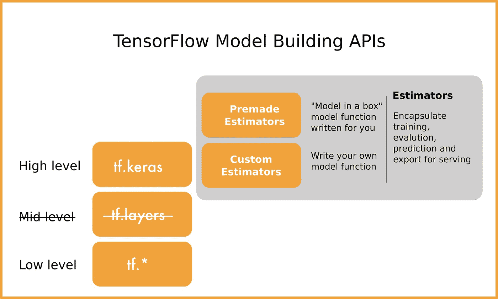

# 揭开 TensorFlow APIs 的神秘面纱

> 原文：<https://medium.com/google-developer-experts/demystify-the-tensorflow-apis-57d2b0b8b6c0?source=collection_archive---------3----------------------->

您是否对使用哪些 TensorFlow APIs 感到困惑？在这篇博文中，我将向您概述 TensorFlow 中的各种**模型构建**API，以及它们是如何组合在一起的。我将介绍一些最佳实践，并回答一些常见问题。

TensorFlow 团队在开发更易于使用的 API 方面投入了大量精力，TensorFlow 正在快速发展。这篇博客文章涵盖了当前的状态(从 TensorFlow 1.12 开始)和 TensorFlow 2.0 的一瞥。

# 介绍

2015 年末开源的 TensorFlow 是最受欢迎的深度学习框架。它同时面向**的研究人员**和**的开发者**。

张量流**灵活**:

*   用 tf 之类的高级 API 写 TensorFlow 代码。Keras(推荐)，估计器，或者在低级 API 中，如果你需要更好的控制。
*   用不同的语言写 TensorFlow 代码:Python，JavaScript 或者 SWIFT。
*   在 CPU、GPU 或 TPU 上进行培训，并部署到移动(Android / iOS)、Web、Android Things、Raspberry Pi 和 AIY 套件等。

TensorFlow 的灵活性也给其架构带来了**复杂性**。我经常听到类似这样的问题(无论是初学者还是 TensorFlow 的专家用户)“tf 有什么不同？Keras 和其他 TensorFlow 高级 API？我选哪个？”所以我写了这篇博文来帮助澄清一些常见的问题:

*   tf。Keras 还是 Keras？
*   tf。Keras 还是估计量？
*   低级 TensorFlow APIs 还是高级 API？
*   热切的执行是如何融入这一切的？

# TensorFlow(模型构建)API

首先让我们从 TensorFlow 模型构建 API 的各种选项开始，从低级到高级:



**注意:**TF . layers API 将随 TensorFlow 2.0 一起消失。建议你用 tf。Keras 将取代 tf.layers API。

# tf.keras 还是 keras？

如果你是深度学习新手，刚入门，从 [**tf 开始。Keras**](https://www.tensorflow.org/guide/keras) 是作为 TensorFlow 核心 API 的一部分集成的 Keras。Keras 继续作为一个独立的开源项目。

*   不再问“我用 Keras 还是 TensorFlow？”因为 Keras 现在是 TensorFlow 的一部分。
*   不需要“以 TensorFlow 作为后端的 Keras”，因为 Keras 现在是 TensorFlow 的一部分。您可以继续使用 Theano 和 CNTK 等。作为 Keras 后端，如果你愿意。

因此，与其将 keras 作为单独的包导入:

```
$ pip install keras
import keras as keras
```

使用 keras 作为 TensorFlow 核心 API 的一部分:

```
$ pip install --upgrade tensorflow
import tensorflow as tf
from tensorflow import keras
```

> **常见问题:“我为什么要用 tf。喀拉斯？”**用 tf。Keras 代替 Keras 是为了更好地与其他 TensorFlow APIs 集成，如[急切执行](https://www.tensorflow.org/guide/eager)和 [tf.data](https://www.tensorflow.org/guide/datasets) 等。

在 tf 中有三种创建模型的方法。Keras:

1.  **顺序**API——使用顺序 API，您可以使用大约 10 行代码来定义和训练图像分类模型。看看我写的这篇关于如何用 tf 分类 [**时尚-MNIST 的教程。以 Keras**](http://bit.ly/fashion-mnist-with-keras) 为例。
2.  **功能性**API——关于这一点的一个很好的教程是 [**用 Keras 功能性 API 和 TensorFlow**](/tensorflow/predicting-the-price-of-wine-with-the-keras-functional-api-and-tensorflow-a95d1c2c1b03) 预测葡萄酒的价格。
3.  **模型子类化—[Tensorflow.org](http://tensorflow.org)上的 [**TensorFlow Keras 指南**](https://www.tensorflow.org/guide/keras) 中有这方面的例子。那里还有很多其他很棒的 tf.keras 教程和示例代码。**

> **Protip:** [**用 Python 进行深度学习**](https://www.manning.com/books/deep-learning-with-python) 弗朗索瓦·乔莱(Franç ois Chollet)的书是一本学习 Keras 的好书。

# tf。Keras 还是估计量？

Estimators 是另一个高级 TensorFlow API，它通过封装训练、评估、预测和服务导出的步骤来简化 ML 过程。

有两种类型的估计器:1) **预制估计器**和 2) **定制估计器**。根据官方 TensorFlow 文档，预制估算器和定制估算器之间的差异在于模型函数:

*   **预制估算器**:模型函数已经为你写好了。当你不想训练你自己的模型时，这些是你盒子里的模型。
*   **自定义估算器**:需要自己编写模型函数。

建议您在编写自己的定制估算器之前，先研究一下预制的估算器，看看它是否能解决您的问题。

## **预制估算器**

预制估计量是 tf.estimator.Estimator 基类的子类。预制估值器的例子包括 DNNClassifier、LinearClassifier、LinearRegressor 等。

## 自定义评估员

到目前为止，有 3 种可能性来定义用于创建定制估计器的模型:

1.  用 Keras 定义你的模型，然后把它变成一个估计器。([链接](https://www.tensorflow.org/api_docs/python/tf/keras/estimator/model_to_estimator))
2.  使用来自 [**TensorFlow Hub**](https://www.tensorflow.org/hub/) 的模块，这是一个可重复使用的机器学习模块库。[对 TensorFlow 团队的反馈:请为我们提供一些 TensorFlow Hub 如何与 tf.Keras 一起工作的好例子]
3.  使用层的 API 编写函数。这里的见例[。**注意:** tf.layers 将从 TensorFlow 2.0 中移除，但您可以使用 tf.keras.layers 来实现此目的。](https://www.tensorflow.org/guide/custom_estimators)

> **常见问题—“我需要使用评估员 API 吗？”**在我看来，跟 tf 走。除非你想利用预制的估计。注意:在最近的 TensorFlow 1.12 版本中，Keras 模型现在可以直接导出为 SavedModel 格式(`tf.contrib.saved_model.save_keras_model()`)并与 TensorFlow 服务一起使用。

# TensorFlow 低级 API

在低级 API 中，你将使用张量、常数、占位符、图形和会话等。直接。一些学习资源:

*   张量流 [**低级张量流官方文档**](https://www.tensorflow.org/guide/low_level_intro)
*   博客帖子 [**TensorFlow:令人困惑的部分**](https://jacobbuckman.com/post/tensorflow-the-confusing-parts-1/) ，由 Jacob Buckman 撰写，详细介绍了这方面的内容。

> **常见问题** : **“我什么时候需要写低级张量流代码？”如果你是一名研究深度学习的学生或需要对你的实验进行更大控制的研究人员，你只需要在这个低水平上工作；否则就坚持使用高级 API。**

# 急切的执行

2017 年底，在博客文章[中宣布了渴望执行:TensorFlow](https://developers.googleblog.com/2017/10/eager-execution-imperative-define-by.html) 的一个命令式、由运行定义的接口。从 TensorFlow 1.7 开始就搬出了 contrib。

这是 TensorFlow 的一个重要特性，使您能够在不创建图形的情况下调试 tensor flow—调用 session.run()。热切的执行让 TensorFlow 更加直观和 pythonic 化。您只需要一行代码来实现急切执行:

```
import tensorflow as tf
import tensorflow.contrib.eager as tfe# Enable eager execution
tfe.enable_eager_execution()
```

这里有一个很好的[例子](https://twitter.com/i/moments/999070517108748289?lang=en),展示了启用渴望模式如何使调试变得更容易。

> **Protip:** 在渴望模式下使用 defun 提升性能。

急切执行可能比执行等价的图要慢，因为它不能从图的整体程序优化中受益，并且还会导致解释 Python 代码的开销。您可以使用[**TF . contrib . eager . defun**](https://www.tensorflow.org/api_docs/python/tf/contrib/eager/defun)来创建图形函数并获得性能提升。例如，在您的培训步骤中调用 defun，如下所示:

```
# define train_step function
...# use defun on train_steptrain_step = tf.contrib.eager.defun(train_step)
```

> **Protip** :研究用**急切执行**，生产用**图形执行**。

TensorFlow 有一个名为 **Autograph** 的新功能，它将使渴望模式和图形模式之间的转换无缝进行——在这里阅读 TensorFlow 团队[的博客文章。同样在 TensorFlow 2.0 中，渴望模式将成为默认模式。](/tensorflow/autograph-converts-python-into-tensorflow-graphs-b2a871f87ec7)

总之，启用**急切执行**并将 TensorFlow 代码写入 **tf。喀拉斯**。TensorFlow 团队正在努力使我们的过程尽可能简单。他们还在 tensor flow 2.0**中提供了关于高级 API 的官方 [**指南，其中包含了我上面讨论的主题的更多细节。我期待 TensorFlow 2.0 有更简单的 API、更好的文档和更多的示例代码。**](/tensorflow/standardizing-on-keras-guidance-on-high-level-apis-in-tensorflow-2-0-bad2b04c819a)**