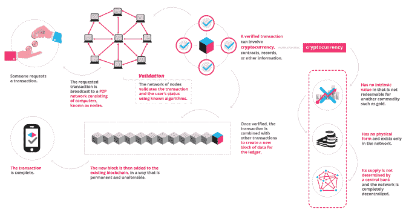
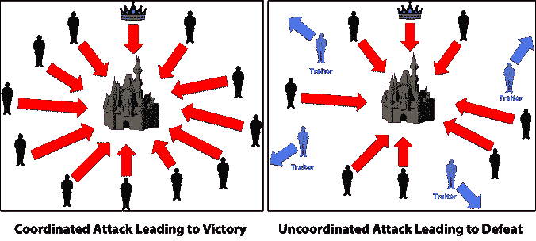

# 揭开区块链和共识机制的神秘面纱——你想知道但从未被告知的一切

> 原文：<https://medium.com/oracledevs/demystifying-blockchain-and-consensus-mechanisms-everything-you-wanted-to-know-but-were-never-aabe62145128?source=collection_archive---------0----------------------->

到目前为止，你可能已经听说了很多关于区块链的描述，而这些描述很可能与金钱有关。当然，这不是偶然发生的，而是由于许多流行的技术，如比特币、以太坊、Ripple 和加密货币市场上目前可用的许多其他技术，它们拥有基于 DLT( *分布式账本技术*)的解决方案，作为其核心实现基础，这是通过公共&私人市场交易加密货币和其他资产的基础。然而，区块链技术不仅仅是加密货币。今天，区块链已经成为许多日常 B2B 交易的一部分，包括那些由企业应用程序驱动的交易，如 ERP、供应链、金融服务、医疗保健系统等，这个列表比这个要长得多。

区块链是一个不可否认的巧妙发明——是化名中本聪的一个人或一群人的心血结晶。但从那时起，它已经演变成更伟大的东西，每个人都在问的主要问题是: ***什么是区块链？***

根据定义， ***区块链*** 是一个不断增长的记录列表，称为块，使用加密技术进行链接和保护。每个块通常包含前一个块的加密散列、时间戳和交易数据。根据设计，区块链天生就能抵抗数据修改。它是“一个开放的、分布式的分类账，可以有效地、可验证地、永久地记录双方之间的交易”。为了用作分布式分类帐，区块链通常由共同遵守用于验证新块的协议的对等网络来管理。一旦被记录，任何给定块中的数据都不能在不改变所有后续块的情况下被追溯性地改变，这需要网络多数的共谋。

一般来说，区块链网络是用于维护分布式分类帐或事实以及分类帐更新历史的系统。这种方法允许彼此不完全信任的组织通过使用对等协议而不是中央第三方或手动离线对帐过程来就提交到共享分类帐的更新达成一致。区块链支持实时交易，并在可信的商业网络中安全地共享防篡改数据。

从访问角度来看，区块链本质上有两种类型:

# 未经许可

基本上，任何人都可以读取链，任何人都可以进行合法的更改，任何人都可以将新块写入链中(只要他们遵守规则)。

比特币是迄今为止最受欢迎的成功区块链公共网络的例子。它是完全分散的。它也被描述为一个“审查证明”区块链。比特币和以太坊等其他加密货币目前通过要求新条目包含工作证明来保护其区块链。然而，由于公共区块链的工作方式，它们需要计算机资源密集型挖掘过程来加密地添加块。此外，基于计算昂贵的算法的共识模型需要许多节点的处理能力来确保安全性

开放的、无许可的或公共的区块链网络的最大优点是不需要防范坏人，也不需要访问控制。这意味着应用程序可以添加到网络中，而无需他人的批准或信任，使用区块链作为传输层。

出于这些原因，它也被称为其最广泛的描述，一个公共区块链。但是，显然，这不是建设区块链的唯一途径。

# 许可的

本质上，它们是一个封闭的生态系统，成员被邀请加入并保留一份分类账。**例如:** (Hyperledger，R3 Corda)。许可区块链使用访问控制层来控制谁有权访问网络。与公共区块链网络不同，私有区块链网络上的验证器由网络所有者审查。

他们不依赖匿名节点来验证交易，也不受益于网络效应，但他们依赖一种叫做共识协议的东西，像比特币的工作证明(我们最常听到的一种)，它做两件基本的事情:它确保区块链中的下一个区块是唯一的真相版本，它阻止强大的对手破坏系统并成功分叉链。

共识协议包括 3 个基本步骤:

*   **背书**:决定是否接受或拒绝一笔交易
*   **排序**:将一段时间内的所有交易按顺序排序
*   **验证**:验证背书满足策略，读集有效

被许可的网络也可以被冠以 ***【联盟】或*** 区块链的名字。

# 区块链共识机制

区块链是一个分散的对等系统，没有中央权威人物。虽然这创建了一个没有来自单一来源的腐败的系统，但它仍然产生了一个主要问题。

*   任何决定都是如何做出的？
*   事情是如何完成的？

想象一个正常的集权组织。所有的决定都是由领导者或决策者委员会做出的。这在区块链是不可能的，因为区块链没有“领袖”。为了让区块链做出决定，他们需要使用**共识机制**达成共识。

那么，这些**共识机制**是如何运作的，我们为什么需要它们？加密货币和一些区块链实现(如 Hyperledger)中使用的一些共识机制是什么？所有这些问题都将在稍后回答，但是在讨论一些可用的实现之前，让我们先了解一下共识是如何工作的。

简而言之，共识是一种在群体中达成一致的动态方式。虽然投票只是满足于多数人的规则，而没有考虑到少数人的感受和福祉，但另一方面，共识可以确保达成一项协议，这对整个群体都有好处。达成共识决策的一种方法称为“**共识机制**”。

现在我们已经定义了什么是共识，让我们看看共识机制的目标是什么:

*   **寻求一致**:共识机制应该尽可能地让群体达成一致。
*   协作:所有的参与者都应该致力于共同努力，实现一个把集体利益放在第一位的结果。
*   合作:所有的参与者都不应该把自己的利益放在第一位，而应该像团队一样工作。
*   平等主义者:一个试图达成共识的团体应该尽可能的平等。这基本上意味着每一票都有同等的分量。一个人的投票不可能比另一个人的更重要。
*   **包容性**:尽可能多的人应该参与到共识过程中。它不应该像正常的投票那样，人们并不真的想投票，因为他们认为他们的投票从长远来看没有任何分量。
*   **参与性**:共识机制应该是每个人都应该积极参与整个过程。

现在我们已经定义了什么是共识机制以及它们应该达到的目标，我们需要考虑其他问题:区块链网络应该使用哪些**共识机制**来保持其原有的特性，如可靠性、安全性和可用性？

我们听到很多关于公共区块链将如何改变世界的谈论，但要在全球范围内发挥作用，像比特币这样的共享公共账本需要一个实用、高效和安全的共识算法。

在比特币出现之前，P2P 去中心化货币系统经历了多次迭代，但都失败了，因为它们无法解决达成共识时的最大问题。这个问题叫做“**拜占庭将军问题(BGP)** ”。

# 拜占庭将军问题

想象一下，拜占庭军队的几个师驻扎在敌人的城外，每个师都由自己的将军指挥。将军们只能通过信使相互交流。观察敌人后，他们必须决定一个共同的行动计划。然而，一些将军可能是叛徒，试图阻止忠诚的将军达成协议。将军们必须决定何时进攻这座城市，但他们需要强大的多数军队同时进攻。将军们必须有一个算法来保证:(a)

1.  所有忠诚的将军决定相同的行动计划，和
2.  少数叛徒不能使忠诚的将军们采纳一个坏计划。忠诚的将军们都会做算法说他们应该做的事情，但是叛徒们可能会做他们想做的任何事情。

不管叛徒做什么，算法必须保证条件(a)。忠诚的将军们不仅应该达成一致，而且应该商定一个合理的计划。

**图 3 —拜占庭将军问题**

看了上图，你就明白问题了，拜占庭将军在攻城的时候面临的挑战是什么。他们面临着两个截然不同的问题:

*   将军们和他们的军队相距甚远，因此中央集权是不可能的，这使得协同攻击非常困难。
*   这个城市有一支庞大的军队，他们能赢的唯一方法是他们一起进攻。

这些将军们需要的是一个**共识机制**，它可以确保他们的军队能够真正作为一个整体进攻，尽管所有这些挫折。

这显然也与区块链有关。链条是一个巨大的网络；你怎么可能相信他们？如果你从钱包里给某人发了 4 个比特币，你怎么能确定网络中的某人不会篡改它，把 4 个变成 40 个呢？

这就是共识机制的作用。因此，现在我们将浏览一系列共识机制，这些机制可以解决一些非常有名的区块链网络的拜占庭将军问题，如比特币、以太坊、Ripple、Peercoin、Hyperledger 和许多其他网络。

# 工作证明

比特币使用工作证明(PoW)来确保区块链的安全性和一致性。“工作证明”，顾名思义，要求验证块的分散参与者证明他们已经为此投入了大量的计算能力。

在比特币中，验证者(被称为“矿工”)竞争处理一批交易，并将其添加到区块链中。

在工作证明中，矿工们通过比赛解决一个极其困难的密码难题来竞争添加链中的下一个块(一组交易)。他们通过在电脑上搅动足够多的随机猜测，在比特币建立的参数范围内得出答案。这个过程需要大量的能量和计算。这些谜题被设计成一种使系统变得困难和费力的方式。本质上，这个需要解决的难题是找到一个数字，当它与块中的数据组合并通过哈希函数传递时，会产生一个在某个范围内的结果。这比听起来难多了。这个游戏中的主角叫做“nonce”，是“使用过一次的数字”的缩写。对于比特币，随机数是一个介于 0 和 4.294.967.296 之间的整数。

他们是怎么找到这个号码的？通过随机猜测。哈希函数使得预测输出结果变得不可能。因此，矿工猜测神秘的数字，并将哈希函数应用于猜测的数字和数据块中的数据的组合。产生的散列必须以预先确定的零的数量开始。没有办法知道哪个数字会有效，因为两个连续的整数会给出非常不同的结果。此外，可能有几个随机数产生期望的结果，或者可能没有(在这种情况下，挖掘器继续尝试，但是使用不同的块配置)。

当一个矿工解决了这个难题，他们就把他们的方块提交给网络进行验证。验证该块是否属于该链是一个极其简单的过程。第一个解决难题的人赢得彩票。作为对他或她的努力的奖励，矿工会收到新的比特币——以及少量交易费。

计算的难度(哈希字符串开头所需的零的数量)经常调整，因此处理一个块平均需要大约 10 分钟。

为什么是 10 分钟？这是比特币开发者认为在达到 2100 万的最大数量(预计在 2140 年的某个时候)之前，新硬币稳定和逐渐减少的流动所需的时间。

然而，尽管比特币本身就是一部杰作，但它的工作证明并不完美。

常见的批评包括，它需要大量的计算能量，它不能很好地扩展(交易确认需要大约 10-60 分钟)，并且大多数采矿集中在世界上电力便宜的地区，由于它消耗大量的电力和能量，导致效率低下。

也就是说，能够负担更快更强大的 ASICs(专用集成电路芯片)的人和组织通常比其他人有更好的机会挖掘。因此，比特币并不像它希望的那样去中心化。从理论上讲，有一些大型矿池可以简单地相互合作，在比特币网络上推出超过 51%的份额。因此，那些拥有大量金融资源的人开始主导比特币挖矿领域。今天的采矿体现在企业风格、数据中心托管的采矿作业的出现。

比特币的创造者中本聪让我们认识到了区块链的潜力，但这并不意味着我们不能继续寻找更快、更分散、更节能的共识算法，带领我们走向未来。其他例子可以在下面找到，如 PoS(利益相关证明)，活动证明和其他一些现在可用的例子。

# 利害关系证明

工作证明最常见的替代方法是股权证明。在这种共识算法中，一个“验证者”投资于系统的硬币，而不是投资于昂贵的计算机设备来进行区块开采竞赛。请注意术语验证器。那是因为没有硬币创造(采矿)存在于股权证明中。相反，所有的硬币从第一天起就存在，验证者(也称为利益相关者，因为他们在系统中持有股份)严格按照交易费支付。不使用工作证明的系统通常也称为虚拟挖掘系统，因为它们没有挖掘活动。

网络基于他们在网络中的比例股份选择个人来批准新消息(也就是说，确认提交给数据库的新信息的有效性)。换句话说，不是任何个人试图计算一个值以便被选择来建立一个共识点，而是网络本身运行一个抽签来决定谁将宣布结果，并且系统参与者专门地和自动地与他们在网络中的总股份成正比地进入该抽签。与比特币运行的 PoW 系统一样，Peercoin 等组织运行的 PoS 系统也为参与提供了激励，这确保了最广泛的网络参与，从而确保了最强大的网络安全性。在 Peercoin 系统中，被选中的一方会在一个名为“铸造”(而不是比特币的“挖掘”)的过程中获得一个新的 Peercoin。

如前所述，股权证明将使整个采矿过程虚拟化，并用验证者取代矿工。以下是该流程的工作原理:

*   验票员将不得不锁定一些硬币作为赌注。
*   之后，他们将开始验证块。也就是说，当他们发现一个他们认为可以添加到链中的区块时，他们会通过下注来验证它。
*   如果方块被追加，那么验证者将获得与其赌注成比例的奖励。

作为赌注的证明，你被选中创建下一个区块的机会取决于你拥有的系统中硬币的比例(或预留用于下注)。拥有 300 枚硬币的验证者被选中的可能性是拥有 100 枚硬币的人的三倍。

一旦验证程序创建了一个块，这个块仍然需要提交给区块链。不同的利害关系证明系统在处理这一点上有所不同。在一些实现中，系统中的每个节点都必须在一个块上签名，直到达到多数投票，而在其他系统中，随机选择一组签名者。

如您所见，PoS 协议比 PoW 更加资源友好。在 PoW 中，你需要浪费大量资源来遵守协议，这基本上是为了资源浪费而浪费资源。

虽然 PoS 似乎是 PoW 最合理的替代品，但由于没有 PoW 中发现的问题(需要大量的计算能量，而不是像它希望的那样分散，因为只有几个大型池总共拥有超过 50%的比特币网络)，有一个非常常见的问题需要 PoS 解决，然后才能在生产区块链实施中大量采用。因此，回顾一下 PoS 在安全性方面的工作方式，可能出现的常见问题如下:如何阻止验证者创建两个块并要求两组交易费用？是什么阻碍了签名者对这两个块进行签名呢？这被称为“无利害关系”问题。一个没有什么可失去的参与者没有理由不表现不好。在新兴的“密码经济学”领域，区块链的工程师们正在探索解决这个和其他问题的方法。一个答案是要求验证者将他们的货币锁定在一种虚拟金库中。如果验证者试图对系统进行双重签名或分叉，这些硬币将被切断。

此外，这个系统，然而，通过奖励那些已经深深卷入网络的人，固有地创造了一个日益集中的系统。这不利于一个真正健全的网络。因此，PoS 系统的支持者提出了许多不同的修改，以帮助确保他们的网络基础尽可能广泛(因此安全)。

Peercoin 是第一枚实施股权证明的硬币。以太坊目前依赖于工作证明，但计划在 2018 年初转向利益证明，通过利用一种称为 Casper 协议的新方法来解决名为“无关紧要”的 PoS 问题。

此外，这种方法还有一种变体，称为**委托利益证明(DPoS)** 。除了个人选择一个总体实体来代表他们在系统中的股份份额之外，这个系统的工作原理与 PoS 系统相同。想象一下，每个人决定实体 1、2 或 3(例如，这些可以是计算机服务器，在 DPoS 系统中称为“代表节点”)是否将“代表”他或她在系统中的个人利益。这使得拥有较小股份的个人可以联合起来扩大他们的代表性，从而创造一种机制来帮助平衡大股东的权力。然而，这是以更大的网络集中化为代价的。Bitshares 是一家采用 DPoS 系统的公司。

# 活动证明(PoA)

因此，活动证明被创造出来作为比特币的替代激励结构。活动证明是一种混合方法，结合了工作证明和利益证明。在活动证明中，采矿以传统的工作证明方式开始，矿工们竞相解决一个密码难题。根据实现的不同，挖掘的块不包含任何事务(它们更像模板)，因此获胜的块将只包含一个标题和矿工的奖励地址。

此时，系统切换到赌注证明。根据报头中的信息，随机选择一组验证者对新块进行签名。验证者拥有的硬币越多，他或她被选中的可能性就越大。一旦所有的验证器对模板进行了签名，它就变成了一个成熟的块。如果一些选定的验证器不可用于完成该块，则选择下一个获胜的块，选择一组新的验证器，等等，直到一个块接收到正确数量的签名。费用由矿商和批准该地块的验证者分摊。

对活动证明的批评与对工作证明(开采区块需要太多能量)和利益证明(没有什么可以阻止验证者双重签名)的批评是一样的。法令是目前唯一一种使用活动证明变体的硬币。

# 实用拜占庭容错算法(PBFT)

实用的拜占庭容错算法(PBFT)是作为一个问题的解决方案而设计的，这个问题以寓言的形式出现，在本章前面的拜占庭将军问题(BGP)一节中有所描述。

为了我们的目的，阐明这个寓言:故事中的“将军”是参与分布式网络运行所讨论的区块链(数据库)的各方。他们来回发送的信使是区块链运行的网络上的通信手段。“忠诚的将军们”的集体目标是决定是否接受提交给区块链(数据库)的一条信息是否有效。在我们的寓言中，一条有效的信息将是一个决定支持攻击的正确机会。忠诚的将军们是忠实的区块链参与者，他们对确保区块链(数据库)的完整性感兴趣，因此确保只接受正确的信息。另一方面，trecherous 将军是任何试图伪造区块链(数据库)信息的一方。他们的潜在动机是多种多样的——可能是一个人想要花掉她实际上并不拥有的比特币，或者是另一个人想要摆脱他已经签署并提交的智能合同中概述的合同义务。

各种计算机科学家已经从寓言中勾勒出拜占庭将军问题的许多潜在解决方案。用于在区块链系统中建立共识的实用拜占庭容错算法(PBFT)只是这些潜在解决方案之一。区块链的三个例子依赖于 PBFT 的 conses 是 Hyperledger，Stellar 和 Ripple。非常粗略地，没有解释整个算法(这将需要一个多页的研究论文)，PBFT 做的如下:每个“将军”维护一个内部状态(正在进行的特定信息或状态)。当一个“将军”收到一个消息时，他们使用这个消息和他们的内部状态来运行一个计算或操作。这种计算反过来告诉个人“一般”如何考虑所讨论的信息。然后，在对新消息做出个人决定后，该“将军”与系统中的所有其他“将军”共享该决定。基于所有将军提交的总决定，确定一致决定。

在其他考虑因素中，这种建立共识的方法比之前描述的其他方法需要更少的努力。此外，PBFT 最初是为低延迟存储系统设计的系统，这可能适用于基于数字资产的平台，这些平台不需要大量的吞吐量，但需要许多事务。

# Hyperledger 的共识方法

Hyperledger 项目允许开发人员使用基于 PBFT 原理构建的节点驱动的分布式账本创建自己的数字资产。该系统可以用于以数字方式支持真实资产(如房屋)，创造新的硬币，或形成共识的容错系统。

Hyperledger 使用 PBFT 的想法超越了基于资产的系统。它将算法的思想用于共识，并使用它来分发各种技术解决方案，而不仅仅是它最初提供的低延迟、高速文件存储解决方案。这可能是测试不使用激励来发展其力量的节点的力量的好方法。没有这样的奖励会怎么样？像 Hyperledger 这样的系统旨在找出答案。如果您使用拜占庭容错，理想情况下会包含损坏问题。其他节点可以意识到一个节点行为不当，并且不响应它的消息。

在分布式分类帐技术中，共识最近已经成为单个功能中特定算法的同义词。然而，共识不仅仅是对交易顺序达成一致，这种差异在 Hyperledger Fabric 中通过其在整个交易流程(从提议和认可到订购、验证和承诺)中的基本作用得到了突出体现。简而言之，共识被定义为对组成一个块的一组事务的正确性的全周期验证。

至于超分类帐的实施，当一个块的交易的顺序和结果满足明确的政策标准检查时，最终达成共识。这些检查和平衡发生在事务的生命周期中，包括使用认可策略来规定哪些特定成员必须认可某个事务类，以及系统链码来确保这些策略得到执行和维护。在提交之前，对等体将使用这些系统链码来确保存在足够的背书，并且它们来自适当的实体。此外，在包含交易的任何块被附加到分类帐之前，将进行版本控制检查，在此期间，分类帐的当前状态被同意。这种最后的检查提供了对双重花费操作和其他可能损害数据完整性的威胁的保护，并允许针对非静态变量执行函数。

此外，由于 Hyperledger Fabric 的许可实施性质，它要求对所有参与者进行身份验证，除了利用这一特性来管理某些级别的访问控制(例如，该用户可以阅读分类帐，但不能交换或转移资产)，它还可以利用这种对身份的依赖作为一个巨大的优势，因为可以实施不同的共识算法(例如，拜占庭或崩溃容错)来代替更计算密集型的工作证明和利害关系证明，如本节前面所述。因此，许可网络倾向于提供更高的事务吞吐率和性能。

除了进行大量的认可、有效性和版本控制检查之外，在交易流程的各个方向还会进行身份验证。访问控制列表是在网络的分层上实现的(订购服务一直到信道)，并且当交易提议通过不同的架构组件时，有效负载被重复签名、验证和认证。简而言之，共识不仅仅局限于一批交易的商定顺序，而是一种总体特征，是在交易从提议到承诺的过程中不断验证的副产品。

# 关于共识机制的结论

虽然这些建立共识的系统目前是最主要的，但是通过创建这些实现的变体以及新的方法，该领域仍然对创新敞开大门。其他一些例子有:燃烧证明、容量证明和消耗时间证明。随着区块链系统越来越受欢迎，它们的规模和复杂性也将继续增长。这些共识构建系统中，哪一个(如果有的话)最适合处理这种持续的扩展，还有待观察。目前，公司为他们的产品选择最能满足他们(或他们的客户)对速度、效率和安全性需求的系统。

值得注意的是，这些系统不仅在各自共识构建社区的形成细节上有所不同，更重要的是，它们在处理潜在攻击的方式上也有所不同。事实上，这是共识构建系统之间最明显的区别特征之一:对系统攻击的潜在规模可以很容易地管理。

如果你已经做到了这一步，那么恭喜你！关于区块链和 Hyperledger 还有很多要解释的，但至少现在你对编程的天才和概念有了一个大致的概念。我们第一次有了一个系统，可以以分散、无信任和防篡改的方式方便地进行数字传输。天空是区块链的极限！！

如果这篇文章对你理解区块链和共识机制有所帮助，请点击这里。请发表评论并陈述您的反馈。这对帮助我继续写关于这类内容的新文章非常重要。