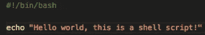
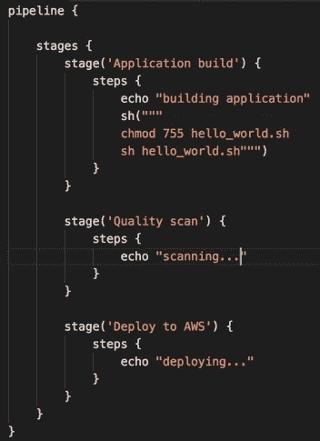
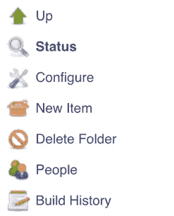
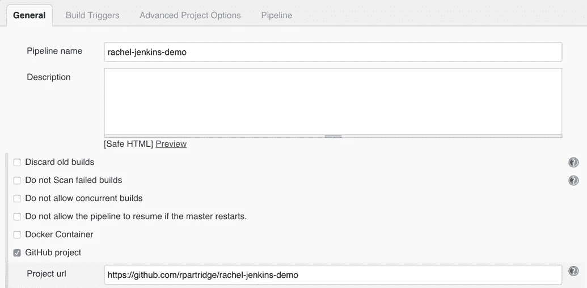
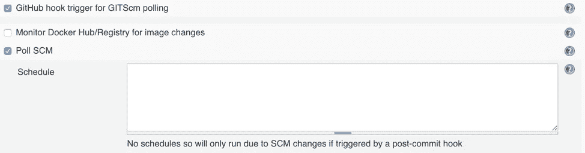
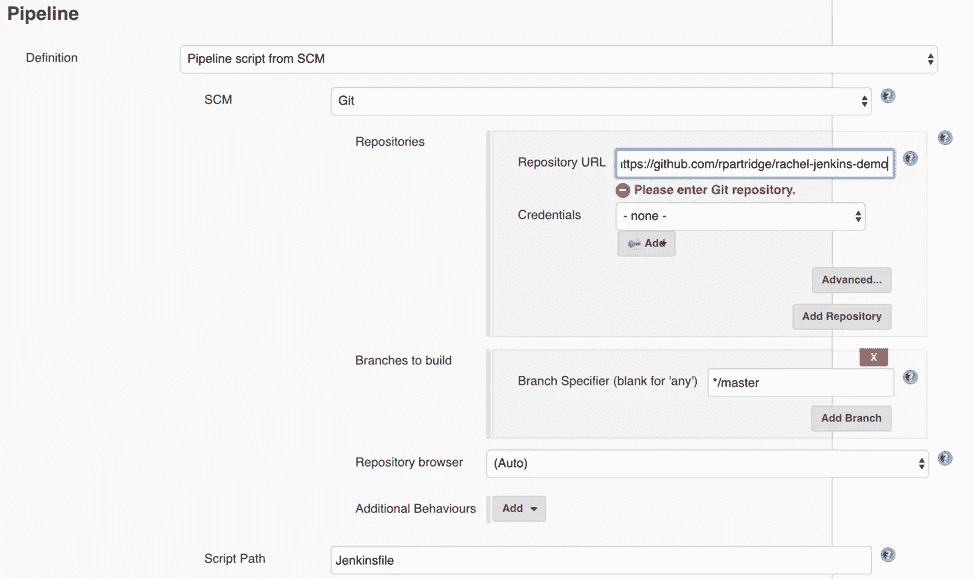
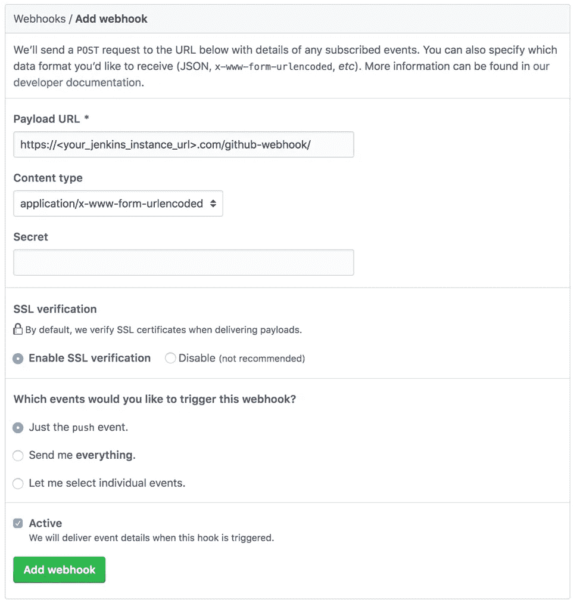
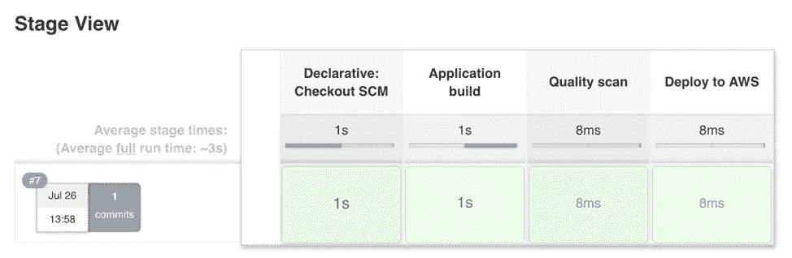

# 揭开 DevOps 的神秘面纱:自动化交付管道入门

> 原文：<https://medium.com/capital-one-tech/demystifying-devops-getting-started-with-automated-delivery-pipelines-jenkins-30ccb84c284a?source=collection_archive---------6----------------------->

## DevOps 和 Jenkins 流程新手指南

# **简介**

DevOps 是一种软件工程文化和实践，旨在统一软件开发和运营。DevOps 实践包括使用技术堆栈和工具，帮助团队快速可靠地操作和开发应用程序，使我们能够完成部署代码、配置基础架构、扫描代码质量、运行自动化测试和监控运行中的应用程序等任务。

# **问题**

从历史上看，部署软件(将代码投入生产并提供给客户)一直是一个非常手工和缓慢的过程。软件开发团队将构建软件，然后将其交给一个完全独立的操作团队，该团队将处理代码的构建、测试和部署。开发团队本质上是把他们的产品扔过一堵墙给运营团队，并且说，“*现在是你的问题了！”*

结果，将代码交付给客户花费了很长时间，并且为混淆和人为错误留下了很大空间。

# **解决方案:DevOps！**

通过拥抱一种新的文化，其中团队负责软件的开发和操作方面，团队现在有了更多的交流、更短的开发周期、由于更频繁的代码发布而减少的恢复时间，以及关注性能的文化。团队现在对他们代码的整个生命周期负责，并负责修复从编写第一行代码一直到发布的任何时候出现的任何错误。

# **企业级开发运维**

在 Capital One，我们的工程团队使用 DevOps 流程以超高效的方式交付高质量的软件。我们努力实现全公司的标准，以便我们有更好的表现团队，更快的交付，和更满意的客户。为了实现这一点，我们使用各种交付管道来扫描和检查我们的代码。

使用自动化交付管道的目的是，每次对代码库进行更改时，代码都要经过一系列严格的自动化测试，包括单元测试、集成测试、安全扫描和质量检查。如果更新后的代码通过了所有的管道测试，并且能够成功构建并部署到我们的基础设施中，管道将自动创建并部署一个版本，供客户立即使用！客户不会经历应用程序的任何停机时间，团队可以发布更新，而不用担心会出问题。

# **使用 Jenkins 构建自动化交付管道**

作为 DevOps 团队的一名工程师，我致力于构建健壮的管道，以便任何开发团队都可以轻松地使用它们来部署他们的应用程序，并确保他们的代码符合 Capital One 的高标准。为此，我的团队利用了 Jenkins，这是构建输送管道的行业标准。

Jenkins 是一个用 Java 编写的开源自动化服务器，有助于自动化 DevOps 的操作部分。Jenkins 可以很容易地与 GitHub webhooks 集成在一起，这样每次有变化时，Jenkins 都会收到通知，并可以执行任意数量的功能。在 Capital One，我们使用 Jenkins，因为它允许我们利用最先进的开源工具，而无需在内部重新发明轮子。如果你是 DevOps 世界的新手，对 Jenkins 有一个基本的了解是至关重要的！

回购的 Jenkins 管道在一个名为 Jenkinsfile 的文件中定义，该文件通常位于项目的顶层目录中。Jenkinsfiles 被分解成几个阶段，例如“应用程序构建”、“集成测试”和“部署”，这些阶段又被进一步分解成更多的步骤。在 Capital One，我们使用代码生成工具，比如我工作的应用程序，为不同类型的应用程序生成 Jenkinsfiles。然而，Jenkinsfiles 经常需要手动调整，无论如何，理解如何从头开始编写一个 Jenkins files 仍然很重要。本文的其余部分将带您创建一个与 Jenkins 集成的 GitHub repo。

# **从头开始构建您自己的 Jenkins 管道**

我们的目标是配置一个存储库，以便每当推送回购时，都会触发 Jenkins 中的管道运行。管道几乎可以做任何事情，但是我们的管道将是一个简单的管道，它调用一个 shell 脚本并打印它所在的步骤。

## **你需要什么**

1.  GitHub 账户和 git 基础知识。*免费开户* [*此处*](https://github.com/) *。*
2.  访问 Jenkins 实例(您自己的实例或您公司的企业实例)。*更多信息* [*此处*](https://jenkins.io/) *。*

## **添加一个定义管道的 Jenkins file**

1.  创建一个新的 GitHub 存储库(在您的帐户下)。这将为您提供对回购的管理员访问权限，这将允许您添加一个 webhook 来与 Jenkins 交谈。
2.  在本地克隆您的回购。
3.  在顶级目录中添加一个名为“hello_world.sh”的文件，并添加以下代码，或者您希望管道执行的任何其他代码:

这是一个将在 Jenkinsfile 中调用的脚本，因此将在管道运行时执行。

4.在顶级目录中添加一个名为“Jenkinsfile”的文件，并添加以下代码:

这是一个包含三个阶段的基本管道。虽然这些阶段是模拟的，并不实际执行这些任务，但这里列出的三个阶段是 Jenkins 通常执行的实际功能。第一个阶段更改文件的权限，以便 Jenkinsfile 可以执行我们的 shell 脚本，后两个语句是基本的 print 语句。

5.把这些变化推给你的回购。

## **在 Jenkins 中创建管道**

1.在 Jenkins 实例中创建一个文件夹。

2.在左侧，点击“新项目”

3.输入新管道的名称(例如， <your_name>-jenkins-demo)。从选项列表中选择“管道”，然后单击“确定”</your_name>

4.选择将管道连接到 GitHub 项目，并包含到 repo 的链接。

5.在构建触发器下，选择“GitHub hook trigger for git SCM polling”和“Poll SCM”这将允许 GitHub webhook 与 Jenkins 进行交互。

6.在“管道”>“定义”下，选择“来自 SCM 的管道脚本”在 SCM 下拉列表中，选择“Git ”,并在 repo URL 下包含相同的 repo 链接。

这将告诉管道执行 repo 中的脚本(第 1 部分编写的 Jenkinsfile)。如果您在 repo 中将更新推送到 Jenkinsfile，执行的管道将自动更新。

7.保存您的管道。

8.通过从左侧菜单中选择“立即构建”,手动运行一次管道。

## **在 GitHub 中添加 web hook**

1.  在 GitHub repo 中，点击 Settings > Hooks 并添加一个 webhook，配置如下(使用您自己的 Jenkins 实例的 URL):

2.保存 webhook。

## **测试**

1.  推动你回购的改变。它可以是任何东西，例如添加或更新自述文件或在某处添加注释。如果一切设置正确，您的管道脚本应该已经被触发，您将能够看到您的作业在 Jenkins 中运行！

# **外卖**

如果你是一名软件工程师，对什么是 DevOps 以及它为什么重要有一个基本的了解是至关重要的。拥有自动化的部署过程可能看起来很乏味，但是对于部署健壮的、无 bug 的代码来说是非常重要的。

即使有一点 Jenkins 和自动化部署的经验，比如完成上面的活动，也能让你从其他开发人员中脱颖而出。无论您正在构建什么类型的产品，拥有一个 DevOps 解决方案是交付高质量软件的关键。

# **资源**

*   詹金斯
*   [带 AWS 的 DevOps】](https://aws.amazon.com/devops/what-is-devops/)
*   [企业开发计划](https://www.plutora.com/blog/what-is-enterprise-devops)

*披露声明:这些观点是作者的观点。除非本帖中另有说明，否则 Capital One 不属于所提及的任何公司，也不被其认可。使用或展示的所有商标和其他知识产权都是其各自所有者的所有权。本文为 2018 首都一。*