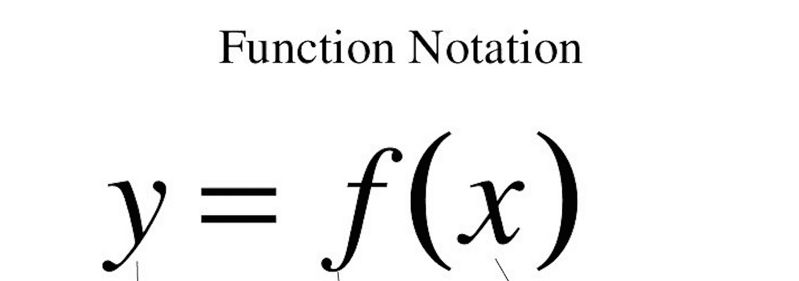
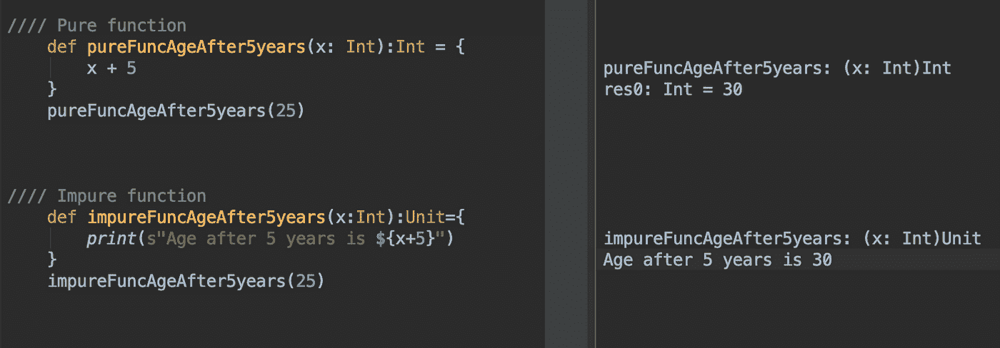
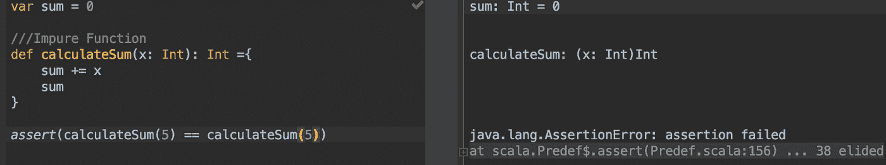
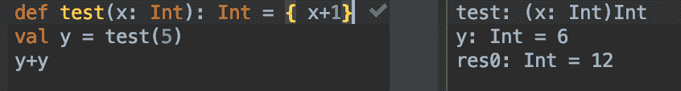

# 揭开函数式编程的神秘面纱(第 1 部分)

> 原文：<https://medium.com/walmartglobaltech/demystifying-functional-programming-part-1-eb4347d145d0?source=collection_archive---------5----------------------->



Image Credit: [https://www.tes.com/lessons/oyJgbl4VmcFTag/function-notation](https://www.tes.com/lessons/oyJgbl4VmcFTag/function-notation)

函数式编程(FP)是一种只使用纯函数和不可变值编写软件应用程序的方法。或者说 FP 是一种面向数学的方式来编写代码。*那么，我说的纯函数是什么意思？*

*f(x)=>x+1；*这是一个纯粹的函数，因为它将对相同的输入产生相同的输出，提供的次数与评估的次数一样多！

一个纯函数不会改变状态或者改变“外部世界”——函数范围之外的世界。

它不能依赖于任何隐藏状态或全局变量。函数的求值不应该引起任何副作用，比如可变对象的突变或者输出到 I/O 设备或者*修改*函数范围之外的任何字段。并且它不修改其输入参数。

总结一下——输出只靠输入+没有副作用！

现在你可能会问，副作用是什么？在我们深入探讨“为什么是纯函数”之前，我们稍后再讨论这个问题。？

*   更容易证明 f(x) => x * x，你可以通过函数的签名来判断它的大部分特性。
*   更容易测试和调试，纯函数依赖于输入和算法，而不依赖于函数范围之外的参数(如全局变量)。



```
assert(pureFuncAgeAfter5years(25) == 30)
```

正如你在上面一行中看到的，测试一个纯函数很容易，但是另一方面，不纯函数处理 I/O，因此很难测试。再举一个不纯函数的例子。在下面的代码中，函数(calculateSum)与外界参数对话，因此变得难以测试，因为调用同一个函数两次，会导致不同的输出！即 *5 & 10，* 5 不等于 10



*   更容易编写并发应用程序

> 如果两个纯表达式之间没有数据依赖关系，则它们的顺序可以颠倒，或者它们可以并行执行，并且不会相互干扰(换句话说，任何纯表达式的计算都是线程安全的)

*   参考透明-



> 如果一个表达式可以用它的值替换而不改变程序的行为，那么它就是引用透明的。

*   幂等的-对于一个给定值*‘x’*它将产生相同的结果，无论它被调用多少次！

> 重新计算函数任意次都是安全的。

*   惰性求值——求值被推迟到需要值的时候(在程序的某个地方调用)。有时候，删除我们不需要执行的东西是更好的优化。

# 副作用

副作用可能是需要并发性和并行性的错误！(这是一个相当苛刻的说法)

1.  print("Hello World") : *立即写入控制台*
2.  stdln.readLine(): *立即读取控制台*
3.  System.nanoTime(): *立即从 JVM 中检索当前时间*
4.  Future(deteleDb): *立即删除数据库*

他们的结果依赖于某种形式的隐藏 I/O。

但是在编程世界中，我们不能忽视写入文件、从数据库读取或从控制台读取。如果一个程序在某个时候不与外界对话，它就没有任何意义！这就是 IO 单子发挥作用的地方，单子封装副作用并设计更优雅的程序。我将在下一部分讨论这个问题！但在此之前，我将讨论 FP 世界中不变性的需要。

# **参考文献:**

> [1]: [功能编程，简化](https://alvinalexander.com/scala/learning-functional-programming-in-scala-book)
> 
> [2]:[https://en . Wikipedia . org/wiki/Functional _ programming # Pure _ functions](https://en.wikipedia.org/wiki/Functional_programming#Pure_functions)