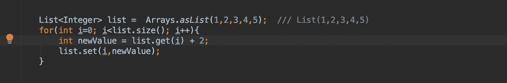

# 揭开函数式编程的神秘面纱(第 2 部分)——对不变性的需求

> 原文：<https://medium.com/walmartglobaltech/demystifying-functional-programming-part-2-the-need-for-immutability-4f5c16ae2c9a?source=collection_archive---------0----------------------->


欢迎回来，对于那些没有浏览过本系列前一篇博客的人，我建议浏览一下 [Part 1](/walmartlabs/demystifying-functional-programming-part-1-eb4347d145d0) (5 分钟阅读)以便更好地理解！

# 什么是不变性和可变性？


不可变对象是其状态在声明后不能改变的对象，而可变对象是变量，其状态可以在程序的整个执行过程中改变。

在 java 中，你可以将 final 视为不可变的，而在 scala 中，所有声明为‘val’的字段都是不可变的，而‘var’是可变的！

> 字符串在 Java 中也是不可变的

你们中的一些人可能认为我们可以在一段时间内改变字符串的值，或者对它执行“连接”操作。当然你可以这样做，但是当你这样做的时候，另一个 string 对象就被创建了，而不需要修改在堆内存中保存那个值的前一个对象。

这里就不深究语言具体的东西了！

# 为什么是不变性？

在一个简单的场景中，您希望利用多核 CPU 实现快速处理，您需要并行化您的代码，并以分布式方式运行它。拥有不可变字段意味着您不必担心并行线程之间的交互以及改变其他字段的状态。这使得并行毫不费力，而不用担心任何线程安全问题。

编写可变的并行代码很难，而且很容易出错。不可变函数式编程几乎是我们所知道的唯一一种既安全又容易做到这一点的方法。

> 让你的变量不可变，除非有一个很好的理由不这样做。

你可能会有很多疑问，不是在任何地方我们都可以使用不变性概念，比如在循环中，或者根据条件表达式给字段赋值。

我会在某个时候回答这个问题，在我们知道函数式编程语言中的*“一切都‘评估’为一个值”*之前。这意味着，即使是 if else 语句也将向您返回一个对象！


在第一张图中，我们使用了一个可变字段' *flag* '，我们可以很容易地避免使用这个概念，即在函数式编程中，所有东西都计算一个值。因此， *if else* 条件返回一个*真/假*表达式，该表达式存储在第二幅图像的不可变字段“ *flag* 中。

在还不算太晚之前，我已经找到了你最喜欢的变量。另一个关于如何避免 for 循环的例子，如果你在 java 8 中使用流函数，你会理解下面的代码，无论如何我会试着解释一下！所以我们有一个列表，我们希望它的值增加 2(每个值加 2)



第一张图是不言自明的，也是处理事情的基本方式，在第二段代码中，我们使用了一个*‘map’函数*，它不过是 scala 中的一个 t *变换函数*。将地图放在列表上可以让我们进入列表，访问每个值，这里用 *' _ '(下划线)表示。*所以，下划线是我们的整数值，列表一次只有一个。为了解决我们的问题，我们只需要做一个 *( _ + 2)* ，它给出了创建一个新列表所需的输出！

*你也可以在 Java 8 中使用‘map ’,但是你需要额外做一步将列表转换成流，所以 Java 中的不可变代码看起来像这样-*

```
final List newList= list.stream().map(value -> value + 2).collect(Collectors.toList());
```

最后一个例子-从 1 到 10 的数字相加-

```
val sum10 = (1 until 10).foldLeft(0){
  case (sum,curr) => sum + curr
}
```

这里(1 到 10)会给你一个范围。 *FoldLeft 是一个可遍历函数，用于从左到右取值，默认参数为* 0，即此处的 sum *。*从上面的代码片段中可以看出，我们省略了声明可变字段 *SUM* 的使用。

# 结论:

如果您想要编写利用大部分处理能力的并行代码，并且想要一种线程安全的方式，那么不变性就是答案！

如果您对如何将可变场景转换成不可变场景有任何疑问，您可以通过我的 LinkedIn 句柄联系我！:)