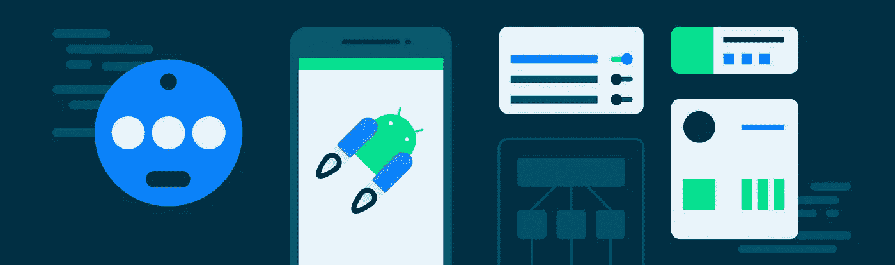
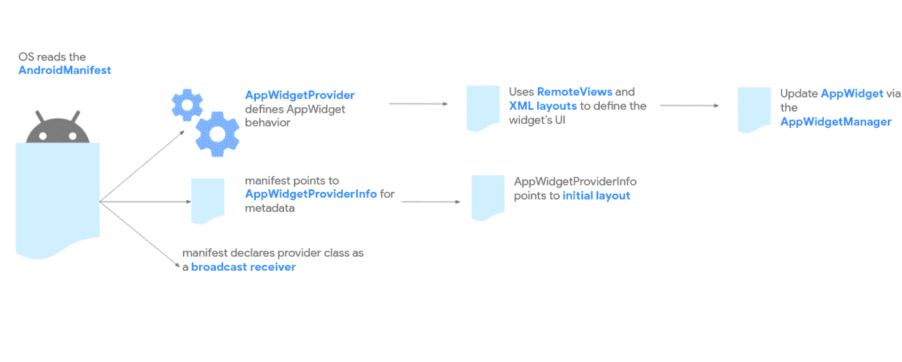
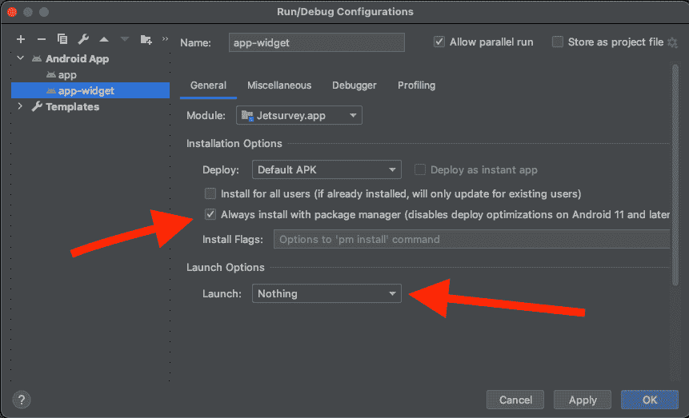

# 揭秘 Jetpack Glance for app widgets

> 原文：<https://medium.com/androiddevelopers/demystifying-jetpack-glance-for-app-widgets-8fbc7041955c?source=collection_archive---------0----------------------->



我们最近[宣布了](https://android-developers.googleblog.com/2021/12/announcing-jetpack-glance-alpha-for-app.html)Glance 的第一个 Alpha 版本，最初支持 [AppWidgets](https://developer.android.com/guide/topics/appwidgets/overview) ，现在支持用于 Wear OS 的 [Tiles。这个新框架建立在](https://android-developers.googleblog.com/2022/01/announcing-glance-tiles-for-wear-os.html) [Jetpack Compose runtime](https://developer.android.com/jetpack/androidx/releases/compose-runtime) 之上，旨在更快更容易地构建“glanceables”，如 app widgets，而不必处理大量样板代码或生命周期事件来连接不同的组件。

然而，重要的是要理解 Glance APIs 不能与 Jetpack Compose 互操作，并且也有一定的限制。在本帖中，我们将揭开这些限制的神秘面纱，并强调使用 Glance 构建 AppWidgets 时需要考虑的要点。

内容分为以下几个主题:

*   声明应用程序小部件
*   主题和样式
*   更新、重组和副作用
*   Android Studio 工具

> **重要提示:**这篇博客是为 **Glance-alpha03** 版本而写的。未来的版本可能会废弃下面的一些内容。

# 声明应用程序小部件

Glance 的主要目标是简化应用程序小部件的 UI 创建，并连接不同的部分，以便您可以专注于构建漂亮的应用程序小部件。我们正在简化某些任务，请注意有一些限制，仍然需要手工操作。



App widgets mechanism ([source](https://developer.android.com/guide/topics/appwidgets#components))

# "为什么我需要 GlanceAppWidgetReceiver？"

Android 操作系统使用 [BroadcastReceivers](https://developer.android.com/reference/android/content/BroadcastReceiver) 来通知应用程序小部件“生命周期”事件，例如当它第一次启用或需要更新时。为了简化 API，Android SDK 提供了 [AppWidgetProvider](https://developer.android.com/reference/android/appwidget/AppWidgetProvider) 类。Glance 通过[GlanceAppWidgetReceiver](https://developer.android.com/reference/androidx/glance/appwidget/GlanceAppWidgetReceiver)类更进一步，连接接收器和 GlanceAppWidget 实例，管理不同的事件，并在必要时刷新其内容。

```
class MyAppWidgetReceiver : GlanceAppWidgetReceiver() { override val glanceAppWidget = MyAppWidget()}
```

> **注意:**可能会有捕获应用程序窗口小部件事件的用例，例如 **onEnabled** ，但这并不是构建 UI 所必需的。

# "我还需要在 XML 中定义元数据吗？"

目前，是的。我们正在寻找简化这一步骤的方法，但目前，请遵循[官方应用小部件指南](https://developer.android.com/guide/topics/appwidgets#AppWidgetProviderInfo)。

# "我需要提供 android:previewLayout 还是 android:previewImage？"

是的，否则启动器中的应用程序小部件选择器将无法显示预览，使用户很难理解你的应用程序小部件功能。

你两个都需要吗？虽然我们建议同时提供这两种功能以获得更好的体验，但是 previewLayout 只在 Android 12 和更高版本中使用，并且需要您用 XML 重新定义应用程序小部件 UI(同样，我们正在寻找简化这一点的方法)。

# 主题和样式

本节涵盖了 AppWidgets 和 Glance 主题化的一些常见混淆点。

# "我可以使用 Jetpack Compose[material theme](https://developer.android.com/reference/kotlin/androidx/compose/material/package-summary#MaterialTheme(androidx.compose.material.Colors,androidx.compose.material.Typography,androidx.compose.material.Shapes,kotlin.Function0))composable 吗？"

不，我们不建议将 Jetpack 组件与 Glance 混合使用。用 MaterialTheme(或任何种类的“撰写主题”)包装 Glance 组件不会对 Glance 组件产生任何影响。(参见下面的一些限制。)

与这里描述的一些其他特性一样，我们正在努力提供一个 API 来简化这一点。在此之前，将您的样式、颜色和属性保存在单个 Kotlin 对象中，并手动将它们应用到您的组件中。

# "我应该提供颜色值还是颜色资源 Id？"

如果你想利用“[动态颜色](https://developer.android.com/guide/topics/appwidgets/enhance#dynamic-colors)”或者对明暗主题的支持，你应该使用颜色资源 ID。否则，应用程序微件不会动态更改其颜色(例如，在亮暗模式之间切换时)，因为颜色值在微件的第一次放置时就已解析。

```
Box(modifier = modifier
  .appWidgetBackground()
  .background(R.color.m3_sys_color_dynamic_dark_background)
) { … }
```

> **注:**我们使用的是[素材组件库](https://github.com/material-components/material-components-android)提供的[色彩资源](https://github.com/material-components/material-components-android/blob/master/docs/theming/Color.md)。要处理白天或夜晚主题或向后兼容的设备，请将颜色包装到另一个 ID 中，并在每个文件夹中重新定义它(即:values/colors.xml、values-v31/colors.xml 等)

# "我可以提供自定义字体吗？"

不，应用程序小部件的限制会阻止 Glance 显示自定义字体。检查 [TextStyle](https://developer.android.com/reference/androidx/glance/text/TextStyle) 类以查看可用的字体和样式。

# "我如何创建类似于 Jetpack Compose 中的[形状](https://developer.android.com/jetpack/compose/themes/material#shape)？"

Glance for AppWidgets 将可组合代码翻译成实际的 *RemoteViews + XML* 。这意味着您没有像 Jetpack Compose 中那样的“*免费画布*”。适用于 *RemoteViews* 的限制同样适用于 Glance。

获得形状(如圆角)的最佳方式是退回到 *drawables + XML* :

```
<shape android:shape=”rectangle”> <corners 
    android:radius=”@dimen/app_widget_background_corner_radius” /> <solid android:color=”@color/color_background” /></shape>
```

并将 drawable ID 传递给 composable:

```
Box(modifier = modifier.background(
  ImageProvider(R.drawable.rounded_corner_background)
))
```

# 更新应用程序小部件

好了，你已经建立了你的简略图。但是如何更新、加载要显示的数据，或者处理数据/状态变化呢？👇

# "我需要接收者更新应用程序部件吗？"

需要接收器来处理 Android OS 事件，如“onUpdate”，但是您可以在应用程序中的任何地方更新 GlanceAppWidget 实例，只要您是在协程中进行更新。避免向接收方发送更新事件，而是使用以下机制之一:

```
// Update a specific instance of MyAppWidget.
MyAppWidget().**update**(context, glanceId)// Update all placed instances of MyAppWidget.
MyAppWidget().**updateAll**(context)// Iterate over all placed instances of MyAppWidget
// and update if the state of the instance matches
// the given predicate.
MyAppWidget().**updateIf**<Preferences>(context) { *state* ->
 *state[KEY_TYPE] == TYPE_DESTINATION*
}
```

> **注意:**使用[glanceappwidgetmanager . getglanceids(..)](https://developer.android.com/reference/androidx/glance/appwidget/GlanceAppWidgetManager#getGlanceIds(java.lang.Class))检索龟头的方法。

此外，我们建议查看“[更新小部件内容的优化](https://developer.android.com/guide/topics/appwidgets/advanced#update-widgets)”指南，但是不要使用 [AppWidgetManager](https://developer.android.com/reference/android/appwidget/AppWidgetManager#updateAppWidget(int,%20android.widget.RemoteViews)) 而是使用本节中的一种机制。

# "我如何从配置活动中更新小部件？"

***Android:configure***允许你提供一个活动，该活动将在小工具第一次放置时(或者在[重新配置](https://developer.android.com/guide/topics/appwidgets/configuration#reconfigure-widgets)时)启动。如本[指南](https://developer.android.com/guide/topics/appwidgets/configuration)中所述，您可以从 ***意图*** 中检索 ***appWidgetId*** 。目前还没有将其转化为 GlanceId 的机制。在我们研究它的时候，您可以使用来自[glanceappwidgetmanager . getglanceids(..)](https://developer.android.com/reference/androidx/glance/appwidget/GlanceAppWidgetManager#getGlanceIds(java.lang.Class))自会最后放置 ***appWidgetId*** 。

# “我可以从非主线程/作用域更新我的应用程序小部件吗？”

是的，允许并鼓励从不同的线程/作用域调用任何更新方法，但这并不意味着您可以在 ***Content()*** 函数中执行长期任务。

# “我能用[副作用](https://developer.android.com/jetpack/compose/side-effects)吗？”

因为目前还不支持对 Glance 进行重组，而且大部分副作用都依赖于它，所以我们不建议使用副作用。尽管它们在 Jetpack Compose 中很常见，但它们在 Glance 中不受支持，因为应用程序小部件没有绑定到生命周期(例如一个 ***活动*** )，并且该进程可能在任何时候被终止。

# “我能用[还记得](https://developer.android.com/reference/kotlin/androidx/compose/runtime/package-summary#remember(kotlin.Function0))吗？”

***记住*** 是 Jetpack Compose 中用于管理[状态](https://developer.android.com/jetpack/compose/state)的机制，通过在 Compose 中存储值。简而言之，这是不可能的，因为每次小部件更新时，组合都会被破坏。相反，在 GlanceAppWidget 中定义一个 [GlanceStateDefinition](https://developer.android.com/reference/androidx/glance/state/GlanceStateDefinition) ，以确保应用程序小部件的状态是持久的，即使进程被终止。

这里有一个简单的例子:

```
// Define the state definition in your app widget…
override val stateDefinition = **PreferencesGlanceStateDefinition**// … inside a composable.
val counter: Int = **currentState**(CounterKey) ?: 0// … somewhere outside of the composition (e.g [ActionCallback](https://developer.android.com/reference/androidx/glance/appwidget/action/ActionCallback)).
**updateAppWidgetState**(context, glanceId) { state ->
  state[CounterKey] = (state[CounterKey] ?: 0) + 1
}// Don’t forget to trigger the update. :)
MyAppWidget().**update**(context, glanceId)
```

> **注意:** [updateAppWidgetState](https://developer.android.com/reference/kotlin/androidx/glance/appwidget/state/package-summary) 不会自动触发 app widget 更新。你必须手动触发它。

# “我如何获取数据？”

我们正在想办法让这变得更容易，但这不是 Glance 所特有的。使用 RemoteViews 开发应用程序小部件也是如此。

从后台异步获取数据的最佳方式是使用[工作管理器](https://developer.android.com/jetpack/androidx/releases/work)，并按照[后台工作指南](https://developer.android.com/guide/background)中的建议存储数据。重要的部分是避免连续地启动新的工作线程(例如，在*glanceappwidgetreceiver . on update*中)或者在数据已经被加载时。

# Android Studio 工具

我们正在努力提供更好的工具来加速 Glance 的开发。

# “我可以使用@Preview 浏览吗”

目前没有。鉴于 Glance 通过将组件翻译成实际的 RemoteViews 和 XML 来工作的方式，Android Studio 提供的预览面板不能用于开箱即用的 Glance 组件。我们正在寻找实现这一目标的方法。

# “如何更快地应用更改？”

为了加快开发速度，我们建议创建以下启动配置。这可以确保应用程序小部件得到更新，而无需启动活动或移除应用程序小部件并重新放置。

1.  在 Android Studio 中，选择**运行>编辑配置…**
2.  创建新配置:
3.  勾选**总是安装软件包管理器**复选框。
4.  在**启动选项**下，从**启动**菜单中选择**无**。



*Android Studio Run configuration panel*

## 下一步是什么？

我们希望这篇文章对您在使用 Glance 时可能遇到的一些常见问题有所帮助。以下是一些附加资源:

*   试试 Glance 并提供你的反馈！
*   跟随[扫视释放](https://developer.android.com/jetpack/androidx/releases/glance)
*   查看演示
    [——GitHub](https://github.com/android/user-interface-samples/tree/main/AppWidget)
    ——[Android x 回购演示](https://cs.android.com/androidx/platform/frameworks/support/+/androidx-main:glance/glance-appwidget/integration-tests/demos/src/main/java/androidx/glance/appwidget/demos/)中的官方样本
*   加入社群
    -stack overflow[#glance](https://stackoverflow.com/questions/tagged/glance)， [#glance-appwidget](https://stackoverflow.com/questions/tagged/glance-appwidget)
    -加入 [Kotlin Slack group](https://surveys.jetbrains.com/s3/kotlin-slack-sign-up) (频道# glance)

> **PS:** 随时在 Twitter 上 ping 我([@ marxalski](https://twitter.com/marxallski))，让我看看你用 Glance 创造的东西！