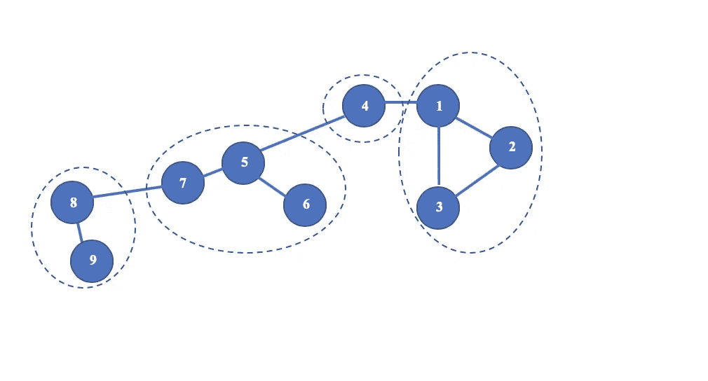

# 解密 Louvain 算法及其在 GPU 中的实现

> 原文：<https://medium.com/walmartglobaltech/demystifying-louvains-algorithm-and-its-implementation-in-gpu-9a07cdd3b010?source=collection_archive---------0----------------------->

Photo Credit : [Community Detection](https://pixabay.com/illustrations/network-social-social-networks-1911678/)

# **1。简介:**

今天，大多数运行业务的系统都可以用网络的形式来表示。在这个数字时代，网络是代表实体的合适方式，因为今天所有的系统都连接得很好。以网络形式表示的数据也称为图形。与需要更大空间来存储这些关系的关系数据库相比，图表是研究社交媒体、有组织犯罪链接、地理链接等多层次关系网络的更好方式。此外，由于链接元素的冗余存储，搜索链接实体的计算复杂度也会增加。在这篇博客中，我将尝试使用 GPU 中的 Louvain 算法来解释图论和社区检测的基本术语。快乐阅读！！

# **2。图表的应用:**

*   **社交媒体网络:**用户被视为顶点，他们之间的友谊被视为顶点(用户)之间的边的存在。这在好友推荐中很有用。
*   **零售产品推荐** **零售**:将产品表示为节点，将同一张发票中的采购量表示为边，可以展开产品之间新的多级关系。这些关系推动了向客户推荐产品。
*   **零售欺诈网络**:使用相同信用卡、电话号码、IP 地址、设备的客户分析可以使用图表来完成，以识别与股票缩水、支付欺诈等所涉及的客户之间的勾结相关的欺诈。
*   **地理地图**:每个地图应用程序都使用图形，根据交通拥堵和实际道路距离(边缘)计算两个位置(顶点)之间的最短路径。
*   **无监督机器学习**K-Means 聚类等算法以图形的形式存储元素，以便更快地计算成对距离。

# **3。理解卢万算法所需的图形术语**

在这一节中，我将带你浏览图形术语，这是理解卢万算法的先决条件。

**什么是图？**

图是包含由边连接的节点的非线性数据结构，其中边可以是有向的或无向的。所有术语都将以下面的示例图作为参考进行解释。

Basic Graph Example

**节点/顶点:**

图中用线连接起来的点称为节点。在上图中，节点标记为 1 到 8。

**边缘:**

连接**图**中任意两个**节点**的线或弧称为边。

**邻接矩阵:**

简单标记图的邻接矩阵(也称为连接矩阵)是具有由图节点标记的行和列的矩阵，基于节点是否相邻，图节点在位置(ni，nj)上具有 1 或 0。在下面的矩阵中，行和列标签表示节点，矩阵元素表示边的存在。我们可以观察到，边被标记为 1，而它们之间没有链接/边的顶点对被标记为 0。

Adjacency Matrix Example

**有向和无向图**:

边没有方向的图称为无向图，而有向图有特定方向的边。在任何社交网络网站中，如果个人是节点，那么他们之间的友谊将是一个无向图，因此该图将被称为无向图。如果边代表谁发送或接收了好友请求，那么它将成为一个有向图。

**社区检测**

在任何图结构中，如果节点可以形成多个组，使得与其他组中的节点相比，节点更多地关联/链接到组内的节点，则这些组被称为形成社区。下图显示了分别以蓝色和橙色标识的两个社区。边长代表边的重量。基于边长，与节点 5、6、7、8 和 9 相比，蓝色社区中的节点 1、2、3 和 4 彼此更接近。这也适用于橙色节点。

Community Detection Example

在下面的部分中，我们将探索一种最常用的社区检测算法，即 Louvain 算法。

# **4。用于社区检测的 Louvain 算法:**

Louvain 算法是由 Vincent D. Blondel，Jean-Loup Guillaume，Renaud Lambiotte 和 Etienne Lefebvre 于 2008 年在这篇论文中提出的。它是以比利时的一个城市命名的，2007 年 3 月，在比利时的 UCL( Louvain-la-Neuve)发表硕士论文时，Etienne Lefebvre 首次开发了这种算法。

**简介和成本函数**

任何无监督或有监督的机器学习算法都需要损失/优化/成本函数来决定收敛标准。在社区检测场景中，模块性是一个最合适的优化度量。卢万的算法是基于非常有效地优化模块化。在讨论算法中遵循的步骤之前，让我们首先理解模块化概念。

下文中称为分区的社区的质量通过分区的模块性来衡量。模块化 Q 被定义为下图所示的公式。

Modularity Definition

为了更好地解释它，让我们举一个小图表的例子。

根据前面章节中解释的邻接矩阵 Aij 的定义，该图看起来如下所示。

将分区分配视为:

*分区 1*–1，3，4

*分区 2–2，5*

链接数量，m = 5

ki，kj 是各个节点的度数(在我们的例子中是 2)

如果节点属于同一分区，则 d(x，y)为 0，否则为 1。

使用模块化的公式，

**Q = 1/(2 * 5)((0–2 * 2/(2 * 5))* 1+***#节点 1 到 1 - >不存在，相同成员*

**(1–2 * 2/(2 * 5))* 0+***#节点 1 到 2 - >存在，不同成员*

**(0–2 * 2/(2 * 5))* 1+***#节点 1 至 4 - >不存在，成员相同*

**(0–2 * 2/(2 * 5))* 0+***#节点 1 到 5 - >存在，不同成员*

**(1–2 * 2/(2 * 5))* 1+***#节点 1 至 3 - >存在，相同成员*

继续矩阵的其余部分，最终简化为:

**Q = 1/10(7 *(0–2/5)+6 *(1–2/5))= 4/50 = 0.08**

感谢[Matthew Joseph 在](https://www.researchgate.net/post/Can_anyone_provide_a_short_example_of_how_the_modularity_is_being_calculated_in_networks) [ResearchGate](https://www.researchgate.net/) 中的回答，分享了模块化计算的一次演练。这个解释来自同一个例子。模块性得分的范围在-1 和 1 之间，模块性得分越高，意味着检测到的社区越好，越紧密。

**算法中遵循的步骤**:

算法大致遵循迭代重复的两个步骤(A 和 B)。

**一个**。设图网络中有 N 个节点。在我们的示例中，我们有 N = 9 个节点，如下图所示。每条边都有特定的权重。

1.  首先，每个节点被分配到不同的社区或分区。分区数量等于节点数量 n。

Communities Initialisation represented by dotted rings

2.对于节点 I 的每个邻居 j，通过将 I 从其分区移动到分区 j 来检查整体模块性是否增加。节点 I 被移动到模块性增益最高的分区 j(增益应该总是正的)。如果观察到的增益都不是正数，I 将保留原来的分区标签。

3.按顺序对所有节点重复步骤 2。这称为一次迭代。重复迭代，直到不能实现模块化的改进。这个想法是为了达到模块性的局部最大值，之后模块性不可能进一步增加。请注意，一个节点可以并且很可能被访问不止一次，以通过将它的邻居移动到不同的分区来评估模块性的变化。

**B** 。第二步包括通过将步骤 a 中标记在相同社区中的节点组合在一起(合并单个节点)来重建新网络

通过将从一个社区中的每个节点到另一个社区的边的权重相加，来确定两个新社区(包含多于 1 个节点)之间的边的权重。下面的图片将补充我对算法步骤的解释。

Nodes 1 and 2 merged into one community

Node 3 also got merged with 2 and 3

Nodes 5 and 7 gets merged into same community and process continues

Final community assignments for nodes

同一社区的节点内的边形成自循环。这意味着即使是邻接矩阵中的对角线元素也将是非零的。

步骤 A 和 B 的一次迭代称为一次 ***通过。*** 第一遍后，算法尝试第二遍，依此类推。每次通过后，社区的数量都会减少。这一直持续到观察到社区标签没有变化，并且达到最大模块化。大多数计算发生在最初的几个过程中，并在最后的过程中以指数方式减少。

# **5。在 GPU 中实现**

在本节中，我将带您了解安装在微软 Azure 上的 CUDA RAPIDS GPU 中的 **Louvain 算法**的实现步骤。

系统配置:

GPU 风味:Volta-100 GPU

CUDA-版本 9.2

Rapids-版本 0.9

云服务提供商:微软

Azure 实例类型:N 系列 NCsv3

我不打算详细介绍如何为数据科学配置基于 GPU 云的系统。你可以参考[这里](https://blogs.nvidia.com/blog/2019/03/18/cuda-x-ai-microsoft-azure/)和[这里](https://azure.microsoft.com/en-in/blog/azure-machine-learning-service-now-supports-nvidia-s-rapids/)了解更多详情。

我们将使用一个虚拟数据集，其中包含消息服务/应用程序的成对客户之间交换的消息数量。客户是节点，客户(节点)之间交换的消息数量是各自的边长/权重。

将使用两个 CUDA 库 CUDF 和 CUGRAPH。CUDF 是 vanilla python 中 Pandas 的 CUDA 等价物，用于处理数据框和探索性数据分析。 [CUGRAPH](https://github.com/rapidsai/cugraph) 包含 CUDA RAPIDS 中基于图的算法实现。参考[链接](https://docs.rapids.ai/)了解更多关于在急流城从事机器学习的工作。

接下来的步骤:

1.  导入所需的库

2.导入数据集

Sample Data Used for Implementation

字段*邀请者*和*被邀请者*是节点，并且 *MsgCount* 字段包含边权重。字段 *Num 表示节点*之间的边/链接*。*

3.节点应该作为整数输入。我们必须从*邀请人*和*被邀请人*列中删除字符“P”。

检查数据。 *src_node* 和 *des_node* 是去掉‘P’后的新字段。

Intermediate Data after removing character “P” from nodes

4.将节点的数据类型转换为整数，将边权重转换为浮点数。

5.CUGRAPH 的 Louvain 算法实现要求节点从零开始。我们必须将每个节点减去 1，因为它在我们的数据集中从 1 开始。

*src_0* 和 *dest_0* 是表示要馈送给 Louvain 算法的节点的字段。

Sample Data with Nodes starting from 0

6.下一步是将这个结构化的表格数据转换成一个 Graph 对象。

我们将创建一个空图。

然后从数据帧 *df_chat 添加节点和边。*

我们图中的节点总数是 131。

7.清算的时刻到了！！运行 Louvain 社区检测算法，将社区信息存储在 *df_chat_partition* 对象中，将模块性得分存储在变量 *mod 中。*

0.94 的模块化得分意味着我们检测到了非常封闭的社区:)正如之前本博客*简介和成本函数*一节所讨论的。

每个节点都将被分配一个分区/社区。

9.检查分区/社区的数量，并探索每个社区的成员。

检测到 47 个社区。

Sample data showing communities and its members

我已经展示了几个社区的样本。例如，节点 15、76 和 81 属于社区'*分区 9'* ，这意味着与任何其他成员相比，成员 P15、p76 和 P81 倾向于在彼此之间交换更多的消息。

这就是你如何将 Louvain 的算法应用于你选择的任何数据集，以迎合类似的需求。代码结构与基于 python 的 pandas 代码非常相似，任何熟悉 python 数据分析的人都可以轻松采用。

我希望这篇博客给了你一个很好的概述，一般来说是图中的社区发现，特别是 Louvain 的算法。目前，我正在探索在增量的基础上对新添加到数据集中的节点进行社区标记的策略。我会在以后的博客中分享更多的细节。在此之前，探索在你所属的组织、机构和企业中进行社区检测的可能性。非常感谢你的阅读！！

# 6.参考资料:

1.  [https://arxiv.org/pdf/0803.0476.pdf](https://arxiv.org/pdf/0803.0476.pdf)
2.  https://docs.rapids.ai/
3.  【https://github.com/rapidsai/cudf 
4.  [https://github.com/rapidsai/cugraph](https://github.com/rapidsai/cugraph)
5.  [https://github . com/rapidsai/notebooks/blob/branch-0.11/Cu graph/louvain . ipynb](https://github.com/rapidsai/notebooks/blob/branch-0.11/cugraph/Louvain.ipynb)
6.  [https://www . research gate . net/post/Can _ any one _ provide _ a _ short _ example _ of _ how _ the _ modularity _ is _ being _ calculated _ in _ networks](https://www.researchgate.net/post/Can_anyone_provide_a_short_example_of_how_the_modularity_is_being_calculated_in_networks)
7.  [https://en.wikipedia.org/wiki/Graph_theory](https://en.wikipedia.org/wiki/Graph_theory)
8.  [http://mathworld.wolfram.com/Graph.html](http://mathworld.wolfram.com/Graph.html)
9.  [https://azure . Microsoft . com/en-us/pricing/details/virtual-machines/series/](https://azure.microsoft.com/en-us/pricing/details/virtual-machines/series/)
10.  [https://developer.nvidia.com/how-to-cuda-python](https://developer.nvidia.com/how-to-cuda-python)
11.  [https://blogs . NVIDIA . com/blog/2019/03/18/cuda-x-ai-Microsoft-azure/](https://blogs.nvidia.com/blog/2019/03/18/cuda-x-ai-microsoft-azure/)
12.  [https://azure . Microsoft . com/en-in/blog/azure-machine-learning-service-now-supports-NVIDIA-s-rapids/](https://azure.microsoft.com/en-in/blog/azure-machine-learning-service-now-supports-nvidia-s-rapids/)