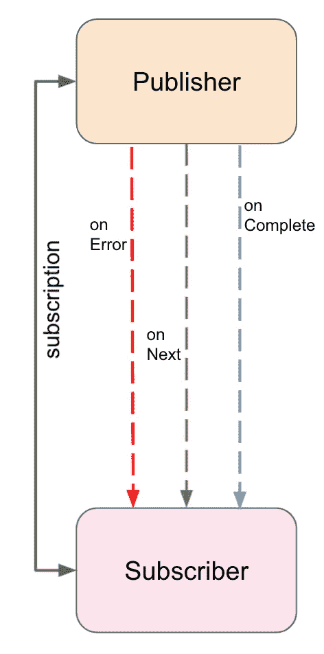
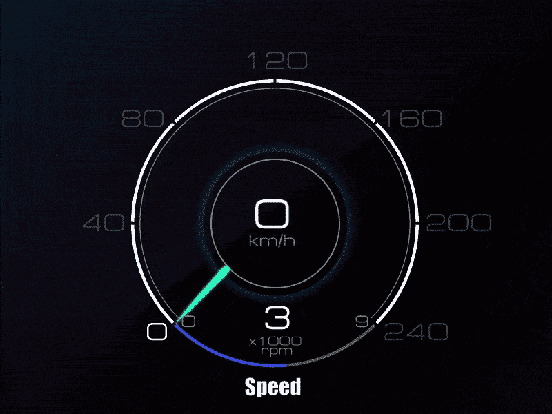

# 揭开反应式编程的神秘面纱——概述

> 原文：<https://medium.com/walmartglobaltech/demystifying-reactive-programming-the-overview-21c8173f7842?source=collection_archive---------0----------------------->

## 回答什么、为什么、何时和如何？


Photo by [Marvin Meyer](https://unsplash.com/@marvelous?utm_source=unsplash&utm_medium=referral&utm_content=creditCopyText) on [Unsplash](https://unsplash.com/s/photos/technology?utm_source=unsplash&utm_medium=referral&utm_content=creditCopyText)

## “**作为一家**公司，**的目标是拥有**不仅是最好的，而且是传奇的客户服务。”—萨姆·沃尔顿

我们沃尔玛一直致力于提高服务质量，增强顾客体验。随着我们不断增长的客户群，为**更好的性能**和**改进的 UX** 构建快速和健壮的应用程序势在必行。这就是反应式编程发挥作用的地方。

让我们从回答这个问题开始——

# “什么是反应式编程”？

> **反应式编程**是一种声明式编程范例，关注异步数据流和变化的传播。

嗯，这是一个充满术语的声明。让我们到引擎盖下了解更多。

## **异步**

假设您的应用程序变得没有响应，因为您的主线程发出了一个对数据库的调用，现在在客户等待时被阻塞了。接下来呢？你的客户向你的竞争对手妥协并完成他们的工作。使用反应式方法，数据库调用不会阻塞调用线程，而是立即返回。该程序的结构是一个异步的事件流。简而言之，在开始一些后台工作来处理前一个任务之后，你立即转移到下一个任务。那就是被**异步**！

## **数据流**

流对于反应式编程就像钱德勒·宾对于朋友一样。没错——**主心骨！**现在考虑一个水箱和一个连接的管道。这个容器保存数据(水)，因此与数据结构产生共鸣。然而，管道不是盛水而是输送水。**数据流**更像是一个应用于数据的方法管道。

## 变化的传播

重新考虑上面的例子。管道的另一端连接到什么？你——消费者。类似地，流式数据必须传播给**消费者**。这里的“更改”指的是通过流传递的数据的转换。这种改变或转换的数据由**观察者**消费，观察者**订阅**这种改变。

反应式方法涉及 4 个接口:



Publisher-Subscriber Communication

**发布者:** It 是数据发射者，也被称为**可观测者**。

**订阅者:**订阅可观察对象来消费数据，可以识别所有发出的事件包括错误！如果订阅者很慢，它很容易被生产者超越。为了解决这个问题，订户或**观察者**可以利用一种叫做**背压**的强大机制来控制可观察对象的节流。

**订阅:**这是发射器和订户之间的会话，当不再需要数据时可以取消。

**处理器:**这些**消耗来自发布者的**数据，应用一些操作(例如，映射、过滤等)并**产生**给订阅者。因此，它们可以被认为是两者的结合——发布者和订阅者。

值得注意的是，这种端到端的系统是懒惰的，也就是说，它直到被消费者订阅后才会实现。

# 为什么要进行反应式编程？

随着所处理数据的指数级增长和并发用户数量的增加，软件需要满足新的规范才能具有竞争力。这些要求可以用[反应宣言](https://www.reactivemanifesto.org)的四个原则来概括，该宣言指出**反应系统是:**

## 消息驱动

随着应用程序越来越复杂，开发人员已经从传统的单片方法转向微服务架构。这些松散耦合的服务相互交互，并以消息的形式交换数据。反应式系统使用组件间的异步消息通信(T21)来代表数据和故障。

## 应答的

具有阻塞 IO 操作的 CRUD 应用程序不仅会导致系统资源的低效利用，还会导致更高的延迟和较差的性能。因此，浪费了您的资金和客户的时间，这是组织最不希望看到的！用户期望眨眼之间就能得到结果。为了满足这一要求，反应式系统专注于提供**快速**和**一致的响应时间**。

## 弹性的

对于一个系统来说，能够在不同的工作负载下**扩展**是绝对重要的。**弹性**是根据负载增加或减少分配给服务的资源以保持响应的能力。

## 弹回的

失败是必然的。重要的是你如何从中恢复过来。因为一个模块停机而影响整个应用程序是不体面的。即使面对故障，系统也需要保持响应。**韧性**无非是**优雅地失败**。



[Source](https://www.pinterest.com/pin/291819250861444856/)

反应式编程使您能够构建**反应式微服务**。值得注意的是，**反应式编程**并不等同于**反应式系统**。使用反应式编程来构建反应式系统并不是强制性的。然而，这是一个好主意，也是遵守反应宣言的最简单的方法之一。

# 何时使用反应式编程？

在多用户环境中或者处理海量数据时，反应式编程通常是更好的解决方案。这时，您需要异步处理来提高应用程序的响应速度。当它可以被无缝地集成为一个需要“反应性”的组件，而不是改变整个应用程序的编码风格时，完全坚持这种范式是没有价值的。当用更简单的方法可以实现相同的性能时，就没有必要引入额外的复杂性。

作为行业领导者，沃尔玛被期望保持其服务在任何时候都无缝运行。为了提高可伸缩性和性能，我们采用了现代事件驱动架构，这种架构可以处理更多的并发流程和最终用户，而不需要额外的计算能力。

一些现实生活中的解决方案在零售和电子商务中变得被动:

1.  **目录视图**——假设你在某电商网站搜索“牛仔裤”；页面立即被结果填满。你无限向下滚动，却发现没有更多的数据。很快，页面就会被更多的数据填满。为什么？因为这些数据只有在需要的时候才会提前提供。结果，我们在交付**高度交互式 UI** 的同时，避免了不必要的服务器负载。
2.  **产品列表**——考虑一个想要在电子商务网站上出售其库存的卖家。他们一次上传并列出一个项目。项目列表是一个延迟受限的事件，它是异步执行的。因此，卖家不会被阻止设置下一个项目。**卖家体验++；**
3.  **货物跟踪** -流数据的一个经典例子是来自随时间变化的 GPS 信号的数据。下游的观察者可能会窒息，从而产生瓶颈。这就是我们可以采用**背压**策略进行流量控制的地方。

# 在 Java 中如何去反应？

Java 中有许多反应式编程的实现。

1.  [**RxJava**](https://github.com/ReactiveX/RxJava) —使用可观察序列编写异步和基于事件的程序的库。
2.  [**项目反应器**](https://projectreactor.io) —反应库，基于[反应流](https://github.com/reactive-streams/reactive-streams-jvm)
    规范，用于在 JVM 上构建非阻塞应用。
3.  [**Reactive Streams API**](https://www.reactive-streams.org)—在 Java 9 中引入，这是一项为具有非阻塞背压的异步流处理提供标准的倡议。

在习惯这种编码范式之前，需要大量的经验和时间。让我们使用 [**反应器**](https://projectreactor.io/) 作为反应式编程库，通过一个简单的实现来体验一下。

*考虑一个每秒发出整数的普通发布者和一个消耗两倍发出的偶数整数的订阅者。*

Reactor Example

*在主线程超时之前，上面的代码产生以下输出:*

```
Received: 0
Received: 4
Received: 8
```

# 症结所在

综上所述，反应式编程是一种涉及异步数据流的编码风格。它为以分布式异步非阻塞方式工作提供了更简单的方法。那么反应式编程是未来吗？虽然这是一个强有力的声明，但很明显，我们已经分支进入了**异步编程**的世界，以构建**快速**和**容错**系统。

# 参考

[](https://www.reactivemanifesto.org) [## 反动宣言

### 在不同领域工作的组织正在独立地发现构建看起来…

www.reactivemanifesto.org](https://www.reactivemanifesto.org) [](https://www.scnsoft.com/blog/java-reactive-programming) [## Java 中的反应式编程:你应该想知道答案的 10 个问题

### 对于应用程序开发来说，反应式编程(RP)并不是什么新的前沿技术。机会是…

www.scnsoft.com](https://www.scnsoft.com/blog/java-reactive-programming) [](https://en.wikipedia.org/wiki/Reactive_programming) [## 反应式编程-维基百科

### 在计算中，反应式编程是一种声明式编程范式，它关注数据流和数据流之间的关系。

en.wikipedia.org](https://en.wikipedia.org/wiki/Reactive_programming) [](/@hharans7889/reactive-programming-as-simple-badb80392baf) [## 简单的反应式编程

### 反应式编程背后的动机。

medium.com](/@hharans7889/reactive-programming-as-simple-badb80392baf)