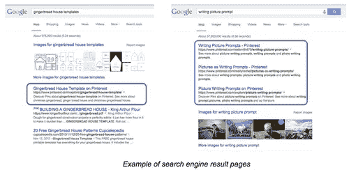
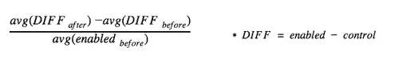

# 用实验揭开 SEO 的神秘面纱

> 原文：<https://medium.com/pinterest-engineering/demystifying-seo-with-experiments-a183b325cf4c?source=collection_archive---------0----------------------->

Julie Ahn | Pinterest 增长工程师

搜索引擎优化(SEO)是 Pinterest 增长的最大驱动力之一。然而，在我们的规模下，找到制胜策略并不容易。传统上，搜索引擎优化策略包括尝试不同的已知策略，并期待最好的结果。你可能有一个好的交通天或一个坏的交通天，不知道是什么真正触发了它，这往往使人们认为 SEO 是魔术，而不是工程。

我们的 SEO 目标是帮助数十亿互联网用户发现 Pinterest，并发现它作为可视化书签工具的价值。随着时间的推移，我们发现验证变更是否对用户行为产生积极影响的唯一方法是运行 [A/B 测试](https://engineering.pinterest.com/post/100594540604/lessons-in-growth-and-increasing-signups)。不幸的是，我们没有类似的工具来测试搜索引擎的行为，所以我们建立了一个实验框架，并用它来将“魔术”变成确定性的科学。

## 构建搜索引擎优化实验框架

有了这个框架，我们希望建立一个实验工具，让我们能够准确地衡量任何内容修改对 SEO 的整体影响，更重要的是，整体用户增长。

实验工具由以下三个独立组件组成:

*   定义实验和分组范围的配置
*   计算每个实验组页面流量的日常数据工作(我们通过搜索引擎引用 Pinterest 页面的独特会话数来衡量流量)
*   查看结果的仪表板

与通常通过细分用户来完成的 A/B 实验不同，我们的 SEO 实验框架对页面进行了细分。例如，在一个实验中，50%的页面被分组为“启用”，另 50%的页面被分组为“控制”，页面将根据其 URL 被归入其中一个组:

`‘enabled’ if hash(experiment_name + page_url) in enabled_group_range`

`‘control’ if hash(experiment_name + page_url) in control_group_range`

将页面 URL 与实验名称结合起来进行哈希运算，可以确保页面在实验组中的均匀分布，并使我们能够同时运行不同组大小的多个实验。

一旦实验启动并运行，我们就可以通过比较流量来衡量每个组的性能。

如图 2 所示，即使在实验开始之前，两组之间的流量也不相同，启用组的流量略高于控制组。这是因为有些页面比其他页面更受欢迎，所以无论我们如何分配页面，不同群体之间的流量差异可能仍然存在。为了使这种差异和每周波动正常化，我们将两组之间的差异重新绘制成图 3。现在更容易看到启用组的流量在发布后有所提高。

为了衡量实验的效果，我们可以比较实验开始前后的平均差异。图 3 中两条虚线之间的距离是该实验的平均增益或损耗。

## 我们学到了什么

有数百种不同的方法来做 SEO，包括网站地图，链接建设，搜索引擎友好的网站设计等等。成功的 SEO 的最佳策略可能因产品、页面甚至季节而异。确定最适合每种情况的方法有助于我们利用有限的资源快速行动。通过运行大量的实验，我们发现一些众所周知的 SEO 策略对我们不起作用，而某些我们不太有信心的策略却非常有效。

例如，我们曾经注意到 Google 网站管理员工具在我们的页面上发现了太多重复的标题标签。在 Pinterest 上，论坛页面上的标题标签被设置为“ *{board_name}”，并且有许多由不同用户创建的具有相同名称的论坛。众所周知，页面标题标签是 SEO 的一个重要因素，所以我们想知道保持标题标签的唯一性是否会增加流量。我们进行了一项实验，通过在标题标签中包含 Pin 计数来减少重复的标题标签，例如“*{ board _ name } on Pinterest |({ number } Pin)*”但是我们发现两组之间的流量没有统计学上的显著变化。*

那么，Pinterest 上哪些做得好呢？Pinterest 中有数百亿个 pin，但文本描述可能会有所欠缺。我们认为在页面上提供更好的文本可以解决这个问题，所以我们从一个相对简单的方法开始改进文本描述。pin 由许多不同的用户添加，其中一些比另一些更具描述性。对于许多图钉，我们从包含相同图像的其他图钉中挑选了一个更好的描述，并在现有描述的基础上显示出来。实验结果比我们预期的要好很多(还记得图 3 吗？)这促使我们更多地投资于使用复杂技术的文本描述，例如视觉分析。一系列的后续实验导致去年的流量增加了近 30%。

## 做出数据驱动的决策

在大多数情况下，我们发现一项实验对流量的影响早在启动后几天就开始显现。群体之间的差异会持续一两个星期，直到变得稳定。了解这一点不仅有助于我们更快地运送成功的实验，也有助于我们尽早关闭失败的实验。我们经历了惨痛的教训。

图 4 显示了一个实验的结果，我们运行该实验是为了测试使用 JavaScript 进行渲染以获得更好的 web 性能。这个实验的目的是确保这个变化不会对 SEO 产生负面影响。我们注意到第二天的流量略有下降，但决定再等几天，因为我们认为爬虫可能需要更多时间来适应。不幸的是，流量没有恢复，我们在晚了几天后关闭了这个实验。即使在我们关闭实验后，启用组的页面也花了近一个月的时间才从流量下降中恢复过来。这很不幸，但是现在我们知道如何以及何时为将来的类似实验做出决定。此外，我们了解了为非 SEO 项目进行实验的重要性，以证明它们不会对 SEO 产生负面影响。

上面的实验可能是一个失败的实验，但运行这个实验是一个巨大的成功，因为它防止了一个未知原因的可怕的流量下降。我们通常会对所有影响未授权页面的主要变化进行 SEO 实验。特别是，主要的布局变化、标题标签的修改、新的注册模式和通过 JavaScript 呈现内容都必须用 SEO 实验框架进行测试。

## 下一步是什么？

我们仍处于扩大搜索引擎优化实验范围的早期阶段。我们计划改进现有的框架，允许更多的分割和过滤选项，以满足不同实验的需要。

如果你对解决 SEO 挑战感兴趣，[加入我们的团队](https://about.pinterest.com/en/careers/engineering-product)！

*朱莉·安是成长团队的一名软件工程师。*

*获取 Pinterest 工程新闻和更新，关注我们的工程*[*Pinterest*](https://www.pinterest.com/malorie/pinterest-engineering-news/)*，* [*脸书*](https://www.facebook.com/pinterestengineering) *和* [*推特*](https://twitter.com/PinterestEng) *。有兴趣加入团队吗？查看我们的* [*招聘网站*](https://about.pinterest.com/en/careers/engineering-product) *。*