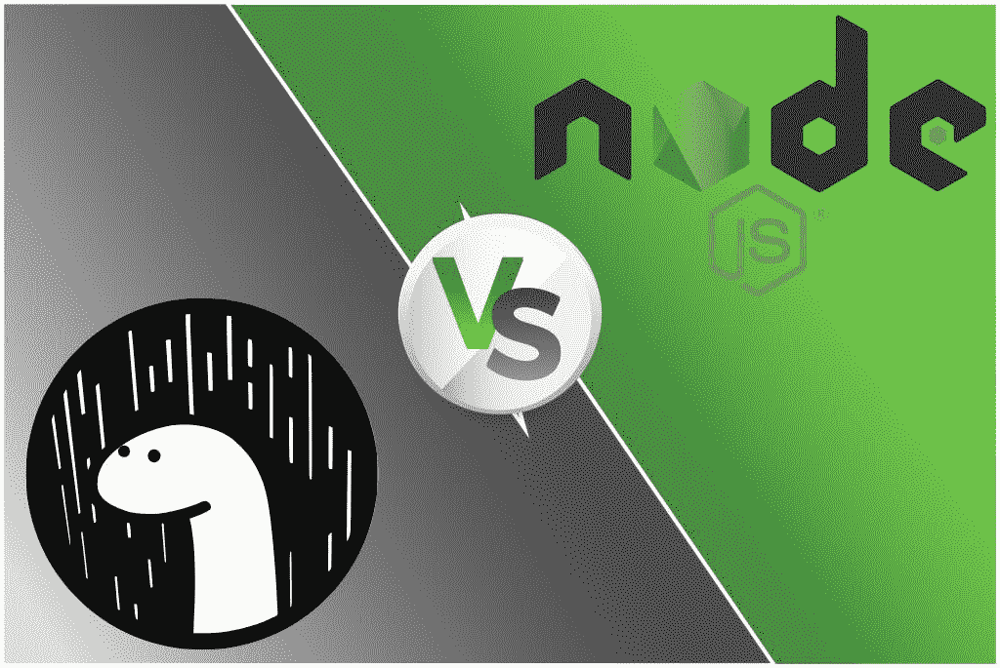

# deno vs Node.js——这是 node . js 的未来吗？

> 原文：<https://medium.com/quick-code/deno-vs-node-js-is-this-the-future-of-node-js-d1d243662e38?source=collection_archive---------0----------------------->

大家好！我一直在 JavaScript 世界里看到这种新的宣传……它是服务器的新运行时“Deno”。

所以想借此机会谈谈我的看法。那么什么是 Deno 呢？如果你去它的官方网站，你会看到它被描述为“Deno 是 JavaScript 和 Typescript 的安全运行时”，就像 Node.js 所使用的一样，并且是由 Node.js 的创建者 Ryan Dahl 创建的。他创建了 Deno 来修复 Node.js 的一些缺陷。

“Deno”基本上是 node 的变位词。JS，事实上他们知道，正如我们在他们的官方页面下载中看到的，Deno 是 JavaScript 和 Typescript 的安全运行时，如果我们看一下 nodejs.org，我们会发现离他们的节点不远。JS 是一个基于 chrome 的 V8 JavaScript 引擎的 JavaScript 运行时，事实上现在终于有了一个由 node 的发明者开发的新的 JavaScript 运行时。射流研究…

现在你会发现 Ryan 自己的一些观点，你可以在 YouTube 上找到，他基本上宣布了 Deno，并分享了他的想法，为什么他觉得有必要使用 Deno，为什么我们需要 node 的替代品。JS 但不是你应该替换的意义上的替换节点。JS 与它，但相反，你可以看看 Deno，因为它可能能够以更好的方式做同样的事情，但是这是一个很大的免责声明-在这一点上，Deno 处于非常非常早期的阶段，大概我们只有几天时间进入 1.0 版本的发布，虽然 1.0 不会是 Deno 的最终目的地，一切都结束了，而是它的第一个更最终的版本，你现在可以说。

虽然源代码库非常受欢迎，因为它收集了相当多的 GitHub 明星(如果你认为这是受欢迎的问题)。

有一点值得注意和牢记，那就是节点。JS 正在被很多大公司使用，那里有大量的项目和网站，包是用 node 构建的。JS，这是一个相当成熟和发达的运行时，所以它不是全新的，充满了错误，而是生产就绪，并得到了大量使用。**让我把这个节点说清楚。JS 不会去任何地方，但当然你不必从我这里得到这个，你可以从 Ryan 本人那里得到这个**:

# 发动机罩下的 Deno 和 Node:

Node.js 基于 C++使用 V8 引擎执行 JavaScript 代码。V8 引擎本身最初是为谷歌 Chrome 开发的，用于在浏览器中快速执行 JavaScript。与此同时，即使是新的微软 Edge 版本也是基于 chrome V8 的。

Deno 也依赖于 V8 引擎，但不是 C++，Deno 也基于 Rust——一种编程语言，据说可以提供与 C++类似的良好性能，但也特别强调安全性。我将在我即将到来的博客中写这种语言，但简而言之，我们可以说使用 Rust 语言，应该避免内存访问错误或缓冲区溢出，因为 Rust 没有垃圾值。

安全性是一个方面，对 Node.js 的一个常见批评是，一旦 Node 应用程序运行，它就可以轻松访问文件系统或网络，例如，Deno 希望通过要求运行 Deno 应用程序的人首先允许 Deno 想要做的事情来避免这一点。

一个很大的区别是 Deno 支持开箱即用的 Typescript，并且内置了编译器。

此外，与 node 不同，它只提供一个可执行文件。JS 文件，它会出现在多个文件夹中。

deno 也有内置的工具，如依赖检查器(deno info)和代码格式化器(deno fmt)，这使得使用 Deno 进行编码和开发变得更加容易和轻松。

Deno 的另一个优点是，它可以从网络上的任何位置导入任何模块，如 GitHub、个人服务器或本地网站，而不像 node。我们只能用一个地方，那就是 npm。这使得任何组织都可以更容易地开发他们自己的私有模块，将其托管在他们的个人服务器上，开发人员现在只需输入 URL 即可导入模块。

总而言之，我可以说 Deno 看起来是一个非常有前途的运行时，但我们需要有所保留，因为它仍在 1.0 版本中。这意味着当人们和组织广泛采用这项技术时，还有很长的路要走。你觉得德诺怎么样？你愿意试一试吗？

*原载于 2020 年 5 月 24 日*[*http://madhureshgupta . home . blog*](http://madhureshgupta.home.blog/2020/05/24/deno-vs-node-js-is-this-the-future-of-node-js/)*。*