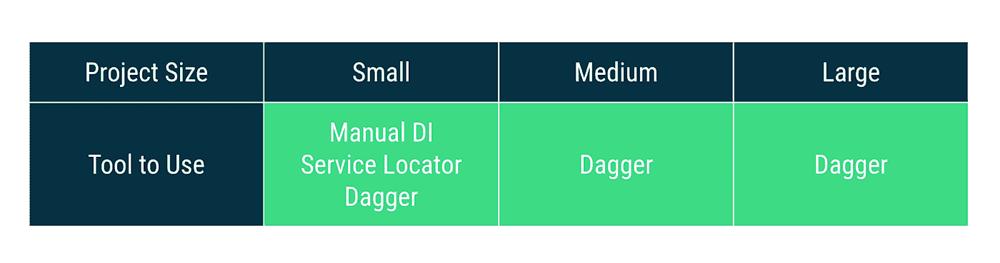
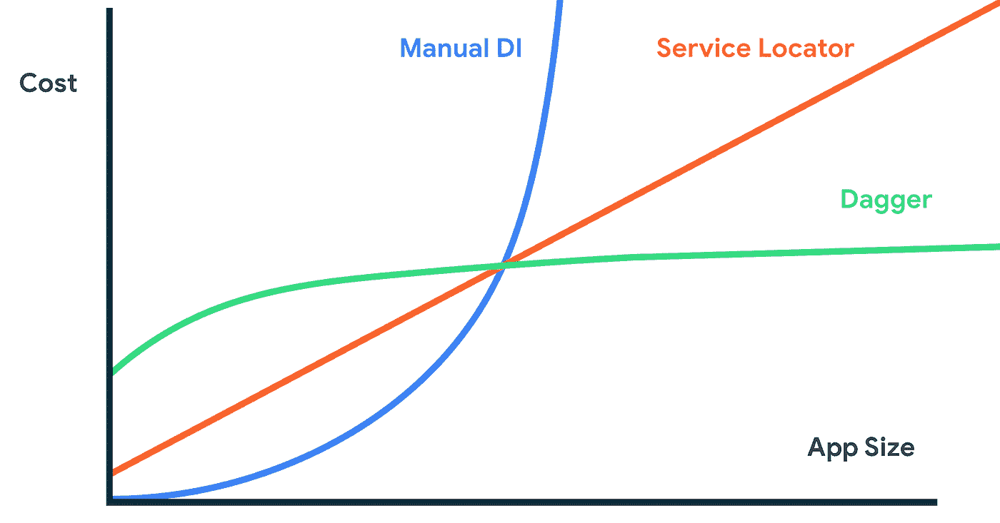
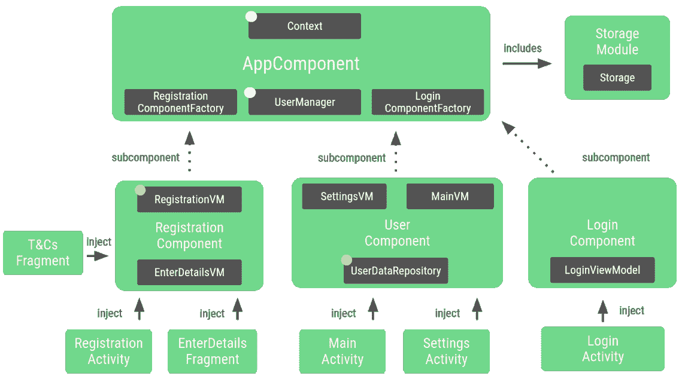

# Android 上的依赖注入指南— ADS 2019

> 原文：<https://medium.com/androiddevelopers/dependency-injection-guidance-on-android-ads-2019-b0b56d774bc2?source=collection_archive---------4----------------------->

根据我们的[对依赖注入](https://developer.android.com/training/dependency-injection) (DI)的介绍，我们相信你应该在你的应用中一直使用 DI 原则。如果你正在开发一个专业的 Android 应用，使用 [Dagger](https://dagger.dev/) 来更好地管理你的依赖。

我们推荐中大型应用使用 Dagger 对于小的 app 或者宠物项目来说，你使用的工具并不重要，但是越早在你的项目中加入 Dagger，它就越好，你以后需要重构的就越少。

*DI tool to use depending on the size of your project. This is relative, use your own judgement since every app is different.*

如果你比较一下使用 Dagger 和其他工具管理依赖关系的成本，Dagger 一开始的成本相对较高，但随着应用程序变大，成本会趋于平稳。

*Made up graph showing the scalability of different DI techniques*

匕首真的闪耀着:

*   **表演**。没有反射和在构建时生成的代码，Dagger 可以提供最好的性能。
*   **正确性**。匕首在建造时给你安全感。如果一个类型在 DI 应用程序图中不可用，您将无法构建项目，而是在运行时得到这些崩溃。
*   **可扩展性**。Dagger 是按比例构建的，适用于 Gmail、Google Photos 或 YouTube 等大型应用程序。

DI 和 Dagger 是复杂的主题，因此我们提供文档和示例来学习这些专业工具。

# 新文档

我们刚刚发布了一组文档来帮助您解决这个问题。我们希望通过提供良好的实践来帮助初学者和更有经验的用户。

可用的新文档:

*   [DI 概述](https://developer.android.com/training/dependency-injection):什么是 DI，以及在你的项目中使用它的好处。
*   [手动 DI](https://developer.android.com/training/dependency-injection/manual) :为了更好的了解 DI 的好处，以及匕首能为你做什么，你应该亲自尝试一下 DI。在本页中，我们将展示如何在您的应用中手动执行 DI。
*   [Dagger 基础知识](https://developer.android.com/training/dependency-injection/dagger-basics):在你的项目中加入 Dagger 的好处以及它在幕后的作用。
*   [在 Android 应用程序中使用 Dagger](https://developer.android.com/training/dependency-injection/dagger-android):通过在典型的 Android 应用程序中添加 Dagger，从头开始学习 Dagger 的所有概念。
*   [多模块应用中的 Dagger](https://developer.android.com/training/dependency-injection/dagger-multi-module):如何在既有常规梯度模块又有动态特征模块的模块化 app 中使用 Dagger。

# 新代码实验室

除了文档之外，学习一个主题的最好方法是亲自动手编写代码。我们发布了一个名为[的新代码实验室，在 Android 应用](https://codelabs.developers.google.com/codelabs/android-dagger)中使用 Dagger。它从一个手动 DI 实现开始，您将一个接一个地迁移到 Dagger 流。

结束时，您将构建一个这样的应用程序图！

Final Dagger graph built throughout the codelab

完成 codelab 以理解 Dagger 的主要概念，这样您就可以相应地将它们应用到您的项目中。

# Android 中更简单的匕首

我们希望通过减少您必须编写的代码量，使 Dagger 更容易被小型应用程序访问。我们正致力于一项新计划，将使 Dagger 在 Android 中更简单。什么将会改变？

*   你为 Dagger 组件做的工作可以自动化！我们将提供一些预定义的组件，可以简化您的工作。
*   它将与 Jetpack 的其余部分集成，并将提供与视图模型、工作管理器和导航的轻松集成。
*   科特林友好。我们希望 Dagger 在用 Kotlin 编写时能够无缝地工作，并扩展它的功能，使它能够与委托和其他 Kotlin 强大的功能一起工作。
*   Dagger 模块是向 Dagger 图提供信息的方式。重要的是，它们在新计划中保留并提供相同的功能。

请继续关注，我们正在努力。

# 匕首.安卓

[dagger.android](https://dagger.dev/android) 是 dagger 之上的一个库，当在 android 框架类(例如活动或片段)中使用 Dagger 时，它减少了样板代码。

尽管样板文件有所帮助，但我们认为我们可以做得更好。由于新的 Android 方法是完全不同的，没有计划对这个库进行重大改进，但我们致力于维护它，直到有一个合适的稳定的替代品可用。

如果你用的是 dagger.android，就继续用吧。如果你开始一个新项目，考虑 dagger.android 作为替代，如果它适合你的用例就使用它。我们将提供从 Dagger 和 dagger.android 代码到新计划的迁移指南。

# 结论

用依赖注入，用匕首！我们已经在努力让它变得更好。有关更多信息，请查看 2019 年 Android Dev Summit 关于此主题的记录: