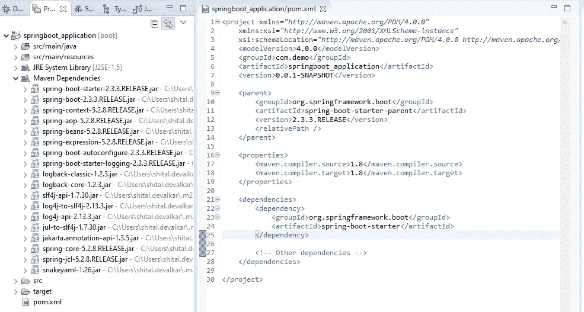

# 核心 Java 中的依赖注入实现

> 原文：<https://medium.com/globant/dependency-injection-implementation-in-core-java-fe9729f8ae27?source=collection_archive---------1----------------------->

在不使用任何框架的情况下，在核心 Java 中实现自己的轻量级依赖注入

**概述**

本文将指导您理解并使用自己的依赖注入实现构建一个轻量级 Java 应用程序。

依赖注入……DI……控制反转……IoC，我想你可能在日常工作或特别的面试准备时间听到这些名字很多次了，以至于你想知道它到底是什么。

但是如果你真的想了解它内部是如何工作的，那么请继续阅读这里。

**这篇文章的“目的”只是根据我在 springboot 和 java 的经验，让你更容易理解 DI 如何在 springboot 内部工作，而不是和 springboot 中的 DI 进行比较。**

****那么，什么是依赖注入呢？****

**依赖注入是一种用于实现 IoC 的设计模式。依赖关系)由框架创建和分配。**

**要使用 DI 特性，一个类及其实例变量只需要添加框架预定义的注释。**

**依赖注入模式包括 3 种类型的类。**

*   ****客户端类:**客户端类(依赖类)依赖于服务类。**
*   ****服务类:**为客户端类提供服务的服务类(依赖类)。**
*   ****注入器类:**注入器类将服务类对象注入到客户端类中。**

**这样，DI 模式将创建服务类对象的责任从客户机类中分离出来。下面是 DI 中使用的几个术语。**

*   ****接口**定义客户端如何使用服务。**
*   ****注入**指的是将一个依赖(一个服务)传递到对象(一个客户端)，这也被称为自动连线。**

****那么，什么是控制反转呢？****

**简而言之，“不要打电话给我们，我们会打电话给你。”**

*   **控制反转(IoC)是一种设计原则。它用于反转不同种类的控件(即对象创建或依赖对象创建和绑定)来实现松耦合。**
*   **依赖注入是实现 IoC 的方法之一。**
*   **IoC 有助于将任务的执行与实现分离。**
*   **IoC 帮助它将一个模块集中在它被设计的任务上。**
*   **IoC 可防止更换模块时出现副作用。**

****DI 设计模式类图****

****

**Class Diagram of Dependency Injection Design Pattern**

**在上面的类图中，需要 UserService 和 AccountService 对象的客户端类没有直接实例化 UserServiceImpl 和 AccountServiceImpl 类。**

**相反，注入器类创建对象并将它们注入客户端，这使得客户端独立于对象的创建方式。**

****依赖注入的类型****

*   ****构造器注入:**注入器提供服务(依赖)**
*   **通过客户端类构造函数。在这种情况下，自动连线注释添加在构造函数上。**
*   ****属性注入:**注入器通过客户端类的公共属性提供服务(依赖)。在这种情况下，在成员变量声明时添加了自动连线注释。**
*   ****Setter 方法注入:**客户端类实现一个接口，该接口声明提供服务(依赖)的方法，注入器使用该接口向客户端类提供依赖。**

**在这种情况下，Autowired 注释添加了 while 方法声明。**

****它是如何工作的？****

**要理解依赖注入实现，请参考这里的代码片段。**

****先决条件****

**为了更好地理解本教程，最好提前了解注释和反射的基本知识。**

****需要添加到类路径中的 java 库:****

**在开始编码步骤之前，您可以在 eclipse 或其他 IDE 中创建新的“maven 项目”,并将下面的配置复制到 pom.xml**

```
**Note:** to reflect below config below configuration please follow   
      below steps.

      Right click on your project -> Maven -> Update Project
```

****pom.xml****

```
<project  xmlns:xsi="http://www.w3.org/2001/XMLSchema-instance" xsi:schemaLocation="http://maven.apache.org/POM/4.0.0 http://maven.apache.org/xsd/maven-4.0.0.xsd"><modelVersion>4.0.0</modelVersion>
    <groupId>temp</groupId>
    <artifactId>com.di</artifactId>
    <version>0.0.1-SNAPSHOT</version> <properties>
       <maven.compiler.source>1.8</maven.compiler.source>    
       <maven.compiler.target>1.8</maven.compiler.target>
     </properties>

     <dependencies>
        <dependency>
        <groupId>org.reflections</groupId>
        <artifactId>reflections</artifactId>
        <version>0.9.9-RC1</version>
        <scope>compile</scope>
     </dependency> <!-- other dependencies -->
    </dependencies>
</project>
```

**如上所述，DI 实现必须提供预定义的注释，这些注释可以在声明客户端类和客户端类中的服务变量时使用。**

**让我们添加客户端和服务类可以使用的基本注释:**

```
**CustomComponent.java**import java.lang.annotation.*;/** Client class should use this annotation */@Retention(RetentionPolicy.RUNTIME)
@Target(ElementType.TYPE)
public @interface CustomComponent {
}**CustomAutowired.java**import java.lang.annotation.*;
import static java.lang.annotation.ElementType.*;
import static java.lang.annotation.RetentionPolicy.RUNTIME;/** Service field variables should use this annotation */@Target({ METHOD, CONSTRUCTOR, FIELD })
@Retention(RUNTIME)
@Documented
public @interface CustomAutowired {
}**CustomQualifier.java**import java.lang.annotation.*;/**
 * Service field variables should use this annotation
 * This annotation Can be used to avoid conflict if there are     
 * multiple implementations of the same interface   
 */@Target({ ElementType.FIELD, ElementType.METHOD, ElementType.PARAMETER, ElementType.TYPE,
  ElementType.ANNOTATION_TYPE })
@Retention(RetentionPolicy.RUNTIME)
@Inherited
@Documented
public @interface CustomQualifier {
String value() default "";
}**CustomApplication.java**/**
* Client class should use this annotation
*/
import java.lang.annotation.*;
import java.lang.annotation.RetentionPolicy;@Retention(RetentionPolicy.RUNTIME)
@Target(ElementType.TYPE)
public @interface  CustomApplication {
}
```

# **服务接口**

```
**UserService.java**public interface UserService {
String getUserName();
}**AccountService.java**public interface AccountService {
     Long getAccountNumber(String userName);
}
```

****服务实现类:****

**这些类实现服务接口并使用 DI 注释。**

```
**UserServiceImpl.java**@CustomComponent
public class UserServiceImpl implements UserService {
   @Override
   public String getUserName() {
     return "shital.devalkar";
   }
}**AccountServiceImpl.java**@CustomComponent
public class AccountServiceImpl implements AccountService {
     @Override
     public Long getAccountNumber(String userName) {
       return 12345689L;
     }
}
```

****客户端类别:****

**为了使用 DI 特性，客户端类必须使用 DI 框架为客户端和服务类提供的预定义注释。**

****ClientApplication.java****

```
/** Client class, havin userService and accountService 
 * expected to initialized by CustomInjector.java
 */@CustomComponent
public class ClientApplication {
  @CustomAutowired
  private UserService userService;

  @CustomAutowired
  @CustomQualifier(value = "accountServiceImpl")
  private AccountService accountService; public void displayUserAccount() {
    String username = userService.getUserName();
    Long accountNumber = accountService.getAccountNumber(username);
    System.out.println("\nUser Name: " + username 
    + " Account Number: " + accountNumber);
  }
}
```

****喷油器等级:****

**CustomInjector 类是 DI 框架中的主要角色。因为它负责创建所有客户端的实例和客户端类中每个服务的 autowire 实例。**

****该类创建实例和注入依赖关系的步骤**:**

1.  **扫描根包和所有子包下的所有客户端**
2.  **创建客户端类的实例。**
3.  **扫描客户端类中使用的所有服务(成员变量、构造函数参数、方法参数)**
4.  **递归地扫描服务本身内部声明的所有服务(嵌套依赖)**
5.  **为步骤 3 和步骤 4 返回的每个服务创建实例**
6.  **Autowire:注入(即。初始化)具有在步骤 5 创建的实例的每个服务**
7.  **创建映射所有客户端类的映射<class object=""></class>**
8.  **公开 API 以获取 get bean(Class clasz)/get service(Class classz)。**
9.  **验证接口是有多个实现还是没有实现**
10.  **在多个实现的情况下，按类型处理服务或自动连线的限定符。**

****喷射器类中需要的实用程序类:****

**这个类大量使用 java.lang.reflect.Field 提供的基本方法。**

**这个类中的 autowire()方法是递归方法，因为它负责注入服务类中声明的依赖关系。(即。嵌套依赖关系)**

**【InjectionUtil.java 号**

```
import java.util.*;
import java.util.Map.Entry;
import java.lang.reflect.Field;
import java.util.stream.Collectors;
import javax.management.RuntimeErrorException;public class InjectionUtil {
 /**
  * Perform injection recursively, for each service inside 
  * the client class
  */
 public static void autowire(Class<?> classz, 
   Object classInstance, Map<Class<?>, Object> applicationScope,
   Map<Class<?>, Class<?>> diMap) 
    throws InstantiationException, IllegalAccessException {
  Set<Field> fields = findFields(classz);for (Field field : fields) {
   String qualifier = 
      field.isAnnotationPresent(CustomQualifier.class)
     ? field.getAnnotation(CustomQualifier.class).value() : null;Object fieldInstance = getBeanInstance(field.getType(), diMap, 
       applicationScope, field.getName(), qualifier);
   field.set(classInstance, fieldInstance);

   autowire(fieldInstance.getClass(), 
     fieldInstance, applicationScope, diMap);
  }
 }/**
  * Overload getBeanInstance to handle qualifier and autowire 
  * by type
  */
 public static <T> Object getBeanInstance(Class<T> interfaceClass, 
   Map<Class<?>, Class<?>> diMap,
   Map<Class<?>, Object> applicationScope, String fieldName,
   String qualifier)
   throws InstantiationException, IllegalAccessException {

   Class<?> implementationClass = 
     getImplimentationClass(interfaceClass, diMap, 
     fieldName, qualifier);if(applicationScope.containsKey(implementationClass)){
    return applicationScope.get(implementationClass);
   }

   Object service = implementationClass.newInstance();
   applicationScope.put(implementationClass, service);
   return service;
 }/**
 * Get the name of the implimentation class for input
 * interface service
 */
 private static Class<?> getImplimentationClass(Class<?> 
   interfaceClass, Map<Class<?>, Class<?>> diMap,
   String fieldName, String qualifier) {
    Set<Entry<Class<?>, Class<?>>> implementationClasses = 
      diMap.entrySet().stream()
     .filter(entry -> entry.getValue() == interfaceClass)      
     .collect(Collectors.toSet());

    String errorMessage = "";
    if(implementationClasses == null || 
     implementationClasses.isEmpty()) {
      errorMessage = "no implementation found for interface " 
                    + interfaceClass.getName();
    }else if(implementationClasses.size() == 1) {
      Optional<Entry<Class<?>, Class<?>>> optional = 
      implementationClasses.stream().findFirst(); 

      if(optional.isPresent()) {
        return optional.get().getKey();
      }
    }else if(implementationClasses.size() > 1) {  
      final String findBy = (qualifier == null || 
      qualifier.trim().length() == 0) ? fieldName : qualifier; Optional<Entry<Class<?>, Class<?>>> optional = 
        implementationClasses.stream().filter(entry -> 
        entry.getKey().getSimpleName()
       .equalsIgnoreCase(findBy)).findAny();

      if(optional.isPresent()) {
        return optional.get().getKey();
      }else{
        errorMessage = "There are " + implementationClasses.size() 
         + " of interface " + interfaceClass.getName()
         + " Expected single implementation or make use of " 
         + "[@CustomQualifier](http://twitter.com/CustomQualifier) to resolve conflict";
      }
    }
    throw new RuntimeErrorException(new Error(errorMessage));
  }/**
  * Get all the fields having CustomAutowired annotation used
  * while declaration
 */
 private static Set<Field> findFields(Class<?> classz) {
   Set<Field> set = new HashSet<>();
   while (classz != null) {
     for (Field field : classz.getDeclaredFields()) {
       if(field.isAnnotationPresent(CustomAutowired.class)) {
          field.setAccessible(true);
          set.add(field);
       }
     }
     classz = classz.getSuperclass();
    }
   return set;
 }
}
```

**【ClassLoaderUtil.java **

**这个类使用 java.io.File 获取输入包名称的根目录和子目录下的 java 文件，并使用 java.lang.ClassLoader 提供的基本方法获取所有类的列表。**

```
import java.io.*;
import java.util.*;
import java.net.URL;public class ClassLoaderUtil {

 /** Get all the classes for the input package */
 public static Class<?>[] getClasses(String packageName) throws   
    ClassNotFoundException, IOException {
    ClassLoader classLoader =    
    Thread.currentThread().getContextClassLoader();
    assert classLoader != null;
    String path = packageName.replace('.', '/');
    Enumeration<URL> resources = classLoader.getResources(path);
    List<File> dirs = new ArrayList<>();

    while(resources.hasMoreElements()){
      URL resource = resources.nextElement();
      dirs.add(new File(resource.getFile()));
    } List<Class<?>> classes = new ArrayList<>();
    for(File directory : dirs) {
      classes.addAll(findClasses(directory, packageName));
    }
    return classes.toArray(new Class[classes.size()]);
 } /** Get all the classes for the input package, inside the input    
  * directory
  */
 public static List<Class<?>> findClasses(File directory, 
   String packageName) throws ClassNotFoundException {
   List<Class<?>> classes = new ArrayList<>();
   if (!directory.exists()) {
      return classes;
   } File[] files = directory.listFiles();
    for (File file : files) {
      if(file.isDirectory()) {
        assert !file.getName().contains(".");
        classes.addAll(findClasses(file, packageName + "." + 
        file.getName()));
      }else if(file.getName().endsWith(".class")) {
        String className = packageName + '.' +    
        file.getName().substring(0, file.getName().length() - 6);
        classes.add(Class.forName(className));
      }
    }
    return classes;
  }
}
```

****CustomInjector.java****

**这个类大量使用 java.lang.Class 和 org.reflections.Reflections 提供的基本方法。**

```
import java.util.*;
import java.io.IOException;
import org.reflections.Reflections;/**
 * Injector, to create objects for all [@CustomService](http://twitter.com/CustomService) classes
 *   autowire/inject all dependencies
 */
public class CustomInjector {
  private Map<Class<?>, Class<?>> diMap;
  private Map<Class<?>, Object> applicationScope; public CustomInjector() {
    super();
    diMap = new HashMap<>();
    applicationScope = new HashMap<>();
  } public <T> T getService(Class<T> classz) {
     try{
       return this.getBeanInstance(classz);
     }catch (Exception e) {
       e.printStackTrace();
     }
    return null;
  } /** initialize the injector framework */
  public void initFramework(Class<?> mainClass)
   throws InstantiationException, IllegalAccessException,    
    ClassNotFoundException, IOException{
  Class<?>[] classes = 
     ClassLoaderUtil.getClasses(mainClass.getPackage().getName());
  Reflections reflections = new 
    Reflections(mainClass.getPackage().getName()); Set<Class<?>> types = 
   reflections.getTypesAnnotatedWith(CustomComponent.class);

 for (Class<?> implementationClass : types){
   Class<?>[] interfaces = implementationClass.getInterfaces(); if (interfaces.length == 0) {
      diMap.put(implementationClass, implementationClass);
   } else{
     for (Class<?> iface : interfaces) {
       diMap.put(implementationClass, iface);
     }
   }
 } for (Class<?> classz : classes) {
   if(classz.isAnnotationPresent(CustomComponent.class)) {
      Object classInstance = classz.newInstance();
      applicationScope.put(classz, classInstance);
      InjectionUtil.autowire(classz, classInstance, 
      applicationScope, diMap);
     }
   }
 }/**
  * Create and Get the Object instance of the implementation 
  * class for input interface service
  */
 [@SuppressWarnings](http://twitter.com/SuppressWarnings)("unchecked")
 private <T> T getBeanInstance(Class<T> interfaceClass) throws 
   InstantiationException, IllegalAccessException {
   return (T) InjectionUtil.getBeanInstance(interfaceClass, 
     diMap, applicationScope, null, null);
  }
}
```

****DIApplication.java****

**这个类扫描在主类上有@CustomApplication 注释的主类，如果这个注释出现在主类上，那么就要注意依赖注入，否则主类将像常规的主 java 类一样工作**

```
public class DIApplication {
  private final CustomInjector injector;
  public DIApplication() {
  super();
  this.injector = new CustomInjector();
} public void run(Class<?> mainClassz) {
    boolean hasCustomApplicationAnnotation =
      mainClassz.isAnnotationPresent(CustomApplication.class);if(hasCustomApplicationAnnotation) {
     System.out.println("Starting CustomDemoApplication...");
     this.startApplication(mainClassz);
     this.injector    
      .getService(ClientApplication.class).displayUserAccount();
     System.out.println("\nStopping CustomDemoApplication...");
   }else{
     System.out.println("\nRunning as regular java Application...");
   }
 } /**
  * Start application
  * @param mainClass
  */
  public void startApplication(Class<?> mainClass) {
    try {
      synchronized (DIApplication.class) {
       this.injector.initFramework(mainClass);
        System.out.println("\nCustomDemoApplication Started....");
      }
    }catch (Exception ex) {
      ex.printStackTrace();
    }
  } public static void run(Class<?> mainClassz, String[] args){
     new DIApplication().run(mainClassz);
  }
}
```

****应用主类…** 最后但不是列表！！！**

```
**MainApplicationClass.java**@CustomApplication
public class MainApplicationClass {
   public static void main(String[] args) {      
      DIApplication
     .run(MainApplicationClass.class, args);
  }
}
```

**下面是与 spring 添加的依赖项的对比。**

**1.春季启动依赖项:**

****

**2.此实现中的依赖关系:**

****

**Create User-Defined Annotations:**

****结论****

**本文将清楚地介绍 DI 或 autowire 依赖项是如何工作的。**

**有了你自己的 DI 框架的实现，你就不需要像 Spring Boot 那样笨重的框架了。如果你真的没有在你的应用程序中使用大部分的 by Spring Boot 或者任何 DI 框架特性，比如 Bean 生命周期管理方法执行和更多的东西。**

**你可以做很多这里没有提到的事情，通过为各种目的添加更多的用户定义的注释，例如像 bean 作用域 singleton、prototype、request、session、global-session，以及许多类似于 Spring framework 提供的特性。**

**感谢您花时间阅读本文，我希望这能让您清楚地了解如何使用依赖注入及其内部工作。**