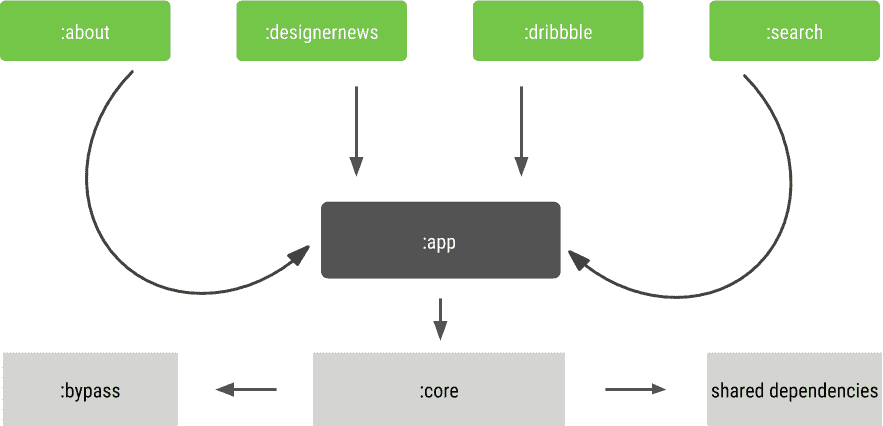
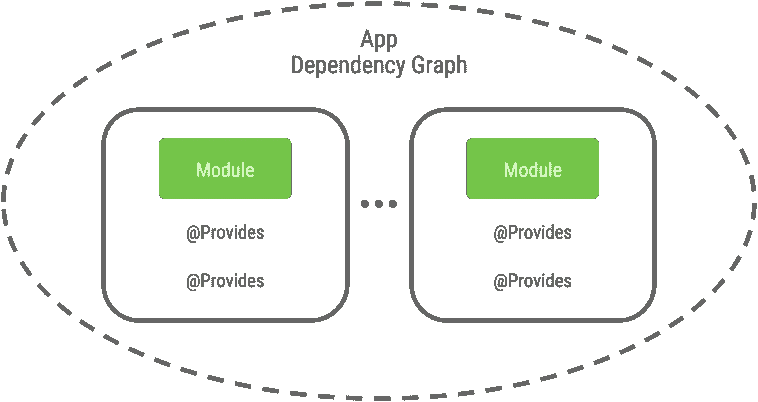
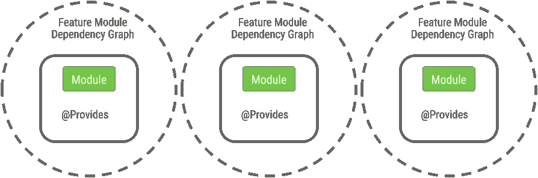
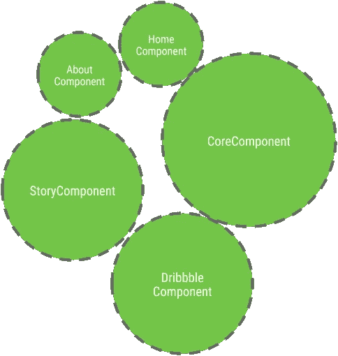
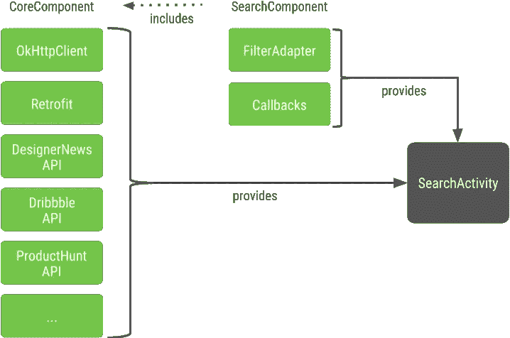

# 多模块项目中的依赖注入

> 原文：<https://medium.com/androiddevelopers/dependency-injection-in-a-multi-module-project-1a09511c14b7?source=collection_archive---------2----------------------->

## 将阿迪框架引入格子花呢的启示


Illustrated by [Virginia Poltrack](https://twitter.com/vpoltrack)

这不是一篇关于依赖注入的文章，也不是一篇关于为什么我们选择库 X 而不是库 y 的文章。

# 我们的设置

在之前的一篇文章中，我写了关于格子花呢整体模块化的故事。

[](/androiddevelopers/a-patchwork-plaid-monolith-to-modularized-app-60235d9f212e) [## 拼布格子——从整体到模块化应用

### 我们如何和为什么模块化格子布和未来

medium.com](/androiddevelopers/a-patchwork-plaid-monolith-to-modularized-app-60235d9f212e) 

让我快速回顾一下从鸟瞰角度看格子花呢的样子。

我们有一个`app`模块，它包含主要的启动器活动。还有几个动态特征模块(DFM)依赖于`app`模块。每个 DFM 包含至少一个仅与所讨论的特性相关的活动、代码和资源。

`app`模块依赖于`core`模块，后者包含共享代码和资源以及第三方库。



Plaid’s module dependency graph

在我们开始模块化并引入 Dagger 作为依赖注入的主要参与者之前，Plaid 的代码有几个类和函数，如下所示:

```
class DesignerNewsInjector { fun providesApi(...): DesignerNewsService { ... }}
```

虽然这是一个完美的解决方案，但是我们不得不手工编写大量的样板文件和管道代码。

无论注射器需要什么，我们都必须在正确的点调用底层函数，在许多情况下要么是对象初始化，要么是`onCreate`。

# 非常简短的依赖注入介绍

依赖注入基本上意味着你不在你需要的地方创建对象，而是在别的地方创建。然后，对这些对象的引用可以传递到需要它们的类中。

这既可以手动完成，也可以通过许多库中的一个来完成。我们选择了匕首 2。多亏了 Dagger，我们所要做的就是获得一个可以使用的初始化服务:

```
@Inject lateinit var service: DesignerNewsService
```

服务的所有依赖项都可以作为参数传递给 provides 函数。为我们的依赖注入需求选择 Dagger 意味着我们的依赖图是在编译时创建的。在接下来的章节中，请记住这一点。

# 我们将匕首引入格子的方法

当我们决定将 Dagger 引入 grid 时，我们已经学到了一个宝贵的经验，这对于模块化来说尤其如此。

> 不要试图一次涵盖太多内容。

这意味着花一些时间来计算实现一个新特性所需的最小范围是值得的。然后我们在团队内部讨论这个 MVP，看看我们是否在朝着正确的方向前进。坚持这种做法可以防止我们因为太大而无法有效地工作。这也允许我们在其他人继续工作的同时，在我们的代码库中逐步推出变更。

在 Plaid 中，我们使用已经被证实的`about`功能模块作为 Dagger 的游戏场。在这里，我们可以添加 Dagger，而不会干扰其他模块或工作负载。你可以在这里找到[初始提交](https://github.com/nickbutcher/plaid/commit/9310b6d4f100adff4e639456f58ac802b57d4b39)。

# 依赖图

当将依赖注入库引入到一个单一的应用程序中时，通常整个应用程序只有一个单一的依赖图。



Classic simplified dependency graph in a monolithic project

这使得组件之间能够共享依赖关系。在一些库中，为了避免冲突或者为注入目标提供特定的实现，可以限定依赖关系的范围。

# 模块异常

对于模块化的应用程序，尤其是使用动态功能模块的应用程序，这是行不通的。让我们仔细看看应用程序和动态特性模块是如何相互依赖的。动态特征模块知道应用模块的存在。应用程序模块知道动态特性模块的存在，但是不能直接从该模块中执行代码。对于依赖注入，这意味着图必须被分成几部分。

对于模块化的应用程序，简化的依赖图通常看起来像这样。



Modules have clear boundaries and are encapsulated within a DFM’s dependency graph

更具体地说，格子里的组成部分是这样的。



Plaid’s component landscape

每个 DFM 都有自己的组件，以其所在的功能模块命名。通过`HomeComponent`的`app`模块也是如此。

还有一个包含共享依赖项的组件。它位于`core`内，被称为`CoreComponent`。`CoreComponent`背后的主要思想是提供可以在整个应用程序中使用的对象。它结合了位于`core`库中的几个 Dagger 模块，可以在整个应用程序中重用。

此外，因为图是有向的，所以只有一种方法可以共享 Dagger 组件:
DFM 可以从应用程序模块访问 Dagger 组件。应用程序模块可以从它所依赖的库中访问组件。但不是反过来。

# 跨模块边界共享组件

为了共享 Dagger 组件，需要使它们在整个应用程序中都是可访问的。在 Plaid 中，我们决定通过 Application 类访问我们的`CoreComponent`。

```
class PlaidApplication : Application() { private val coreComponent: CoreComponent by lazy {
    DaggerCoreComponent
      .builder()
      .markdownModule(MarkdownModule(resources.displayMetrics))
      .build()
  } companion object { @JvmStatic fun coreComponent(context: Context) =
      (context.applicationContext as PlaidApplication).coreComponent
  }
}
```

实例化的核心组件现在可以通过调用`PlaidApplication.coreComponent(context)`从应用程序中任何有可用上下文的地方访问。

使用一个扩展函数使得对它的访问更加甜蜜:

```
fun Activity.coreComponent() = PlaidApplication.coreComponent(this)
```

# 组件中的组件

要将`CoreComponent`合并到另一个组件中，有必要在创建组件时提供它。让我们看看这在`[SearchComponent](https://github.com/nickbutcher/plaid/blob/master/search/src/main/java/io/plaidapp/search/dagger/SearchComponent.kt)`中是如何工作的:

```
@Component(modules = [...], dependencies = [CoreComponent::class])
interface SearchComponent { @Component.Builder
  interface Builder { fun coreComponent(coreComponent: CoreComponent): Builder
    // modules
  }
}
```

在生成的`DaggerSearchComponent`初始化期间，我们这样设置`CoreComponent`:

```
DaggerSearchComponent.builder()
  .coreComponent(activity.coreComponent())
  // modules
  .build()
.inject(activity)
```

这里的技巧是将`CoreComponent`设置为`SearchComponent`的依赖项。

```
@Component(
    modules = [SearchModule::class],
    dependencies = [CoreComponent::class]
)
interface SearchComponent : BaseActivityComponent<SearchActivity>
```

`CoreComponent`是`SearchComponent`的依赖。当`CoreComponent`像上面一样作为`SearchComponent`的组件依赖被包含时，所有的`CoreComponent’s`方法都可以在`SearchComponent`或其他 Dagger 组件中使用，就像它们是`@Provides`方法一样。



Component dependencies with their respective modules (in green) providing implementations to SearchActivity

这种方法的一个好处是`@Modules`不必在整个特性图中重复，而是可以通过`CoreComponent`或其绑定的模块透明地提供。

例如，`CoreDataModule`被绑定在`CoreComponent`中，并在其中提供`Retrofit`。现在可以在任何包含了`CoreComponent`的组件中访问这个`Retrofit`实例。

# 下一步是什么

读完这篇文章后，你会发现模块化你的应用程序也必须考虑依赖注入。引入的特征模块边界通过分离的依赖图反映在 DI 中。了解这些限制有助于为共享组件找到合适的位置。

您可以深入代码，看看我们是如何使用 Dagger in Plaid 解决依赖注入的。

`[CoreComponent](https://github.com/nickbutcher/plaid/blob/master/core/src/main/java/io/plaidapp/core/dagger/CoreComponent.kt)`是一个很好的起点，`[AboutComponent](https://github.com/nickbutcher/plaid/blob/master/about/src/main/java/io/plaidapp/about/dagger/AboutComponent.kt)`也是，因为它没有太多的外部依赖性。