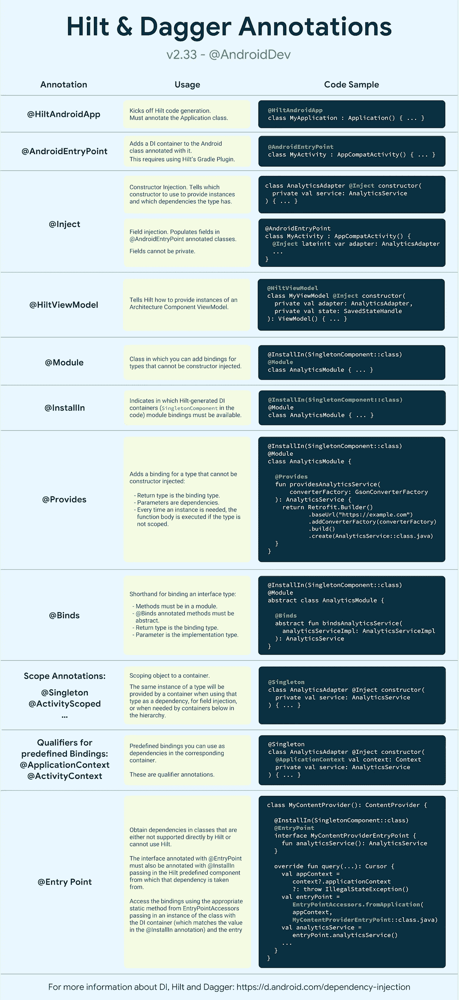

# 基于 Hilt 的 Android 依赖注入

> 原文：<https://medium.com/androiddevelopers/dependency-injection-on-android-with-hilt-67b6031e62d?source=collection_archive---------0----------------------->


Illustration by [Virginia Poltrack](https://twitter.com/VPoltrack)

## Jetpack 为 DI 推荐的库

依赖注入(Dependency injection)(DI)是一种广泛应用于编程的技术，非常适合 Android 开发，依赖被提供给一个类，而不是自己创建。通过遵循 DI 原则，您为良好的应用程序架构、更高的代码可重用性和易于测试奠定了基础。你有没有在你的 app 里尝试过手动依赖注入？即使现在有许多现有的依赖注入库，随着项目变得越来越大，它也需要大量的样板代码，因为您必须手工构造每个类及其依赖项，并创建容器来重用和管理依赖项。

> **通过遵循 DI 原则，你为良好的应用架构、更高的代码可重用性和测试的简易性打下了基础**。

新的[柄](https://developer.android.com/training/dependency-injection/hilt-android)库定义了一种**标准方式**来在你的应用中进行 DI，为你的项目中的每个 Android 类提供容器，并为你自动管理它们的生命周期*。*

*Hilt 构建在流行的 DI 库 [Dagger](https://developer.android.com/training/dependency-injection/dagger-basics) 之上，因此受益于 Dagger 提供的**编译时正确性、运行时性能、可伸缩性以及** [**Android Studio 支持**](/androiddevelopers/dagger-navigation-support-in-android-studio-49aa5d149ec9) 。正因为如此，Dagger 在谷歌 Play 商店排名前 10k 的应用中有 30%被广泛采用。但是，由于编译时代码的生成，预计构建时间会增加。*

*由于许多 Android 框架类是由操作系统自己实例化的，所以在 Android 应用程序中使用 Dagger 时会有一个相关的样板文件。与 Dagger 不同，Hilt 与 Jetpack 库和 Android 框架类集成在一起，并删除了大部分样板文件，让您**只关注定义和注入绑定的重要部分**，而不必担心管理 Dagger 的所有设置和连接。它自动生成并提供:*

*   *用于集成 Android 框架类和 Dagger 的组件，否则你将需要手工创建。*
*   ***范围标注**为 Hilt 自动生成的组件。*
*   ***预定义的绑定和限定符**。*

*最棒的是，**匕首和剑柄可以共存，应用程序可以按需迁移**。*

# *剑柄在行动*

*为了向您展示使用 Hilt 有多简单，让我们在一个典型的 Android 应用程序中执行一些快速 DI。让 Hilt 给我们的`MainActivity`注入一个`AnalyticsAdapter`。*

*首先，通过用`@HiltAndroidApp`注释你的应用程序类来触发 Hilt 的代码生成，在你的应用程序中启用 Hilt:*

```
***@HiltAndroidApp**
class MyApplication : Application() { ... }*
```

*其次，告诉 Hilt 如何通过用`@Inject`注释构造函数来提供`AnalyticsAdapter`的实例:*

```
*class AnalyticsAdapter **@Inject** constructor() { ... }*
```

*第三，为了将`AnalyticsAdapter`的实例注入到`MainActivity`中，使用`@AndroidEntryPoint`注释启用活动中的 Hilt，并使用`@Inject`注释执行字段注入:*

```
***@AndroidEntryPoint**
class MainActivity : AppCompatActivity() { **@Inject** lateinit var analytics: AnalyticsAdapter override fun onCreate(savedInstanceState: Bundle?) {
    super.onCreate(savedInstanceState) // analytics instance has been populated by Hilt
    // and it's ready to be used
  }
}*
```

*要了解更多信息，您可以在下面的备忘单部分轻松查看新注释的功能。*

# *附带 Jetpack 支持！*

*你可以使用你最喜欢的 Jetpack 库。到目前为止，我们为 ViewModel、WorkManager、Navigation 和 Compose 提供了直接注入**支持。***

*例如，要将一个[架构组件视图模型](https://developer.android.com/topic/libraries/architecture/viewmodel) `LoginViewModel`注入到一个`LoginActivity`中:用`@HiltViewModel`注释`LoginViewModel`，用`@Inject`注释构造函数，并在`@AndroidEntryPoint`活动或片段中使用它，如您所料:*

```
***@HiltViewModel**
class LoginViewModel **@Inject** constructor(
  private val analyticsAdapter: AnalyticsAdapter
): ViewModel { ... }**@AndroidEntryPoint** class LoginActivity : AppCompatActivity() { private val loginViewModel: LoginViewModel **by viewModels()** override fun onCreate(savedInstanceState: Bundle?) {
    super.onCreate(savedInstanceState)
    // loginViewModel is ready to be used
  }
}*
```

*在[文档](https://developer.android.com/training/dependency-injection/hilt-jetpack)中了解更多关于 Jetpack 支持的信息。*

# *开始使用刀柄*

*如果你对 Hilt 感兴趣并想了解更多，这里有一些资源供你以自己喜欢的方式学习:*

## *Hilt 入门*

*通过这个[指南](https://developer.android.com/training/dependency-injection/hilt-android#setup)，学习如何在你的 Android 应用程序中添加 Hilt。*

## *证明文件*

*如果你是 DI 或 Dagger 新手，看看我们的[指南，为 Android 应用](https://developer.android.com/training/dependency-injection/hilt-android)添加刀柄。或者，如果你已经知道 Dagger，我们也在 dagger.dev 上提供[文档。](https://dagger.dev/hilt)*

*如果你只是对新的注释和你能用 Hilt 做什么感到好奇，看看下面部分的备忘单。*

## *对于匕首使用者来说*

*如果你已经在你的应用程序中使用 Dagger 或 dagger.android，看看这个[迁移指南](https://dagger.dev/hilt/migration-guide)或下面提到的 codelab 来帮助你切换到 Hilt。因为 Dagger 和 Hilt 可以共存，所以你可以增量地迁移你的应用。*

## *Codelabs*

*为了循序渐进地学习 Hilt，我们刚刚发布了两个代码实验室:*

*   *[在你的安卓应用中使用 Hilt](https://codelabs.developers.google.com/codelabs/android-hilt)*
*   *[从匕首转移到刀柄](https://codelabs.developers.google.com/codelabs/android-dagger-to-hilt)*

## *示例代码*

*想看看现有的 app 是如何使用 Hilt 的吗？去谷歌 I/O 2020 应用程序和 Android [架构的](https://github.com/android/architecture-samples/tree/dev-hilt)`[dev-hilt](https://github.com/android/architecture-samples/tree/dev-hilt)`分支——示例 Github 库检查它的用法。*

# *小抄*

*这个备忘单可以让你快速看到*不同的刀柄和匕首注释做什么，以及*如何使用它们。***

***[**下载 PDF 格式备忘单**](https://developer.android.com/images/training/dependency-injection/hilt-annotations.pdf)***

******

***Hilt and Dagger annotations cheat sheet. [Download in PDF here](https://developer.android.com/images/training/dependency-injection/hilt-annotations.pdf).***