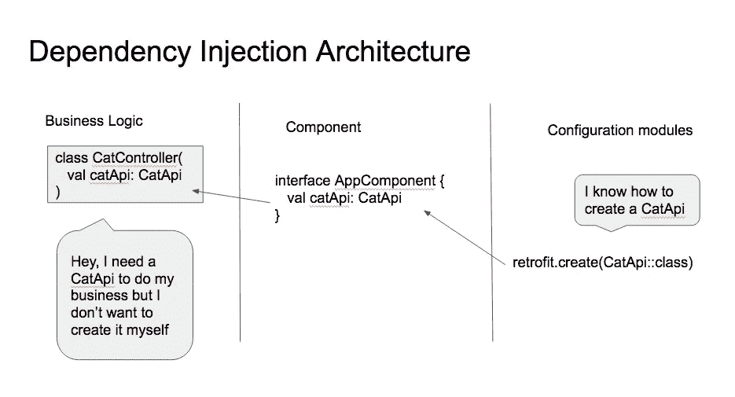
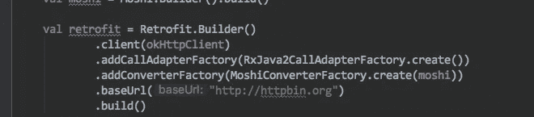
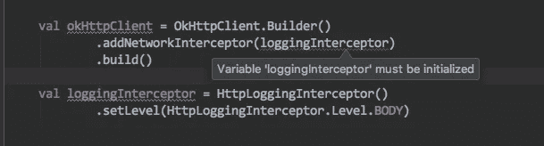

# 依赖注入:没有框架的模式

> 原文：<https://blog.kotlin-academy.com/dependency-injection-the-pattern-without-the-framework-33cfa9d5f312?source=collection_archive---------0----------------------->

## 其实挺好的！

> 依赖注入是一种模式，而不是任何特定的框架。你甚至可以手动实现它，但是那太麻烦了。
> 
> **等等..为什么？我们怎么知道的？**

*更新:增加了一段关于依赖注入(一个我一直使用的术语)和服务定位器(我通常更喜欢的替代模式)之间的区别。*

依赖注入是 Android 世界的一个大话题。忽略它，你很快就会感受到痛苦的体验，你所有的代码都与 android 框架紧密相连，你不能真正以一种有意义和实际有用的方式测试你的应用。

Dagger 是一个依赖注入框架，最初来自 Square，后来被 Google 重新混合，是 android 世界的大框架(尽管不限于它)。本文假设读者熟悉 dagger。

关于这个主题的好资源包括杰克·沃顿的一个演讲，一个片段播客，还有一个缺失的指南:如何使用匕首。我将借用后一篇文章中的例子，因为我发现它很实用而且切中要害。

关于这个话题的讨论通常的共同点是，他们坚持依赖注入是一种通用的编程模式，而不是任何特定的框架。你可以自己做 DI……嗯，除了你不做，因为那根本不实际。

我想知道:真的是这样吗？我想我会试一试，好奇看看在哪个点上我会碰壁。

那没有发生。

想看看如何用几个约定、一些技巧和普通的语言结构进行依赖注入吗？

让我们开始吧。

Business Logic / Component / Configuration modules

我们将保留 dagger 的基本架构，如上面的模式所述。

因为我们有相似的架构，我们将通过展示如何从 dagger 迁移来开始探索。

假设我们已经正确设置了 dagger 配置模块。Dagger 可以为我们提供 AppComponent 的实现，这是我们目前所关心的。这允许我们直接处理业务逻辑。但是首先，我们将重构组件。

**注意** : *如果您想尝试上面的代码片段，而不必为此配置完整的 android 项目，请使用下面定义了所需类型的代码片段*[https://gist . github . com/jmfayard/5313 e 2 fa 8 AFD BBA 84 bb 94 ea 5a 0a 52792](https://gist.github.com/jmfayard/5313e2fa8afdbba84bb94ea5a0a52792)

# 出发点

[https://gist.github.com/jmfayard/9378a7ed21f61c40424442aa98732905](https://gist.github.com/jmfayard/9378a7ed21f61c40424442aa98732905)

我们从一个标准的 dagger 项目开始，除了我通过一个顶级函数使组件易于访问。稍后将解释这个惯例，现在请耐心听我说。

`fun app(): AppComponent = ...`

# 构造函数注入，而不是字段注入

[https://gist.github.com/jmfayard/1ff428054248d3c2777f78f07da4dec3](https://gist.github.com/jmfayard/1ff428054248d3c2777f78f07da4dec3)

在这一点上，你可以做两种类型的 DI。我坚定地站在偏爱构造函数注入的一边。我心目中的 Fields injection 与 Israel Ferrer Camacho 所说的“**墨西哥卷饼设计模式**”玩得太好了，在那里你在属于框架的上帝对象中放了太多东西。**构造函数注入**干净简单。

# 属性的组成部分

在我们继续讨论业务逻辑之前，我们将应用一个重要的技巧:**在组件接口**中使用 getter 方法内部的属性！

IntelliJ/Android Studio 正好有合适的重构工具:`convert function to property`让我们把它应用到每一个 getter 方法上。

[https://gist.github.com/jmfayard/e609e0c8c329b1ee19fab261de708c78](https://gist.github.com/jmfayard/e609e0c8c329b1ee19fab261de708c78)

这里发生了什么？对我们来说，它会很重要，但从匕首的角度来看 *:* *几乎没什么*。它将您的 **val** **属性**视为有效的 getter 方法。再次编译该项目，它将继续像魔法一样工作。

# 业务逻辑:构造函数注入+默认值

所以我们有一个可以注入的属性列表。下面是我们通常如何在代码生成的 dagger 方法中使用它们:

[https://gist.github.com/jmfayard/f1384464039b35e714fea72d750fb1d1](https://gist.github.com/jmfayard/f1384464039b35e714fea72d750fb1d1)

所以我们在构造函数中传递属性，用`inject`注释标记它，在组件中添加一个新的 getter 方法(或者实际上，一个属性)。为了获得 CatController，我们要求组件提供它。

不依靠匕首能达到同样的效果吗？

是的，我们可以用一个简单的模式:我们像以前一样在构造函数中声明所需的属性，然后我们声明一个来自组件的相同属性的默认值。

[https://gist.github.com/jmfayard/184f7389ec851d6b448789ca9fd91fdb](https://gist.github.com/jmfayard/184f7389ec851d6b448789ca9fd91fdb)

几个月来，我一直在使用这种方法，并与 dagger 一起构建 AppComponent 本身，它有许多我喜欢的地方:

*   用法方面非常简单。这只是对构造函数的一个标准调用，按照惯例，不要为可选参数传递任何值。
*   您不必向组件添加新属性
*   您有两种可能性来启用测试:或者您通过创建一个实现 AppComponent 的`TestComponent`来全局地改变依赖图
*   …或者你直接在构造函数中通过任何你需要的测试。
*   注意你如何混合自由注入的字段(`catService`)和普通的构造函数参数(`catId`)
*   注入两种不同类型的属性是很容易的事(`mainThread` 对`backgroundThread`)。不需要使用类似`Named`的附加注释
*   因为我们使用的是简单的语言结构，而不是一些额外的语言注释处理魔术，你的 IDE(a)可以用它通常帮助你的所有方式来帮助你:自动完成，跳转到`app()`的定义，查看一个属性的每个实现，…

另一方面，你将不得不输入比我们所依赖的`Inject`更多的字符。我很喜欢这种样板文件，它可以使事情变得清晰，并且可以很好地自动完成，所以对我来说这是一个有效的权衡。

这个模式我用了几个月，不会回头。

# 概述

下面是我们的依赖注入的三个部分与 dagger 的比较

*   我们保留了 dagger 的`Component`抽象，做了一些小而重要的调整:我们使用构造函数注入、kotlin 属性和一个顶级函数来轻松访问它。
*   在业务逻辑中，我们为构造函数注入部分制定了自己的约定
*   我们有 dagger 实现了`Component`接口。

此时，dagger 只是一个实现细节。它实现了组件接口，并且做得很好。但是我们也可以直接实现组件接口。

当我们开始一个新项目时，有很强的理由这样做。

# 从零到一

如果我不是从一个已经使用 dagger 的项目开始，而是从一个全新的项目开始，会怎么样？

我曾经有过这样的经历:写了一个应用程序，然后发现已经太晚了，以至于不能用一种有意义的方式来测试它。再也不会了！我想从第一天开始就进行依赖注入。另一方面，dagger 最初的设置很痛苦。如果我们可以稍后设置 dagger，但仍然使用依赖注入，会怎么样？

假设我们正在构建网络部分。最自然的开始方式就是这样

[https://gist.github.com/jmfayard/40b44ba26850d03986e5b56efe31c98f](https://gist.github.com/jmfayard/40b44ba26850d03986e5b56efe31c98f)

接下来我们只需要让我们的接口`ApiComponent`有用。让我们使用重构工具`Pull Members Up`。
此外，像以前一样，我们通过顶级函数使组件可访问。

[https://gist.github.com/jmfayard/b65b999a7729664365a11858e603c7eb](https://gist.github.com/jmfayard/b65b999a7729664365a11858e603c7eb)

IDE 完成了这里几乎所有的工作！懒惰，这是我非常喜欢的事情。我们已经准备好编写可测试的产品代码。

# 科特林地产

第一次成功之后，让我们深入探讨一下。用纯 kotlin 语言复制 dagger 的代码生成所做的聪明工作有多难？答案是科特林的属性非常强大

Singleton Provides fun retrofit(okHttpClient: OkHttpClient, moshi: Moshi)

这就是我们在 ApiModule 示例中提供翻新的方式。这里实际上发生了很多事情。用 dagger 的话来说，我们的 ApiModule 是一个 *ObjectGraph* ，它是*基于其他提供`Moshi`和`OkHttpClient`的方法为*提供类型改进。编译器和 IDE 努力确保我们没有空指针异常，并且不会打乱我们初始化属性的顺序。

the compiler working hard for us

有了 kotlin 属性，正如 Perl 的一句格言所说，*简单的事情很容易，复杂的事情也有可能。*

在这一点上，我们陷入了第一世界的问题:我们应该使用 dagger 来实现组件还是自己实现它？

对于这个问题，我的答案是明确的:是的

两种方法都有效。根据上下文，我们可以选择不同的权衡。如果团队很了解 dagger，dagger 没问题。如果团队很了解科特林，直接的方法是没问题的。而且，这是一次很好的学习经历。

我愉快地使用 dagger 几个月了。最近我转而直接实现它。转行不难。相同的概念，相同的有向无环依赖图，只是语法不同。

对我来说，转折点是我将我的应用程序模块化，并且能够将除 dagger 之外的所有代码生成工具归入更小的模块。从主模块中移除`kapt`是一个巨大的胜利，因为它拥有可靠快速的增量构建、构建缓存、网络缓存……以及卓越的 IDE 集成。

# 额外收获:java 呢？

有一个不是 100%科特林的项目？没问题，依赖默认参数的方法也可以。只需声明两个构造函数，一个包含所有依赖项，另一个传递组件。

[https://gist.github.com/jmfayard/8b79752a3b93a1e164ee3a98a88035d3](https://gist.github.com/jmfayard/8b79752a3b93a1e164ee3a98a88035d3)

# 额外收获:走向多模块

正如我所说的，我正在把我的应用程序分成多个更小的模块。事实证明，使用这种模式非常简单。

函数`fun app(): AppComponent`之所以这么叫是因为它提供了`:app` gradle 模块需要注入的属性。

如果我们有多个像`:app, :common`这样的模块，我们只需要重复这个模式:

[https://gist.github.com/jmfayard/e982331d4a8dbb8d122f424260c5e601](https://gist.github.com/jmfayard/e982331d4a8dbb8d122f424260c5e601)

# 奖励:注入活动/片段

到目前为止，我一直假设我处理的是普通的类，其中可以使用构造函数注入。但是属于框架的活动和片段呢？我们通常至少有(通常应该最多有)0 个片段和 1 个活动。

实际上有很多不同的方法来模拟磁场注入，您可能会发现这些方法很有用

[https://gist.github.com/jmfayard/eaf1c45b6b048b9eb51ece527192d7d1](https://gist.github.com/jmfayard/eaf1c45b6b048b9eb51ece527192d7d1)

# 结论

如果没有别的，尝试手工依赖注入将会是一次很好的学习经历。我第一次将 dagger 集成到我的应用程序中时，感觉势不可挡。同时掌握概念和语法是很难的。我发现深入研究核心依赖注入模式非常有帮助，尽管它非常有用，但实际上很简单。一旦你得到了模式并写下了依赖关系图，设置 dagger 只是一个语法问题。

在玩了几个月的手动 DI 之后，我可以自信地说，在许多情况下，它实际上是一个很好的选择。

当你开始一个新项目并希望尽快拥有 DI 时，这是一种优越的体验。一旦你习惯了，事情就简单了。编写体验是优越的，因为您习惯的所有 IDE 集成在这里也能工作，您不需要依赖语言范围之外的特性。它与构建缓存配合得很好。这对我的构建时间来说是一件好事，因为代码生成现在被限制在更小的模块中。

同样，最后，我们使用的概念实际上是有意地与 dagger 的概念相差不远。如果在项目生命的某个时刻，使用高效成熟的 dagger 框架更有意义，那么切换并不难。只是语法不同。

# 更新(27.02):依赖注入与服务定位器

在本文中，我一直不严格地使用依赖注入这个术语。

敏锐的读者指出，我所描述的正确术语是**服务定位器**。这是因为我的类像 *CatController* 是*从外部*(在我的例子中是通过默认参数)找到它们的依赖关系。

为了实现依赖注入，我必须做的最少的改变就是下面的这个改变，在这个改变中，对定位器本身的依赖被移除了。从这个人为的例子中，人们可以开始看到权衡。CatController 现在对外界一无所知。另一方面，组件变得更大。它有一个递归的方面。仅仅*使用*一个注入属性的一切可能都应该由组件(DI 框架)产生，并以一种巧妙的方式确定范围(我们的“范围”仅限于:交付一个单例或新实例)

[https://gist.github.com/jmfayard/bfba725b36d99599ceeb0a9ee315114d](https://gist.github.com/jmfayard/bfba725b36d99599ceeb0a9ee315114d)

我以前听说过这种区别，但不太明白为什么它很重要，或者我是否应该在乎。

在与敏锐的读者讨论之前，我有一个不清楚的前概念，即服务定位器模式比依赖注入模式差一些。事实上它很相似，只是有不同的穿线。Martin Fowler 自己对此的看法是*依赖注入和服务定位器之间的选择没有配置和使用分离的原则重要。*

> 基本的选择是在服务定位器和依赖注入之间。第一点是，这两种实现都提供了简单示例中所缺少的基本解耦——在这两种情况下，应用程序代码都独立于服务接口的具体实现。这两种模式的重要区别在于如何将实现提供给应用程序类。使用服务定位器，应用程序类通过给定位器发送消息来明确地请求它。对于注入，没有明确的请求，服务出现在应用程序类中——因此出现了控制反转。
> 
> 控制反转是框架的一个常见特征，但这是有代价的。当你试着调试时，它往往很难理解并导致问题。所以总的来说，除非我需要，否则我宁愿避免它。这并不是说这是一件坏事，只是我认为它需要证明自己比更直接的选择。
> 
> 关键区别在于，使用服务定位器，服务的每个用户都依赖于定位器。定位器可以隐藏对其他实现的依赖，但是您确实需要看到定位器。所以定位器和注入器之间的决定取决于这种依赖是否是一个问题(…)
> 
> **控制容器的倒置和依赖注入模式**
> 
> https://martinfowler.com/articles/injection.html

退一步说，我在寻找什么？我想把我的应用的核心从它的边界(网络、共享偏好、数据库、android 框架调用等等)中分离出来。我想通过用假的服务实现替换真实的服务实现来支持测试。我想用一种类型安全的方式来做这件事。

正确实现的服务定位器模式正好提供了这一点。它更简单，因为它仍然感觉像普通代码。另一方面，DI 模式提供了比我真正需要的更多的东西。我能感受到它的美丽，以及它在某些情况下的强大，但这是有代价的。所以我最终意识到，我通常更喜欢简单的服务定位器。

# 链接

 [## 缺失的指南:如何使用 Dagger2

### Dagger 是一个依赖注入框架，它使得管理我们的类之间的依赖关系变得更加容易。

medium.com](https://medium.com/@Zhuinden/that-missing-guide-how-to-use-dagger2-ef116fbea97)  [## 属性和字段:Getters、Setters、const、lateinit - Kotlin 编程语言

### 最常见的属性是简单地从后台字段中读取(或者写入)。另一方面，随着…

kotlinlang.org](https://kotlinlang.org/docs/reference/properties.html)  [## 委托属性- Kotlin 编程语言

### 一个常见的用例是在地图中存储属性值。这在解析 JSON 等应用程序中经常出现…

kotlinlang.org](https://kotlinlang.org/docs/reference/delegated-properties.html)  [## 科特林程序员词典:字段与属性

### 这是一个 Java 字段的示例:

blog.kotlin-academy.com](/kotlin-programmer-dictionary-field-vs-property-30ab7ef70531)  [## 控制容器的倒置和依赖注入模式

### 在 Java 社区中，出现了大量的轻量级容器，它们有助于从不同的…

martinfowler.com](https://martinfowler.com/articles/injection.html) 

喜欢的话记得**拍**。注意，如果你按住鼓掌按钮，你可以留下更多的掌声！

了解卡帕头最新的重大新闻。学院、[订阅时事通讯](https://kotlin-academy.us17.list-manage.com/subscribe?u=5d3a48e1893758cb5be5c2919&id=d2ba84960a)、[观察 Twitter](https://twitter.com/ktdotacademy) 并在 medium 上关注我们。

