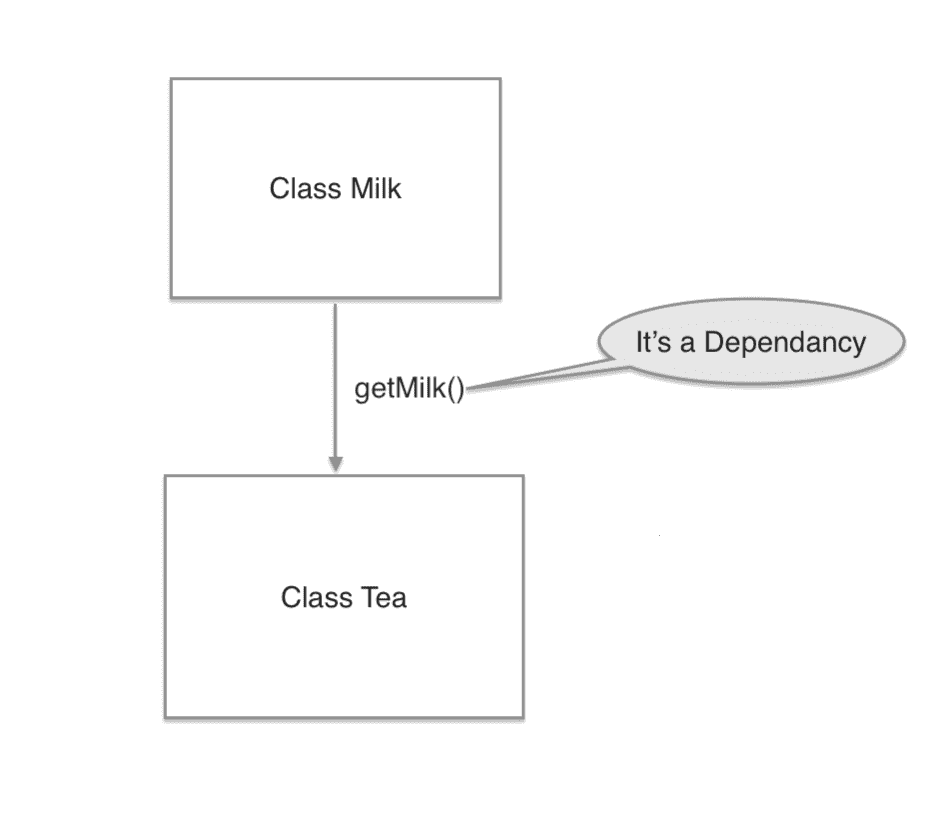
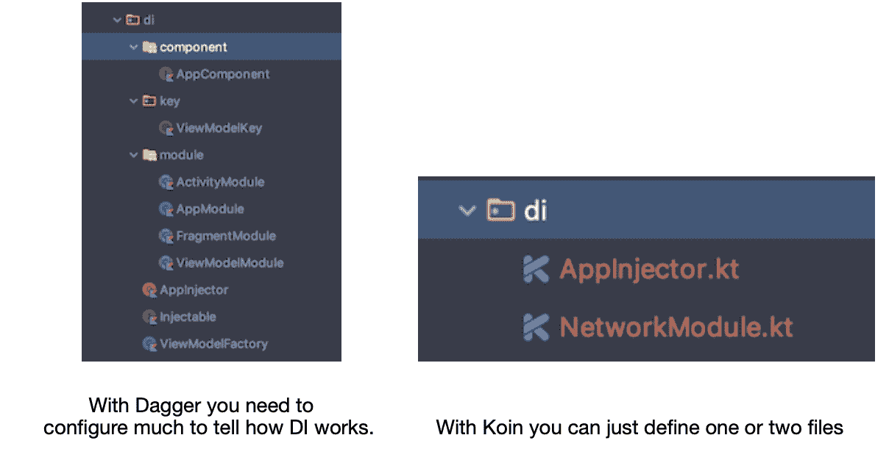
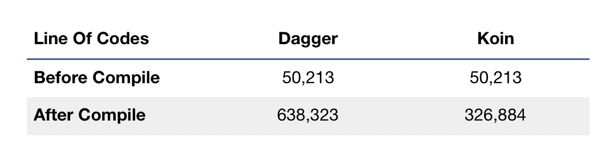
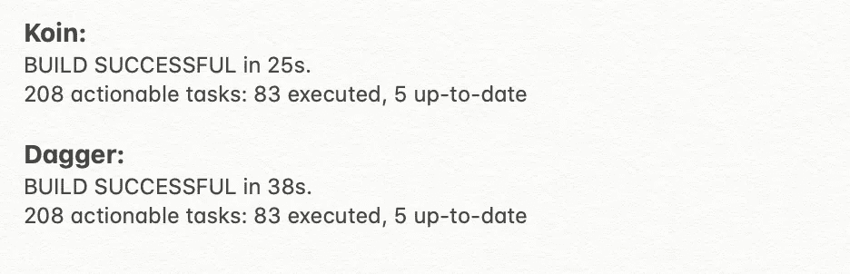
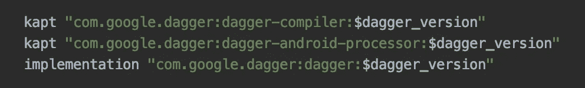
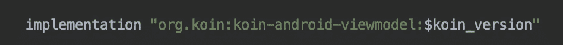
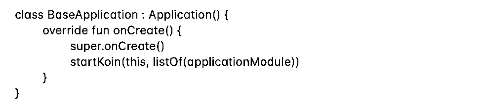
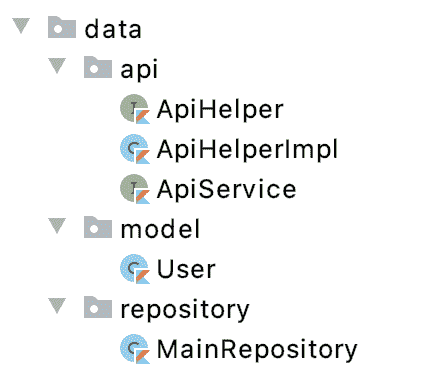
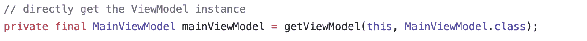

# 使用 KOIN 的依赖注入

> 原文：<https://medium.com/globant/dependency-injection-with-koin-81f92e015ac6?source=collection_archive---------0----------------------->

**什么是依赖注入(DI)？**

假设，我们必须为 MakeTea 编写一个类。为此，我们将必须需要 3 类:牛奶，茶粉，糖

为了在 Tea 类中准备茶，我们需要创建一个 Milk 类的实例来访问 getMilk()方法。因此，奶茶依赖于牛奶。

将依赖关系传递给对象有两个主要选项:

*   通过构造函数的对象。
*   使用阿迪框架

**为什么是迪？**

我们知道软件开发的坚实原则。

DI 具有单一责任原则和从属倒置

**单一责任原则** = *一个班应该做且只能做一项工作。*

**依赖倒置原则** = *实体必须依赖抽象而不是具体化。您可以使用抽象，而不是使用从高级到低级模块的引用。*

**什么是 KOIN？**

*   *轻量级依赖注入*
*   *用纯科特林语写的*
*   *无代理*
*   *没有代码生成*
*   *没有反映！*
*   *没大力气学*

Koin 比其他 DI 框架更加简洁和直接。它非常适合封装的特性/库模块。

**为什么是锦鲤而不是匕首？**

**1。DI 的配置:**

Dagger 配置需要写更多的文件。《出埃及记》我正在使用 MVVM 建筑改造和现场数据。项目有活动、片段、视图模型、存储库和 web 服务接口。

**2。代码行:**

**3。构建时间:**

项目越大，时间变得越贵！

**4。设置**

《出埃及记》在模块梯度中，

匕首:需要添加 3 个依赖项

KOIN:一行就够了

**5。简单易学:**

对于项目中的新细木工来说容易理解。不需要像匕首一样花很多时间在学习上。

**关键词/功能:**

*   **startKoin** :用于创建和注册一个 KoinApplication 实例。也开始在应用程序上执行 Koin。
*   **模块**:用于声明 startKoin 内部的模块。也可以将所有的 Koin 模块作为参数传递。
*   **androidContext** :用于注入 Android 上下文。通过将应用程序上下文作为参数传递，可以在 startKoin 中声明它。
*   **by inject()** :这允许我们检索实例
*   **get()** :这个函数允许我们检索一个实例(非懒惰)。通常，在构造函数中使用它来提供必要的组件实例。
*   **koinComponent** :用相同的标签标记类，以访问 koin 函数
*   **name =** :这是用来命名定义的。当您希望同一类有多个不同类型的实例时，请使用。

**瞄准镜**

*   **single** :总是为请求者提供依赖对象的相同副本
*   工厂:总是为请求者提供一个新的依赖对象副本
*   **作用域**:创建对象的内联函数，这些对象持续到相关的作用域生存期。

# Kotlin 项目中 Koin 的步骤:

**第一步:** **声明一个模块**

首先，定义注入实体。

**第二步:** **启动 Koin**

要启动 DI 流程

**第三步:** **注射**

# **我们开始吧！**

让我们看看如何在这个例子中引入一个锦鲤。

**1。在 Build.gradle 中添加依赖关系**

*//koin*

实现" org . koin:koin-Android-viewmodel:{最新版本} "

实现" org . koin:koin-Android:{最新版本} "

**2。创建应用程序类**

类应用程序:应用程序()

更新清单

android:name= "。应用程序"

**3。添加改型和 Kotlin 协同程序的依赖关系**

*//联网*

实现" com.squareup.retrofit2:翻新:{最新版本} "

实现" com . square up . retro fit 2:converter-Moshi:{最新版本} "

实现" com . square up . ok http 3:ok http:{最新版本} "

实现" com.squareup.okhttp3:日志拦截器:{最新版本} "

*//协程*

实现" org . jetbrains . kot linx:kot linx-coroutines-Android:{最新版本} "

实现" org . jetbrains . kot linx:kot linx-coroutines-core:{最新版本} "

**4。现在，我们将在数据层中创建 api、模型、存储库包。它会有类似于**的文件

使用 **getUsers** 函数**为 ApiService、ApiHelper 和 ApiHelperImpl 编写一个接口。**

此外，对于 **BASE_URL** ，您可以使用任何模拟 API 并添加到您的构建配置中

buildConfigField 'String '，' BASE_URL '，" \ " https://5e 510330 F2 c0d 300147 c 034 c . mock API . io/\ "

现在，在主存储库中，我们将使用 APIhelper 方法更新代码

**5。设置 DI**

创建一个包" **di - >模块"。**在其中创建 AppModule、ViewModelModule 和 RepositoryModule。

首先在 AppModule 中，我们将创建希望作为依赖项提供的函数。

该模块是我们将向应用程序提供的依赖关系的集合。

在模块内部，我们可以传递我们创建的所有函数的单个实例。

**6。用 MainRepository()的单个实例更新存储库模块**

若要在模块中提供 ApiHelperImpl.kt，请创建一个实例。

**7。使用 ViewModel 更新 UI**

**8。用 fetchUsers()更新 ViewModel，fetch users()从主存储库实例调用 getUsers()。**

NetworkHelper 看起来像，

创建一个变量“mainViewModel”来传递 ViewModel 的实例。《出埃及记》

**私有**val main viewModel:main viewModel by**viewModel**()

现在，主要的活动看起来像，

主适配器看起来像，

**8。为了运行该应用程序，我们将添加所需的权限，如，**

为了在项目中初始化 Koin，我们将更新应用程序的 onCreate()，

我们完成了这个项目。如果您运行该项目，您将在 recyclerView 中看到该列表。

# 如何配合 ViewModel 使用 KOIN？

可以在*活动*、*片段*和*服务*中使用。

**声明:**

使用`get()`函数在 appModule 中注入依赖项。

## 2 种注射方式:

1.  `by viewModel()` -惰性委托属性，将视图模型注入到属性中

2.`getViewModel()` -获取 ViewModel 实例

你可以从[这里](https://insert-koin.io/docs/reference/koin-android/viewmodel/)更多的参考 ViewModel

# 在模块中不要忘记我！:)

Kotlin 有一个非常好的特性，可以在编译时解析类型。但是，在这种情况下，如果它找不到依赖项，就会触发运行时崩溃。

# 用 KOIN 测试

**设置:**添加依赖关系

**声明一下:**

**使用它:**

这是一个简单的 JUnit 测试文件，并用 KoinTest 对其进行了扩展。然后，我们将能够使用 by inject()操作符。