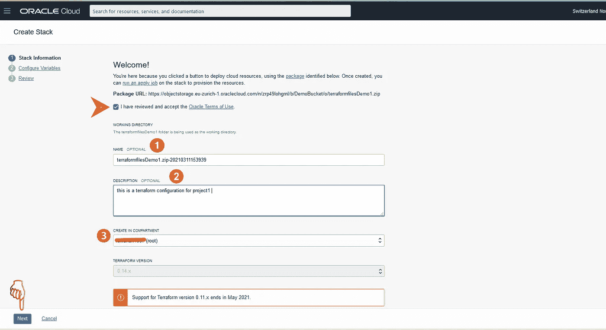

# 通过单击按钮部署 Terraform 配置文件

> 原文：<https://medium.com/oracledevs/deploy-a-terraform-configuration-file-with-a-button-click-3b033d8c0f57?source=collection_archive---------3----------------------->

鉴于目前大多数业务都是远程管理的，并且团队位于不同的位置，Resource Manager 使您能够跨多个团队和平台共享和管理基础架构配置和状态文件。它使用 Terraform 通过“基础设施即代码”模型来安装、配置和管理资源。


[https://unsplash.com/photos/QgoNPoH1v4c](https://unsplash.com/photos/QgoNPoH1v4c)

Terraform 是一款高效、可靠地供应、维护和管理基础设施的工具。Terraform 配置将您打算配置的所需组件以及配置说明和变量编入声明性配置文件中，以运行单个应用程序甚至整个数据中心。

通过在您的存储库页面和其他网页上添加 **Deploy to Oracle Cloud** 按钮，您可以直接选择使用您的 terraform 配置文件包创建堆栈，该文件包存储在受支持的提供商中，并链接到 **Deploy to Oracle Cloud** 按钮。


您可以将 Terraform 配置文件上传到以下受支持的提供商之一:

*   开源代码库
*   GitLab
*   对象存储

使用该链接作为配置文件的源，您只需点击一下，即可为指定的 Terraform 配置文件包创建一个堆栈。


# 例子

我创建了一个包含多个**部署到 Oracle 云**按钮的网页，每个按钮都链接到不同支持提供商的不同 Terraform 配置文件包，这可以帮助远程工作的团队，例如，能够访问 Terraform 配置文件、应用修改、管理或供应云上的基础架构。

让我们看看如何将 terraform 配置文件上传到支持的提供者，并将它们正确地链接到网页上的按钮，然后在云上创建一个堆栈，并运行不同的作业。

> 要跟进此示例，您需要一个有效的 Oracle Cloud 帐户。
> 
> 没有户口？ [**单击此处**](https://www.oracle.com/free/?source=:so:li:or:awr:ocorp:::RC_WWSA210315P00015:RA21001&SC=:so:li:or:awr:ocorp:::RC_WWSA210315P00015:RA21001&pcode=WWSA210315P00015) 立即创建 Oracle 云免费层，并获得 30 天免费试用以及可无限期使用的广泛服务。
> 
> **请记住，除非您明确要求按需付费升级，否则 Oracle Cloud 不会向您收取任何费用。**
> 
> 此外，确保在所选租赁中授予用户有效的权限，以便能够管理堆栈和作业。
> 
> **要了解有关资源管理器** [**使用的资源管理策略的更多信息，请点击此链接！**](https://docs.oracle.com/en-us/iaas/Content/Identity/Tasks/managingstacksandjobs.htm#Policies_for_Managing_Stacks_and_Jobs)


## 步骤 1:显示按钮:

为了在我的页面上显示 **Deploy to Oracle Cloud** 按钮，我添加了以下 HTML 代码:

```
<ahref="https://cloud.oracle.com/resourcemanager/stacks/create?zipUrl=<package URL> " target="_blank"></a>
<p>
```

在这个例子中，我已经使用 GitHub 版本和对象存储上传了我的配置文件。

因此，让我们看看如何在这些受支持的提供商上上传您的文件，并获取文件的 URL。

## 步骤 2:创建 GitHub 发布 URL

在主存储库页面上，选择**创建新版本:**


输入标签版本 *(1)* ，名称 *(2)* ，描述(3)，然后拖拽配置文件(4)，点击**发布发布**创建发布 URL 链接:


复制链接位置，并将其粘贴到网页 HTML 代码中:


## 步骤 3:创建对象存储桶 URL

登录 Oracle 云界面后，从导航菜单中选择**对象存储**→**对象存储** → **创建一个存储桶**

输入存储桶名称(1)，然后单击创建(2):


设置好桶后，点击**上传** (1)，拖拽配置文件，点击**上传** (2) **:**


点击上传包旁边的操作图标，选择**查看对象详细信息**选项:


复制包 URL，并将其粘贴到网页 HTML 代码中:


## 步骤 4:集成代码中的链接

粘贴前面提到的代码中的链接，以正确链接到正确的文件:

```
<p><ahref="https://cloud.oracle.com/resourcemanager/stacks/create?zipUrl=https://objectstorage.eu-zurich-1.oraclecloud.com/@#$%^&*/DemoBucket/o/terraformfilesDemo1.zip"  target="_blank"></a>
</p>
```


## 步骤 5:堆栈创建

按下 **deploy to Oracle Cloud** 按钮，您将立即转到 Oracle Cloud 上的堆栈创建界面。

接受使用条款后，输入新堆栈的名称(1)和描述(2)，从下拉列表(3)中选择要在其中创建堆栈的隔间，然后单击下一步:



在**配置变量**面板，完成**主配置**，提供您希望由该堆栈提供的实例总数(1)，选择**可用性域** (2)，添加您的公钥(3)。

您可以选择**使用 OCPU 数可调的灵活实例形状？:**保持默认选中状态(除非您计划使用固定形状)(4)，按下**下一个**:

> 不要将您的私钥或其他机密信息添加到配置变量中。


最后，在审查面板上，验证您的堆栈配置，并单击**创建:**


在几秒钟内，堆栈将被提供，然后您将能够创建作业并执行它们，


## 核实计划

从**地形动作**下拉列表中创建一个**计划作业**，输入名称(1)，点击创建运行作业:


执行计划将列出将要执行的行动顺序。当实施应用作业时，如果 terraform 配置文件中有错误，它将返回“失败”；否则显示“成功”。

您可以监视日志，以检查状态并验证实施计划。


## 部署计划

计划作业成功后，您可以进入下一步，从**地形行动**列表中创建一个**应用作业**，并执行它**。**完成**应用作业**的持续时间可能因指定资源的数量和类型而异，您也可以在作业运行时检查状态。


一旦**应用作业**完成，资源必须完全供应。

要检查所调配资源的状态，您可以浏览云界面。

## 关掉它

最后，如果您想删除已部署的资源，您可以创建一个**销毁作业**，它会释放与堆栈相关联的资源，但不会删除它们，因此您可以始终运行一个**应用作业**并再次部署它们。


在运行一个**销毁作业**后，堆栈的作业历史和状态仍然存在。您可以通过检查堆栈的日志文件来监控状态并查看**销毁作业**的结果。


但是，如果您决定消除整个堆栈，您需要单击**更多操作** (1)，选择**删除堆栈** (2):


检查**我了解如果在销毁作业运行前删除该堆栈会发生什么，**并单击**删除:**


# 综上

在 Oracle Cloud 上保存和上传 Terraform 配置文件有不同的选项，无论您是决定从 Oracle Cloud interface 主菜单上传还是通过添加 **Deploy to Oracle Cloud 按钮**，都可以帮助您以最有效的方式构建、更改和版本化您的基础架构。

> 为了完成上述教程，我使用了 Oracle 免费试用版中的免费积分。 [**点击她**](https://www.oracle.com/free/?source=:so:li:or:awr:ocorp:::RC_WWSA210315P00015:RA21001&SC=:so:li:or:awr:ocorp:::RC_WWSA210315P00015:RA21001&pcode=WWSA210315P00015) **e** 了解更多关于 30 天免费试用的信息，以及你可以无限期使用的永远免费的服务。

## 想要更多吗？加入非官方的[不和社区](https://discord.gg/NfcvyKxrRU)！