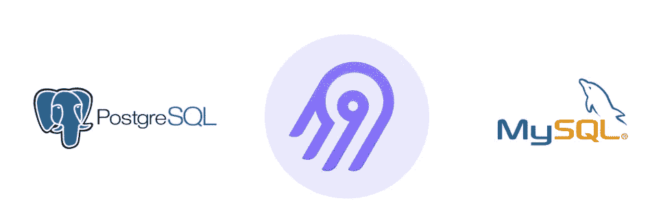
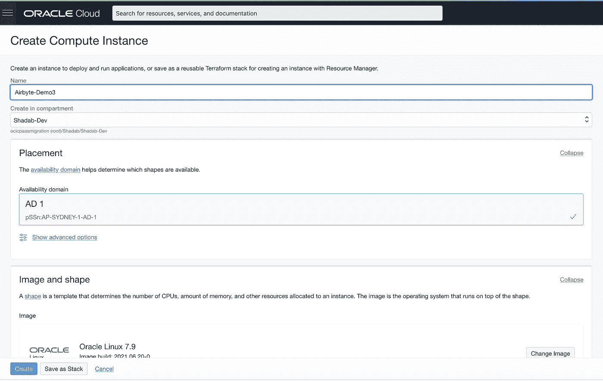
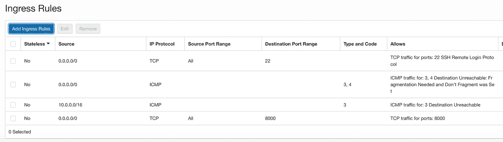
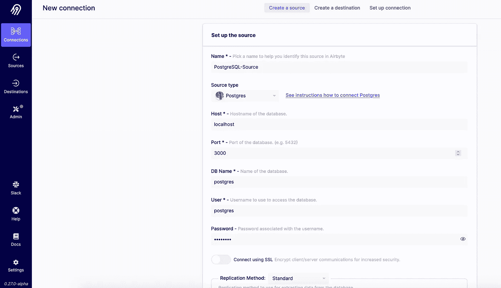
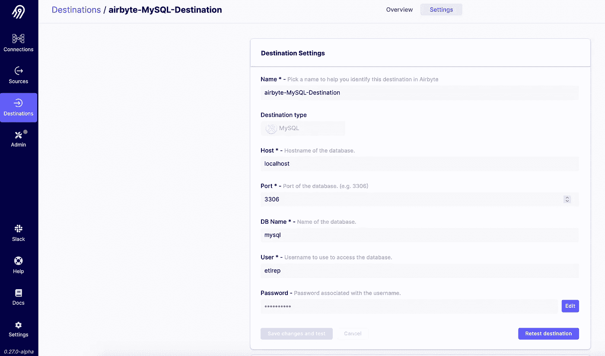
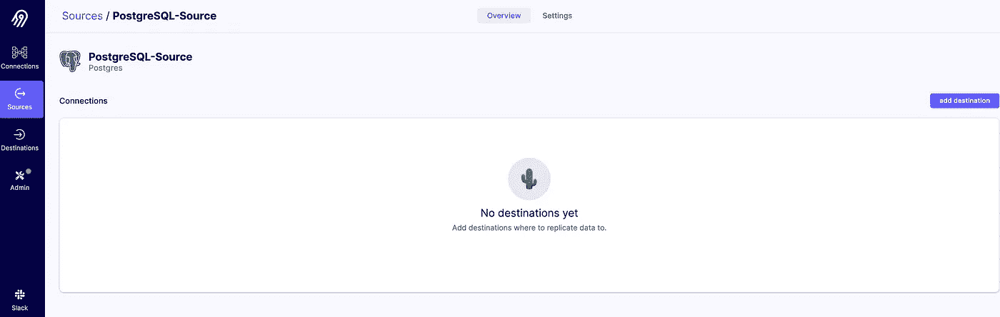
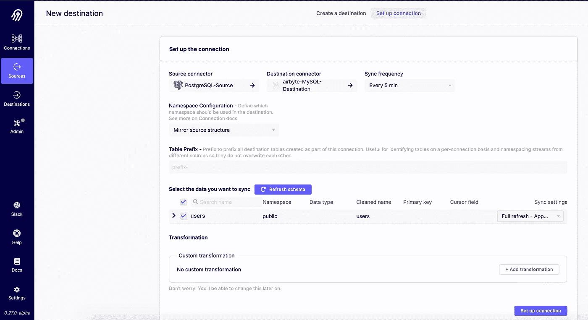
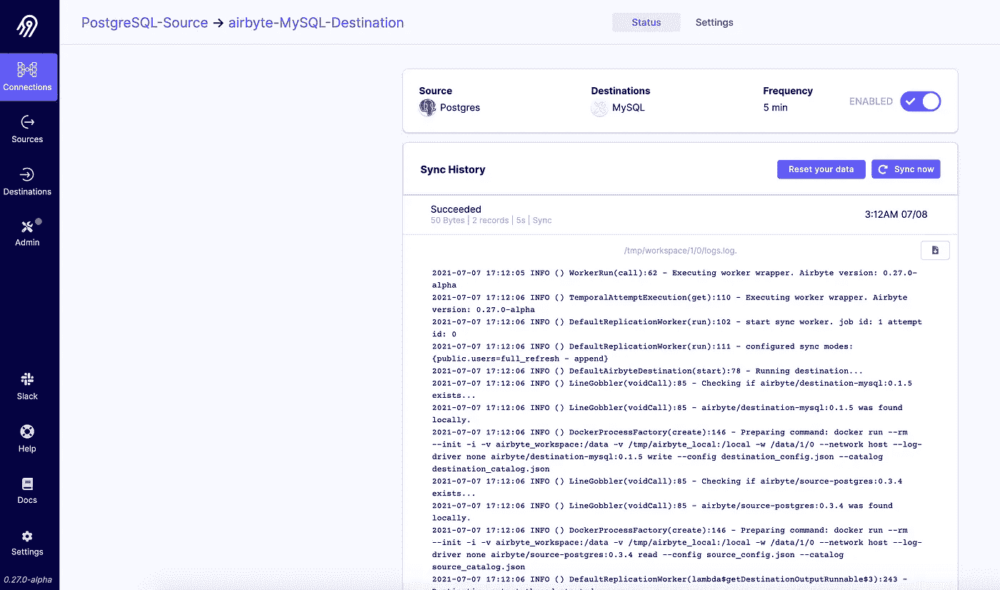
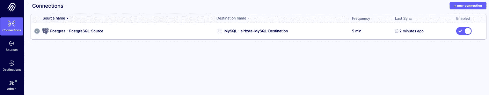

# 在 Oracle 云基础设施上部署 Airbyte，并将 PostgreSQL 表复制到 MySQL

> 原文：<https://medium.com/oracledevs/deploy-airbyte-on-oracle-cloud-infrastructure-and-replicate-a-postgresql-table-to-mysql-f07cf3cbe19c?source=collection_archive---------2----------------------->

Airbyte 是一个即将到来的开源 ELT 平台。Airbyte 支持来自各种[源](https://airbyte.io/sources) & [目的地](https://airbyte.io/destinations)的实时和基于批处理的 ETL 操作。它有一个非常易于使用的用户界面，使不同数据源之间的数据复制和转换变得轻而易举。



Airbyte pgsql to mysql

在本文中，我们将在 Oracle 云基础设施(OCI)虚拟机上部署 Airbyte。部署完成后，我们将在 OCI 虚拟机上使用 Airbyte 创建 PostgreSQL 到 MySQL 的复制。OCI 的 Airbyte 部署指南也可以在这里找到

# 创建 OCI 实例(虚拟机)

转到 OCI 控制台>计算>实例>创建实例



# OCI 虚拟机子网安全列表中 CIDR 范围的白名单端口 8000

转到 OCI 控制台>网络>虚拟云网络

选择子网>安全列表>添加入口规则



# 使用 SSH 密钥和“opc”用户登录实例/虚拟机

请参考> >*创建 SSH 隧道一节，以登录到实例*

```
chmod 600 private-key-filessh -i private-key-file opc@oci-private-instance-ip
```

# 在 OCI 虚拟机上安装 Airbytes 先决条件

# 安装 Docker

```
sudo yum update -ysudo yum install -y dockersudo service docker startsudo usermod -a -G docker $USER
```

# 安装 Docker 撰写

```
sudo wget [https://github.com/docker/compose/releases/download/1.26.2/docker-compose-$(uname](https://github.com/docker/compose/releases/download/1.26.2/docker-compose-%24(uname) -s)-$(uname -m) -O /usr/local/bin/docker-composesudo chmod +x /usr/local/bin/docker-composedocker-compose -version
```

# 安装 Airbyte

```
mkdir airbyte && cd airbytewget [https://raw.githubusercontent.com/airbytehq/airbyte/master/{.env,docker-compose.yaml}](https://raw.githubusercontent.com/airbytehq/airbyte/master/%7B.env,docker-compose.yaml%7D)which docker-composesudo /usr/local/bin/docker-compose up -d
```

# 创建 SSH 隧道以通过 Bastion 主机登录到实例

强烈建议运行 Airbyte 的实例不要有公共 IP)

从您的本地工作站

```
## SSH Local Port Forward to Airbyte VM$ ssh opc@bastion-host-public-ip -i <private-key-file.key> -L 2200:oci-private-instance-ip:22$ ssh opc@localhost -i <private-key-file.key> -p 2200## Airbyte GUI Local Port Forward to Airbyte VM$ ssh opc@bastion-host-public-ip -i <private-key-file.key> -L 8000:oci-private-instance-ip:8000
```

# 访问 Airbyte

```
[http://localhost:8000/](http://localhost:8000/)
```


**/* Airbyte 目前不支持 SSL/TLS 证书*/**

# 在 OCI 上部署 PostgreSQL 和 MySQL 容器

既然 Airbyte 部署已经完成，我们将配置从 PostgreSQL 表到 MySQL 的复制。第一步是创建容器映像并部署 PostgreSQL 和 MySQL 容器。

出于快速演示的目的，我们将在与 Airbyte 相同的虚拟机上创建用户 docker 容器，但在现实世界中，您的源可能是运行在 AWS 上的 PostgreSQL 或 Aurora 实例，而您的目的地可能是 OCI 上的 MySQL 云服务。在这种情况下，唯一需要的是通过 VPN 或快速连接或直接连接从 Airbyte 实例到 AWS VPC 和 OCI VCN 的连接。有关多云设置的更多信息，请参考[本文](https://blogs.oracle.com/cloud-infrastructure/post/multicloud-with-oracle-cloud-azure-and-even-aws)

1.  **在 OCI 虚拟机上创建一个 PostgreSQL 容器**

```
docker run --rm --name airbyte-source -e POSTGRES_PASSWORD=password -p 3000:5432 -d postgres
```

**在 PostgreSQL 中创建一个虚拟表并插入一些记录**

```
docker exec -it airbyte-source psql -U postgres -c “CREATE TABLE users(id SERIAL PRIMARY KEY, col1 VARCHAR(200));”docker exec -it airbyte-source psql -U postgres -c “INSERT INTO public.users(col1) VALUES(‘record1’);”docker exec -it airbyte-source psql -U postgres -c “INSERT INTO public.users(col1) VALUES(‘record2’);”docker exec -it airbyte-source psql -U postgres -c “SELECT * FROM public.users;”
```

**2。在 OCI 虚拟机上创建一个 MySQL 容器**

```
docker run --name airbyte-MySQL-Destination -p 3306:3306 -d mysql/mysql-server:latest
```

找到 MySQL 容器的根密码，我们将在登录 MySQL 容器后更改它

```
sudo docker logs airbyte-MySQL-Destination
```

搜索行:*【entry point】生成的 ROOT 密码:8fn#iF+76Wp+，*2wN8FiH79Y，d1m__qz*

```
docker exec -it airbyte-MySQL-Destination /bin/bashbash-4.4# mysql -u root -pChange the passwordmysql> ALTER USER ‘root’@’localhost’ IDENTIFIED BY ‘ThisIsaSecret321#_’;
```

创建另一个用户以连接到 Airbyte，ip 地址是绑定到本地主机的 OCI 虚拟机的私有 IP，因此创建一个具有私有 IP 的用户以避免遇到以下错误:

*无法使用提供的配置进行连接。无法创建 PoolableConnectionFactory(用户“root”的访问被拒绝……*

```
docker exec -it airbyte-MySQL-Destination mysql -u root -p mysqlmysql> CREATE USER 'etlrep'@'172.17.0.1' IDENTIFIED BY 'Etl123#_' ;
Query OK, 0 rows affected (0.01 sec)mysql> grant all on *.* to 'etlrep'@'172.17.0.1' ;
Query OK, 0 rows affected (0.01 sec)
```

# 使用 Airbyte 配置从 PostgreSQL 到 MySQL 表的复制

在浏览器中打开 Airbyte 实例: [http://localhost:8000/](http://localhost:8000/)

前往“连接”>添加连接


**添加源 PostgreSQL**



```
Parameters for PostgreSQLHost: localhost
Port : 3000
DB Name : postgres
Username : postgres
Password : password
```

**添加目的地 MySQL**



```
Parameters for MySQLHost: localhost
Port : 3306
DB Name : mysql
Username : etlrep
Password : Etl123#_
```

**转到源> PostgreSQL，并向其中添加一个在上一步**中创建的目标 MySQL



**设置连接并验证日志**



**如果一切配置正确，连接将显示在控制台上，旁边有一个绿色图标。**



现在让我们检查一下 MySQL 中是否有这些记录。Airbyte 会将 PostgreSQL 表复制到 MySQL 中的“公共”数据库。该表在 MySQL 中可用，名称为***_ airbyte _ raw _ users***，复制的数据作为 JSON 可用

```
docker exec -it airbyte-MySQL-Destination mysql -u ‘etlrep’ -p publicpassword : Etl123#_mysql> show tables
 -> ;
+ — — — — — — — — — — +
| Tables_in_public |
+ — — — — — — — — — — +
| _airbyte_raw_users |
+ — — — — — — — — — — +
1 row in set (0.00 sec)mysql> select * from _airbyte_raw_users ;
+ — — — — — — — — — — — — — — — — — — — + — — — — — — — — — — — — — — — + — — — — — — — — — — — — — — +
| _airbyte_ab_id | _airbyte_data | _airbyte_emitted_at |
+ — — — — — — — — — — — — — — — — — — — + — — — — — — — — — — — — — — — + — — — — — — — — — — — — — — +
| 1eca25a9–2268–4f47-b21d-5e467e9c61f9 | {“id”: 2, “col1”: “record2”} | 2021–07–07 17:12:09.164000 |
| 7f94d5d5–331b-437d-b918-dee2af4e0389 | {“id”: 2, “col1”: “record2”} | 2021–07–07 17:17:09.312000 |
| 845079b2–6ec1–4391-b67a-f054eb7e1a8d | {“id”: 2, “col1”: “record2”} | 2021–07–07 17:22:14.645000 |
| 9aa2776f-7dda-4932–9723–10671ec78cae | {“id”: 1, “col1”: “record1”} | 2021–07–07 17:22:14.645000 |
| d379af77-c99a-4e56-aaca-8d6553f2fec8 | {“id”: 1, “col1”: “record1”} | 2021–07–07 17:12:09.164000 |
| da5106e6–47fc-4149–9e1a-f9a4691fd8ea | {“id”: 1, “col1”: “record1”} | 2021–07–07 17:27:15.080000 |
| ff63a94b-cf48–4fe2–971e-07e250a4a5b8 | {“id”: 2, “col1”: “record2”} | 2021–07–07 17:27:15.080000 |
| ffaa2ad8–87e9–48f4–8251-f8aad1fa624e | {“id”: 1, “col1”: “record1”} | 2021–07–07 17:17:09.312000 |
+ — — — — — — — — — — — — — — — — — — — + — — — — — — — — — — — — — — — + — — — — — — — — — — — — — — +
8 rows in set (0.01 sec)
```

# 结论

我们可以在 OCI 虚拟机上使用 Airbyte 轻松创建从 PostgreSQL 到 MySQL 的近实时复制。Airbyte 支持不同的大数据源和大数据汇。在不久的将来，这将是一个令人兴奋的 ETL 工具。