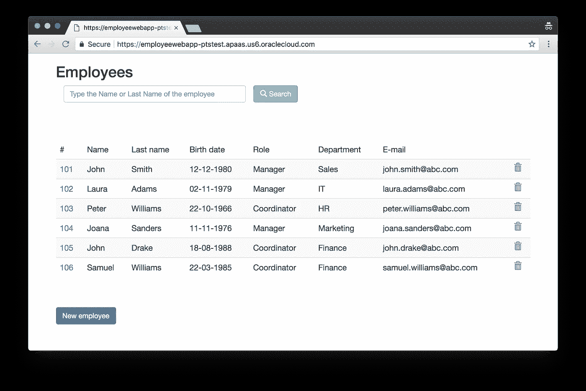

# 使用 Terraform 在 Oracle 应用容器云服务上部署和管理应用

> 原文：<https://medium.com/oracledevs/deploy-and-manage-apps-on-oracle-application-container-cloud-service-using-terraform-bc9772a63d44?source=collection_archive---------0----------------------->

本文介绍了如何开始使用 Oracle Cloud**Terraform Providers**来部署和管理部署到 **Oracle 应用容器云服务**的应用程序

Oracle Application Container Cloud Service 为在运行时平台上的应用部署提供了一个快速、可扩展的平台，包括 **Java EE** 、 **Java SE、Node.js** 、 **PHP** 、 **Python** 、 **Ruby** 、 **Go** 和**。网**

要使用带有`[oraclepaas](https://www.terraform.io/docs/providers/oraclepaas/)`提供者的应用程序容器云服务，请将`application_endpoint`设置为 Oracle Cloud My Services dashboard 的服务详细信息页面上提供的 REST API 端点。

```
provider "oraclepaas" {
  version              = "~> 1.3"
  user                 = "${var.user}"
  password             = "${var.password}"
  identity_domain      = "${var.domain}"
  **application_endpoint = "**[**https://apaas.us.oraclecloud.com**](https://apaas.us.oraclecloud.com)**"**
}
```

使用`oraclepaas_application_container`资源创建新的应用程序部署非常简单，只需声明所需的运行时，提供应用程序包的位置，并设置一些基本的部署特性

让我们来看看如何使用来自[Oracle 应用程序容器云入门](http://www.oracle.com/webfolder/technetwork/tutorials/obe/cloud/apaas/acc-getting-started/welcome.html)教程的示例 EmployeeWebApp Java 应用程序。下载示例`[**employees-web-app.zip**](http://www.oracle.com/webfolder/technetwork/tutorials/obe/cloud/apaas/acc-getting-started/files/employees-web-app.zip)`应用程序，并将其上传到 Oracle Storage Cloud Classic 中合适的位置(例如`my-accs-apps/employees-web-app.zip`

```
resource "oraclepaas_application_container" "java-app" {
  name               = "EmployeeWebApp"
  runtime            = "java"
  archive_url        = "my-accs-apps/employees-web-app.zip"
  notes              = "Sample Tomcat application"
  subscription_type  = "HOURLY" deployment_attributes {
    memory = "1G"
    instances = 1
  }
}output "web_url" {
  value = "${oraclepaas_application_container.java-app.web_url}"
}
```

应用配置后，部署的应用程序将在由`web_url`地址提供的 URL 上可用。



Example EmployeeWebApp deployment on Application Container Cloud Service

## **自动将应用上传至对象存储器**

Terraform 还可以使用`opc` provider `opc_storage_object`资源自动将本地应用程序包上传到对象存储容器。

```
resource "**opc_storage_object**" "example-app" {
  name         = "employees-web-app.zip"
  container    = "my-accs-apps"
  file         = "./employees-web-app.zip"
  etag         = "${md5(file("./employees-web-app.zip"))}"
  content_type = "application/zip;charset=UTF-8"
}resource "oraclepaas_application_container" "java-app" {
  name               = "EmployeeWebApp"
  archive_url        = "my-accs-apps/**${opc_storage_object.example-app.name}**"
  ...
}
```

## 缩放应用

扩展应用程序部署就像修改部署属性一样简单:

```
resource "oraclepaas_application_container" "java-app" {
  name               = "EmployeeWebApp"
  ... deployment_attributes {
    memory = "1G"
 **instances = 2**  }
}
```

然后重新应用 terraform 配置:

```
$ **terraform apply**
Terraform will perform the following actions:~ oraclepaas_application_container.java-app deployment_attributes.0.instances: "1" => "2"**Plan:** 0 to add, 1 to change, 0 to destroy.
```

添加或删除实例时，其他现有实例将继续运行。更改`memory`大小将导致所有实例在短时间内不可用，因为应用程序将使用新值重新启动。

## 从 Git 存储库部署应用程序

应用程序容器云还可以直接从源 git 存储库部署应用程序。我们只需设置源`git_respository` URL，而不是将预打包的应用程序上传到对象存储。当从 git 存储库部署时，必须提供一个`manifest`配置(或`manifest_file`)。

```
resource "oraclepaas_application_container" "example-node-app" {
  name              = "nodeWebApp"
  runtime           = "node"
 **git_repository    = "**[**https://github.com/scross01/employee-app**](https://github.com/scross01/employee-app.git)**"
**  subscription_type = "HOURLY" **manifest {
    runtime {
      major_version = "8"
    }
    command = "node server.js"
    type    = "web",
    home    = "/employees"
  }** deployment {
    memory    = "1G"
    instances = 1
  }
}
```

设置`manifest`或`manifest_file`也可用于覆盖应用程序包 zip 文件中的默认`manifest.json`设置。

# 更多示例

有关将应用程序部署到应用程序容器云的更多示例，请查看

*   [示例 **Node.js 应用**部署到 Oracle 应用容器云服务](https://github.com/oracle/terraform-examples/tree/master/examples/oraclepaas/accs-nodejs-app)
*   [示例 **Node.js 应用** **从 Git 存储库**部署到 Oracle 应用容器云服务](https://github.com/oracle/terraform-examples/tree/master/examples/oraclepaas/accs-nodejs-app-from-git-repo)
*   [示例 **Java 应用**部署到 Oracle 应用容器云服务](https://github.com/oracle/terraform-examples/tree/master/examples/oraclepaas/accs-java-app)
*   [示例**将应用**部署到 Oracle 应用容器云服务](https://github.com/oracle/terraform-examples/tree/master/examples/oraclepaas/accs-go-app)
*   [示例 **PHP 应用**部署到 Oracle 应用容器云服务](https://github.com/oracle/terraform-examples/tree/master/examples/oraclepaas/accs-php-app)
*   [示例 **Python 应用**部署到 Oracle 应用容器云服务](https://github.com/oracle/terraform-examples/tree/master/examples/oraclepaas/accs-python-app)
*   [示例 **Python 应用**部署到 Oracle 应用容器云服务](https://github.com/oracle/terraform-examples/tree/master/examples/oraclepaas/accs-python-app)
*   [示例 **Ruby 应用**部署到 Oracle 应用容器云服务](https://github.com/oracle/terraform-examples/tree/master/examples/oraclepaas/accs-ruby-app)

# 相关文章

*   [宣布 Terraform 支持 Oracle 云平台服务](https://blogs.oracle.com/developers/announcing-terraform-support-for-oracle-cloud-platform-services)
*   [为 Oracle 应用容器云服务开发—示例应用](https://docs.oracle.com/en/cloud/paas/app-container-cloud/dvcjv/sample-applications.html)