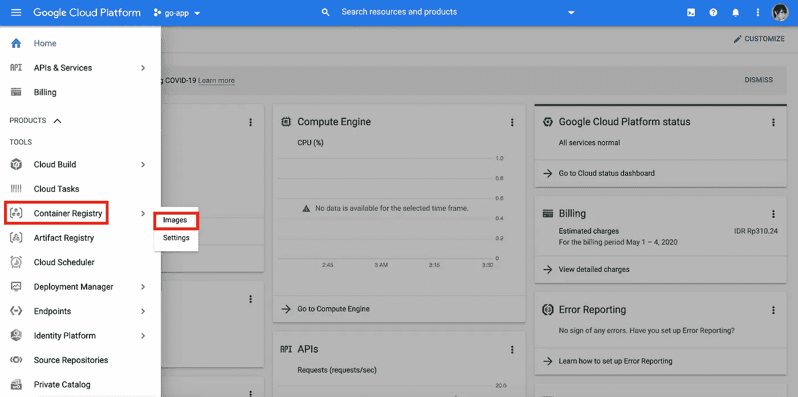
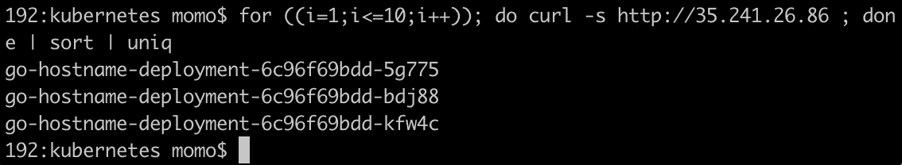

# 将 Go 应用程序部署到 Google Kubernetes 引擎(GKE)

> 原文：<https://medium.easyread.co/deploy-go-app-to-google-kubernetes-engine-gke-b56ca15f1865?source=collection_archive---------0----------------------->


Photo by [pexels.com](http://pexels.com/photo/person-typing-on-computer-keyboard-2058128/)

大家好！与我一次又一次地分享一些经验，尽管还是关于软件工程领域相关技术的看法。今天，我将分享关于 Devops 的事情，即如何部署您的应用程序到谷歌 Kubernetes 引擎(GKE)。在这个例子中，我们将使用 Go 编程语言。

为什么是 Kubernetes？什么是 Kubernetes？你可以在 Kubernetes 的官方页面[https://kubernetes.io/](https://kubernetes.io/)上了解更多信息

> **TL**；**博士**
> 
> Kubernetes 是一个开源的容器编排系统，用于自动化应用程序部署、伸缩和管理。
> 
> Kubernetes 很容易管理一吨集装箱的例子码头工人

好的，因为 Kubernetes (K8s)所做的是管理容器，所以我们将在这个例子中使用 Docker。因为它很受欢迎，而且与 Kubernetes 配合得很好。如果你不熟悉 Docker，也许你可以阅读这篇官方文章:

> [*https://www.docker.com/*](https://www.docker.com/)[*https://www.docker.com/why-docker*](https://www.docker.com/why-docker)

# 1.设置图像

在前面的故事中，我们使用 Docker Hub 作为存储图像容器的仓库。但是，Docker Hub 是一个公共存储库。如果我们想把它保存为私人图像呢？然后，我们可以使用谷歌容器注册表来存储我们的图像。让我们试着建造它！

首先，我们需要一个简单的应用程序。当我们 ping 它时，这个应用程序将打印我们的主机名。接下来，创建 main.go 文件，在本地机器中包含以下代码:

我们还需要 Dockerfile 来构建包含以下代码的图像:

使用此命令构建映像。

```
docker build -t go-hostname .
```


Picture 1 Build Docker Image

检查我们创建的图像。

```
docker images
```


Picture 2 Check Docker Images

用谷歌容器注册格式标记图像。

*   **gcr.io** 是一个主机名，有几个主机名像 us.gcr.io、eu.gcr.io 和 asia.gcr.io
*   **go-app-275713** 是我们的**项目 ID** 。我们可以在仪表板上找到价值。
*   **go-hostname** 是我们的映像名称

```
docker tag go-hostname gcr.io/go-app-275713/go-hostname
```


Picture 3 Copy Google Project ID

检查我们创建的标签。我们应该有新的形象。

```
docker images
```


Picture 4 Check Docker Tag Image

我们将使用 glcloud 命令轻松连接到 Google 云服务。关于如何安装 gcloud 命令的细节，请看这个链接[https://cloud.google.com/sdk/install](https://cloud.google.com/sdk/install)，因为它依赖于我们的操作系统。

在本例中，我使用的是 macOS，步骤如下所示

使用 curl 下载 gcloud sdk。

```
curl [https://sdk.cloud.google.com](https://sdk.cloud.google.com) | bash
```

使用 exec 重新启动 Shell。

```
exec -l $SHELL
```

运行 gcloud init 并完成安装(您会问几个关于 google 帐户、云项目、计算引擎区域的问题) :

```
gcloud init
```

然后，使用 gcloud 命令将图像推送到 Google 容器注册表中。

```
gcloud docker -- push gcr.io/go-app-275713/go-hostname
```


Picture 5 Push Docker Image

在**容器注册表**菜单下的**图像**子菜单上检查推送的图像。



Picture 6 Go To Container Registry Images

我们的图像应该存在于**资料库中。**


Picture 7 Image Already Stored

# 2.设置集群

回到 GCP 控制台。打开边栏菜单。点击 **Kubernetes 引擎**菜单下的**集群**子菜单，进入**集群**页面，然后创建一个新的集群。


Picture 8 Go to Kubernetes Engine Clusters


Picture 9 Go to Create Cluster

大多数情况下，我们将使用默认配置，只需更改**机器类型**以降低成本:)接下来，单击**创建**按钮以创建集群，并等待该过程完成。


Picture 10.1 Cluster Configuration


Picture 10.2 Cluster Configuration


Picture 11 Cluster Created

# 3.配置集群

是时候让我们的集群发挥作用了。请记住，在创建群集时，我们为群集配置了 3 个节点。因此，我们的聚类图将如下所示。


Picture 12 Kubernetes Cluster Diagram

来自云的流量将作为入站流量进入入口。并且入口将服务于来自节点的对请求的响应。每个节点有 3 个单元。我将尝试用简短的描述来解释上述术语:

*   **云**:用户的流量来自云区。我们将有几个请求进入我们的 Kubernetes 集群。
*   **入口**:我们的 Kubernetes 集群是孤立的。为了从外部访问，我们需要一个网关作为负载平衡器，将请求转发到节点。
*   **节点**:在 GKE，节点将成为一个虚拟机实例。因此，当我们创建 3 个节点时，我们将有 3 个虚拟机实例。我们的吊舱将在节点内运行。
*   **Pod** :我们所有的容器将被一组容器(或者只是单个容器，取决于我们的应用程序)放入 Pod。

我们需要几个文件来配置集群。我们的项目目录应该是这样的。


Picture 13 Project Directory

创建用于管理 pod 的部署 yaml 文件。我们将对 pod 使用 3 个复制。

为 expose pod 创建服务 yam 文件。因此，流量可以通过服务路由到 pod。

为负载平衡器创建入口 yaml 文件。来自外部的流量将由负载平衡器处理，并将转发给服务。

返回群集页面，然后单击连接按钮。


Picture 14 Guide Connect to Cluster

GKE 有几个选项，如运行在云壳或本地运行。我们将选择本地运行。只需复制 configure kubectl 命令并粘贴到我们的终端上。


Picture 15 Configure Kubectl Command

运行这个命令，就会为我们的集群生成 kubeconfig。

```
gcloud container clusters get-credentials cluster-1 --zone us-central1-c --project go-app-275713
```


Picture 16 Fetching Kubeconfig

检查节点。根据之前的配置，我们将获得 3 个节点。确保**状态**为**就绪**。

```
kubectl get node
```


Picture 17 Get Nodes

应用(创建/更新)部署。

```
kubectl apply -f deployment.yaml
```


Picture 18 Apply Deployment

检查部署状态。还要确保 3 个豆荚准备好**。**

```
kubectl get deployment
```

****

**Picture 19 Check Deployment**

**检查 pod 的状态。吊舱的**状态**应为**运行**。**

```
kubectl get pod
```

****

**Picture 20 Check Pods**

**应用(创建/更新)服务。**

```
kubectl apply -f service.yaml
```

****

**Picture 21 Apply Service**

**检查服务状态。**

```
kubectl get service
```

****

**Picture 22 Check Services**

**应用(创建/更新)入口。**

```
kubectl apply -f ingress.yaml
```

****

**Picture 23 Apply Ingress**

**使用以下命令查找入口负载平衡器的公共 IP。我们将从命令输出中找到公共 IP。**

```
kubectl get ingress go-hostname-ingress --output yaml
```

****

**Picture 24 Check Ingress**

**不错，似乎我们的 Kubernetes 集群配置已经完成。让我们转到测试部分。**

# **4.测试**

**打开 web 浏览器，尝试使用公共 IP 地址访问负载平衡器入口。我们需要几分钟时间让负载平衡器准备好为 Kubernetes 集群服务。**

****

**Picture 25 Testing Kubernetes Ingress**

**或者我们可以用 curl 来测试连接。**

```
for ((i=1;i<=10;i++)); do curl -s [http://35.241.26.86](http://35.241.26.86) ; done | sort | uniq
```

****

**Picture 26 Testing Kubernetes Ingress by CURL**

**Yuuuhuuu，是作品！现在我们可以访问使用 Google Kubernetes 引擎部署的 Go 应用程序了！**

**如果你想看 Kubernetes 配置的例子，你可以访问我的 github 库:**

**[](https://github.com/moemoe89/go-kubernetes-t3) [## moemoe89/go-kubernetes-t3

### 这个项目为实践 Kubernetes 为实践 pod，找到一个在 pod 知识库实现的例子。对于…

github.com](https://github.com/moemoe89/go-kubernetes-t3) 

希望你喜欢它，我很高兴如果这篇文章对你有用！部署愉快！

谢谢大家！**