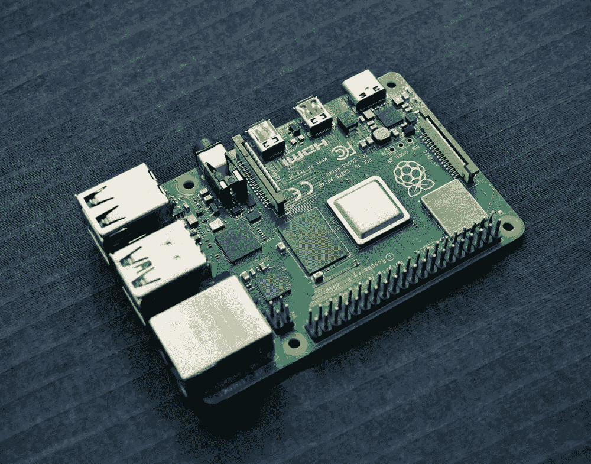
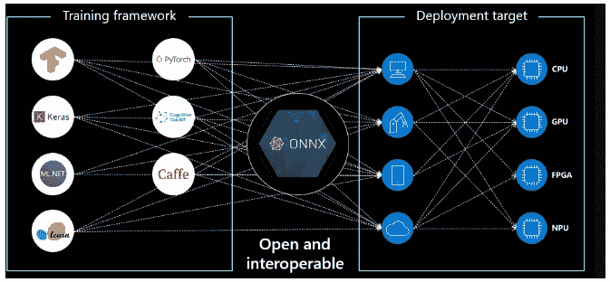
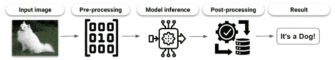
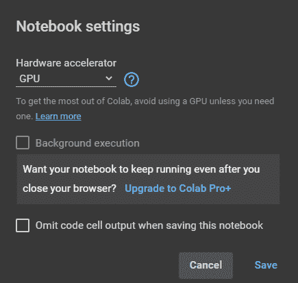

# 使用 ONNX 在物联网设备上部署机器学习模型

> 原文：<https://medium.com/globant/deploy-machine-learning-models-on-iot-devices-using-onnx-dc34cd854e27?source=collection_archive---------0----------------------->

## 一个运行时来管理它们



Source: [Unsplash](https://unsplash.com/es/fotos/rZKdS0wI8Ks) (Credits to Vishnu Mohanan)

在本文中，我们将学习如何使用 [ONNX](https://onnx.ai/) 部署机器学习(ML)模型，这是一个生态系统，使我们能够分离 ML 模型的训练和推理环境。首先，我们将了解为什么以及何时这是有用的，然后概述 ONNX 的工作原理，最后，我们将通过一个使用计算机视觉的例子。从 PyTorch 中的训练模型开始，我们将它导出到 ONNX，并在 Google Colab 中执行这两个版本的模型，以验证结果并寻找性能差异，这对于小型物联网设备来说是一个关键因素，如 [Raspberry Pi 4](https://www.raspberrypi.com/products/raspberry-pi-4-model-b/) ，我们将在其中运行 ONNX 版本的模型。

要继续学习，你需要具备应用于 ML 的 Python 的基础知识，能够访问 Google Colab 或等效的工作空间，以及 Raspberry Pi。

# **我们什么时候需要改变部署工作流程？**

部署 ML 模型的传统流程需要使用相同的框架来训练模型和进行预测。开始时，这很有意义，但很快就会失去控制，尤其是在满足以下任何条件的情况下:

*   我们使用不止一个框架来训练模型。
*   生产中模型的目标设备不同于用于培训的设备。
*   我们使用的是性能受限的小型设备，因此模型必须针对该平台进行优化。

有几种方法可以应对这些挑战，但近年来越来越受欢迎的一种方法是分离训练和推理环境。这是因为 ML 框架是所有行业的千斤顶，我们从培训和优化到部署模型都使用它们，但它们并不是每个任务的最佳工具。

这就是为推理设计的工具派上用场的地方。它可以帮助我们充分利用我们的模型，优化流程并减少执行它们所需的依赖性。考虑到这一点，开放神经网络交换(ONNX)就是这样一种工具。在它的特性中，我们将获得:

*   一种允许跨框架转换模型的标准格式。
*   在不同设备中执行相同模型的运行时。
*   每个目标平台的运行时优化。

# **ONNX 生态系统是如何工作的？**

ONNX 生态系统的第一部分是格式的[规范，包括:](https://github.com/onnx/onnx/blob/main/docs/IR.md)

*   代表模型的计算图的定义
*   支持的数据类型
*   内置运算符。

有了这些功能，就有可能将模型从它们原来的框架转换成 ONNX 格式或任何其他兼容的框架。

第二部分是 ONNX 运行时，它在各种目标设备上执行 ML 模型，而不需要修改模型文件。该功能完善了生态系统，并实现了不同目标设备中模型的互操作性。



Source: [Microsoft](https://microsoft.github.io/ai-at-edge/docs/onnx/)

# **图像分类模型的例子**

使用图像分类模型进行推理的标准管道从读取输入图像开始，然后有一个预处理阶段将输入准备为模型所需的格式，这可能包括:调整图像的大小、裁剪或归一化图像。准备好输入后，进行模型推理，根据输出格式，可能需要一个后处理阶段，以使输出具有人类可读的格式。



我们将把这个管道从 Pytorch 迁移到 ONNX，为此我们必须改变模型，并且在大多数情况下，还要改变预处理阶段。这是因为我们通常在训练模型的同一个框架中进行部分图像操作，因此为了消除对框架的依赖性，我们必须改变管道中使用它的所有部分。在本文中，我们将关注代码的关键部分，但是可以查看这个例子在 [**仓库**](https://github.com/Luis-ramirez-r/cv-onnx) 中的完整文件。

让我们从克隆回购开始:

```
!git clone [https://github.com/Luis-ramirez-r/cv-onnx.git](https://github.com/Luis-ramirez-r/cv_pytorch2onnx.git)
```

现在我们已经有了完成任务所需的所有文件，让我们打开 Main.ipynb 笔记本并运行第一行。这将做几件事:首先，在 PyTorch 中下载我们的启动模型，执行推理管道，最后保存模型。如果一切正常，你将得到狗的品种“萨摩耶”和模型的路径如下:

```
>>> !python '1_pytorch_model_test.py'
Samoyed
The model has been saved at models/googlenet.pt
```

现在我们知道模型正在工作，我们想把它从 PyTorch 转换成 ONNX，为此我们可以参考 PyTorch [文档](Pytorch documentation)

从这里我们可以看到，有一个使用 **torch.onnx.export** 将模型导出为 ONNX 格式的功能。要使用它，我们需要提供输入:模型对象，也就是我们在脚本 1 中下载的模型，一个输入样本，为此我们将读取我们的测试图像 Dog.jpeg，以及输出文件的路径。对于其余的参数，我们可以保留默认值。还有一个名为 **check_model** 的函数，我们将使用它来确认模型是否具有有效的模式，如果文件有错误，该函数将抛出一个错误。

这一步的代码在文件 2_export_model.py 中

```
>>> !python '2_export_model.py'
The model has been saved at: models/googlenet.onnx
```

现在我们准备再次运行管道，但是有一个关键的变化。这次使用 ONNX-Runtime 代替 PyTorch。为了加载 ONNX 模型，我们需要创建一个推理会话，它需要两个参数:模型的路径和执行提供者(EP)。EP 允许运行时优化对平台的模型推断。现在，我们将使用“CPUExecutionProvider”。

这一步的代码在 3_onnx_model_base_pipeline.py 文件中，我们可以用与前面文件相同的方式运行它，输出应该是相同的。

```
>>> !python '3_onnx_model_og_pipeline.py'
Samoyed
```

这样，我们验证了我们的模型工作正常，但仍有一个问题。在预处理阶段，我们使用 PyTorch 的 transform 函数，这意味着此时我们仍然需要安装 PyTorch 来运行管道。

为了消除 PyTorch 依赖性，我们必须重写预处理函数，为此我们将使用 NumPy:

现在我们完成了，在这一点上，我们最终执行了没有 PyTorch 依赖的模型。

这个阶段的完整代码在 4_onnx_new_pipeline.py 文件中，如您所见，不需要导入 PyTorch。

让我们运行脚本:

```
>>> !python '4_onnx_pipeline.py'
Samoyed
```

正如所料，我们在 PyTorch、ONNX + PyTorch 和 ONNX only 三种情况下都得到了相同的结果，现在让我们看看有什么不同。

## 【ONNX 推论与 Pytorch 相比如何？

对于所有的情况，我们从模型中得到相同的预测:**、萨摩耶、**哪一个是输入图像中正确的品种，但是这两个模型之间有什么不同吗？

在性能方面，我们得到了一个更有趣的结果，当我们使用 ONNX 时，推理时间明显更低，129ms vs .当推理在 CPU 中进行时，41ms。要使用 GPU 复制推理，首先我们需要将 Colab 运行时改为 GPU:



对于 PyTorch 中的代码，不需要进行任何更改，对于 ONNX 代码，唯一需要的更改是添加 CUDA EP:

一旦为两个框架执行了代码，我们就会得到以下推理时间:PyTorch 为 10ms，ONNX 为 6ms。虽然在这种情况下差异较小，但与 PyTorch 相比，ONNX 的速度几乎是前者的两倍。

# **物联网呢？**

到目前为止，我们一直在使用 Google Colab 上的 ONNX 来准备和测试管道，现在我们已经准备好了最后一步。部署到物联网设备时，我们会有哪些不同？

物联网设备有很多种，但我们可以期待的是更小的尺寸和更低的功耗，这意味着更少的计算能力和更低的成本。这是通过切换到 ARM 架构来实现的，这与我们的手机中使用的架构相同。这些设备的一个例子是 [Raspberry Pi](https://www.raspberrypi.org/) ，这就是我们将要使用的设备。在许多情况下，架构的改变可能是一个问题，但是因为 ONNX 是一个跨平台的运行时，所以这次我们不必担心它。

我用的是树莓 Pi4 4GBs RAM 版本。如果你没有访问权限，一个替代方法是使用 ARM 架构的虚拟机，比如 [AWS Graviton 实例。](https://aws.amazon.com/ec2/graviton/)

## **树莓 Pi 4 设置**

在 Colab 设置中，大多数库从一开始就是可用的，在这种情况下，我们需要在我们的 Raspberry Pi 中安装所有的依赖项。希望，因为它是一个推理环境，只有没有很多。

为了保持整洁，您可以在您的设备中克隆 repo，并查找 requirements.txt 文件，该文件包含我们执行模型所需的所有库，正如您所看到的，只有四个。

要在您的 Raspberry Pi 上安装这些库，只需运行以下代码:

```
pip install -r requirements.txt
```

现在我们准备好了，您可以执行我们在 Colab 4_onnx_new_pipeline.py 中使用的相同文件，您将得到相同的结果，狗繁殖。

```
>>> python '4_onnx_pipeline.py'
Samoyed
```

就这样，我们有了一个推理环境，我们的模型在一个物联网兼容设备上运行。这是使用标准运行时的主要优势之一，跨平台移植模型这种方式更容易，并且在开始时需要做一些额外的工作，因为我们必须导出模型，并且在某些情况下需要修改部分管道，就像我们在预处理阶段所做的那样。

# 下一步是什么？

到目前为止，我们讨论了 ONNX 生态系统的一个用例，将 PyTorch 模型转换为 ONNX，并将其部署在 Raspberry Pi 上，但这只是冰山一角。如果我们从不同的框架开始或者想要使用另一个目标设备，会发生什么？

对于 PyTorch，我们可以直接将模型导出为。onnx，但对于许多框架，我们必须使用外部库，如 [onnxmltools](https://github.com/onnx/onnxmltools) ，它支持 scikit-learn、Keras、H2O 等。

如果您计划在另一个设备上部署您的模型，如 [Jetson nano](https://developer.nvidia.com/embedded/jetson-nano-developer-kit) 或 [neural compute stick](https://www.intel.com/content/www/us/en/developer/tools/neural-compute-stick/overview.html) ，请确保安装针对您的平台进行了更好优化的运行时版本和 EP，[这里](https://onnxruntime.ai/)您可以查看在所有支持的平台上安装 ONNX 运行时的说明，这里[是所有可用 EP 的列表。](https://onnxruntime.ai/docs/execution-providers/)

# 结论

在本文中，我们描述了当使用多个框架时，或者当我们有性能限制时，部署 ML 模型的挑战，并提出 ONNX 生态系统作为解决这些挑战的替代方案。然后，我们采用了计算机视觉的实际操作方法，我们:

*   使用 Google Colab 作为我们的开发平台
*   将模型从 PyTorch 导出到 ONNX，并相应修改预处理阶段
*   验证我们得到了相同的结果
*   比较 ONNX 和 Pytorch 的性能
*   将模型部署到 Raspberry Pi

最后，研究进一步工作的一些建议，例如在其他设备上部署模型或使用不同的 EP 来优化推理时间。