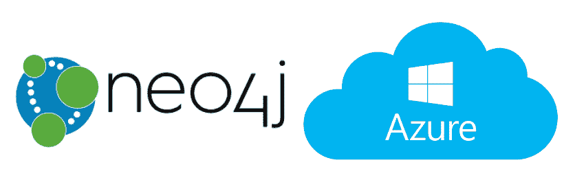
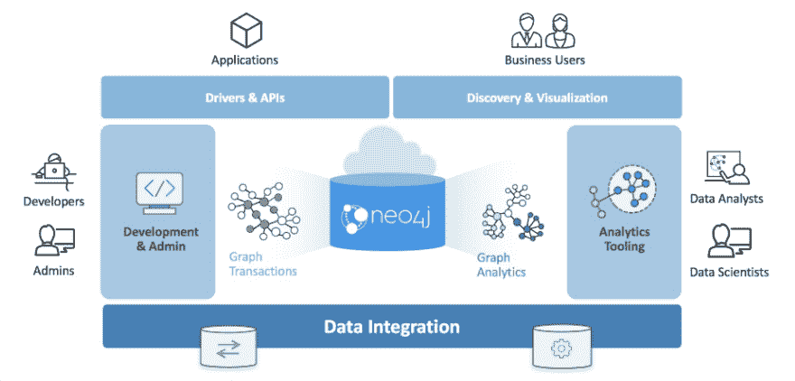
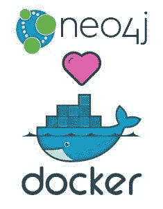
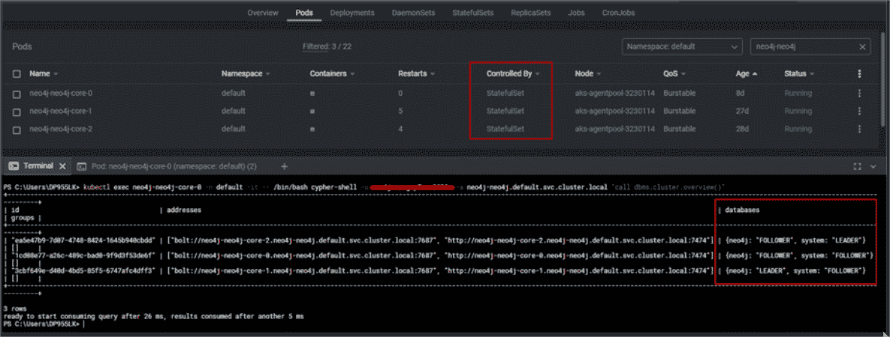
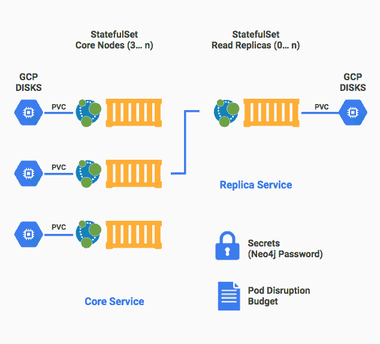
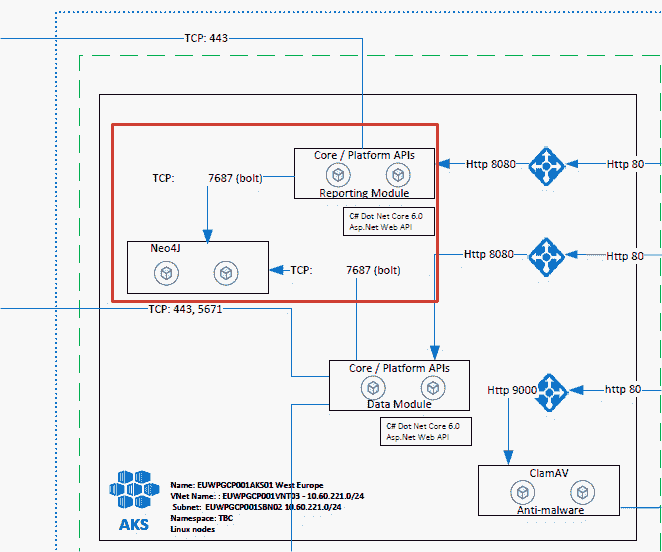
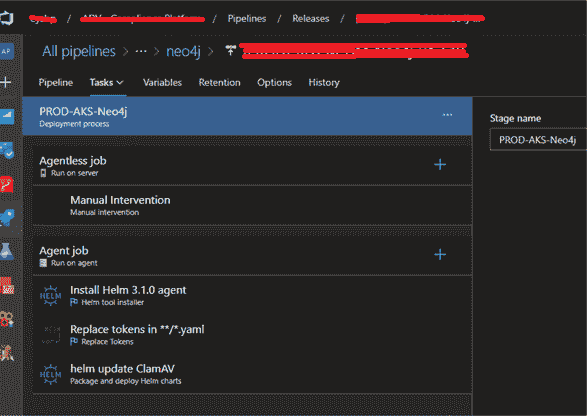
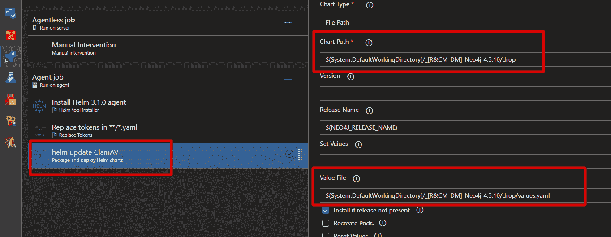

# 使用 Helm Chart 和 Azure DevOps 在 Kubernetes 上部署 Neo4j

> 原文：<https://medium.com/globant/deploy-neo4j-on-kubernetes-using-helm-chart-and-azure-devops-615f3190ea96?source=collection_archive---------0----------------------->

本文旨在记录如何使用 K8s 中的舵图部署 Neo4J 因果集群。如果用户对在 AKS 中部署 neo4j 感兴趣，可以关注这篇文章，在这个过程中学习理论。

在本指南中，您将看到:

1.  Neo4j 简介
2.  运行在 Kubernetes 上的 Neo4J
3.  舵图表包构建
4.  舵图表包部署(CD —继续部署)
5.  结论

**Neo4j 简介**

**a. Neo4j 图形平台**

Neo4j Graph 平台包括一些组件，使开发人员能够创建支持图形的应用程序。开发人员、管理员、数据分析师和数据科学家使用它来访问应用程序数据。开发人员通过将数据导入到图表中或者使用 Cypher 语言实现数据模型来创建图表中的数据。此外，开发人员负责将图形与其他系统和 DBMS 安装集成在一起。管理员管理与 Neo4j 安装相关的流程和文件。数据科学家和数据分析师通常结合使用密码查询和工具来分析数据。最终用户通常使用开发人员编写的应用程序来访问图形数据。

要查看更多详情，请前往 https://neo4j.com/docs/getting-started/current/

**b. Raft 协议**

无论是独立安装还是 docker-Kubernetes 安装，neo4j 都使用一个或多个核心服务器来工作(取决于设置)。neo4j 使用的另一个策略是 Raft 协议。Raft 的主要设计目标之一是易于理解，以便在实现中隐藏更少的棘手错误。Raft 协议描述了一个实例可以扮演的三个角色:**领导者**、**跟随者**和候选者。这些都是暂时的角色，任何核心服务器都可以在集群的整个生命周期中扮演这些角色。虽然从计算科学的角度来看理解这些状态很有趣，但是操作者不应该过分担心:它们是实现的细节。由于每个数据库都在逻辑上独立的 Raft 组中运行，所以核心服务器可以有多个角色:每个数据库一个角色。例如，它可以是数据库系统的领导者，同时也是数据库 neo4j 的追随者。

一旦启动，每个核心服务器就花时间处理数据库事务。通过 Raft 协议在核心服务器周围可靠地复制更新。更新以包含事务命令的(提交的)Raft 日志条目的形式出现，这些事务命令随后被应用来更新数据库。

为了安全起见，在任何 Raft 协议实例中，只有一个**领导者**能够在任何给定的期限内向前推进。对于**的跟随者**，由**的领导**负责对木排日志条目下达命令，并推动日志前进。**追随者**根据当前**领导者**的日志维护他们的日志。如果集群中的任何参与者怀疑**领导者**已经失败(没有接收到新的条目或心跳)，那么他们可以通过进入候选状态来发起领导者选举。在 Neo4j 核心服务器中，此故障检测窗口默认设置为 20 秒以上，以支持更稳定的领导者。

这是非阻塞共识协议的本质，它允许 Neo4j 因果集群为应用程序提供连续可用性。

要查看更多详细信息，请访问[因果聚类生命周期-操作手册(neo4j.com)](https://neo4j.com/docs/operations-manual/current/clustering-advanced/lifecycle/#causal-clustering-transacting-via-raft-protocol)

**2。运行在 Kubernetes 上的 Neo4J】**

**a .状态集和持久卷**

Kubernetes 中的 Neo4j Docker 使用 stateful set**:neo4j-neo4j-core**。生产环境需要核心模式，至少有三个单元，一个领导者和两个追随者。在开发环境中，您可以使用单一模式(单一实例，只有一个 pod)。此外，neo4j 使用两个数据库:用于管理目的的 system DB 和用于业务数据的 neo4j 数据库:

转到上一个名为“ **b. Raft protocol** 的点来看看关于这个的理论。

在体系结构级别，每个单元都有各自的卷(磁盘)用于存储持久数据:

**b .通信**

Neo4j 是要和一个或者多个 app 进行通信的。在图像中，您可以看到与两个应用程序的通信:数据模块和报告模块。使用 bolt 协议(端口 TCP:7687)可以做到这一点:

**3。舵图包构建**

**a .舵图的主要修改**

对于 4.4.x 版本，您可以从以下 GitHub 链接下载 Helm Chart 的源代码:

[https://github.com/neo4j-contrib/neo4j-helm/tree/4.4.3](https://github.com/neo4j-contrib/neo4j-helm/tree/4.4.3)。

有必要修改舵图上的这些文件:

*   文件**/templates/core-stateful set . YAML**:

*   文件 **pv-pvc-volumes.yaml** 创建指向文件共享(存储帐户)的卷:

*   文件**/develop-RCM/values . YAML**:

b .创建映像并准备文件以部署包(CI-持续集成)。

Neo4j Docker 映像包括一些基本的默认配置，在大多数情况下不需要调整。

默认情况下，Docker 映像为远程访问提供了三个端口:

*   HTTP 的 7474
*   7473 去 HTTPS
*   螺栓 7687

我们将使用这些端口连接到容器内部的 Neo4j，从 Neo4j 浏览器、应用程序或其他方法访问它。

它建议在 k8s 集群上部署映像之前创建映像，使用 WhiteSource 工具扫描它，并使用 AquasecScanner 工具检查它是否是安全的映像。

在部署映像之前，我们使用以下简单命令添加一个 docker 文件:

更多详情，请访问 [How-To:在 Docker —开发者指南中运行 Neo4j](https://neo4j.com/developer/docker-run-neo4j/)和[在 Docker —开发者指南中运行 Neo4j](https://neo4j.com/developer/docker/?_gl=1*13q1jh2*_ga*NjU5MTI4NTUyLjE2MTUyMTg4NTM.*_ga_DL38Q8KGQC*MTY1NzI5NDgyNS4xMDguMS4xNjU3Mjk2MjE4LjA.)

要在 Azure DevOps 中准备包，您可以创建一个构建管道来获取代码，用 docker 文件构建映像，用 WhiteSource 清理代码，用 AquasecScanner 工具检查映像的安全性，将映像推送到注册表，并复制和发布 helm chart 文件。这是用于 WhiteSource 和 AquasecScanner 工具的 yml 代码:

**4。舵图表包展开(CD —继续展开)**

创建一个包含三个简单任务的 Azure DevOps 发布管道，使用我们在上一步中构建的工件来部署 neo4j helm 图表:

带有 Helm 版本规范“3.1.0”的“Helm 工具安装程序”

“替换令牌”用于替换变量，

通过指定“图表路径”和“值文件”来“打包和部署舵图表”

路径:

**5。结论**

使用 Docker 的 k8s 中的 Neo4j 工作起来就像一个独立的安装，其优点是您拥有 k8s 的所有功能。基本上，你只能从 Docker Hub 库获取图像，并在 helm 图表中配置一些部分，就完成了。您可以使用 Azure 管道在 AKS K8s 中创建包和部署映像。此外，一些重要数据(如日志、Prometheus 指标和备份)在集群中配置为指向文件共享(存储帐户)的永久卷，以分隔信息，防止数据丢失。