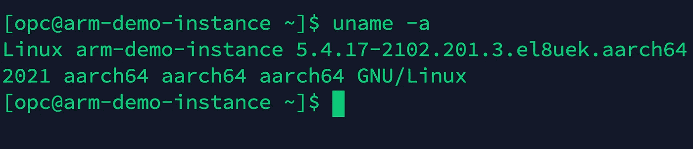
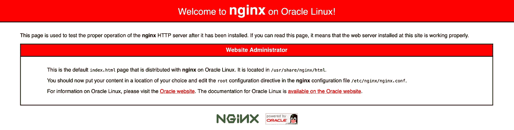

# 在不到两分钟的时间内在新 OCI ARM A1 实例上部署 Nginx

> 原文：<https://medium.com/oracledevs/deploy-nginx-on-the-new-oci-arm-a1-instance-in-under-2-mins-977f68a7984d?source=collection_archive---------0----------------------->

甲骨文最近在甲骨文云基础设施(OCI)上推出了新的基于 ARM 的 A1 实例。新实例在所有商业 OCI 地区都可用。

您可以从这里[开始使用 Oracle Linux 8 云开发者映像](https://blogs.oracle.com/linux/develop-arm-applications-quickly-using-oracle-linux-cloud-developer-image?source=:so:ch:or:awr::::)部署新的 ARM 实例。一旦部署了映像，SSH 进入实例并运行下面的命令来设置 Ngnix 反向代理/web 服务器。

如果套件不可用，请参考[此](https://www.nginx.com/resources/wiki/start/topics/tutorials/install/)链接*【1】*

要检查 Nginx 服务器是否启动并运行，请从浏览器打开*http://<public IP-address-of-instance>*。如果一切顺利，那么你应该可以看到下面的页面

既然我们已经成功地在 OCI ARM 实例上部署了 Nginx，让我们对 web 服务器的性能做一个快速的基准测试。我们将使用 ApacheBench(ab)，一个开源工具来执行测试。

OCI 上 ARM 实例的成本是每个内核每小时 0.01 美元，这使其成为第一个“一分钱一分货”的云实例。例如:您可以使用 OCI A1 ARM 实例，以较低的成本来扩展您的应用程序的 Web 流量。

OCI 安培 A1 处理器支持所有通用工作负载。以下工作负载特别适合 Altra 处理器:

*   Kubernetes 工作负载(OKE) — NGINX，web 应用
*   云原生和 CI/CD
*   网络规模的应用
*   基于 Redis、Memcached 和 MySQL 的工作负载
*   ML 推理
*   媒体编码
*   高性能计算(HPC)

我们在这里使用的 Oracle Linux 云开发人员映像包括以下预装软件和工具:

1.  **最新**[**Oracle Linux 8 for Oracle Cloud infra structure for Arm(aarch 64)**](https://docs.oracle.com/en-us/iaas/images/oracle-linux-8x/)
2.  **语言和数据库连接器**

*   [Java 平台标准版](https://www.oracle.com/java/technologies/java-se-glance.html) (Java SE) 8、11、16
*   Oracle GraalVM 企业版 21
*   Python 3.6
*   Ruby 2.7
*   PHP 7.4
*   Node.js 14
*   GCC 8，10(带有 GCC 工具集 10)
*   去 1.15
*   MySQL 8.0 社区版
*   [Oracle 即时客户端](https://docs.oracle.com/en/database/oracle/oracle-database/19/lacli/arm-sdk-instant-client.html#GUID-B31B6E4B-5D89-457D-9F86-951B8622DB9F) 19.10

**3。甲骨文云基础设施和命令行客户端工具**

*   [甲骨文云基础设施 CLI](https://docs.cloud.oracle.com/iaas/Content/API/Concepts/cliconcepts.htm)
*   [Java](https://docs.cloud.oracle.com/iaas/Content/API/SDKDocs/javasdk.htm) 、 [Python](https://docs.cloud.oracle.com/iaas/Content/API/SDKDocs/pythonsdk.htm) 、 [TypeScript 和 JavaScript](https://docs.oracle.com/en-us/iaas/Content/API/SDKDocs/typescriptsdk.htm) 、 [Go](https://docs.cloud.oracle.com/iaas/Content/API/SDKDocs/gosdk.htm) 和[Ruby](https://docs.cloud.oracle.com/iaas/Content/API/SDKDocs/rubysdk.htm)Oracle Cloud infra structure SDK
*   [Terraform](https://www.terraform.io/docs/index.html) 和 [Oracle 云基础设施 Terraform 提供商](https://docs.oracle.com/en-us/iaas/Content/API/SDKDocs/terraform.htm)
*   [甲骨文云基础设施实用程序](https://docs.cloud.oracle.com/iaas/Content/Compute/References/ociutilities.htm)
*   [Ansible](https://docs.ansible.com/ansible/latest/index.html) 和 [Oracle 云基础设施 Ansible 集合](https://docs.oracle.com/en-us/iaas/Content/API/SDKDocs/ansible.htm)

**4。其他**

*   通过 Yum 为企业版 Linux (EPEL )提供额外的软件包
*   通过 [VNC 服务器](https://docs.oracle.com/en/learn/install-vnc-oracle-linux/#introduction)访问 GUI 桌面
*   提供 [Podman](https://docs.oracle.com/en/operating-systems/oracle-linux/podman/) 、 [Buildah 和 Skopeo](https://docs.oracle.com/en/operating-systems/oracle-linux/podman/) 的容器工具模块
*   [Rclone](https://docs.oracle.com/en/solutions/move-data-to-cloud-storage-using-rclone/index.html#GUID-13EF8474-9517-4043-9638-8EE04FE6C565)
*   [月食 IDE](https://www.eclipse.org/ide/)

参考资料:

[1]安装 Nginx RHEL 或 Oracle Linux—[https://www . Nginx . com/resources/wiki/start/topics/tutorials/Install/](https://www.nginx.com/resources/wiki/start/topics/tutorials/install/)