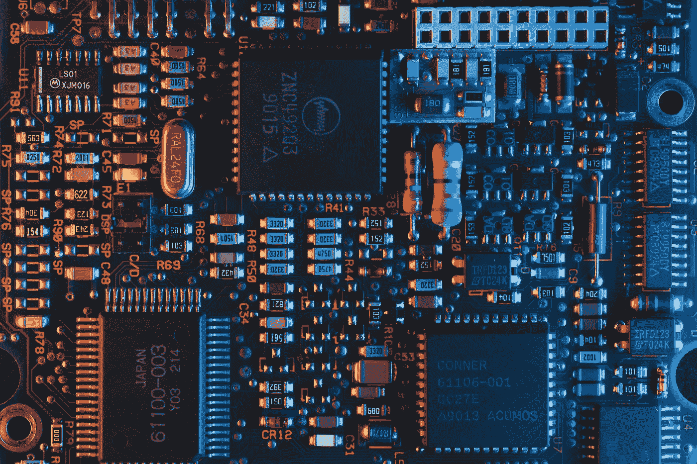
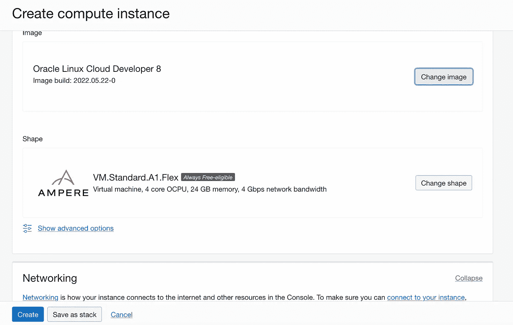

# 在 Oracle 云基础架构 A1 安培 ARM 实例上部署 Redis 和 PostgreSQL

> 原文：<https://medium.com/oracledevs/deploy-redis-postgresql-on-oracle-cloud-infrastructure-a1-ampere-arm-instance-c4d364c87546?source=collection_archive---------2----------------------->

甲骨文云基础设施(OCI)有一个新的[基于 ARM 的 Ampere A1 实例](https://www.oracle.com/au/cloud/compute/arm/)类型。Ampere Altra 处理器是业内首款 80 核 Arm 服务器，每核小时仅售 0.01 美元，每核可灵活配置 1 至 80 个 OCPUs 和 1 至 64 GB 内存。OCI Ampere Altra A1 计算平台提供确定性性能、线性可扩展性和安全架构，具有市场上最佳的性价比。新实例在所有商业 OCI 地区都可用。



Credit : Unsplash

您可以在这里[开始使用 Oracle Linux 8 云开发者映像部署新的 ARM 实例。一旦映像被部署，SSH 进入实例并安装 Podman，它是 Docker 的 OSS 等价物。](https://blogs.oracle.com/linux/develop-arm-applications-quickly-using-oracle-linux-cloud-developer-image?source=:so:ch:or:awr::::)



**在 OCI A1 安臂上安装波德曼实例**

```
$ ssh -i key.priv opc@110.x.x.x$ sudo -s $ yum install podman$ podman login docker.io
Username: 9*******8
Password:
Login Succeeded!
```

**A .使用 pod man*****[*【1】*](https://hub.docker.com/r/arm64v8/postgres/)部署 PostgreSQL 容器

```
$ podman run --name postgres-arm64 -e POSTGRES_PASSWORD=PAssw0rd1234#_ -d docker.io/arm64v8/postgres$ podman container list**CONTAINER ID IMAGE COMMAND CREATED STATUS PORTS NAMES**
d******7 docker.io/arm64v8/postgres:latest postgres 3 minutes ago Up 3 minutes ago postgres-arm64
```

A-1。创建 PostgreSQL 表并插入记录

```
$ podman exec -it postgres-arm64 psql -U postgres -c “CREATE TABLE users(id SERIAL PRIMARY KEY, col1 VARCHAR(200));”$ podman exec -it postgres-arm64 psql -U postgres -c “INSERT INTO public.users(col1) VALUES(‘record1’);”$ podman exec -it postgres-arm64 psql -U postgres -c “INSERT INTO public.users(col1) VALUES(‘record2’);”$ podman exec -it postgres-arm64 psql -U postgres -c “SELECT * FROM public.users;”**id |  col1
----+---------**
  1 | record1
  2 | record2
**(2 rows)**
```

**B .使用 pod man*****[*【2】*](https://hub.docker.com/r/arm64v8/redis/)部署 Redis 容器

```
$ podman run --name redis-arm64 -d docker.io/arm64v8/redis redis-server --save 60 1 --loglevel warning$ podman container list**CONTAINER ID  IMAGE                              COMMAND               CREATED         STATUS             PORTS       NAMES**
d*****7  docker.io/arm64v8/postgres:latest  postgres              20 minutes ago  Up 20 minutes ago              postgres-arm64a*****1  docker.io/arm64v8/redis:latest     redis-server --sa...  11 seconds ago  Up 11 seconds ago              redis-arm64$ podman image list**REPOSITORY                  TAG         IMAGE ID      CREATED       SIZE**
docker.io/arm64v8/redis     latest      5****d  44 hours ago  115 MB
docker.io/arm64v8/postgres  latest      4****c  8 days ago    363 MB
```

B-1。通过 redis-cli 检查

```
$ podman exec -it redis-arm64 redis-cli**127.0.0.1:6379>** ZADD mycolorset 1 white
(integer) 1**127.0.0.1:6379>** ZADD mycolorset 2 black
(integer) 1**127.0.0.1:6379>** ZRANGE mycolorset 0 -1
1) "white"
2) "black"
```

接下来是什么

OCI 自由层

[立即开始使用](https://www.oracle.com/au/cloud/free/)**[3]*OCI 服务。永远免费层包括您可以无限期使用的服务和以下功能:

*   两个具有强大工具的 Oracle 自治数据库，如 Oracle Application Express (APEX)和 Oracle SQL Developer
*   两台 AMD 计算虚拟机
*   最多四个 Arm 安培 A1 计算实例
*   数据块、对象和归档存储、负载平衡器、数据出口、监控和通知

你也可以在我们的 [DevRel 公共松弛频道](https://bit.ly/devrel_slack)上讨论这个和其他话题！

**参考文献:**

[1][https://hub.docker.com/r/arm64v8/postgres/](https://hub.docker.com/r/arm64v8/postgres/)

[https://hub.docker.com/r/arm64v8/redis/](https://hub.docker.com/r/arm64v8/redis/)

[https://www.oracle.com/au/cloud/free/](https://www.oracle.com/au/cloud/free/)