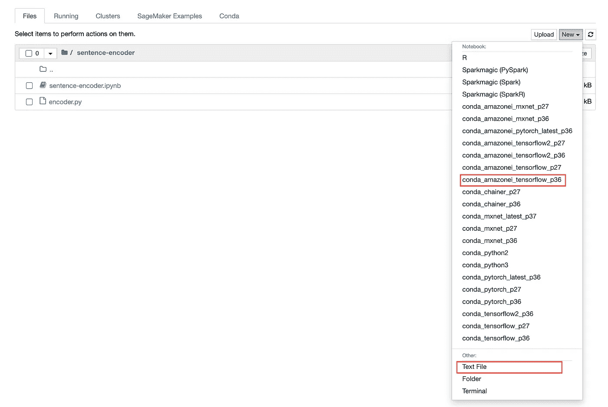

# 在 Amazon Sagemaker 上部署 TensorFlow-hub 模型

> 原文：<https://medium.com/globant/deploy-tensorflow-hub-models-on-amazon-sagemaker-e41c9cc470b5?source=collection_archive---------0----------------------->

## 轻松部署 TensorFlow

在本文中，我们将了解 TensorFlow hub 模型，以及如何在本地和 AWS 云上部署这些模型。

# 介绍

Tensorflow-hub 是一个非常有用的预训练机器学习模型的存储库。这些模型是免费提供的，可以与 Keras 或 TensorFlow 一起使用。

这些模型很容易通过 TensorFlow 服务进行部署。Tensorflow 服务旨在通过简单的 API 接口在生产环境中轻松部署机器学习模型。Tensorflow 模型提供了与 TensorFlow 服务的现成集成。

# 本地执行

我们将首先使用该图像在本地测试 TensorFlow 服务。我们将从一个最常用的模型开始，例如 Google——通用句子编码器。

1.  下载并安装 docker。将 TensorFlow/servings 图像从[拉至此处](https://hub.docker.com/r/tensorflow/serving)。
2.  从[这里](https://tfhub.dev/google/universal-sentence-encoder/4)下载谷歌通用句子编码器 4。
3.  从 zip 文件中提取模型
4.  文件夹结构看起来像这样-


The directory structure of the universal-sentence-encoder model

5.要使用带有 TensorFlow 服务的任何模型，应遵循以下规则

6.创建一个名为“models”的目录和以模型名命名的子目录，如“sentence-encoder”

7.创建一个带有版本号的子目录。默认情况下，它将为版本号最高的型号提供服务。

8.在子目录中复制所有的模型文件。

9.您最终的目录结构将如下所示-


Final directory structure as per TensorFlow servings format

10.现在，我们可以在本地 docker 容器上开始 TensorFlow 服务。运行命令-

```
docker run -t — rm -p 8501:8501 -v “<ABSOLUTE_PATH>/models:/models” -e MODEL_NAME=”sentence-encoder” tensorflow/serving
```

12.现在，您可以发送请求并将模型用作 Rest-API 端点。如果请求成功，那么结果将是一个编码的句子。

```
curl -d '{"instances": ["sample data"]}' -X POST [http://localhost:8501/v1/models/sentence-encoder:predict](http://localhost:8501/v1/models/sentence-encoder:predict)
```


The local deployment result

# Sagemaker 执行

Sagemaker 允许您将模型带到 Sagemaker 环境之外进行训练。因此，一种方法是你可以用 tar.gz 格式的目录结构压缩模型。一旦准备好，您就可以将 zip 上传到 s3 桶，并在部署时传递 S3 位置。

但是这种方法的问题是您需要下载模型，提取并更改目录结构，再次压缩模型并手动上传到 s3 bucket。这导致了大量的开销，而且效率非常低。

但是还有另外一个选择！

Sagemaker 培训作业允许您进行一些处理，并在完成后将模型工件保存回 s3 存储桶。您可以使用 Sagemaker 脚本模式为培训作业提供您的自定义代码。

# 先决条件

我们需要为此设置一些 AWS 服务。

1.  创建一个 S3 桶。

2.创建一个名为“trainingData”的目录和一个名为“train”的子目录

3.上传列车目录下的任意 CSV 文件，文件名为“tranin.csv”。我们只是想要它作为占位符。

4.创建一个 Sagemaker 笔记本实例&将策略“AmazonS3FullAccess”附加到默认的 Sagemaker 角色。

5.创建一个新的 Sagemaker 笔记本，内核为“conda_amazonei_tensorflow_p36”

6.创建一个新的文本文件，并将其保存为“encoder.py”



The directory structure in the Sagemaker notebook instance

# 培训脚本

Sagemaker 提供脚本模式执行，用户提供自己的脚本来执行培训工作。让我们在“encoder.py”中添加脚本。

编码器. py →

```
"""This module is responsible for creating training job and
saving the model back to the s3"""import argparse
import os
import subprocess
import sys
import tensorflow as tf# The tensorflow hub is not installed for sagemaker tensorflow image
# Therefore we need to install the package programmatically
def install(package):
    """
        Function to install python package
        Parameters:
            package (str) : name of package to be installed
         Returns:
            None
        """
    subprocess.check_call(
        [sys.executable, "-q", "-m", "pip", "install", package])# Installing tensorflow-hub package and importing it
install('tensorflow-hub')
import tensorflow_hub as hub# When a training job is created then 
# we can provide a script and execute the training job in script mode.
# This script should be passed as an entry_point while creating a training job.
# The main method should dictate the flow of execution.
if __name__ == '__main__': # To extract command line options if passed any.
    # we can use argparse package
    # Here we are creating an ArgumentParser object.
    parser = argparse.ArgumentParser() # Data, model, and output directories these variables 
    # are set as environment variables by sagemaker.
    # We need to extract these variables and 
    # add it to ArgumentParser object
    parser.add_argument(
        '--output-data-dir',
        type=str,
        default=os.environ.get('SM_OUTPUT_DATA_DIR'))
    parser.add_argument(
        '--model-dir',
        type=str,
        default=os.environ.get('SM_MODEL_DIR'))
    parser.add_argument(
        '--train',
        type=str,
        default=os.environ.get('SM_CHANNEL_TRAIN'))
    parser.add_argument(
        '--test',
        type=str,
        default=os.environ.get('SM_CHANNEL_TEST'))
    # Extracting all known arguments and storing it in args variable
    args, _ = parser.parse_known_args() # Now we need to load the required tensorflow-hub module.
    # Once loaded into memory we get the model as return value
    model = hub.load("[https://tfhub.dev/google/universal-sentence-encoder/4](https://tfhub.dev/google/universal-sentence-encoder/4)") # The model need to be saved as per 
    # sagemaker tensorflow servings format
    # Notice we are saving in directory structure 
    # like <model_name>/<version_number>
    # This method will save the output model to S3 bucket
    tf.saved_model.save(
        model,
        os.path.join(
            args.model_dir,
            "sentence-encoder/1"))
```

# Jupyter 笔记本

首先，让我们设置 S3 配置。

```
s3_bucket = '<Bucket_name>' 
prefix = 'sentence-encoder' # model will be saved under this prefix
training_data_prefix = 'trainingData/train' # training data location 
```

下一步是导入所有需要的包。

```
from sagemaker.tensorflow import TensorFlowfrom sagemaker.tensorflow.model import TensorFlowModelfrom sagemaker import get_execution_rolefrom sagemaker.inputs import TrainingInputfrom sagemaker.predictor import JSONSerializer, Predictor, JSONDeserializerimport sagemakerimport timeimport boto3
```

接下来，我们将创建一个张量流估计器

```
tf_estimator = TensorFlow(entry_point='encoder.py',
                          role=get_execution_role(),
                          instance_count=1,
                          instance_type='ml.m5.large',
                          framework_version='2.0.0',
                          sagemaker_session=sagemaker.Session(),
                          output_path="s3://{}/{}/".format(
                                                 s3_bucket,prefix),
                          py_version='py3')
```

接下来是将训练数据设置为占位符。它实际上不会处理用于训练的数据。

```
train_input = TrainingInput("s3://{}/{}/".format(s3_bucket,
                                             training_data_prefix), 
                            content_type="text/csv")
```

现在，通过调用 fit 方法开始训练作业。

```
job_name = 'sentence-encoder-training-job-' +
            time.strftime("%Y-%m-%d-%H-%M-%S", time.gmtime())print(job_name)tf_estimator.fit({"train":train_input}, job_name=job_name)
```

这将使用 Tensorflow-2 映像开始一项培训工作。一旦准备就绪，它将执行训练脚本。该脚本将

1.  安装张量流-集线器
2.  下载通用句子编码器模型
3.  将模型保存到所需的目录结构中
4.  Sagemaker 将把模型工件保存到 s3 存储桶输出路径中

```
s3://<bucket_name>/<prefix>/<job_name>/model.tar.gz
```

现在所有的神器都准备好了。有了这些存储的工件，模型可以被部署到一个端点—

```
model = TensorFlowModel(
            model_data="s3://{}/{}/{}/output/model.tar.gz".format(
                                         s3_bucket,prefix,job_name),
            role=get_execution_role(),
            framework_version="2.0.0",
            sagemaker_session=sagemaker.Session())predictor = model.deploy(initial_instance_count=1, 
                         instance_type='ml.m5.large', 
                         endpoint_name='sentence-encoder-test')print(predictor.endpoint_name)
```

该过程需要一些时间来完成，并打印端点名称。

一旦模型部署完毕，我们就可以使用 Sagemaker Predictor 进行一些预测—

```
predictor = Predictor(endpoint_name=predictor.endpoint_name,
                      sagemaker_session=sagemaker.Session(),
                      serializer=JSONSerializer(),
                      deserializer=JSONDeserializer())result = predictor.predict({'instances': ['hello world']})print(result)
```

这将返回一个带有编码句子值的 JSON 响应。这意味着模型部署成功。

最后，删除已部署的实例以停止计费。

```
client = boto3.client('sagemaker')response = client.delete_endpoint(
                EndpointName=predictor.endpoint_name)print(response)
```

就是这样！

通过这种方式，您可以利用 Sagemaker 的特性将 TensorFlow 模型部署到 Sagemaker。您可以创建一个管道并自动化这个工作流，这样在不同的环境中部署模型将会非常容易。

# 参考

[https://sagemaker . readthedocs . io/en/stable/frameworks/tensor flow/deploying _ tensor flow _ serving . html](https://sagemaker.readthedocs.io/en/stable/frameworks/tensorflow/deploying_tensorflow_serving.html#how-to-implement-the-pre-and-or-post-processing-handler-s)

https://www.tensorflow.org/tfx/serving/docker

[https://www . tensor flow . org/API _ docs/python/TF/saved _ model/save](https://www.tensorflow.org/api_docs/python/tf/saved_model/save)