# 在 Kubernetes 上部署带有原生 Oracle 云对象存储的灭霸接收

> 原文：<https://medium.com/oracledevs/deploy-thanos-receive-with-native-oci-object-storage-on-kubernetes-829326ea0bc6?source=collection_archive---------0----------------------->


在[之前的文章](/oracledevs/monitoring-multiple-oke-clusters-with-prometheus-thanos-and-grafana-part-2-77d2f0303ea0)中，我们部署了[灭霸](https://thanos.io/)作为[普罗米修斯](https://prometheus.io/)的高可用解决方案和长期存储解决方案。在这个过程中，我们使用 sidecar 模型将灭霸部署为 Prometheus pod 中的 sidecar 容器，以检索指标并将它们写入对象存储。

在本文中，我们将探讨两种替代方案:

1.  我们将使用灭霸接收模型直接从 Prometheus 接收指标数据。
2.  我们还将使用[新的原生 OCI 对象存储集成](https://thanos.io/tip/thanos/storage.md/#oracle-cloud-infrastructure-object-storage)来存储 TSDB 数据。

在这个过程中，我们还将强调 [terraform OKE 模块](https://github.com/oracle-terraform-modules/terraform-oci-oke)中的一个新特性，即使用已定义的标签。

让我们先来看看灭霸的新 OCI 对象存储是如何工作的。

## 灭霸的 OCI 对象存储

经过漫长的酝酿期，我们能够为灭霸项目提供 OCI 本地集成:

这次成功的贡献有两个英雄:

*   Aaron Tam 编写了大部分(如果不是全部)集成。
*   阿维·米勒。你知道你做了什么，我们很感激。

我敢肯定，你想知道为什么你应该使用原生集成时，S3 接口工作得足够好。当配置灭霸的 S3 集成和 OCI 对象存储时，您基本上需要在对象存储配置中指定访问和密钥:

```
type: S3
config:
  bucket: "<bucket_name>"
  endpoint: "<object_storage_namespace>.compat.objectstorage.<region>.oraclecloud.com"
  region: "<region>"
  aws_sdk_auth: false
  access_key: "access_key"
  insecure: false
  signature_version2: false
  secret_key: "secret_key"
```

然而，随着新的灭霸 OCI 集成，您有不同的身份验证选项。第一个也是最明显的一个是使用“原始”提供程序，您可以在其中指定密钥:

```
type: OCI
config:
  provider: "raw"
  bucket: ""
  compartment_ocid: ""
  tenancy_ocid: ""
  user_ocid: ""
  region: ""
  fingerprint: ""
  privatekey: ""
  passphrase: ""
```

今天，您必须直接指定它们。但是我们可以想象，在后续的改进版本中，这里指定的用于认证的参数可以改为来自秘密。所述秘密可以被加密存储在 OCI 保险库中，并且通过外部秘密操作器而不是来检索[。当这快乐的一天最终到来时，你可以轮换你的私人钥匙和指纹等。](/oracledevs/using-the-external-secrets-operator-with-oci-kubernetes-and-oci-vault-6865f2e1fe35)

新 OCI 集成中的第二个也是更安全的选项是使用 OCI *instance_principal* 。

```
type: OCI
config:
  provider: "instance-principal"
  bucket: "thanos"
  compartment_ocid: "ocid1.compartment.oc1..a"
```

实例主体的工作前提是，因为您(或您的应用程序)将从一个计算实例进行一些 API 调用，所以您可以授权这个计算实例进行这些调用。通过这种方式，您不需要将您的密钥隐藏在秘密或文件中，也不需要使用这种原始的方法。要使用实例主体方法，您需要做两件事:

1.  创建一个动态组，以便计算实例成为其成员。
2.  创建策略，为动态组提供必要的权限，以便与所需的任何 OCI 服务进行交互(以及在哪个级别)。

有几种方法可以指定此动态组成员资格:

*   使用实例 OCID，例如 instance . id = ' ocid 1 . instance . oc1…'
*   使用实例的隔离专区 OCID，例如 instance . compartment . id = ' ocid 1 . instance . oc1…'
*   使用已定义的标签:标签。<tagnamespace>。<tagkey>。value = '【T2]'</tagkey></tagnamespace>

如果您想进行测试，或者如果您的集群很小，但确实不可伸缩，您可以使用上面的第一个选项。第二个选项太宽泛，会使隔离专区中任何区域的任何实例成为这个动态组的成员，甚至是那些不属于您的集群的实例。您可以在开发人员环境中使用它——在那里您想要测试，并且您已经专门为您的开发环境创建了一个区间。

现在，当你排除那些不太好的选项时，剩下的，无论多么复杂，都将是你选择的解决方案。因此，使用已定义的标签是推荐的方法。在 OKE 设置中，只要您的 worker 节点具有必要的已定义标记，它们就会成为这个动态组的成员。我们稍后会更详细地讨论这个问题，但是现在请耐心听我说。

一旦定义了组成员，我们就需要授予这个动态组对对象存储的访问权。您可以通过使用以下语句创建策略来实现这一点:

```
Allow dynamic-group thanos to manage buckets in compartment id ocid1.compartment.oc1..a
Allow dynamic-group thanos to manage objects in compartment id ocid1.compartment.oc1..a
```

现在，工作节点有足够的权限与 OCI 对象存储进行交互。但是我们不希望*所有的*工作者节点都成为这个动态组的一部分并拥有访问权。那么，我们如何施加这种限制，以便只有某些节点可以成功运行灭霸？让我们绕个小圈子，深入了解 OKE 节点池。

## OKE 模块、节点池和定义的标记

创建 OKE (Kubernetes)集群时，可以使用节点池对工作节点进行分组和管理。节点池本质上是一组计算实例，它们与集群的工作节点具有相同的配置和功能。节点池中的计算实例具有相同的以下(但不限于)属性:

*   Kubernetes 版本
*   用于设置工作节点的图像
*   计算形状，例如分配的 OCPUs、内存和块卷的数量，以及是使用虚拟机还是裸机
*   CPU 架构，例如英特尔、AMD、ARM、GPU
*   节点标签
*   自由形式和定义的标签

在 OKE 群集中，您可以有许多节点池，每个节点池都有自己的属性和大小，例如，下图显示了 3 个不同形状和大小的节点池，以满足混合性能工作负载要求:

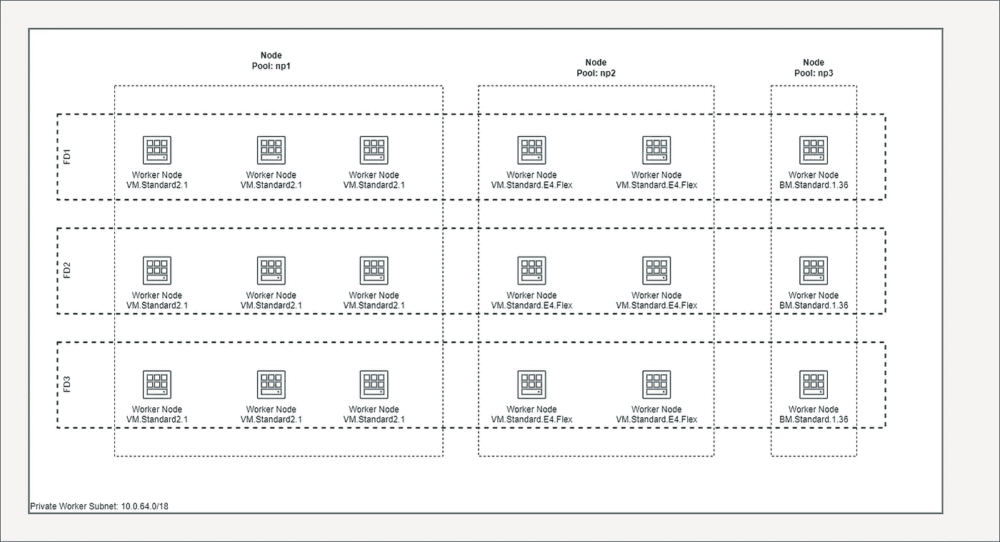

Multiple node pools with different shapes and sizes

同样，您可以拥有混合体系结构的节点池，所有节点池都在同一个群集中:

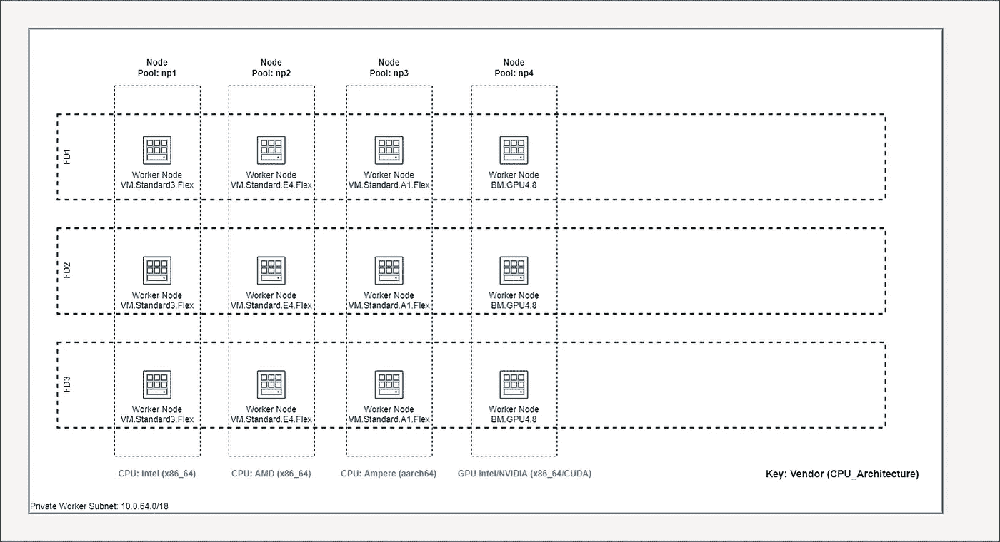

Multiple node pools with different CPU architectures

通过使用标签，您可以[确保运行特定应用程序的特定 pod 位于最适合它们或最符合您需求的特定工作节点](https://kubernetes.io/docs/tasks/configure-pod-container/assign-pods-nodes/#create-a-pod-that-gets-scheduled-to-your-chosen-node)。

将这两者结合起来，您可以实现专用的节点池，您可以通过[特定于节点池的云初始化](https://github.com/oracle-terraform-modules/terraform-oci-oke/blob/main/docs/cloudinit.adoc#specifying-a-cloud-init-script-for-specific-node-pools)对其进行进一步调优，例如:

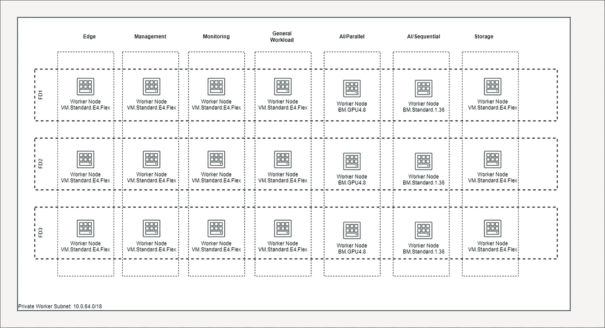

通过这种方式，您可以调整集群的规模，并限制使用昂贵的资源，如 GPU 节点或裸机(如果需要)。

在我们的用例中，我们希望进一步限制灭霸 pod 仅在特定节点池的工作节点上运行。为此，我们为节点池配置了已定义的标记。有了定义的标记，我们现在可以创建一个动态组，它具有对对象存储的实例主体访问权。

## 理论够了，给我看看真正的东西

让我们从创建已定义的标签开始。我们将在这里使用 OCI 控制台，但您也可以使用 Terraform、CLI 等来创建您的标签。在 OCI 控制台中搜索标记名称空间并创建一个:

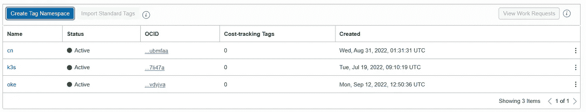

我们在这里使用的是“cn”(cloud native 的缩写)。单击标签并创建标签关键字定义:

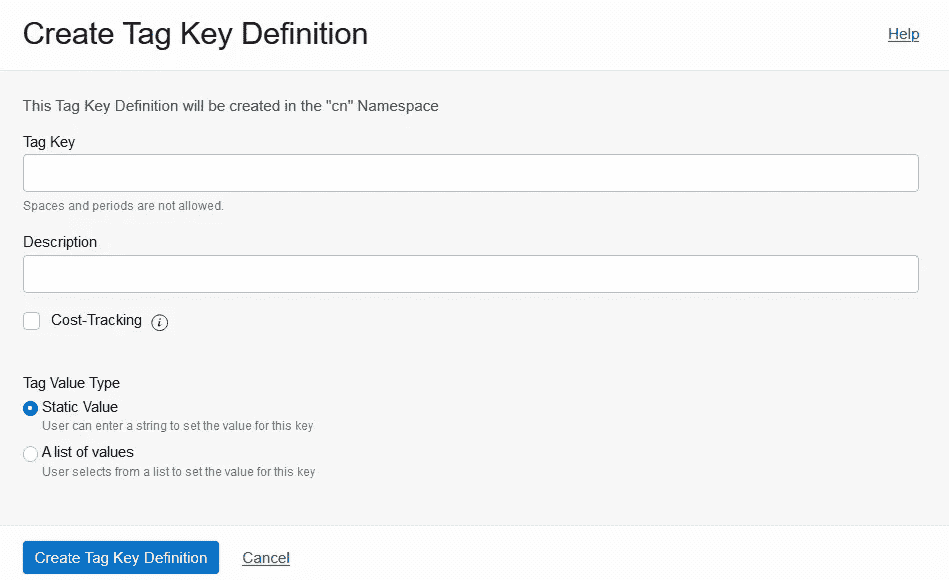

您可以使用一个静态值，也可以进一步将其限制为一个特定的值列表。在这种情况下，我将使用标记键“role ”,它有一个静态值:

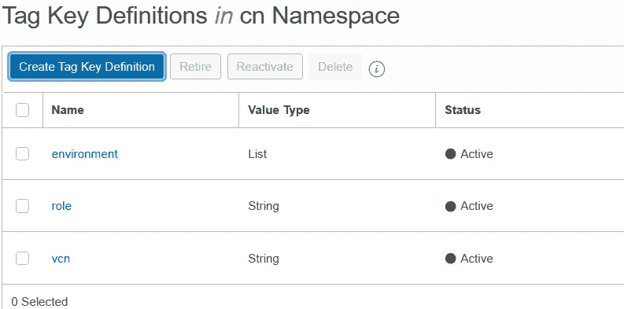

tag keys

最后，在对象存储中创建一个名为“thanos”的桶，用于存储 TSDB 块。

## 创建 OKE 集群

接下来，使用 [Terraform oke 模块](https://github.com/oracle-terraform-modules/terraform-oci-oke)，使用变量输入文件 terra form . TF vars([sample here](https://github.com/oracle-terraform-modules/terraform-oci-oke/blob/main/terraform.tfvars.example))创建几个节点池:

```
allow_worker_ssh_access      = true
node_pools = {
  np1 = {
    shape                  = "VM.Standard.E4.Flex",
    ocpus                  = 2,
    memory                 = 32,
    autoscale              = true,
    node_pool_size         = 1,
    max_node_pool_size     = 3,
    boot_volume_size       = 150,
    label                  = { app = "prometheus", pool = "np1" },
    node_defined_tags      = { "cn.role" = "prometheus" }
  }
  np2 = {
    shape                  = "VM.Standard.E4.Flex",
    ocpus                  = 2,
    memory                 = 32,
    autoscale              = true,
    node_pool_size         = 1,
    max_node_pool_size     = 3,
    boot_volume_size       = 150,
    label                  = { app = "thanos", pool="np2"},
    node_defined_tags      = { "cn.role" = "thanos" }
  }
}
```

还要将“allow_worker_ssh_access”设置为 *true* ，这样我们可以稍后测试实例主体。运行 Terraform apply 创建集群和节点池。您可以稍后禁用此功能。

从基础架构的角度来看，这是我们想要实现的目标:

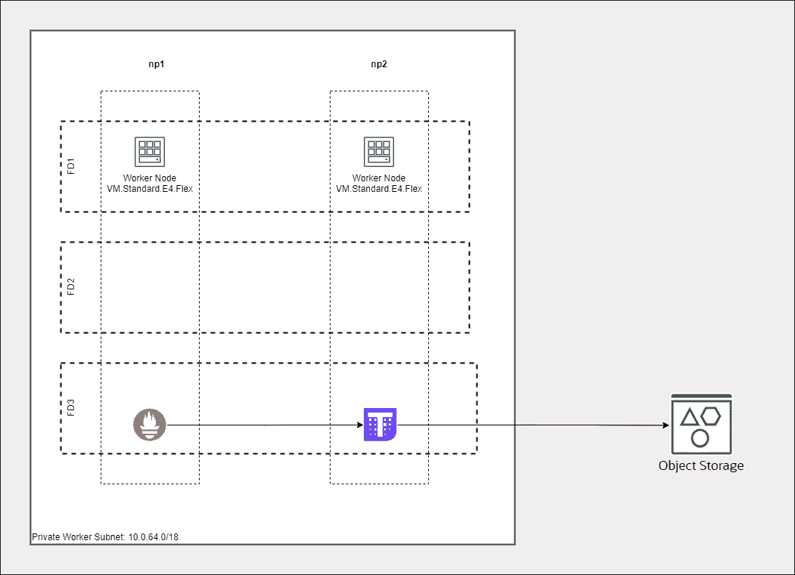

普罗米修斯舱将在节点池 1 的工作节点上运行，灭霸舱将在节点池 2 的工作节点上运行。

从功能角度来看，这就是我们想要实现的目标(在本文中，我们将跳过 Nginx 入口控制器和应用程序单元):

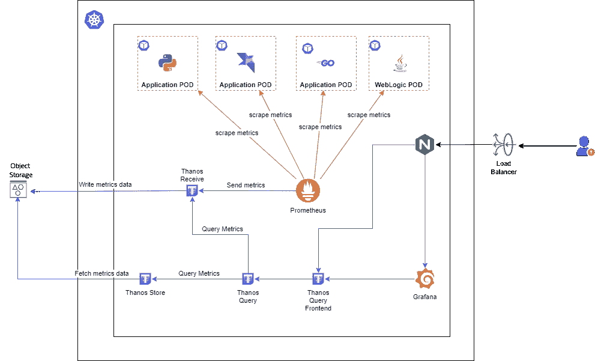

我们希望 Prometheus 使用它的[远程写特性](https://prometheus.io/docs/practices/remote_write/#remote-write-characteristics)将收集到的指标发送给灭霸接收器，后者再将其写入 OCI 对象存储。

使用 OCI 控制台检查节点池 1 中工作节点的 Kubernetes 标签:

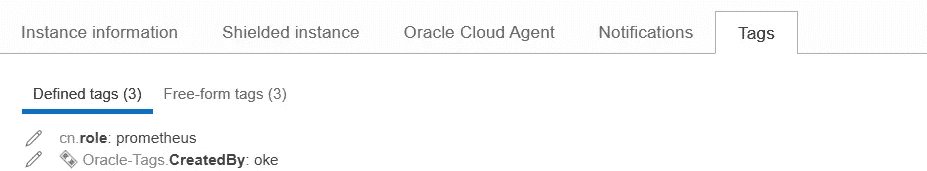

在节点池 2 中:

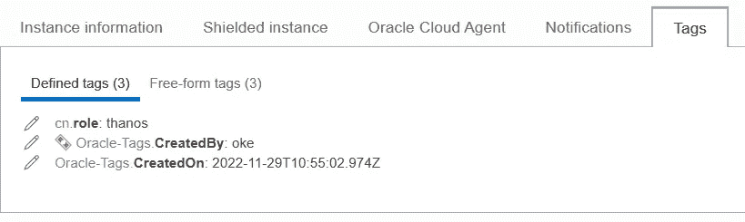

## 创建动态组和策略来访问对象存储

创建动态组并设置以下规则:

```
tag.cn.role.value='thanos'
```

例如

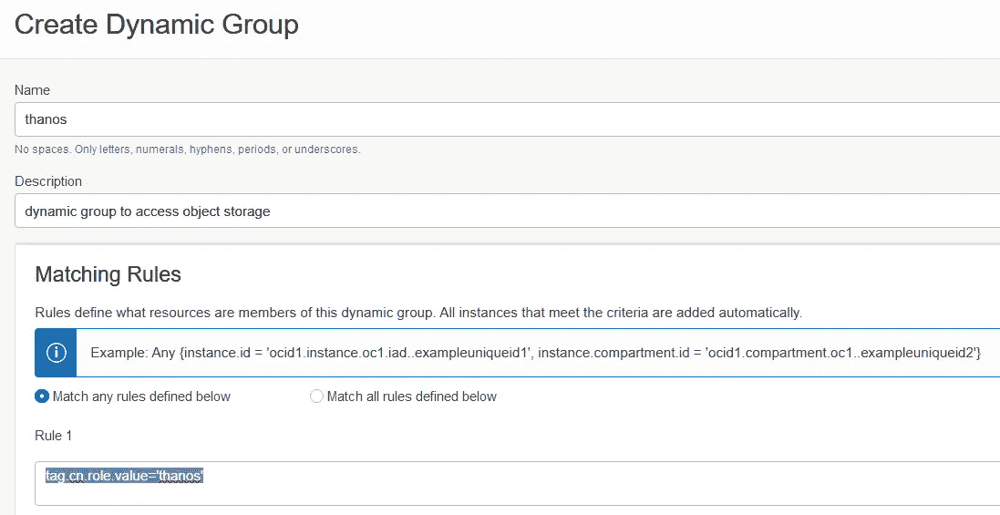

接下来，创建一个策略，授予动态组对对象存储的访问权限。该策略需要以下两个语句:

```
Allow dynamic-group thanos to manage buckets in compartment id ocid1.compartment.oc1..a
Allow dynamic-group thanos to manage objects in compartment id ocid1.compartment.oc1..a
```

对 np2 中的工作节点使用云 shell 或 ssh，并安装 OCI cli，以便可以测试实例主体:

```
sudo dnf install -y oracle-olcne-release-el8
sudo dnf config-manager --disable ol8_olcne13
sudo dnf config-manager --disable ol8_olcne14
sudo dnf config-manager --enable ol8_olcne15
sudo dnf install -y python3-oci-cli
```

将身份验证方法设置为 instance_principal，并测试对对象存储的访问:

```
export OCI_CLI_AUTH=instance_principal
oci os bucket list --compartment-id ocid1.compartment.oc1..a --namespace-name <object storage namespace>
```

您可以在 OCI 控制台的租赁页面中找到对象存储命名空间。您应该会看到如下所示的内容:

```
{
  "data": [
    {
      "compartment-id": "ocid1.compartment.oc1..aa",
      "created-by": "",
      "defined-tags": null,
      "etag": "",
      "freeform-tags": null,
      "name": "thanos",
      "namespace": "",
      "time-created": ""
    }
  ]
}
```

如果您可以检索该存储桶，那么 instance_principal 正在节点池上工作，我们可以继续进行灭霸配置。如果您愿意，可以跳过这个测试，因为它的目的是说明实例主体。

## 部署灭霸

登录到操作员主机或使用云外壳并创建一个命名空间:

```
kubectl create namespace monitoring
```

创建一个名为 storage.yaml 的文件，并相应地填写隔离专区 id 值:

```
type: OCI
config:
  provider: "instance-principal"
  bucket: "thanos"
  compartment_ocid: "ocid1.compartment.oc1.."
```

请注意，这是最低配置。您可以进一步配置其他参数。请参考[文档](https://thanos.io/tip/thanos/storage.md/#oracle-cloud-infrastructure-object-storage)。

接下来，从中创造一个秘密:

```
kubectl -n monitoring create secret generic thanos-objstore-config --from-file=objstore.yml=storage.yaml
```

添加比特纳米灭霸掌舵图表回购:

```
helm repo add bitnami https://charts.bitnami.com/bitnami
```

生成值清单文件:

```
helm show values bitnami/thanos > thanos.yaml
```

编辑 thanos.yaml 文件并设置以下内容:

```
image
  tag: 0.29.0
existingObjstoreSecret: "thanos-objstore-config"    
queryFrontend:
  enabled: true
bucketweb:
  enabled: true
compactor:
  enabled: true
storegateway:
  enabled: true
receive:
  enabled: true
```

请记住，我们还希望将灭霸 pod 限制到节点池 2 中的工作节点。为此，在 thanos.yaml 中查找所有的节点选择器，并按如下方式设置:

```
 nodeSelector:
    app: thanos
```

nodeSelector 将确保灭霸 pods 位于标签为 *app = "thanos"* 的工作节点上，在本例中，工作节点位于节点池 2 中。这确保了灭霸 pod 可以使用实例主体方法来访问 OCI 对象存储。你问这个 *app = "thanos"* 从哪里来？创建节点池时，我们将其设置为标签:

```
np2 = {
    shape                  = "VM.Standard.E4.Flex",
    ocpus                  = 2,
    memory                 = 32,
    autoscale              = true,
    node_pool_size         = 1,
    max_node_pool_size     = 3,
    boot_volume_size       = 150,
    label                  = { app = "thanos", pool="np2"},
    node_defined_tags      = { "cn.role" = "thanos" }
  }
```

我们现在可以部署灭霸:

```
helm install thanos bitnami/thanos --namespace monitoring -f thanos.yaml
```

使用标签查找 thanos 的节点池:

```
k get nodes --show-labels | grep app=thanos
10.0.99.78     Ready    node    44m   v1.23.4   app=thanos,beta.kubernetes.io/arch=amd64,beta.kubernetes.io/instance-type=VM.Standard.E4.Flex,beta.kubernetes.io/os=linux
```

让我们验证灭霸吊舱是否降落在正确的工作节点上:

```
kubectl -n monitoring describe pod thanos-query-69854d896d-lrlzh
Name:         thanos-query-69854d896d-lrlzh
Namespace:    monitoring
Priority:     0
Node:         10.0.99.78/10.0.99.78
```

最后，检查豆荚。它们都应该已经成功启动:

```
kubectl -n monitoring get pods
NAME                                     READY   STATUS    RESTARTS   AGE
thanos-bucketweb-846685d5df-wzgfs        1/1     Running   0          84s
thanos-compactor-85c7cbf4c6-zslwb        1/1     Running   0          84s
thanos-query-69854d896d-lrlzh            1/1     Running   0          84s
thanos-query-frontend-86699dcbfb-pczxr   1/1     Running   0          84s
thanos-receive-0                         1/1     Running   0          84s
thanos-storegateway-0                    1/1     Running   0          84s
```

如果您希望更有选择性，真正需要实例主体访问的三个单元是那些将与对象存储交互的单元:

*   压土机
*   接收
*   商店网关

## 部署普罗米修斯

我们将使用 kube-prometheus-stack 部署 prometheus:

```
helm repo add kps https://prometheus-community.github.io/helm-charts
```

生成值清单文件:

```
helm show values kps/kube-prometheus-stack > kps.yaml
```

编辑 kps.yaml 文件并设置以下内容:

```
prometheus
  prometheusSpec
    serviceMonitorSelectorNilUsesHelmValues: false
    podMonitorSelectorNilUsesHelmValues: false
    remoteWrite:
     - url: http://thanos-receive.monitoring.svc.cluster.local:19291/api/v1/receive
```

正如我们对灭霸所做的那样，找到节点选择器并进行设置，以确保 Prometheus pods 使用我们为节点池 1 指定的相同标签(app = "prometheus ")放置在节点池 1 中的工作节点上:

```
 nodeSelector:
      app: prometheus
```

我们现在可以部署普罗米修斯:

```
helm install prometheus kps/kube-prometheus-stack --namespace monitoring -f kps.yaml
```

验证 pod 正在运行:

```
kubectl -n monitoring get pods

NAME                                                     READY   STATUS    RESTARTS       AGE
alertmanager-prometheus-kube-prometheus-alertmanager-0   2/2     Running   1 (107s ago)   2m8s
prometheus-grafana-66b6bf7789-249vn                      3/3     Running   0              2m22s
prometheus-kube-prometheus-operator-549866c8dd-dbd88     1/1     Running   0              2m22s
prometheus-kube-state-metrics-7944d98645-4q77n           1/1     Running   0              2m22s
prometheus-prometheus-kube-prometheus-prometheus-0       2/2     Running   0              2m8s
prometheus-prometheus-node-exporter-4jms5                1/1     Running   0              2m21s
prometheus-prometheus-node-exporter-svbs4                1/1     Running   0              2m22s
thanos-bucketweb-846685d5df-wzgfs                        1/1     Running   0              16m
thanos-compactor-85c7cbf4c6-zslwb                        1/1     Running   0              16m
thanos-query-69854d896d-lrlzh                            1/1     Running   0              16m
thanos-query-frontend-86699dcbfb-pczxr                   1/1     Running   0              16m
thanos-receive-0                                         1/1     Running   0              16m
thanos-storegateway-0                                    1/1     Running   0              16m
```

让我们看看普罗米修斯的日志:

```
kubectl -n monitoring logs -f prometheus-prometheus-kube-prometheus-prometheus-0
ts=2022-11-29T12:07:30.244Z caller=main.go:543 level=info msg="Starting Prometheus Server" mode=server version="(version=2.39.1, branch=HEAD, revision=dcd6af9e0d56165c6f5c64ebbc1fae798d24933a)"
ts=2022-11-29T12:07:30.244Z caller=main.go:548 level=info build_context="(go=go1.19.2, user=root@273d60c69592, date=20221007-15:57:09)"
ts=2022-11-29T12:07:30.244Z caller=main.go:549 level=info host_details="(Linux 5.4.17-2136.310.7.1.el8uek.x86_64 #2 SMP Wed Aug 17 15:14:08 PDT 2022 x86_64 prometheus-prometheus-kube-prometheus-prometheus-0 (none))"
ts=2022-11-29T12:07:30.244Z caller=main.go:550 level=info fd_limits="(soft=1048576, hard=1048576)"
ts=2022-11-29T12:07:30.244Z caller=main.go:551 level=info vm_limits="(soft=unlimited, hard=unlimited)"
ts=2022-11-29T12:07:30.246Z caller=web.go:559 level=info component=web msg="Start listening for connections" address=0.0.0.0:9090
ts=2022-11-29T12:07:30.247Z caller=main.go:980 level=info msg="Starting TSDB ..."
ts=2022-11-29T12:07:30.248Z caller=tls_config.go:231 level=info component=web msg="TLS is disabled." http2=false
ts=2022-11-29T12:07:30.252Z caller=head.go:551 level=info component=tsdb msg="Replaying on-disk memory mappable chunks if any"
ts=2022-11-29T12:07:30.252Z caller=head.go:595 level=info component=tsdb msg="On-disk memory mappable chunks replay completed" duration=2.955µs
ts=2022-11-29T12:07:30.252Z caller=head.go:601 level=info component=tsdb msg="Replaying WAL, this may take a while"
ts=2022-11-29T12:07:30.252Z caller=head.go:672 level=info component=tsdb msg="WAL segment loaded" segment=0 maxSegment=0
ts=2022-11-29T12:07:30.252Z caller=head.go:709 level=info component=tsdb msg="WAL replay completed" checkpoint_replay_duration=24.287µs wal_replay_duration=264.923µs wbl_replay_duration=161ns total_replay_duration=316.331µs
ts=2022-11-29T12:07:30.253Z caller=main.go:1001 level=info fs_type=XFS_SUPER_MAGIC
ts=2022-11-29T12:07:30.253Z caller=main.go:1004 level=info msg="TSDB started"
ts=2022-11-29T12:07:30.253Z caller=main.go:1184 level=info msg="Loading configuration file" filename=/etc/prometheus/config_out/prometheus.env.yaml
ts=2022-11-29T12:07:30.261Z caller=dedupe.go:112 component=remote level=info remote_name=c6fe10 url=http://thanos-receive.monitoring.svc.cluster.local:19291/api/v1/receive msg="Starting WAL watcher" queue=c6fe10
ts=2022-11-29T12:07:30.261Z caller=dedupe.go:112 component=remote level=info remote_name=c6fe10 url=http://thanos-receive.monitoring.svc.cluster.local:19291/api/v1/receive msg="Starting scraped metadata watcher"
ts=2022-11-29T12:07:30.261Z caller=dedupe.go:112 component=remote level=info remote_name=c6fe10 url=http://thanos-receive.monitoring.svc.cluster.local:19291/api/v1/receive msg="Replaying WAL" queue=c6fe10
ts=2022-11-29T12:07:30.261Z caller=kubernetes.go:326 level=info component="discovery manager scrape" discovery=kubernetes msg="Using pod service account via in-cluster config"
ts=2022-11-29T12:07:30.261Z caller=kubernetes.go:326 level=info component="discovery manager scrape" discovery=kubernetes msg="Using pod service account via in-cluster config"
ts=2022-11-29T12:07:30.262Z caller=kubernetes.go:326 level=info component="discovery manager scrape" discovery=kubernetes msg="Using pod service account via in-cluster config"
ts=2022-11-29T12:07:30.262Z caller=kubernetes.go:326 level=info component="discovery manager notify" discovery=kubernetes msg="Using pod service account via in-cluster config"
ts=2022-11-29T12:07:30.357Z caller=main.go:1221 level=info msg="Completed loading of configuration file" filename=/etc/prometheus/config_out/prometheus.env.yaml totalDuration=103.821285ms db_storage=1.363µs remote_storage=824.336µs web_handler=500ns query_engine=841ns scrape=325.239µs scrape_sd=1.202864ms notify=18.124µs notify_sd=425.578µs rules=94.403577ms tracing=6.311µs
ts=2022-11-29T12:07:30.357Z caller=main.go:965 level=info msg="Server is ready to receive web requests."
ts=2022-11-29T12:07:30.357Z caller=manager.go:943 level=info component="rule manager" msg="Starting rule manager..."
ts=2022-11-29T12:07:30.387Z caller=main.go:1184 level=info msg="Loading configuration file" filename=/etc/prometheus/config_out/prometheus.env.yaml
ts=2022-11-29T12:07:30.391Z caller=kubernetes.go:326 level=info component="discovery manager scrape" discovery=kubernetes msg="Using pod service account via in-cluster config"
ts=2022-11-29T12:07:30.391Z caller=kubernetes.go:326 level=info component="discovery manager scrape" discovery=kubernetes msg="Using pod service account via in-cluster config"
ts=2022-11-29T12:07:30.392Z caller=kubernetes.go:326 level=info component="discovery manager scrape" discovery=kubernetes msg="Using pod service account via in-cluster config"
ts=2022-11-29T12:07:30.392Z caller=kubernetes.go:326 level=info component="discovery manager notify" discovery=kubernetes msg="Using pod service account via in-cluster config"
ts=2022-11-29T12:07:30.471Z caller=main.go:1221 level=info msg="Completed loading of configuration file" filename=/etc/prometheus/config_out/prometheus.env.yaml totalDuration=84.211257ms db_storage=1.412µs remote_storage=78.379µs web_handler=300ns query_engine=942ns scrape=88.718µs scrape_sd=892.646µs notify=11.611µs notify_sd=229.146µs rules=78.660912ms tracing=6.243µs
ts=2022-11-29T12:07:36.032Z caller=dedupe.go:112 component=remote level=info remote_name=c6fe10 url=http://thanos-receive.monitoring.svc.cluster.local:19291/api/v1/receive msg="Done replaying WAL" duration=5.771154497s
```

我们可以看到普罗米修斯能够到达灭霸接收站。让我们几个小时后回来，当普罗米修斯开始发送 TSDB 块到灭霸接收:

```
ts=2022-11-29T15:07:34.926Z caller=compact.go:519 level=info component=tsdb msg="write block" mint=1669723651686 maxt=1669730400000 ulid=01GK1YVNABQ27EXKYSPZ7PAW7Q duration=323.274ms
ts=2022-11-29T15:07:34.944Z caller=head.go:1192 level=info component=tsdb msg="Head GC completed" caller=truncateMemory duration=16.760054ms
ts=2022-11-29T17:00:01.420Z caller=compact.go:519 level=info component=tsdb msg="write block" mint=1669730400427 maxt=1669737600000 ulid=01GK259HMD5R7ZYXNAN5Q2HT9B duration=382.941853ms
ts=2022-11-29T17:00:01.439Z caller=head.go:1192 level=info component=tsdb msg="Head GC completed" caller=truncateMemory duration=18.006233ms
ts=2022-11-29T19:00:01.443Z caller=compact.go:519 level=info component=tsdb msg="write block" mint=1669737600427 maxt=1669744800000 ulid=01GK2C58WCJBJD33MW1MSHBM4X duration=406.65534ms
ts=2022-11-29T19:00:01.458Z caller=head.go:1192 level=info component=tsdb msg="Head GC completed" caller=truncateMemory duration=13.797336ms
```

在灭霸接收日志中，我们可以看到它将 TSDB 数据块上传到 OCI 对象存储:

```
level=info ts=2022-11-29T15:07:35.634586334Z caller=compact.go:519 component=receive component=multi-tsdb tenant=default-tenant msg="write block" mint=1669723651686 maxt=1669730400000 ulid=01GK1YVNY44QT5JNJM8SS4RWV1 duration=398.359924ms
level=info ts=2022-11-29T15:07:35.656935812Z caller=head.go:1192 component=receive component=multi-tsdb tenant=default-tenant msg="Head GC completed" caller=truncateMemory duration=20.755986ms
level=info ts=2022-11-29T15:07:52.64378284Z caller=shipper.go:334 component=receive component=multi-tsdb tenant=default-tenant msg="upload new block" id=01GK1YVNY44QT5JNJM8SS4RWV1
level=info ts=2022-11-29T17:00:01.477942982Z caller=compact.go:519 component=receive component=multi-tsdb tenant=default-tenant msg="write block" mint=1669730400427 maxt=1669737600000 ulid=01GK259HKJBTJET2W57PG7CNDH duration=467.532064ms
level=info ts=2022-11-29T17:00:01.501835652Z caller=head.go:1192 component=receive component=multi-tsdb tenant=default-tenant msg="Head GC completed" caller=truncateMemory duration=22.437929ms
level=info ts=2022-11-29T17:00:22.584036806Z caller=shipper.go:334 component=receive component=multi-tsdb tenant=default-tenant msg="upload new block" id=01GK259HKJBTJET2W57PG7CNDH
level=info ts=2022-11-29T19:00:01.523908074Z caller=compact.go:519 component=receive component=multi-tsdb tenant=default-tenant msg="write block" mint=1669737600427 maxt=1669744800000 ulid=01GK2C58W441B8RY8HTKNYT9DJ duration=495.405003ms
level=info ts=2022-11-29T19:00:01.540641622Z caller=head.go:1192 component=receive component=multi-tsdb tenant=default-tenant msg="Head GC completed" caller=truncateMemory duration=14.962991ms
level=info ts=2022-11-29T19:00:22.500773034Z caller=shipper.go:334 component=receive component=multi-tsdb tenant=default-tenant msg="upload new block" id=01GK2C58W441B8RY8HTKNYT9DJ
```

最后，验证 TSDB 数据块是否已写入:

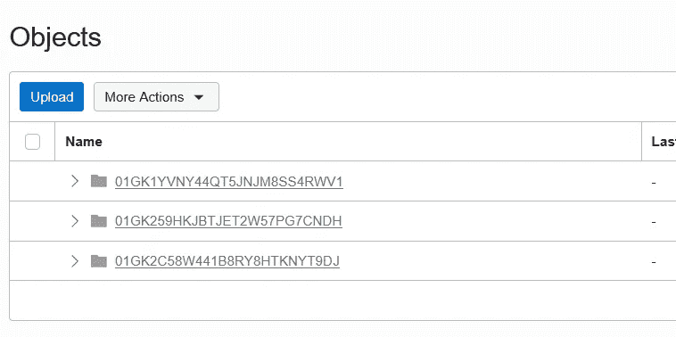

这显示了灭霸接收和 OCI 对象存储之间使用新的 OCI 对象存储集成功能的成功集成。

## 使用 Grafana 访问

我们现在可以访问 Grafana，查看我们的集群的运行情况。默认情况下，预装 kube-prometheus-stack 的 Grafana 将被配置为使用 prometheus 作为其默认数据源。由于灭霸查询使用了一个 Prometheus 兼容的 API，我们只需要添加一个 Prometheus 类型的新数据源，并将其指向灭霸查询前端服务 URL:

```
http://thanos-query-frontend.monitoring:9090/
```

确保灭霸数据源设置为默认数据源:

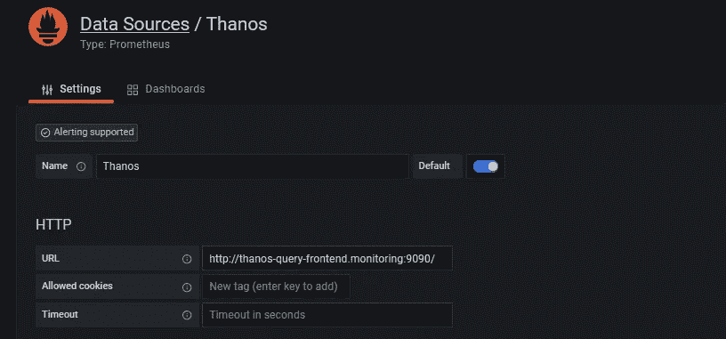

保存并测试以确保数据源正常工作。您现在可以查看预先构建的仪表板:

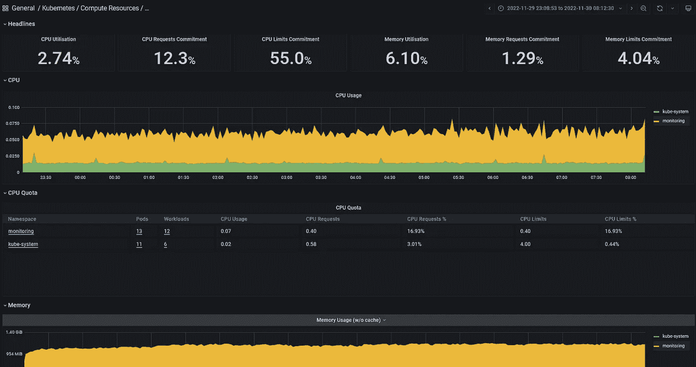

## 推荐

1.  不要混淆标签和标记。Kubernetes 使用标签来将 pod 分配给某些节点，而 OCI 使用标签来确定计算节点的动态组成员资格(是否)。
2.  当通过策略向动态组分配权限时，请始终使用最小权限原则。在这种情况下，它将确保每个组件都有最低限度的安全权限去做它们应该做的事情，仅此而已。
3.  灭霸附带了一些组件(sidecar、receive、Storegateway、Query、Query Frontend 等)，可以部署在一些架构中(Sidecar、Receive)。当与基础架构/云相结合时，可以提供更多的部署选项。因此，请花时间了解每个组件的用途，以及如何最好地使用它们来确定最适合您的体系结构。不要随随便便地相信已经出版的东西。

## 摘要

在本文中，我们向您展示了三件主要的事情:

1.  如何使用新的 OCI 对象存储与灭霸集成，这两种身份验证方法来配置它们。
2.  如何配置和使用 Prometheus 远程写入将 TSDB 块发送到灭霸接收器，以及如何在带有 OCI 对象存储的 OKE 上使用它们。
3.  如何使用新定义的标记功能创建专门的节点池，如果您需要对工作节点上的某些 OCI 服务进行身份验证访问，如何使用实例主体功能来配置更受限制和更安全的访问。

以上三者的结合开启了一个全新的监控机会领域:

*   现在，您可以拥有一个更加灵活的架构，可以同时监控在 OCI 不同地区运行的多个 Kubernetes 集群，或者从一个位置监控其他云提供商的集群。
*   您还可以监控私有数据中心中现有的 Kubernetes 集群，而无需在防火墙上打孔。相反，你可以让普罗米修斯直接将度量数据发送到灭霸接收器，该接收器可以在 OCI 本地或远程运行。
*   您可以使用 Prometheus 监控任何类型的系统，而不需要整个 Kubernetes 集群。你所需要做的就是告诉普罗米修斯你的接收器在哪里运行，以及如何传送你的数据。想象一下运行在低功耗、低计算、低内存和低存储边缘的系统。您现在可以监控它们，并以更低的成本将它们的长期指标存储在 OCI 对象存储中。

在以后的文章中，我们将探索其中的一些场景。同时，您还可以阅读 Medallia(他也使用 OCI)使用灭霸来监控 40 个数据中心的 Kubernetes 集群:

我想借此机会再次感谢我的同事 Aaron 和 Avi，感谢他们努力使 OCI 对象存储公司成为灭霸存储公司的一等公民。

如果你对 Oracle 开发人员在他们的自然环境中发生的事情感到好奇，请加入我们的公共休闲频道！我们不介意成为你的鱼缸🐠