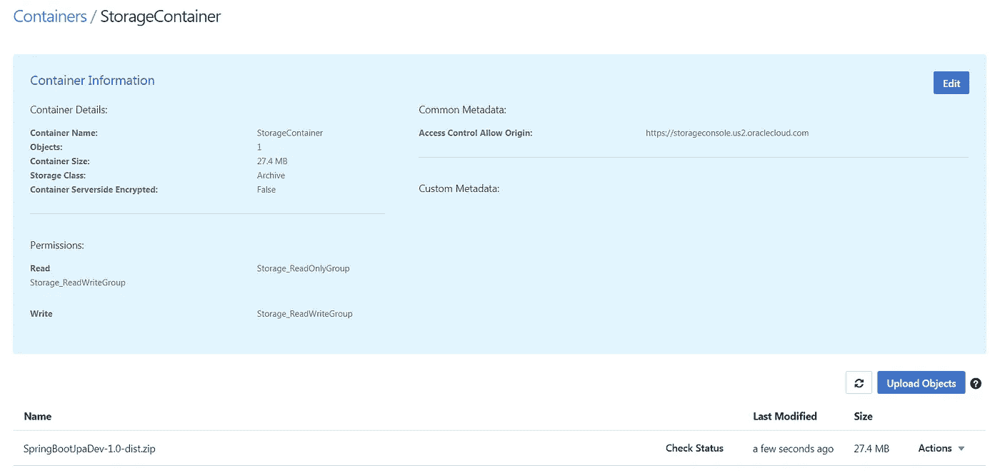

# 通过 REST API 从 Oracle 的存储云部署到应用容器云

> 原文：<https://medium.com/oracledevs/deploy-to-application-container-cloud-service-from-oracle-storage-cloud-via-rest-api-ea5e776acacb?source=collection_archive---------1----------------------->

正如我在[上一篇关于应用容器云的文章](/@vinaykuma201/)中提到的。我们可以使用两个选项将应用程序档案上传到 ACSS

*   UI 控制台(在之前的文章中已经介绍过)
*   通过 REST API 从存储云中

在本帖中，我们将讨论使用 REST API 通过存储云上传归档。为此有两个步骤:

1.  在[存储云服务](https://cloud.oracle.com/storage-opc)上存储档案
2.  将档案部署到 [ACCS](https://cloud.oracle.com/acc)


云账户的信息凭证应该像身份、域、密码一样方便在 REST API 中使用。使用 *cURL* 脚本将您的应用程序上传到存储服务。

在上传到存储云中之前，我们需要在存储云服务中构建容器。您可以通过 Storage cloud UI 控制台。使用 UI 控制台构建非常简单明了。


我们将通过 curl 命令创建容器。

1.  下面的脚本将创建存储容器。

```
# CREATE STORAGE CONTAINERcurl -i -X PUT \ -u ***User-Name***:***Password*** \ https://***hostname***/v1/Storage-***Identity-Domain***/***App-Name***
```

2.现在将您的应用程序归档上传到存储容器。

```
# PUT ARCHIVE IN STORAGE CONTAINER 
curl -i -X PUT \-u ***User-Name***:***Password*** \ https://***hostname***/v1/Storage-***Identity-Domain***/***App-Name***/***Archive-File-Name*** -T ***Path-to-local-file*/*Archive-File-Name***
```

例如，使用以下脚本来上传它-

```
curl -i -X PUT \ -u sampleUserName:samplePassword \ [https://storage.oraclecloud.com/v1/Storagecontainer/DeveloperSkillsApp/SpringBootJpaDev-1.0-dist.zip](https://storage.oraclecloud.com/v1/Storagecontainer/DeveloperSkillsApp/SpringBootJpaDev-1.0-dist.zip) -T target/SpringBootJpaDev-1.0-dist.zip
```

运行这些脚本后，它被上传到存储云容器。



# 将归档部署到 ACCS

将档案上传到 Storage cloud servicee 后，可以调用 ACC 的部署过程。我们需要在部署时提供标准的信息集。脚本的示例模式应该如下所示

```
# Mock Deployment Script 
curl -i -X POST  \
  -u **User-Name**:**Password** \
  -H "X-ID-TENANT-NAME:**Identity-Domain**" \
  -H "Content-Type: multipart/form-data" \
  -F "name=**App-Name**" \
  -F "runtime=java" \
  -F "subscription=Monthly" \
  -F "deployment=@deployment.json" \
  -F "archiveURL=**App-name**/**Archive-File-Name**" \
  -F "notes=Your Notes here" \
  https://hostname/paas/service/apaas/api/v1.1/apps/**Identity-Domain**
```

尝试使用以下脚本上传–

```
curl -v -u "USERNAME:PASSWORD” -X POST -H "X-ID-TENANT-NAME: IDENTITY_DOMAIN" -H "Content-Type: multipart/form-data" -F "name=person-data-service" -F "runtime=java" -F "subscription=Monthly" -F "archiveURL= Storagecontainer/SpringBootJpaDev-1.0-dist.zip " -F "notes=Developer Skills Service Deployment" https://apaas.REGION.oraclecloud.com/paas/service/apaas/api/v1.1/apps/IDENTITY_DOMAIN
```

部署应用程序时，可以引用 deployment.json 文件。关于部署的信息，如内存、实例等。可以通过 deployment.json 传递。

您可以使用 maven 自动化这两个过程。您也可以通过 Oracle Developer cloud services 中的 maven 插件进行配置。

目前就这些。甲骨文云学习快乐。

*最初发表于*[*www.techartifact.com*](http://www.techartifact.com/blogs/2017/08/deploy-to-application-container-cloud-service-from-oracle-storage-cloud-via-rest-api.html)*。*