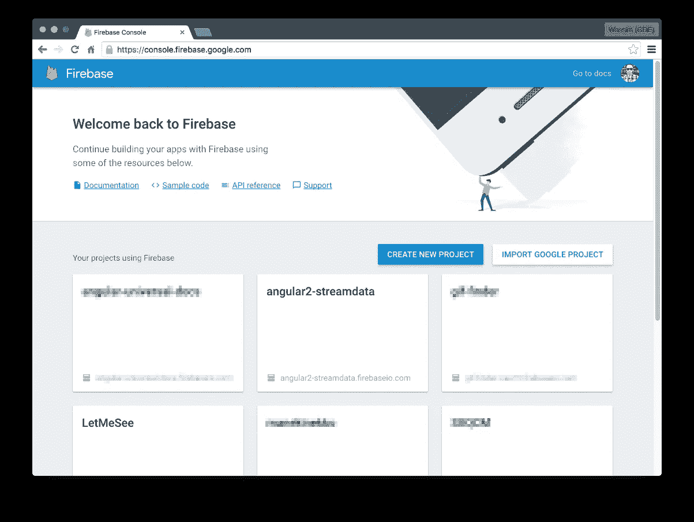
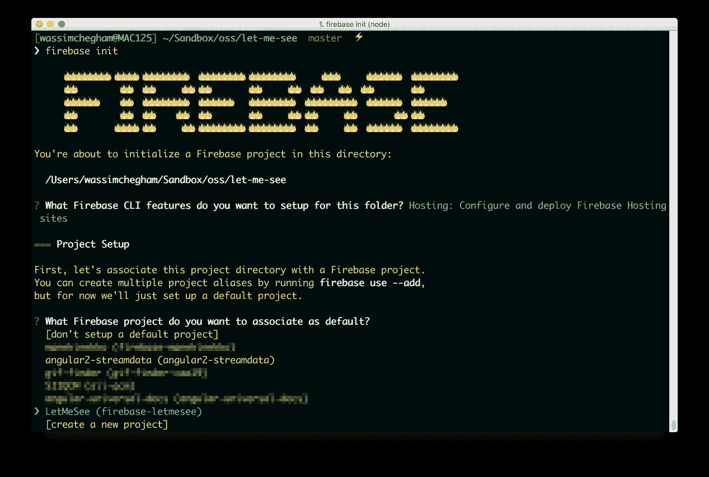
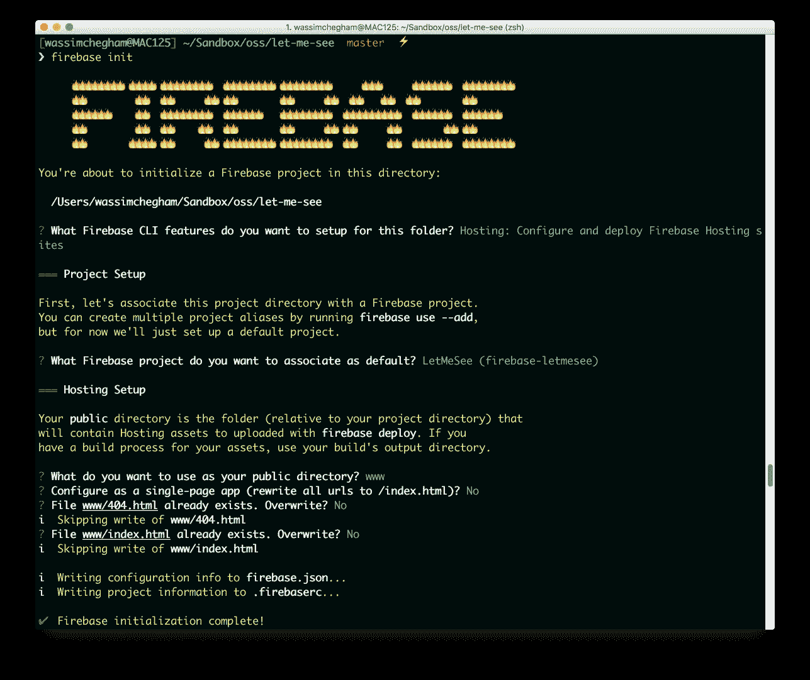
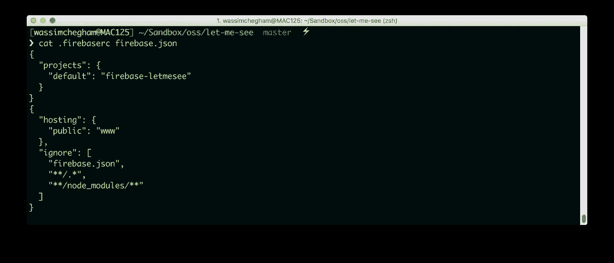
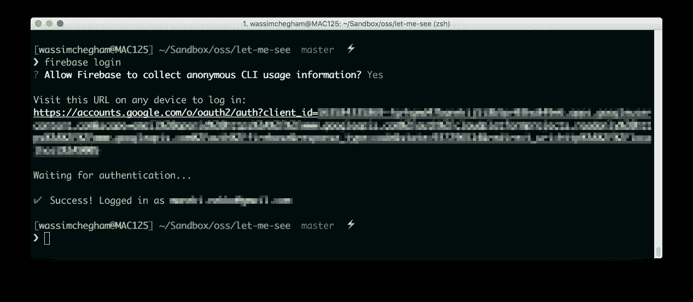
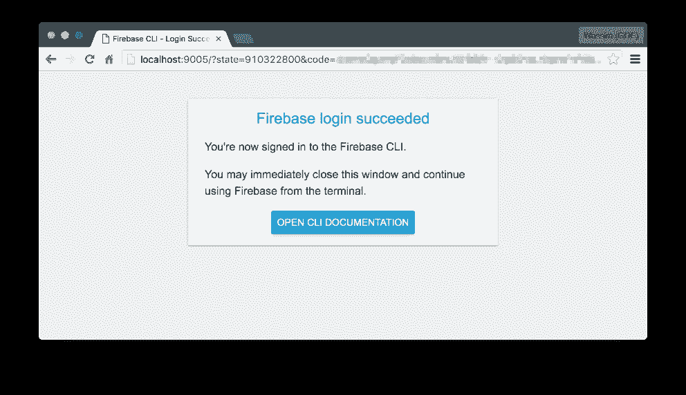
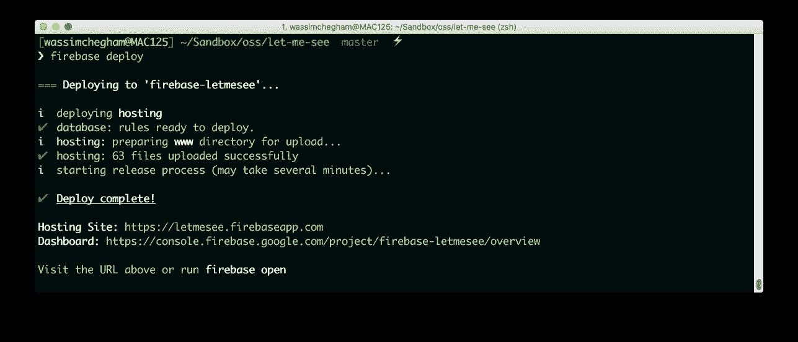

# 在几秒钟内将您的应用部署到 firebase！

> 原文：<https://medium.com/google-developer-experts/deploy-your-app-to-firebase-in-seconds-b3a9a37dff47?source=collection_archive---------0----------------------->


最近[有人问](https://github.com/manekinekko/angularattack2016/issues/22)关于“[让我看看](https://www.angularattack.com/entries/101-angularlabs-london)应用程序的部署和托管。在这篇快速的文章中，我们将看到如何使用 Firebase 的托管服务，以及如何快速部署您的 Web 应用程序。

这个应用程序是在 48 小时 [AngularAttack 黑客马拉松](https://www.angularattack.com/)期间创建的，我使用 [Firebase](https://firebase.google.com) 作为托管服务。

让我们开始吧！

首先，为了使用 Firebase，您需要登录到您的 [firebase 控制台](https://console.firebase.google.com/)并创建一个新项目:



一旦创建了项目。然后，您需要安装 firebase CLI 工具:

```
$ npm install -g firebase-tools
$ firebase -V
3.0.4
```

# 构建您的应用程序

对于接下来的步骤，我们将需要一个我们想要部署的应用程序，很明显！我将使用“让我看看”应用程序。

现在，cd 到您的应用程序根目录并构建它——使用您的设置。在我的例子中，我使用的是离子命令行界面:

```
$ ionic build browser
```

该命令将创建一个 ***www*** 文件夹。这是我们将要部署的文件夹。

# 火灾基地初始化

接下来，我们将为当前应用程序设置一个 firebase 上下文。为此，在同一个根文件夹中，键入:

```
$ firebase init
```

并回答一些问题…

> 每个项目只需要这样做一次，所以不要惊慌！

选择您想要使用的项目实例:



以下是完整的输出:



需要注意的重要一点是:当你被要求使用公共目录时，你应该使用**你的包含捆绑应用**的文件夹。举个例子，在我的例子中，那是 ***www*** 文件夹。

此外，如果你被要求覆盖一些文件，这是由你来决定。我决定不动我的文件。

运行 *init* 命令后，firebase 将创建两个文件:

*   ***firebase . JSON***:这是你项目的配置文件
*   ***。这个文件包含了一些 Firebase 的资源配置***



> 请注意，为了能够部署您的应用程序，您必须将 **firebase.json** 文件放在项目的根目录下。

# firebase 登录

部署应用程序前的最后一步:您只需要确保登录到 Firebase 帐户:

```
$ firebase login
```



该命令将打开一个浏览器窗口，要求您选择您的 Google 帐户，并接受所有必需的权限。登录后，您可以关闭窗口:



# 消防基地部署

最后，是时候向数百万用户部署我们的应用程序了:

```
$ firebase deploy
```



搞定了。现在您可以访问[生成的 URL](https://letmesee.firebaseapp.com) 并享受您的实时应用程序。

*关注*[*@ manekinekko*](https://twitter.com/manekinekko)*了解更多网络平台。*