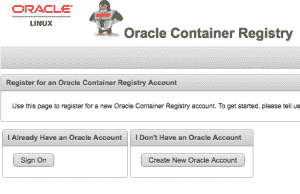

# 在 WordPress.com 的虚拟机箱| Gerald 上部署 Kubernetes 集群

> 原文：<https://medium.com/oracledevs/deploying-a-kubernetes-cluster-with-vagrant-on-virtual-box-gerald-on-it-on-wordpress-com-b87c53e97c16?source=collection_archive---------0----------------------->

Oracle 已经包含了 Kubernetes 对其 [VirtualBox 流浪者 GitHub 库](https://github.com/oracle/vagrant-boxes)的支持。有了它，现在在虚拟机内启动和运行 Kubernetes 集群比以往任何时候都更容易。如果你还没有遇到过[vagger](https://www.vagrantup.com/)，这是 HashiCorp 的一个很好的工具，可以让*开发环境变得简单*。

# TL；博士；医生

1.  安装 VirtualBox
2.  安装流浪者
3.  克隆 GitHub 库 git 克隆[https://github.com/oracle/vagrant-boxes](https://github.com/oracle/vagrant-boxes)
4.  切换到`vagrant-boxes/Kubernetes`文件夹
5.  运行`vagrant up master; vagrant ssh master`
6.  在主客户机中，以`**root**` : `/vagrant/scripts/kubeadm-setup-master.sh`
    的身份运行，您将被要求登录到 Oracle 容器注册表
7.  跑`vagrant up worker1; vagrant ssh worker1`
8.  在 worker1 guest 中，作为`**root**` : `/vagrant/scripts/kubeadm-setup-worker.sh`
    运行，您将被要求登录到 Oracle 容器注册中心
9.  对 worker2 重复最后 2 个步骤

您的集群已经准备好了！
作为`**vagrant**`用户，您可以在主访客中检查集群的状态，例如:

```
kubectl cluster-infokubectl get nodeskubectl get pods --namespace=kube-system
```

# 你需要什么

为了开始，你只需要先做四件事:

# 设置

在你的机器上安装 VirtualBox 和 vagger，不管它是 Mac、Windows 还是 Linux，都非常简单。就我在 Mac 上的情况而言，这只是一个简单的下载和几次点击，所以我不打算在这里涵盖它。

# Oracle 容器注册中心

供应脚本将从 Oracle 的一个完全免费的 Docker 映像存储库[Oracle Container Registry](https://container-registry.oracle.com/)中提取几个 Kubernetes Docker 映像。为此，您必须拥有一个 Oracle 帐户来登录容器注册中心并接受许可协议。这是一个快速的一次性任务，因为容器注册中心将在后续的拉取中记住您的许可接受。因此，如果您之前已经这样做了，您可以直接跳到**在 VirtualBox 上创建 Kubernetes 集群**。

# 为 container-registry.oracle.com 创建 Oracle 帐户

容器注册所需的用户与您可能已经用于 OTN 或其他 Oracle 网站的用户相同。如果您已经有一个，请跳过这一步，转到“**接受最终用户许可协议**”。否则，创建一个用户是快速和容易的。只需进入 https://container-registry.oracle.com 的，点击右上角的**注册**，点击**创建新的甲骨文账户**:



创建帐户并登录后，就该接受许可协议了。

# 接受最终用户许可协议

同样，这一步也是简单而直接的。从注册表中取出的所有组件都在“**容器服务**下:


您只需点击“Container Services ”,它会告诉您在从 Oracle Container Registry 下载之前，您必须同意并接受 Oracle 标准条款和限制。请仔细阅读下页的许可协议。 ”:


点击“**继续**，通读协议并点击右下角的“**接受**”，当然前提是您同意许可条款🙂


就这样，现在您已经准备好构建您的 Kubernetes 集群了。请再次记住，许可接受只是一次性步骤。无论您构建或重建 Kubernetes 集群的频率有多高，今后您都不必再同意它了。

# 在 VirtualBox 上创建 Kubernetes 集群

在本例中，我们将创建一个一个主节点、两个工作节点的群集。

# 克隆 GitHub 存储库

首先，你必须在你的机器上有流浪者文件。这可以通过`git clone [https://github.com/oracle/vagrant-boxes](https://github.com/oracle/vagrant-boxes)`克隆 GitHub repo 来完成，也可以通过浏览器中的[“下载”按钮下载 repo 并解压:](https://github.com/oracle/vagrant-boxes)

```
$ git clone https://github.com/oracle/vagrant-boxesCloning into 'vagrant-boxes'...remote: Counting objects: 342, **done**.remote: Compressing objects: 100% (58/58), **done**.remote: Total 342 (delta 42), reused 71 (delta 31), pack-reused 249Receiving objects: 100% (342/342), 69.52 KiB | 4.63 MiB/s, **done**.Resolving deltas: 100% (170/170), **done**.
```

完成后，进入 Kubernetes 文件夹:

```
$ cd vagrant-boxes/Kubernetes/
```

# 创造 Kubernetes 大师

要创建主文件，只需输入`vagrant up master`。这将为您提供带有 Kubernetes 主服务器的虚拟机:

```
$ vagrant up masterBringing machine 'master' up with 'virtualbox' provider...==> master: Box 'ol7-latest' could not be found. Attempting to find and install...master: Box Provider: virtualboxmaster: Box Version: >= 0==> master: Box file was not detected as metadata. Adding it directly...==> master: Adding box 'ol7-latest' (v0) **for** provider: virtualboxmaster: Downloading: https://yum.oracle.com/boxes/oraclelinux/latest/ol7-latest.box==> master: Successfully added box 'ol7-latest' (v0) **for** 'virtualbox'!==> master: Importing base box 'ol7-latest'...==> master: Matching MAC address **for** NAT networking...==> master: Setting the name of the VM: Kubernetes_master_1521841817878_31194==> master: Clearing any previously set network interfaces...==> master: Preparing network interfaces based on configuration...master: Adapter 1: natmaster: Adapter 2: hostonly==> master: Forwarding ports...master: 8001 (guest) => 8001 (host) (adapter 1)master: 22 (guest) => 2222 (host) (adapter 1)==> master: Running 'pre-boot' VM customizations...==> master: Booting VM...==> master: Waiting **for** machine to boot. This may take a few minutes...master: SSH address: 127.0.0.1:2222master: SSH username: vagrantmaster: SSH auth method: private keymaster:master: Vagrant insecure key detected. Vagrant will automatically replacemaster: this with a newly generated keypair **for** better security.master:master: Inserting generated public key within guest...master: Removing insecure key from the guest **if** it's present...master: Key inserted! Disconnecting and reconnecting using new SSH key...==> master: Machine booted and ready!==> master: Checking **for** guest additions **in** VM...master: The guest additions on this VM **do** not match the installed version ofmaster: VirtualBox! In most cases this is fine, but **in** rare cases it canmaster: prevent things such as shared folders from working properly. If you seemaster: shared folder errors, please make sure the guest additions within themaster: virtual machine match the version of VirtualBox you have installed onmaster: your host and reload your VM.master:master: Guest Additions Version: 5.1.24master: VirtualBox Version: 5.2==> master: Setting hostname...==> master: Configuring and enabling network interfaces...master: SSH address: 127.0.0.1:2222master: SSH username: vagrantmaster: SSH auth method: private key==> master: Configuring proxy environment variables...==> master: Mounting shared folders...master: /vagrant => /Users/gvenzl/Downloads/vagrant-boxes/Kubernetes==> master: Running provisioner: shell...master: Running: /var/folders/5m/xnj65v6d4dx8vbkp_7dt_pyw0000gn/T/vagrant-shell20180323-6639-15ftx0.shmaster: Installing and configuring Docker Engine.........master: Installed:master: kubeadm.x86_64 0:1.9.1-2.0.2.el7master:master: Dependency Installed:master: kubectl.x86_64 0:1.9.1-2.0.2.el7master: kubelet.x86_64 0:1.9.1-2.0.2.el7master: kubernetes-cni.x86_64 0:0.6.0-2.0.1.el7master: kubernetes-cni-plugins.x86_64 0:0.6.0-2.0.1.el7master: socat.x86_64 0:1.7.3.2-2.el7master: Complete!master: net.bridge.bridge-nf-call-ip6tables = 1master: net.bridge.bridge-nf-call-iptables = 1master: Your Kubernetes VM is ready to use!==> master: Configuring proxy **for** Docker...==> master: Running provisioner: shell...master: Running: inline script==> master: Configuring proxy **for** Docker...==> master: Running provisioner: shell...master: Running: inline script==> master: Configuring proxy **for** Docker...$
```

一旦主虚拟机启动，ssh 进入虚拟机并作为`**root**`用户`/vagrant/scripts/kubeadm-setup-master.sh`运行。这将为您提供 Kubernetes 主注释。**请注意，脚本会要求您输入 container-registry.oracle.com 的用户名和密码**:

```
$ vagrant ssh masterWelcome to Oracle Linux Server release 7.4 (GNU/Linux 4.1.12-112.14.13.el7uek.x86_64)The Oracle Linux End-User License Agreement can be viewed here:* /usr/share/eula/eula.en_USFor additional packages, updates, documentation and community help, see:* http://yum.oracle.com/[vagrant@master ~]$ su -[root@master ~]# /vagrant/scripts/kubeadm-setup-master.sh/vagrant/scripts/kubeadm-setup-master.sh: Login to container registryUsername: gerald[dot]venzl[at]oracle[dot]comPassword:Login Succeeded/vagrant/scripts/kubeadm-setup-master.sh: Setup Master nodeStarting to initialize master node ...Checking **if** env is ready ...Checking whether docker can pull busybox image ...Checking access to container-registry.oracle.com/kubernetes ...v1.9.1: Pulling from kubernetes/kube-proxy-amd64Digest: sha256:852fbdc6be8b357356c047bd9649e1c62f572c0e61a0526cd048c0d0dc675e4dStatus: Image is up to date **for** container-registry.oracle.com/kubernetes/kube-proxy-amd64:v1.9.1Checking whether docker can run container ...Checking iptables default rule ...Checking br_netfilter module ...Checking sysctl variables ...Enabling kubelet ...Created symlink from /etc/systemd/system/multi-user.target.wants/kubelet.service to /etc/systemd/system/kubelet.service.Check successful, ready to run 'up' command ...Waiting **for** kubeadm to setup master cluster...Please wait ...- - 75% completedWaiting **for** the control plane to become ready ..................100% completedclusterrole "flannel" createdclusterrolebinding "flannel" createdserviceaccount "flannel" createdconfigmap "kube-flannel-cfg" createddaemonset "kube-flannel-ds" createdInstalling kubernetes-dashboard ...Creating self-signed certificatesGenerating a 2048 bit RSA private key..................................................+++.......................+++writing new private key to 'dashboard.key'-----No value provided **for** Subject Attribute C, skippedNo value provided **for** Subject Attribute ST, skippedNo value provided **for** Subject Attribute L, skippedNo value provided **for** Subject Attribute O, skippedNo value provided **for** Subject Attribute OU, skippedSignature oksubject=/CN=kubernetes-dashboardGetting Private keysecret "kubernetes-dashboard-certs" createdserviceaccount "kubernetes-dashboard" createdrole "kubernetes-dashboard-minimal" createdrolebinding "kubernetes-dashboard-minimal" createddeployment "kubernetes-dashboard" createdservice "kubernetes-dashboard" createdEnabling kubectl-proxy.service ...Starting kubectl-proxy.service ...[===> PLEASE DO THE FOLLOWING STEPS BELOW: <===]Your Kubernetes master has initialized successfully!To start using your cluster, you need to run the following as a regular user:mkdir -p $HOME/.kubesudo cp -i /etc/kubernetes/admin.conf $HOME/.kube/configsudo chown $(id -u):$(id -g) $HOME/.kube/configYou can now join any number of machines by running the following on each nodeas root:kubeadm-setup.sh join --token ce109c.ae7671a693f813d9 192.168.99.100:6443 --discovery-token-ca-cert-hash sha256:861b4d11c037bae9069c8a22c47391b986ea95cab299534d9d0d7f6657eae4f1/vagrant/scripts/kubeadm-setup-master.sh: Copying admin.conf **for** vagrant user/vagrant/scripts/kubeadm-setup-master.sh: Copying admin.conf into host directory/vagrant/scripts/kubeadm-setup-master.sh: Saving token **for** worker nodes/vagrant/scripts/kubeadm-setup-master.sh: Master node ready, run/vagrant/scripts/kubeadm-setup-worker.shon the worker nodes[root@master ~]# exitlogout[vagrant@master ~]$ exitlogoutConnection to 127.0.0.1 closed.$
```

# 创建 Kubernetes 工作节点

一旦主节点启动并运行，现在就可以配置工作节点了。这同样容易。要提供第一个工作者节点类型`vagrant up worker1`:

```
$ vagrant up worker1Bringing machine 'worker1' up with 'virtualbox' provider...==> worker1: Importing base box 'ol7-latest'...==> worker1: Matching MAC address **for** NAT networking...==> worker1: Setting the name of the VM: Kubernetes_worker1_1521842646941_61070==> worker1: Fixed port collision **for** 22 => 2222\. Now on port 2200.==> worker1: Clearing any previously set network interfaces...==> worker1: Preparing network interfaces based on configuration...worker1: Adapter 1: natworker1: Adapter 2: hostonly==> worker1: Forwarding ports...worker1: 22 (guest) => 2200 (host) (adapter 1)==> worker1: Running 'pre-boot' VM customizations...==> worker1: Booting VM...==> worker1: Waiting **for** machine to boot. This may take a few minutes...worker1: SSH address: 127.0.0.1:2200.........worker1: Installed:worker1: kubeadm.x86_64 0:1.9.1-2.0.2.el7worker1:worker1: Dependency Installed:worker1: kubectl.x86_64 0:1.9.1-2.0.2.el7worker1: kubelet.x86_64 0:1.9.1-2.0.2.el7worker1: kubernetes-cni.x86_64 0:0.6.0-2.0.1.el7worker1: kubernetes-cni-plugins.x86_64 0:0.6.0-2.0.1.el7worker1: socat.x86_64 0:1.7.3.2-2.el7worker1: Complete!worker1: net.bridge.bridge-nf-call-ip6tables = 1worker1: net.bridge.bridge-nf-call-iptables = 1worker1: Your Kubernetes VM is ready to use!==> worker1: Configuring proxy **for** Docker...$
```

一旦`worker1`虚拟机启动并运行，再次通过 ssh 进入虚拟机，并作为`**root**`用户:`/vagrant/scripts/kubeadm-setup-worker.sh`运行。您将再次被要求提供 container-registry.oracle.com 的用户名和密码:

```
$ vagrant ssh worker1Welcome to Oracle Linux Server release 7.4 (GNU/Linux 4.1.12-112.14.13.el7uek.x86_64)The Oracle Linux End-User License Agreement can be viewed here:* /usr/share/eula/eula.en_USFor additional packages, updates, documentation and community help, see:* http://yum.oracle.com/[vagrant@worker1 ~]$ su -[root@worker1 ~]# /vagrant/scripts/kubeadm-setup-worker.sh/vagrant/scripts/kubeadm-setup-worker.sh: Login to container registryUsername: gerald[dot]venzl[at]oracle[dot]comPassword:Login Succeeded/vagrant/scripts/kubeadm-setup-worker.sh: Setup Worker nodeStarting to initialize worker node ...Checking **if** env is ready ...Checking whether docker can pull busybox image ...Checking access to container-registry.oracle.com/kubernetes ...v1.9.1: Pulling from kubernetes/kube-proxy-amd64Digest: sha256:852fbdc6be8b357356c047bd9649e1c62f572c0e61a0526cd048c0d0dc675e4dStatus: Image is up to date **for** container-registry.oracle.com/kubernetes/kube-proxy-amd64:v1.9.1Checking whether docker can run container ...Checking iptables default rule ...Checking br_netfilter module ...Checking sysctl variables ...Enabling kubelet ...Created symlink from /etc/systemd/system/multi-user.target.wants/kubelet.service to /etc/systemd/system/kubelet.service.Check successful, ready to run 'join' command ...[preflight] Running pre-flight checks.[validation] WARNING: kubeadm doesn't fully support multiple API Servers yet[discovery] Trying to connect to API Server "192.168.99.100:6443"[discovery] Trying to connect to API Server "192.168.99.100:6443"[discovery] Created cluster-info discovery client, requesting info from "[https://192.168.99.100:6443](https://192.168.99.100:6443/)"[discovery] Created cluster-info discovery client, requesting info from "[https://192.168.99.100:6443](https://192.168.99.100:6443/)"[discovery] Requesting info from "[https://192.168.99.100:6443](https://192.168.99.100:6443/)" again to validate TLS against the pinned public key[discovery] Cluster info signature and contents are valid and TLS certificate validates against pinned roots, will use API Server "192.168.99.100:6443"[discovery] Successfully established connection with API Server "192.168.99.100:6443"[discovery] Requesting info from "[https://192.168.99.100:6443](https://192.168.99.100:6443/)" again to validate TLS against the pinned public key[discovery] Cluster info signature and contents are valid and TLS certificate validates against pinned roots, will use API Server "192.168.99.100:6443"[discovery] Successfully established connection with API Server "192.168.99.100:6443"This node has joined the cluster:* Certificate signing request was sent to master and a responsewas received.* The Kubelet was informed of the new secure connection details.Run 'kubectl get nodes' on the master to see this node join the cluster./vagrant/scripts/kubeadm-setup-worker.sh: Worker node ready[root@worker1 ~]# exitlogout[vagrant@worker1 ~]$ exitlogoutConnection to 127.0.0.1 closed.$
```

设置完成后，退出虚拟机并执行`worker2`的步骤:

```
$ vagrant up worker2Bringing machine 'worker2' up with 'virtualbox' provider...==> worker2: Importing base box 'ol7-latest'...==> worker2: Matching MAC address **for** NAT networking...==> worker2: Setting the name of the VM: Kubernetes_worker2_1521843186488_78983==> worker2: Fixed port collision **for** 22 => 2222\. Now on port 2201.==> worker2: Clearing any previously set network interfaces...==> worker2: Preparing network interfaces based on configuration...worker2: Adapter 1: natworker2: Adapter 2: hostonly==> worker2: Forwarding ports...worker2: 22 (guest) => 2201 (host) (adapter 1)==> worker2: Running 'pre-boot' VM customizations...==> worker2: Booting VM...==> worker2: Waiting **for** machine to boot. This may take a few minutes...worker2: SSH address: 127.0.0.1:2201.........worker2: Installed:worker2: kubeadm.x86_64 0:1.9.1-2.0.2.el7worker2:worker2: Dependency Installed:worker2: kubectl.x86_64 0:1.9.1-2.0.2.el7worker2: kubelet.x86_64 0:1.9.1-2.0.2.el7worker2: kubernetes-cni.x86_64 0:0.6.0-2.0.1.el7worker2: kubernetes-cni-plugins.x86_64 0:0.6.0-2.0.1.el7worker2: socat.x86_64 0:1.7.3.2-2.el7worker2: Complete!worker2: net.bridge.bridge-nf-call-ip6tables = 1worker2: net.bridge.bridge-nf-call-iptables = 1worker2: Your Kubernetes VM is ready to use!==> worker2: Configuring proxy **for** Docker...$$ vagrant ssh worker2Welcome to Oracle Linux Server release 7.4 (GNU/Linux 4.1.12-112.14.13.el7uek.x86_64)The Oracle Linux End-User License Agreement can be viewed here:* /usr/share/eula/eula.en_USFor additional packages, updates, documentation and community help, see:* http://yum.oracle.com/[vagrant@worker2 ~]$ su -[root@worker2 ~]# /vagrant/scripts/kubeadm-setup-worker.sh/vagrant/scripts/kubeadm-setup-worker.sh: Login to container registryUsername: gerald[dot]venzl[at]oracle[dot]comPassword:Login Succeeded/vagrant/scripts/kubeadm-setup-worker.sh: Setup Worker nodeStarting to initialize worker node ...Checking **if** env is ready ...Checking whether docker can pull busybox image ...Checking access to container-registry.oracle.com/kubernetes ...v1.9.1: Pulling from kubernetes/kube-proxy-amd64Digest: sha256:852fbdc6be8b357356c047bd9649e1c62f572c0e61a0526cd048c0d0dc675e4dStatus: Image is up to date **for** container-registry.oracle.com/kubernetes/kube-proxy-amd64:v1.9.1Checking whether docker can run container ...Checking iptables default rule ...Checking br_netfilter module ...Checking sysctl variables ...Enabling kubelet ...Created symlink from /etc/systemd/system/multi-user.target.wants/kubelet.service to /etc/systemd/system/kubelet.service.Check successful, ready to run 'join' command ...[preflight] Running pre-flight checks.[validation] WARNING: kubeadm doesn't fully support multiple API Servers yet[discovery] Trying to connect to API Server "192.168.99.100:6443"[discovery] Created cluster-info discovery client, requesting info from "[https://192.168.99.100:6443](https://192.168.99.100:6443/)"[discovery] Trying to connect to API Server "192.168.99.100:6443"[discovery] Created cluster-info discovery client, requesting info from "[https://192.168.99.100:6443](https://192.168.99.100:6443/)"[discovery] Requesting info from "[https://192.168.99.100:6443](https://192.168.99.100:6443/)" again to validate TLS against the pinned public key[discovery] Cluster info signature and contents are valid and TLS certificate validates against pinned roots, will use API Server "192.168.99.100:6443"[discovery] Successfully established connection with API Server "192.168.99.100:6443"[discovery] Requesting info from "[https://192.168.99.100:6443](https://192.168.99.100:6443/)" again to validate TLS against the pinned public key[discovery] Cluster info signature and contents are valid and TLS certificate validates against pinned roots, will use API Server "192.168.99.100:6443"[discovery] Successfully established connection with API Server "192.168.99.100:6443"This node has joined the cluster:* Certificate signing request was sent to master and a responsewas received.* The Kubelet was informed of the new secure connection details.Run 'kubectl get nodes' on the master to see this node join the cluster./vagrant/scripts/kubeadm-setup-worker.sh: Worker node ready[root@worker2 ~]# exitlogout[vagrant@worker2 ~]$ exitlogoutConnection to 127.0.0.1 closed.$
```

# 验证 Kubernetes 集群

一旦`worker1`和`worker2`虚拟机启动并运行，您就可以开始工作了！您可以通过 ssh 连接到主节点并使用以下一个或多个命令来验证集群。**注意:**设置完成后，这些命令必须作为`**vagrant**`用户执行，该用户是 Kubernetes 设备的所有者:

*   kubectl 集群信息
*   kubectl 获取节点
*   kubectl get pods–namespace = kube-system

```
$ vagrant ssh masterLast login: Fri Mar 23 21:53:41 2018 from 10.0.2.2Welcome to Oracle Linux Server release 7.4 (GNU/Linux 4.1.12-112.14.13.el7uek.x86_64)The Oracle Linux End-User License Agreement can be viewed here:* /usr/share/eula/eula.en_USFor additional packages, updates, documentation and community help, see:* http://yum.oracle.com/[vagrant@master ~]$ kubectl cluster-infoKubernetes master is running at https://192.168.99.100:6443KubeDNS is running at https://192.168.99.100:6443/api/v1/namespaces/kube-system/services/kube-dns:dns/proxyTo further debug and diagnose cluster problems, use 'kubectl cluster-info dump'.[vagrant@master ~]$ kubectl get nodesNAME                STATUS  ROLES    AGE    VERSIONmaster.vagrant.vm   Ready   master   24m    v1.9.1+2.0.2.el7worker1.vagrant.vm  Ready   <none>   13m    v1.9.1+2.0.2.el7worker2.vagrant.vm  Ready   <none>   5m     v1.9.1+2.0.2.el7[vagrant@master ~]$ kubectl get pods --namespace=kube-systemNAME                                      READY  STATUS   RESTARTS AGEetcd-master.vagrant.vm                    1/1    Running  0        24mkube-apiserver-master.vagrant.vm          1/1    Running  0        23mkube-controller-manager-master.vagrant.vm 1/1    Running  0        24mkube-dns-855949bbf-cwsgc                  3/3    Running  0        24mkube-flannel-ds-f56w9                     1/1    Running  0        5mkube-flannel-ds-flpql                     1/1    Running  0        13mkube-flannel-ds-fxp9z                     1/1    Running  0        24mkube-proxy-5thk9                          1/1    Running  0        5mkube-proxy-jmswg                          1/1    Running  0        13mkube-proxy-lfg9v                          1/1    Running  0        24mkube-scheduler-master.vagrant.vm          1/1    Running  0        24mkubernetes-dashboard-7c966ddf6d-hp7br     1/1    Running  0        24m[vagrant@master ~]$ exitlogoutConnection to 127.0.0.1 closed.$
```

# 在 VirtualBox 上定制您的 Kubernetes 集群

流浪者文件允许一些定制，例如:

*   `NB_WORKERS`(默认:`2`):要置备的工作节点数。
*   `USE_PREVIEW`(默认:`true`):当`true`时，流浪汉供应脚本将对 Docker 引擎和 Kubernetes 使用 *Oracle Linux 7 预览版*和*附加模块*通道(最新版本由`yum`选择)。
    否则它将只使用*附加模块*通道。
*   `MANAGE_FROM_HOST`(默认:`false`):当`true`时，流浪者将从主节点绑定端口`6443`到主机。这允许您使用生成的`admin.conf`文件从主机本身管理集群(假设主机上安装了`kubectl`)。
*   `BIND_PROXY`(默认:`true`):当`true`时，vagger 会将 Kubernetes 代理端口从主节点绑定到主机。有助于从集群外的*访问仪表板或任何其他应用程序。这是 ssh 隧道的一个更简单的替代方案。*
*   `MEMORY`(默认值:2048):所有虚拟机都配有 2GB 内存。如果内存是一个问题，这可以稍微减少。

你可以在你的流浪者档案中找到它们，并根据你的需要修改它们。

另请查看与 Kubernetes 用户指南一起使用的 [Oracle 容器服务，了解更多信息。](https://docs.oracle.com/cd/E52668_01/E88884/html/kubectl-basics.html)

*原载于 2018 年 3 月 26 日*[*geraldonit.com*](https://geraldonit.com/2018/03/26/deploying-a-kubernetes-cluster-with-vagrant-on-virtual-box/)*。*