# 使用 OKE 部署多集群 Verrazzano 第 1 部分

> 原文：<https://medium.com/oracledevs/deploying-a-multi-cluster-verrazzano-using-oke-part-1-d6327d45ba03?source=collection_archive---------0----------------------->

在[之前的一篇文章](/oracledevs/deploying-verrazzano-on-oke-d506101f93e)中，我们简单看了一下 Verrazzano，并对 OKE 进行了简单介绍。在本文中，我们将在 OKE 上部署一个多集群 Verrazzano。为了让事情变得有趣，我们也将使用不同的 OCI 地区。

首先，稍微偏离一下 WebLogic 和 Kubernetes，然后我们将讨论 Verrazzano。

## 从 WebLogic 到 Kubernetes 到 Verrazzano

几年前，当我不得不在内部向人们解释 Kubernetes 时，特别是那些有 WebLogic 背景的人，我用 WebLogic 做了一些(非常简单的)类比:

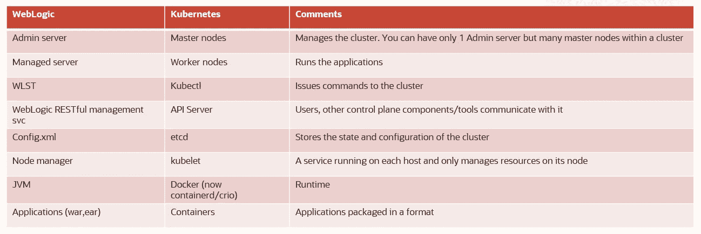

WebLogic and Kubernetes analogy

用熟悉的概念解释 Kubernetes 对理解有很大帮助。在 WebLogic 群集中，管理服务器处理管理、部署和其他不太流畅但却很重要的任务，而受管服务器则负责部署和运行应用程序以及响应请求。当然，您可以总是在单个管理服务器上运行您的应用程序(在某种程度上相当于主节点的[污点和容忍](https://kubernetes.io/docs/concepts/scheduling-eviction/taint-and-toleration/)),但是不建议这样做。另一方面，托管服务器可以扩展并配置为运行您的应用程序。管理服务器和受管服务器一起构成了一个集群。您可以在整个集群或特定的托管服务器上运行您的应用程序。如果您的应用程序被部署到集群中，并且集群中的受管服务器出现故障(JVM、主机、重新启动等)，集群中的其他受管服务器将自动处理该作业。如果运行单元集服务的托管服务器出现故障，WebLogic 还会自动迁移服务。查看[这份文件](https://www.oracle.com/technetwork/middleware/weblogic/weblogic-automatic-service-migratio-133948.pdf)以获得更详细的阅读。本质上，它有点像 Kubernetes 中的复制集。Kubernetes 上的应用程序最初是无状态的，直到添加了 StatefulSets。您现在还可以在整个集群中运行有状态的应用程序。

如果为了实现高可用性，您需要在地理上分散的集群中运行 Kubernetes 应用程序，那该怎么办？你可以试试你的运气，库伯菲德(kubefed)的进展非常缓慢，并且仍处于测试阶段(这不是批评——T2 编辑(T3))。或者，您可以尝试将相同的应用程序部署到不同的集群，实施一种全局健康检查，然后使用[智能负载平衡器](https://docs.oracle.com/en-us/iaas/Content/TrafficManagement/Concepts/overview.htm)将流量从一个集群切换到另一个集群。所有这些方法仍然容易出错且有风险，并且有一些局限性。

输入 Verrazzano 多聚类。

Verrazzano 在 WebLogic 中引入了管理和受管服务器的概念，并将其应用于 Kubernetes 集群:

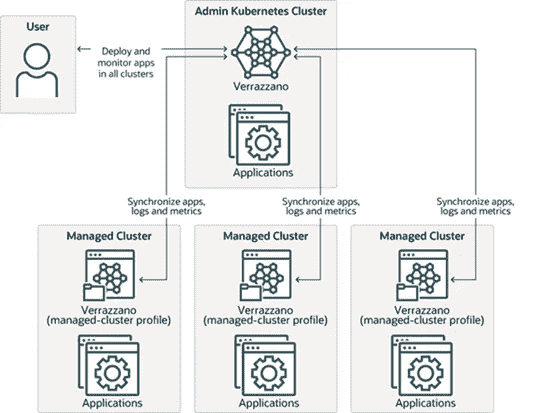

Verrazzano multi-cluster

以前只有一个 WebLogic 管理服务器，现在有了一个基于 Kubernetes for Verrazzano 的管理集群。您的应用程序将部署在托管服务器上，而您的 Verrazzano 工作负载现在将部署在托管的 Kubernetes 集群上，可能离您的用户更近。

## 基础设施规划

为了实现这一点，Verrazzano 管理的集群(Verrazzano 集群是由 Verrazzano 容器平台管理的 Kubernetes 集群)需要能够与 Verrazzano 管理集群通信，反之亦然。在 WebLogic 中，受管服务器通常是同一个网络的一部分(除非您正在进行[伸展集群](https://docs.oracle.com/en/middleware/standalone/weblogic-server/14.1.1.0/wlcag/active-active-stretch-cluster-active-passive-database-tier.html#GUID-66D13F44-200A-45AB-9676-2BF18610554D))，这通常很简单。

然而，我们的目标是在 OCI 的不同云区域部署不同的 Verrazzano 集群，我们需要考虑和规划网络和安全性。请注意，您也可以使用 Verrazzano 来管理部署在其他云中或内部的集群，但是网络和安全配置会有所不同(VPN/FastConnect 等)。

下面是一张 OCI 地区的地图，可以帮助我们挑选一些地区:

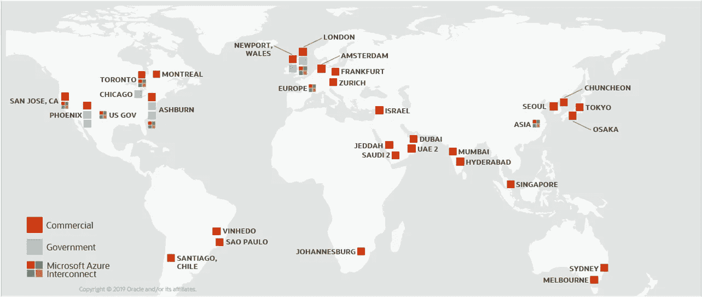

Map of OCI regions

我们将使用新成立的新加坡地区作为管理集群，然后孟买、东京和悉尼作为星型架构中的托管集群:

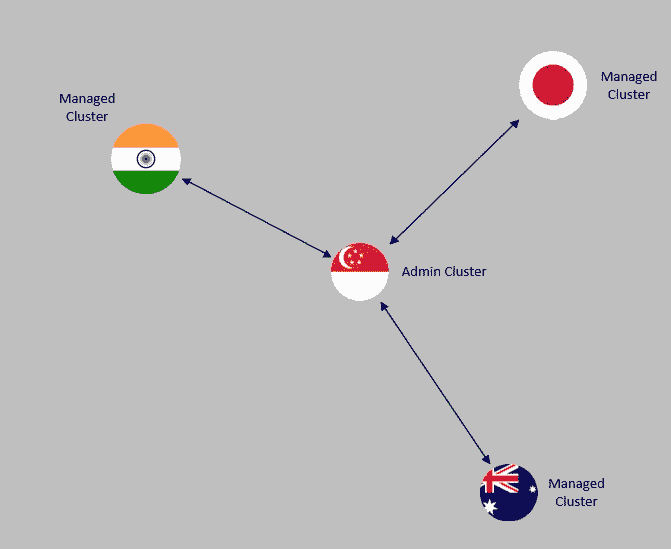

Verrazzano Clusters spread across OCI Asia Pacific regions

## 网络基础设施

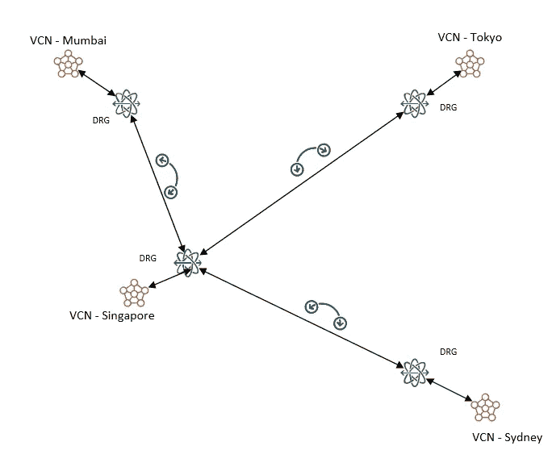

Remote Peering with different regions

我们需要集群使用 OCI 主干安全地通信，因此这意味着我们需要在每个区域设置 DRGs，将它们连接到它们的 VCN，并使用远程对等。由于 VCN 和集群最终会连接在一起，我们还需要确保它们各自的 IP 地址范围(VCN、pod 和服务)不会重叠。

## 创建 Verrazzano 集群

我们将使用 [terraform-oci-oke 模块](https://github.com/oracle-terraform-modules/terraform-oci-oke)来创建我们的集群。我们可以通过克隆模块 4 次，然后更改区域参数来单独创建它们。然而，您会很高兴地知道，我们最近在 4.0 版本的模块中改进的一件事是可重用性。我们将利用这一点。

创建新的 terraform 项目，并按如下方式定义变量:

在 terraform.tfvars 中，与您的身份参数一起定义您的区域:

```
verrazzano_regions = {
  home  = "your-tenancy-home-region" #replace with your tenancy's home region
  admin = "ap-singapore-1"
  syd   = "ap-sydney-1"
  mum   = "ap-mumbai-1"
  tok   = "ap-tokyo-1"
}
```

在 provider.tf 中，使用别名定义不同区域的提供程序:

最后，在 main.tf 中，创建不同的集群(注意，这里的一些参数具有相同的值，您实际上可以使用缺省值，但是我想展示您也可以按区域配置这些参数):

为了方便起见，我们打印出每个地区的操作员主机:

运行 terraform init，plan，该计划应指明以下内容:

```
Plan: 292 to add, 0 to change, 0 to destroy.Changes to Outputs:
+ ssh_to_admin_operator = (known after apply)
+ ssh_to_au_operator    = "ssh -i ~/.ssh/id_rsa -J opc@ opc@"
+ ssh_to_in_operator    = "ssh -i ~/.ssh/id_rsa -J opc@ opc@"
+ ssh_to_jp_operator    = "ssh -i ~/.ssh/id_rsa -J opc@ opc@"
```

运行 terraform apply 并放松，您应该很快就会看到以下内容:

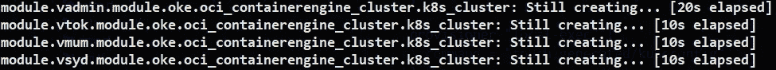

Simultaneous creation of 4 OKE clusters in different regions

这意味着我们的 4 个 OKE 集群将在 4 个不同的 OCI 地区同时创建。在大约 15 分钟内，您将创建所有 4 个集群:

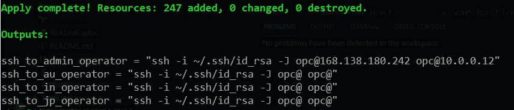

还将打印出各种操作员主机的 ssh 便利命令。

接下来，导航到 ***中的 DRGs 的各个管理集群*** 的区域，即孟买、东京、悉尼。单击 Remote Peering Attachment 并创建一个远程对等连接(称之为 rpc_to_admin)。但是，在管理区域(我们选择的区域中的新加坡)中，创建 3 个远程对等连接:

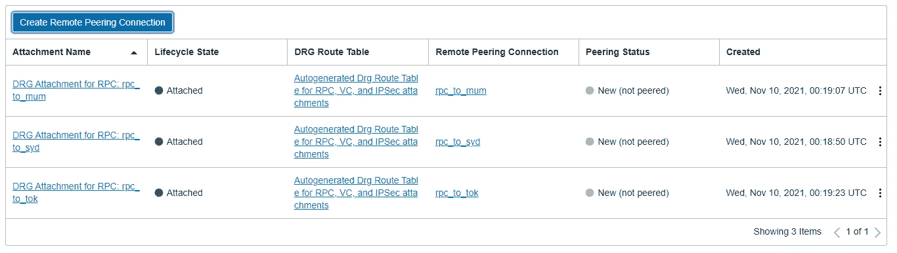

3 RPCs in the Admin region

我们需要观察他们。点击 rpc_to_syd。在浏览器中打开一个新标签，访问 OCI 控制台，将区域更改为悉尼。然后，导航至 DRG 和 rpc_to_syd 页面。复制 RPC 的 ocid(不是 DRG)，切换到 Admin 选项卡并单击“建立连接”:

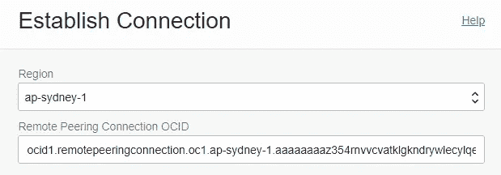

Establishing RPC

如上提供 RPC id 和区域后，单击“建立连接”按钮执行对等操作。对东京和孟买区域重复相同的过程，直到所有被管理的集群区域都与管理区域对等。执行并完成对等后，您会看到其状态将变为“待定”并最终变为“对等”:

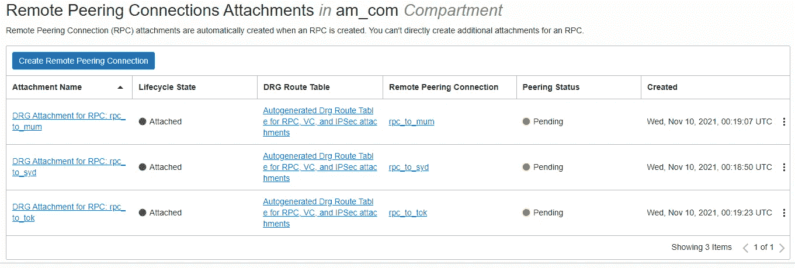

RPCs in Pending state

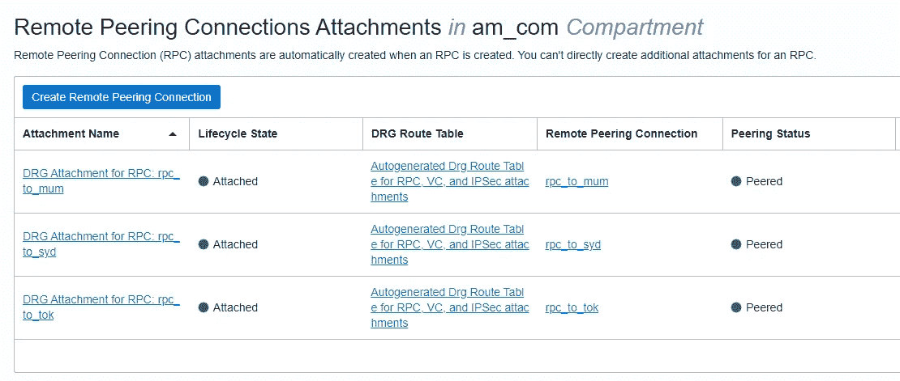

RPCs in Peered state

在这一点上，我们的 vcn 是对等的，但是我们还需要做 3 件事情:

1.  配置路由表，以便 Verrazzano 管理的集群可以与管理集群通信，反之亦然
2.  为控制平面 CIDRs 配置 NSG，以接受来自管理员 VCN 的请求
3.  合并 kubeconfigs

实际上，路由规则的配置已经完成。“怎么会？”你问我。嗯，我们添加的[新特性](https://github.com/oracle-terraform-modules/terraform-oci-oke/releases)之一是[配置和更新路由表](https://github.com/oracle-terraform-modules/terraform-oci-oke/issues/279)的能力。在 main.tf 中，查看管理集群模块，您会发现一个通常为空列表的参数:

```
nat_gateway_route_rules = []
```

相反，在我们的管理模块定义中，我们已经将其更改为:

类似地，在受管集群定义中，我们还设置了到达新加坡管理集群的路由规则:

```
nat_gateway_route_rules = [
  {
    destination       = "10.0.0.0/16"
    destination_type  = "CIDR_BLOCK"
    network_entity_id = "drg"
    description       = "To Admin"
  }
]
```

请注意，您也可以稍后更新这些信息，例如，假设您在海得拉巴(VCN CIDR: 10.4.0.0)添加了另一个管理区域。在 Admin 的路由规则中，您将再添加 1 个条目来将流量路由到 Hyderabad:

```
nat_gateway_route_rules = [
{
  destination       = "10.4.0.0/16"
  destination_type  = "CIDR_BLOCK"
  network_entity_id = "drg"
  description       = "To Hyderabad"
}
]
```

更新自定义规则后，再次运行 terraform apply，管理区域中的路由规则将被更新。

导航到网络可视化工具页面，检查您的连接和路由规则:

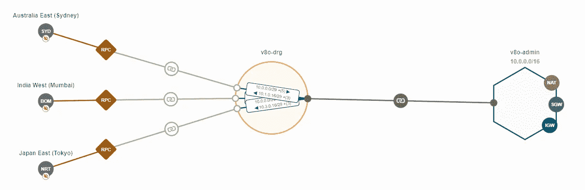

Network connectivity across regions

接下来，在每个区域中管理 VCN 的控制平面 NSG，添加一个入口以接受来自源 CIDR 10.0.0.0/16(管理)和目的端口 6443 的 TCP 请求。这是为了让管理集群能够与被管理集群的控制平面进行通信。

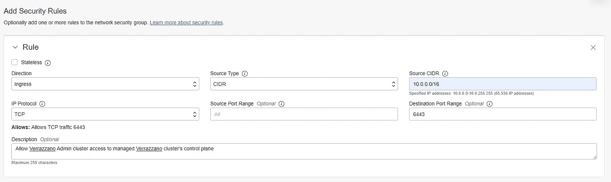

Additional ingress security rule in each managed cluster’s control plane NSG

## 操作便利性

最后，为了方便起见，我们希望能够从 Admin operator 主机执行我们的大多数操作。我们首先需要获得每个集群的 kubeconfig，并在 admin 操作符上将它们合并在一起。您现在必须手动执行此步骤，但我们将在未来努力改进这一点:

1.  导航到每个受管集群的页面，然后单击“Access cluster”。
2.  复制第二个命令，该命令允许您获取该集群的 kubeconfig

```
oci ce cluster create-kubeconfig --cluster-id ocid1.cluster.... --file $HOME/.kube/**configsyd** --region ap-sydney-1 --token-version 2.0.0  --kube-endpoint PRIVATE_ENDPOINToci ce cluster create-kubeconfig --cluster-id ocid1.cluster.... --file $HOME/.kube/**configmum** --region ap-mumbai-1 --token-version 2.0.0  --kube-endpoint PRIVATE_ENDPOINToci ce cluster create-kubeconfig --cluster-id ocid1.cluster.... --file $HOME/.kube/**configtok** --region ap-tokyo-1 --token-version 2.0.0  --kube-endpoint PRIVATE_ENDPOINT
```

请注意，您还必须重命名该文件，以便它们不会覆盖管理区域的现有配置(参见上面以粗体突出显示的内容)。运行命令来获取受管集群各自的 kubeconfigs。您应该有 4 个 kubeconfigs:

```
[opc@v8o-operator ~]$ ls -al .kube
total 16
drwxrwxr-x. 2 opc opc   71 Nov 10 11:40 .
drwx------. 4 opc opc  159 Nov 10 11:15 ..
-rw--w----. 1 opc opc 2398 Nov 10 11:15 config
-rw-rw-r--. 1 opc opc 2364 Nov 10 11:40 configmum
-rw-rw-r--. 1 opc opc 2364 Nov 10 11:40 configsyd
-rw-rw-r--. 1 opc opc 2362 Nov 10 11:40 configtok
```

我们可以从管理员操作员主机检查对集群的访问:

```
cd .kubefor cluster in config configsyd configmum configtok; do
  KUBECONFIG=$CLUSTER kubectl get nodes
done
```

这将为我们返回每个集群中的节点列表:

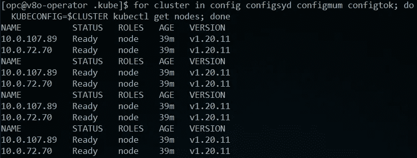

List of nodes in each cluster

为了方便起见，我们还想做的一件事是重命名每个集群的上下文，以便我们知道我们正在处理哪个区域。在本练习中，我们希望 1 个上下文等同于一个 Verrazzano 集群。让我们首先重命名所有的 kubeconfig 文件:

*   配置->管理
*   配置->孟买
*   configsyd ->悉尼
*   东京->东京

让我们重新命名它们各自的上下文:

```
for cluster in admin sydney mumbai tokyo; do
  current=$(KUBECONFIG=$cluster kubectl config current-context)
  KUBECONFIG=$cluster kubectl config rename-context $current $cluster
done
```

我们现在准备合并:

```
KUBECONFIG=./admin:./sydney:./mumbai:./tokyo kubectl config view --flatten > ./config
```

让我们得到一个上下文列表:

```
kubectl config get-contexts
```

这将为我们返回以下内容:

```
CURRENT   NAME     CLUSTER               AUTHINFO           NAMESPACE*         admin    cluster-cillzxw34tq   user-cillzxw34tqmumbai   cluster-cuvo2ifxe2a   user-cuvo2ifxe2asydney   cluster-cmgb37morjq   user-cmgb37morjqtokyo    cluster-coxskjynjra   user-coxskjynjra
```

这太冗长了。相反，我们将使用 [kubectx](https://github.com/ahmetb/kubectx) (我是一个超级粉丝)。安装 kubectx(之前我们可以用它来重命名上下文):

```
wget [https://github.com/ahmetb/kubectx/releases/download/v0.9.4/kubectx](https://github.com/ahmetb/kubectx/releases/download/v0.9.4/kubectx)
chmod +x kubectx
sudo mv kubectx /usr/local/bin
```

现在当我们运行 kubectx 时:

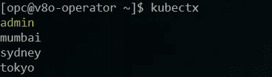

Using kubectx

当前上下文，即当前 Verrazzano 集群以黄色突出显示。我们还可以轻松地更改上下文，以便执行 Verrazzano 安装和其他操作，例如

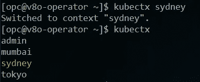

Changing context to Sydney

这包括设置 OKE、网络连接和路由，以及在不同地区运行多集群 Verrazzano 的一些操作便利性。在此，我要感谢我的同事和朋友肖恩·利维，他对 OCI 社交网络的复杂性有着敏锐的洞察力。

在[第 2 部分](https://lmukadam.medium.com/deploying-a-multi-cluster-verrazzano-using-oke-part-2-93d2438f7eef)中，我们将看看如何在多集群配置中安装 Verrazzano。