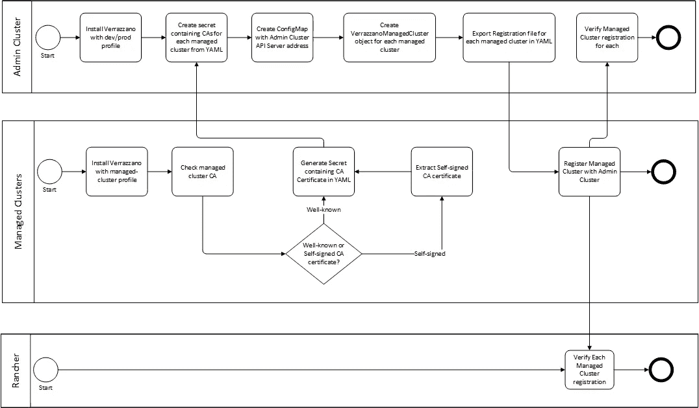
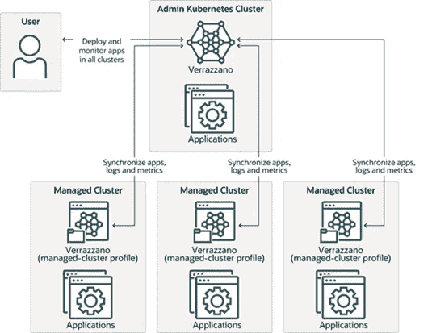
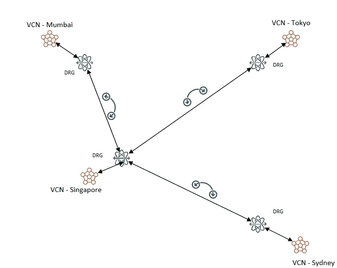
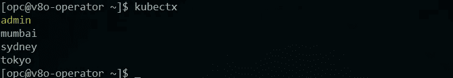
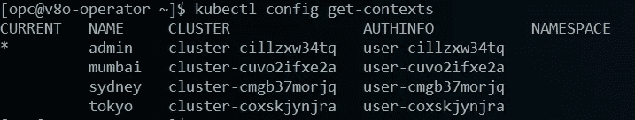
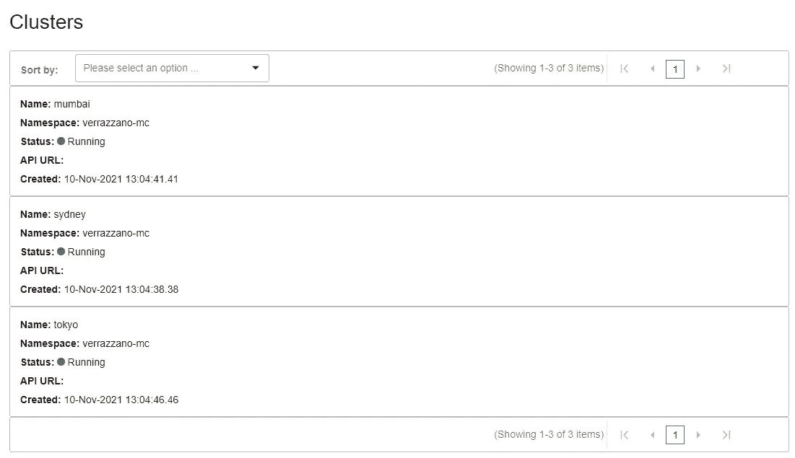
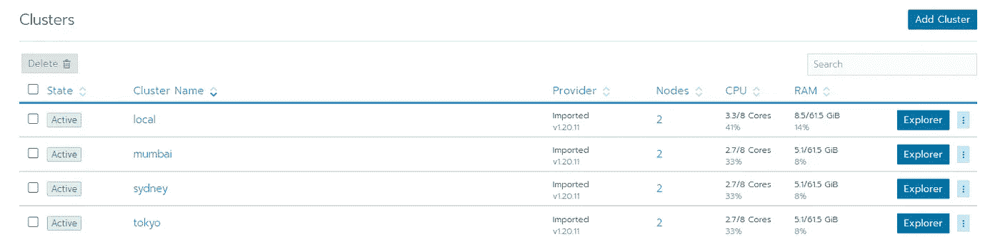

# 使用 OKE 部署多集群 Verrazzano 第 2 部分

> 原文：<https://medium.com/oracledevs/deploying-a-multi-cluster-verrazzano-using-oke-part-2-93d2438f7eef?source=collection_archive---------0----------------------->

在第 1 部分的[中，我们讨论了为多集群](https://lmukadam.medium.com/deploying-a-multi-cluster-verrazzano-using-oke-part-1-d6327d45ba03) [Verrazzano](https://verrazzano.io/) 部署设置网络基础设施。在本文中，我们将对集群进行配置，使它们表现为一种全局集群。下面是多聚类过程的图示:



Verrazzano multi-cluster deployment and registration process

回想一下，一个 Verrazzano 多集群有一个管理集群和一个或多个受管集群，每个 Verrazzano 集群都是一个 Kubernetes 集群:



Verrazzano multi-cluster architecture

还记得我们有以下设置:



我们选择管理服务器位于新加坡 OCI 地区。

我们将在管理集群上安装带有开发/生产配置文件的 Verrazzano，在受管集群上安装带有受管集群配置文件的 Verrazzano。

## 使用 kubectx 的注意事项

在下面的命令中，我使用 kubectx 来设置 Kubernetes 上下文，其中上下文相当于一个 Kubernetes 集群。严格地说，那不是真的，但它符合我们的目的。由于我们在 4 个不同的区域有 1 个管理服务器和 3 个受管服务器，因此我们有 4 个不同的上下文:



Verifying your Kubernetes context

为了确保我们总是使用正确的上下文，我在每个命令之前都执行 kubectx <context-name>。</context-name>

## 以管理员身份安装 Verrazzano

将 Verrazzano 安装为管理集群非常简单。您可以按照[快速入门指南](https://verrazzano.io/docs/quickstart/)进行操作，并且可以在开发/生产配置文件之间进行选择。在操作员主机上，确保您的上下文指向“admin”:


Verifying your Kubernetes context

如果它指向其他集群之一，请按如下方式进行更改:

```
kubectx admin
```

我们现在可以开始安装了:

```
kubectl apply -f https://github.com/verrazzano/verrazzano/releases/download/v1.0.3/operator.yaml
```

等待部署完成:

```
kubectl -n verrazzano-install rollout status deployment/verrazzano-platform-operator
```

并确认操作员舱工作正常:

```
 [opc@v8o-operator ~]$  kubectl -n verrazzano-install get podsNAME                                            READY   STATUS    RESTARTS   AGEverrazzano-platform-operator-54cf56884f-46zzk   1/1     Running   0          91s
```

接下来，安装 Verrazzano:

```
kubectl apply -f - <<EOF
apiVersion: install.verrazzano.io/v1alpha1
kind: Verrazzano
metadata:
  name: admin
spec:
  profile: dev
EOF
```

现在我们需要等到安装完成:

```
kubectl wait \
    --timeout**=**20m \
    --for**=**condition**=**InstallComplete \
    verrazzano/admin
```

这需要一段时间。同时，让我们在托管集群上安装 Verrazzano。

## 在受管集群上安装 Verrazzano

将上下文更改为 1 个受管集群，并再次安装操作员，例如

```
kubectx sydneykubectl apply -f https://github.com/verrazzano/verrazzano/releases/download/v1.0.3/operator.yamlkubectl -n verrazzano-install rollout status deployment/verrazzano-platform-operator
```

对所有受管集群重复上述操作。在每个托管集群中运行之前，确保您已经用 kubectx <contextname>更改了上下文，如上所述。</contextname>

使用与管理区域相同的过程，验证 Verrazzano 操作符是否已成功安装。

现在，通过相应地更改上下文和名称，使用托管配置文件为每个安装 Verrazzano:

```
apiVersion: install.verrazzano.io/v1alpha1
kind: Verrazzano
metadata:
  name: sydney
spec:
  profile: managed-cluster
```

## 验证管理集群和受管集群

在安装受管集群时，让我们看看是否能够[访问各种控制台](https://verrazzano.io/docs/operations/)。确保您可以登录到 Verrazzano 和 Rancher 控制台。

再次更改上下文并验证:

```
kubectx sydneykubectl wait \
    --timeout**=**20m \
    --for**=**condition**=**InstallComplete \
    verrazzano/sydney
```

对每个受管集群重复验证。

## 注册受管理的集群

验证每个受管理群集的 CA 证书类型:

```
kubectx sydneykubectl -n verrazzano-system get secret system-tls -o jsonpath**=**'{.data.ca\.crt}'
```

如果该值为空，则您的托管群集正在使用由知名证书颁发机构签名的证书，并且您可以生成包含 YAML 格式的 CA 证书的密码。如果不是空的，那么证书是自签名的，需要提取。参考本文开头的工作流。

```
kubectx **sydney**CA_CERT=$(kubectl \
    get secret system-tls \
    -n verrazzano-system \
    -o jsonpath="{.data.ca\.crt}" | base64 --decode)kubectl create secret generic "ca-secret-**sydney**" \
  -n verrazzano-mc \
  --from-literal=cacrt="$CA_CERT" \
  --dry-run=client -o yaml > managed**sydney**.yaml
```

对另外两个区域重复上述操作，相应地替换区域/上下文和文件名。

在包含每个受管集群的 CA 证书的管理集群上创建 3 个机密:

```
kubectx adminkubectl apply -f managedsydney.yaml
kubectl apply -f managedmumbai.yaml
kubectl apply -f managedtokyo.yaml
```

获取管理集群的集群名:

```
kubectl config get contexts
```



Cluster names

获取管理服务器的 API 服务器地址:

```
kubectx adminexport CLUSTER_NAME="cluster-cillzxw34tq"API_SERVER=$(kubectl config view -o jsonpath="{.clusters[?(@.name==\"$CLUSTER_NAME\")].cluster.server}")
```

创建包含管理集群的 API 服务器地址的配置映射:

```
kubectx adminkubectl apply -f <<EOF -
apiVersion: v1
kind: ConfigMap
metadata:
  name: verrazzano-admin-cluster
  namespace: verrazzano-mc
data:
  server: "${API_SERVER}"
EOF
```

为每个受管集群创建 VerrazzanoManagedCluster 对象:

```
kubectx admin
kubectl apply -f <<EOF -
apiVersion: clusters.verrazzano.io/v1alpha1
kind: VerrazzanoManagedCluster
metadata:
  name: sydney
  namespace: verrazzano-mc
spec:
  description: "Sydney VerrazzanoManagedCluster object"
  caSecret: ca-secret-sydney
EOFkubectl apply -f <<EOF -
apiVersion: clusters.verrazzano.io/v1alpha1
kind: VerrazzanoManagedCluster
metadata:
  name: mumbai
  namespace: verrazzano-mc
spec:
  description: "Mumbai VerrazzanoManagedCluster object"
  caSecret: ca-secret-mumbai
EOFkubectl apply -f <<EOF -
apiVersion: clusters.verrazzano.io/v1alpha1
kind: VerrazzanoManagedCluster
metadata:
  name: tokyo
  namespace: verrazzano-mc
spec:
  description: "Tokyo VerrazzanoManagedCluster object"
  caSecret: ca-secret-tokyo
EOF
```

等待 VerrazzanoManagedCluster 资源进入就绪状态:

```
kubectx adminkubectl wait --for=condition=Ready \
    vmc sydney -n verrazzano-mckubectl wait --for=condition=Ready \
    vmc sydney -n verrazzano-mckubectl wait --for=condition=Ready \
    vmc sydney -n verrazzano-mc
```

导出为注册受管集群而创建的 YAML 文件:

```
kubectx adminkubectl get secret verrazzano-cluster-sydney-manifest \
    -n verrazzano-mc \
    -o jsonpath={.data.yaml} | base64 --decode > registersydney.yamlkubectl get secret verrazzano-cluster-mumbai-manifest \
    -n verrazzano-mc \
    -o jsonpath={.data.yaml} | base64 --decode > registermumbai.yamlkubectl get secret verrazzano-cluster-tokyo-manifest \
    -n verrazzano-mc \
    -o jsonpath={.data.yaml} | base64 --decode > registertokyo.yaml
```

在每个受管集群上，应用注册文件:

```
kubectx sydney
kubectl apply -f registersydney.yamlkubectx mumbai
kubectl apply -f registermumbai.yamlkubectx tokyo
kubectl apply -f registertokyo.yaml
```

现在验证注册是否成功完成:

```
kubectx admin
kubectl get vmc sydney -n verrazzano-mc -o yaml
kubectl get vmc mumbai -n verrazzano-mc -o yaml
kubectl get vmc tokyo -n verrazzano-mc -o yaml
```

## 附加验证

导航到 Verrazzano 控制台，登录，您应该能够看到所有 3 个集群:



Managed clusters in Verrazzano

同样，在 Rancher 控制台上，您应该能够看到所有 4 个集群:



Admin and managed clusters in Rancher

“本地”是管理集群，而其他集群是被管理的集群。

## 结论

这就完成了将部署在不同区域的 OKE 集群连接成多集群 Verrazzano 部署的练习。注意，在这篇文章中，我们没有配置 DNS、证书、入口控制器等。目标是让多集群配置运行起来。在以后的文章中，我们也会关注这些事情。

请继续关注第三部分。