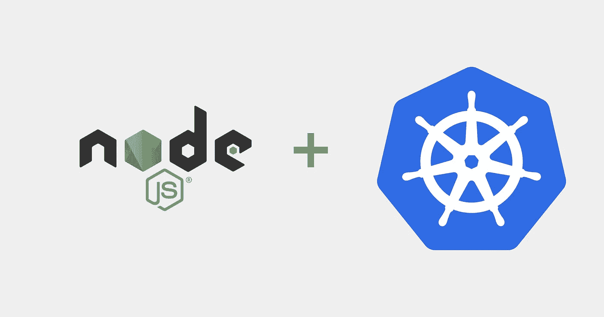

# 将一个简单的 node.js 应用程序部署到 Kubernetes

> 原文：<https://medium.com/oracledevs/deploying-a-simple-node-js-app-to-kubernetes-56b313b99061?source=collection_archive---------0----------------------->



几天前，我向一个小型 IT 团队展示 Kubernetes，一如既往地，我首先解释了容器、Docker Hub、Docker 构建文件的概念，然后继续谈论使用 Helm Charts 部署多层应用程序。最后，我展示了如何用 Wercker 设置 CI/CD。事情没有像我预料的那样发展。

我正在演示的 IT 团队被众多工具弄得不知所措，我完全能够理解这一点。试图理解 Kubernetes 和整个生态系统，同时又不熟悉容器的概念，可能会相当困难。

我们后退了几步，展示了一个非常简单的例子:

1.  构建一个公开 REST API 的简单应用程序
2.  将应用程序和依赖项打包在 Docker 映像中
3.  将 Docker 映像推送到注册中心，在本例中是 Oracle 云基础设施注册中心(OCIR)
4.  将应用程序部署到 Kubernetes

**先决条件:**

本教程有几个先决条件。你可以在这里了解更多。

*   创建 Oracle Kubernetes 集群
*   安装 OCI 工具
*   安装 Kubectl
*   下载 OKE 配置
*   创建一个关于 OCIR 的知识库

我不打算从头开始构建一个应用程序，即使它不会花很长时间。我去了 github，尝试了几个不同的应用程序，最终我找到了这个应用程序并克隆了它:

[](https://github.com/haj/rest-api-sample) [## 朝觐/休息-API-样本

### 带身份验证的 REST API 示例。在 GitHub 上创建一个帐户，为 haj/rest-api-sample 的开发做出贡献。

github.com](https://github.com/haj/rest-api-sample) 

**从 github 克隆应用:**

```
git clone git@github.com:haj/rest-api-sample.git
```

**转到文件夹:**

```
cd rest-api-sample
```

**构建容器:**

```
docker build -t fra.ocir.io/<tenancyname>/<reponame>/node-web-app .
```

**为 Oracle 容器注册表创建凭据**

Kubernetes 需要访问容器注册中心来从中提取图像。

```
kubectl create secret docker-registry regcred --docker-server=fra.ocir.io --docker-username=<tenancyname>/myemail@email.com  --docker-password=’very secret’ --docker-email=myemail@email.com
```

创建一个 deployment.yaml 文件，它定义了我们的部署和服务。我们将在下一步中使用它来部署容器并创建一个负载平衡器来公开服务:

```
cat <<EOF >> deployment.yaml
apiVersion: apps/v1beta1kind: Deploymentmetadata:name: hello-worldspec:replicas: 1 # tells deployment to run 2 pods matching the templatetemplate: # create pods using pod definition in this templatemetadata:# unlike pod-nginx.yaml, the name is not included in the meta data as a unique name is# generated from the deployment namelabels:app: hello-worldspec:containers:- name: hello-worldimage: fra.ocir.io/<tenancyname>/<reponame>/node-web-app:latestports:- containerPort: 8081imagePullSecrets:# enter the name of the secret you created- name: regcred---apiVersion: v1kind: Servicemetadata:name: hello-worldspec:type: LoadBalancerports:- port: 80protocol: TCPtargetPort: 8081selector:app: hello-world
EOF
```

**部署到 Kubernetes**

```
kubectl create -f deployment.yaml
```

**检查已创建部署的状态**

```
kubectl get pods
```

**检查服务创建的状态**

```
kubectl get service
```

**发布一些内容到部署的 App:**

使用创建的负载平衡器的外部 ip 更改下面的 ip。

```
curl -d '{"body":"This is amazing", "feel":"happy"}' -H "Content-Type: application/json" -X POST [http://<IP>:80/api/v1/tweet/](http://132.145.254.60:8081/api/v1/tweet/)
```

就这样，您现在已经将一个应用程序打包到一个容器中，将其推送到一个容器注册表中，并将其部署到 Kubernetes。

查看 helm 图表，了解如何以更易于管理的方式将容器部署到 Kubernetes。