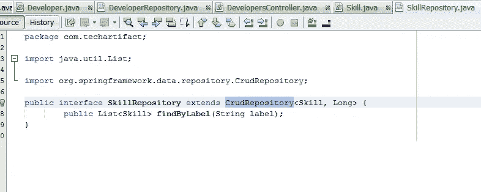
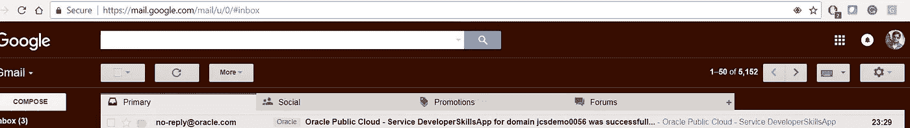

# 将 Spring Boot 微服务部署到应用容器— Oracle 云

> 原文：<https://medium.com/oracledevs/deploying-a-spring-boot-micro-services-application-to-oracle-application-container-cloud-95238f1b7ab7?source=collection_archive---------0----------------------->

在大型系统的开发中，开发实现各种功能的各种组件和库是很常见的，从业务需求的实现到技术任务，例如 XML 解析器。微服务架构允许避免大型系统的整体应用。它提供了在不同环境中独立运行的协作流程之间的松散耦合，具有紧密的内聚性。所以让我们用一个例子来讨论它。

例如，想象一下一家网店，拥有针对用户账户、产品目录订单处理和购物车的独立微服务。所以这些组件对于这样一个大型的在线购物门户来说不可避免的重要。对于在线购物系统，我们可以使用以下架构。

## **带微服务的购物系统**

在这种架构风格中，主应用程序被分成一组称为微服务的子应用程序。一个大型应用程序被分成多个协作流程，如下所示。

这里就不详细说微服务了。那是另一个要讨论的话题。我创建了一个 web 应用程序，它使用 Spring boot、Spring JPA、内存数据库中的 H2 和百里香模板来构建 UI。在开始实施之前，请观看下面的视频，看看最终结果将如何显示。

# **为什么 Spring Boot 要发展微服务**

它带来了开发 REST 服务控制器、业务服务和数据存储库的便利。

*   使用 Spring Boot 设置新服务
*   通过 RestController 公开资源
*   使用 RestTemplate 消费远程服务。

Oracle 建立了一个平台来支持微服务开发。Oracle 应用容器云就是其中之一。到目前为止，它是一个运行时容器，可以运行 Java、Node.js、PHP、Python 和 Ruby 中的应用程序构建。有关甲骨文 ACCS 的更多详细信息，请阅读这篇[文章](/@vinaykuma201/starting-with-oracle-application-container-cloud-ba258c572de1)和[另一篇](/@vinaykuma201/archive-packaging-for-oracle-application-container-cloud-d35aaaf062f8)。Oracle ACCS 创建运行时 docker 容器。需要注意的重要一点是应用程序的主机和端口。如果在本地工作，主机是本地主机，在 8080 端口上。在 ACCS 的环境中肯定会有所不同。这可以通过在 Spring boot 的主类中设置属性来管理，如下所示

Setting optional Configuration for ACC

现在看看 SpringBoot 应用程序的实现

Developer entity

在这个应用程序中，我正在将 [**Spring 数据 JPA**](https://www.javainterviewpoint.com/spring-data-jpa-one-to-one-foreign/) 集成到我们的 [**Spring Boot 应用程序**](https://www.javainterviewpoint.com/spring-boot-commandlinerunner-applicationrunner/) 中。我们将扩展 **CrudRepository** ，这又扩展了 **Repositoryinterface** ，因此不需要实现我们自己的方法。

# 原油储存库

CrudRepository 为 CRUD 操作提供了方法。这个接口扩展了存储库接口。当定义 CrudRepository 时，必须传递两个参数:**实体的类型和实体 id 字段的类型**。该接口有以下方法:

*   保存(实体)
*   T findOne(ID 主键)
*   Iterable findAll()
*   长计数()
*   无效删除(测试实体)
*   布尔值存在(ID primaryKey)

最后 Spring Boot 控制器类为

Spring Boot Controller.

应用项目结构如下-

你可以在我的 [GitHub 账号](https://github.com/vinaykumar2/Developer-Microservices-App)里找到完整的源代码。现在，我们将应用程序部署到 Oracle 应用程序容器云中。

# **部署到应用容器云**

1.  导航至 Oracle 云仪表板。单击创建实例。

2.在仪表板上，用户将看到他有权访问的所有 oracle 云服务。点击应用容器云。

3.点击应用容器云控制台上的创建应用。

4.点击 Java SE 作为应用平台。

5.上传存档 zip 文件。提供应用程序名称、通知电子邮件、Java SE 版本、实例数量和内存信息，然后单击 create。

6.过一会儿，应用程序就部署好了，用户可以查看关于部署的应用程序的信息。

现在，应用程序已成功部署。部署后，您还会收到如下邮件通知。

如果你点击浏览器与网址/开发商，然后应用程序演示将如视频所示。

就是这样。我们成功部署了 Spring 微服务应用程序。如果您遇到任何问题或想要检查日志，然后导航到左侧的管理部分，并单击日志选项卡。日志通过 Oracle Storage cloud service 存储。

如果您想将应用程序与云上的数据库连接，那么在部署部分，您可以通过**服务绑定**部分与 Oracle 数据库云服务或 MySql 云服务连接。您也可以在运行时在**部署**部分设置环境变量。

目前就这些。在[甲骨文云](http://cloud.oracle.com/tryit)上快乐学习。