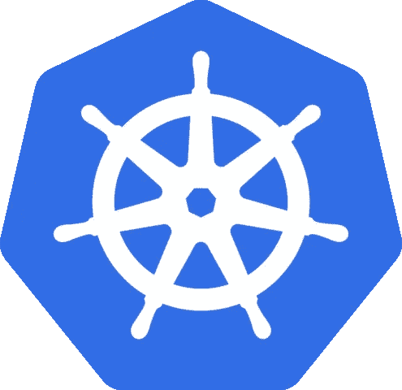
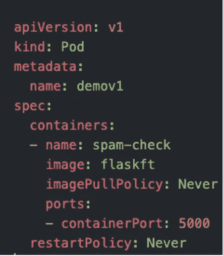

# 将基于 ML 的容器化(Docker) Web 应用程序部署到本地 Kubernetes 集群

> 原文：<https://medium.com/walmartglobaltech/deploying-an-ml-based-containerised-docker-web-application-to-a-local-kubernetes-cluster-f948824699df?source=collection_archive---------0----------------------->



Photo Credit: [Model as Service Deployment on Kubernetes](https://commons.wikimedia.org/wiki/File:Kubernetes_(container_engine).png)

## **1。** **简介**

W *随着机器学习* ***模式即服务*** *的发展，一个关键的方面是能够将这种服务打包在一个容器内并进行部署，以确保* ***的高可移植性、可用性&的可扩展性*** *。一个被广泛接受的解决方案是一个* ***容器，该容器又可以部署在一个容器编排平台上，如****【Kubernetes】****。***

*本文主要面向熟悉 Python/R 编程并希望了解使用容器化方法部署模型即服务的初始阻力的数据科学受众，容器化方法是 MLOps 框架不可或缺的一部分。*

在数据科学团队中，我们使用一个基于 Kubernetes 集群的内部平台，名为 Walmart Cloud-Native Platform(WCNP ),将相应的容器配置和代码文件部署到存储库中。这反过来会触发管道在 Kubernetes 集群上部署这个容器。

如图 1 所示，在最初的开发阶段，我们倾向于直接将它们部署到 Kubernetes 平台上，但我们可能会花费更多的时间来识别和调试许多 ML 代码相关或 docker 配置相关的问题。


Figure 1: Directly Deploying to platform & Debugging

一个直截了当的解决方案可能是开发整个管道，直到在本地机器上存在一个功能性的容器化解决方案，类似于在本地机器上开发一个基本的 ML 算法/就像一个游乐场——参见图 2 **。**

这个使得测试各种功能、探索配置和实验变得更加容易，我们可以简单地将这些文件移植到上面的 WCNP 相关管道(带有一些额外的集群配置)。总的来说，从而避免&减少任何主要的代码相关、docker 配置相关或集群相关问题。

看，解决这个问题的方法是一个简单的基于桌面的平台工具——***Docker 桌面。***


Figure 2: Use of Docker Desktop to debug common issues

在本地机器上研究和执行容器和 Kubernetes 部署的编码方面时，我发现了大量的材料(在下面的参考资料和许多问答站点中提到),包括各种代码、命令、系统/集群配置相关文件等。这涉及到几个小时的阅读和测试，只是为了让一个基本的 web 应用程序容器启动并运行。

因此，请记住，从数据科学家的角度来看，我计划准备本教程，它将列出在几分钟内在 Kubernetes 集群上运行 ML 模型部署所需的非常基本和必要的步骤。随着配置复杂性的增加，部署在云服务上的大多数基本命令将保持不变。

下面，我们列出了构建一个**基本 ML 垃圾邮件检测模型的步骤** &重点创建一个 **web 应用，**将其打包成一个 **Docker 容器** &将容器部署到本地的 **Kubernetes 集群**(在后端运行 minikube 单节点集群)。

## 目标

*   打包一个基于 ML 的示例 web 应用程序
*   使用 REST API 公开示例应用程序
*   创建、构建和运行 Docker 映像
*   使用 minikube 在本地创建集群
*   将容器部署到库伯内特家
*   测试服务

## **2。安装:**

**Docker 桌面**可以从[网站](https://www.docker.com/products/docker-desktop)下载，这将有助于使用 [**minikube**](https://minikube.sigs.k8s.io/docs/) 启动 **Kubernetes** 容器编排系统(有助于运行单节点 Kubernetes 集群进行日常开发工作)。除此之外，我们需要一个工作的 **Python** 编辑器，如 [Jupyter](https://jupyter.org/) 。

Docker 桌面安装后，进入**首选项- >启用 Kubernetes。**


Figure 3: Docker Desktop

## **3。开发 ML 模型:**

我们使用 [UCI 垃圾短信收集数据集](https://archive.ics.uci.edu/ml/datasets/sms+spam+collection)开发垃圾短信检测模型，该模型使用基本计数矢量器进行特征创建，使用随机森林模型进行预测。可以使用 tf-idf、基于上下文的向量等来进一步探索更复杂的模型。

任何中间输出都需要保存到一个存储空间中，这在预测阶段是必需的，比如本例中的词汇表和模型对象。

```
**#Save vectorizer vocabulary to storage**pickle.dump(cv.vocabulary_,open("feature.pkl","wb"))**#Save the model to storage**filename = 'model.pkl'pickle.dump(rfc, open(filename, 'wb'))**#Consumables:**· feature.pkl· Model.pkl
```

*模型输出:用逗号分隔的值，如 0 — ham，1 — spam*

## **4。将 ML 模型部署为 Flask 应用程序:**

Flask package 是一个基于 WSGI 的 web 应用程序框架，经常使用 REST API 将模型公开为服务，我们也会使用它。

Figure 4: Creating the Flask Deployment for the Spam Classifier Prediction

如图 4 所示，我们为预测加载了先前保存的对象，并确保创建了用于 API 调用的默认 IP 地址(0.0.0.0)和端口 5000。调试模式允许容易地检测错误。这个 Python 笔记本转换成*py 格式进行部署(app.py)。

可以检查基址处的默认“Hello world”以确保服务启动并运行，此外，我们将使用“/predict”扩展进行预测。

为了快速测试我们的应用程序，我们在同一个工作目录终端中使用下面的命令，确保 app.py 存在。您甚至可以使用 URL，并使用我们将进一步描述的代码进行预测。

> $ python3 -m 烧瓶运行


Figure 5:Flask app running successfully

## **5。构建&运行 Docker 容器映像:**

导航到与 app.py 相同的目录，并确保以相同的格式创建以下文件。

**Dockerfile** —在这个例子中，我们使用 python 的基本映像:3.6(在第一行中指定)。 **EXPOSE** 关键字允许容器在运行时监听指定的端口。

*根据应用的需要，具体的 docker 图像请参考*[](https://hub.docker.com/)**。**

**

*Figure 6: DockerFile Content*

***requirements.txt** —这是一个打包库的集合，下载起来更方便。通常，使用 pip freeze 命令，但是 **pipreqs** 包在仅捕获当前项目的依赖项方面工作得更好。*

> *$ pip freeze > requirements.txt*
> 
> *$ pip reqs/住宅/项目/位置*
> 
> *在/home/project/location/requirements . txt 中成功保存了需求文件*

*现在，使用 **app.py，*导航到该目录。pkl，docker file&requirements . txt**并在您的终端窗口中使用以下命令。*

***应用名称:** flaskft*

***版本名称:**开发 1*

> *docker build -t flaskft:develop1。*

**

*Figure 7: Successful Build of Container*

*我们现在可以使用下面的命令将我们的映像作为容器运行。*

> *docker run-it-d-p 5000:5000 flask ft:develop 1*

*Docker 可以使用-d 在分离模式下运行容器。*

*为了宣布容器的端口，我们在 run 命令中使用-p 标志，格式为[主机端口]:[容器端口]。因此，如果我们想将容器内部的端口 4000 暴露给容器外部的端口 2000，我们可以将 2000:4000 传递给-p 标志。*

*要检查容器的详细信息，我们可以使用 ps 命令。*

> *docker ps*

**

*Figure 8: Get Container Details*

*因此，每次您想要更改这个应用程序时，您可以更改版本名称并重新部署。*

## ***6。在 Kubernetes 集群上部署 Docker 容器***

*Kubernetes 是一个用于管理容器化工作负载和服务的开源平台，然后用于部署这个容器。虽然公共领域中有多个 Kubernetes 版本，但我们使用本地桌面部署，这需要使用 minikube 来运行单节点 Kubernetes 集群。*

*我们首先看一下需要的交付物。*

***yml 文件:**指定要创建的 pod 的配置。在这种配置中，我们在 pod 内部运行一个容器。*

**

*Figure 9: spamcheck.yml File*

****名称:*** 调配集装箱的名称。*

****imagePullPolicy:***Kubernetes 通常会尝试从 minikube docker 注册表或 public Docker 注册表中提取指定的图像，但在这种情况下，我们没有向其中任何一个注册表注册图像，因此需要声明这是“ **Never** 以防止出现错误。*

****图像:*** 使用与 docker 图像相同的图像名称。*

****restart policy:***restart policy 应用于 pod 中的所有容器，其可能值为 **Always、OnFailure 和 Never** 。虽然默认值是活动的，但我们将其设置为“从不”,因为这仅用于测试目的。*

****container port:***这是服务定位时访问属于 pod 的容器的端口号。*

*请确保正确缩进并删除多余的空格，否则可能会导致部署失败。确保这些文件存在于同一目录中。*

*现在，导航到包含上述文件的目录，在终端窗口中使用下面的命令。*

> *迷你库启动— *启动迷你库服务**
> 
> *eval $(minikube-p minikube docker-env)—*配置您的本地环境，以便在 minikube 实例中重用 Docker 守护进程。**
> 
> *docker build -t flaskft。— *我们需要使用上述环境变量配置进行重建，确保与容器创建期间指定的应用程序名称相同。**
> 
> *kubectl create-f spam check . yml—*将创建 pod 作为 demov1，并获得一个输出* ***，类似于创建的 pod/demov1。****
> 
> *kubectl 获取 pod—*查看 pod**

**

*Figure 10: Pod Status*

> *kubectl 端口转发演示 5000:5000 — *从本地机器到 pod 的端口转发。**

**

*Figure 11:Forwarding of requests to/from port*

## ***7。测试部署***

*为了测试这个部署，我们使用 localhost URL 来测试两个字符串是“ham”还是“spam”。*

*Figure 12: Hosted Spam Classifier Deployment Testing*

*如上所述，我们已经看到了如何使用容器来部署我们的机器学习解决方案，以及如何使用我们的本地机器来部署 Kubernetes，这些本地机器可以在新部署的初始阶段用于**开发/实验**目的。*

*总的来说，Docker 桌面使我们能够在本地机器上部署各种容器并与之交互。它提供了一个用户友好的 GUI 界面来执行与容器部署相关的常见操作，这对新用户非常有益。此外，在深入研究基于容器的配置和问题之前，它有助于验证部署的代码是否按预期工作。*

## *参考资料:*

> *[https://kubernetes . io/docs/concepts/workloads/controllers/deployment/](https://kubernetes.io/docs/concepts/workloads/controllers/deployment/)*
> 
> *https://docs.docker.com/engine/*
> 
> *【https://minikube.sigs.k8s.io/docs/start/ *
> 
> *[https://pypi.org/project/pipreqs/](https://pypi.org/project/pipreqs/)*