# 在 OCI 部署和集成 Hashicorp Vault

> 原文：<https://medium.com/oracledevs/deploying-and-integrating-hashicorp-vault-on-and-with-oci-cf9152b3d1a2?source=collection_archive---------0----------------------->

HashiCorp [Vault](https://www.vaultproject.io/) 是一款神奇的软件。你可以用它来[管理你的秘密](https://www.vaultproject.io/use-cases/secrets-management)，[保护你的应用数据安全](https://www.vaultproject.io/use-cases/data-encryption)或者[管理使用身份](https://www.vaultproject.io/use-cases/identity-based-access)访问不同的系统。

在本文中，我们将:

*   在 OCI 上部署一个 Vault 实例
*   把它和 OCI·KMS 结合起来
*   使用 OCI 对象存储作为 Vault 的存储后端
*   使用 OCI 身份验证方法通过用户和实例主体进行身份验证

准备好了吗？我们走吧。

## 创建基础设施和网络

让我们使用 [terraform-oci-base](https://github.com/oracle-terraform-modules/terraform-oci-base) 模块创建基础设施。你现在也可以从 [Terraform 注册表](https://registry.terraform.io/modules/oracle-terraform-modules/base/oci/1.1.3)中获得基本模块。

```
#base module
module "base" {
  source  = "oracle-terraform-modules/base/oci"
  version = "1.1.3" # identity
  oci_base_identity = local.oci_base_identity # general oci parameters
  oci_base_general = local.oci_base_general # vcn parameters
  oci_base_vcn = local.oci_base_vcn # bastion parameters
  oci_base_bastion = local.oci_base_bastion # admin server parameters
  oci_base_admin = local.oci_base_admin # tagging
  tagging = var.tagging}
```

您可以保留所有默认值，只需确保 bastion 主机已启用。

运行地形来创建 VCN 和堡垒。

接下来，创建 2 个没有任何安全列表的区域子网*。我们将使用网络安全组(NSG)来代替。1 个专用子网用于 vault 实例，另一个用于公共负载平衡器。*

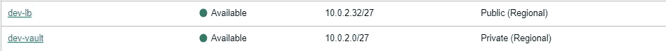

1 public and 1 private subnet

同样，在 VCN 创建两个 NSG:vault 和 lb。

对于跳马 NSG，您将需要以下规则:

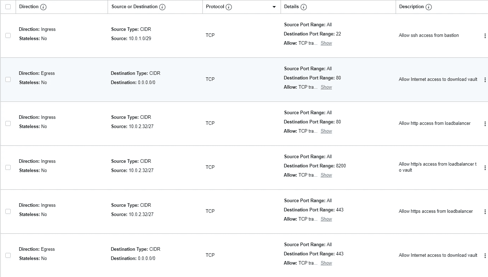

NSG rules for vault

对于负载平衡器 NSG，您将需要以下规则:

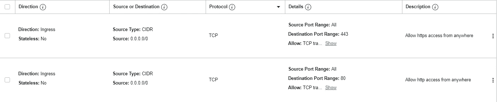

NSG rules for the load balancer

## 用于拱顶密封包装的 KMS

导航至安全>保险库，并[创建一个保险库](https://docs.cloud.oracle.com/en-us/iaas/Content/KeyManagement/Tasks/managingvaults.htm#createnewvault)，如果您还没有保险库的话。创建保险库后，[创建一个密钥](https://docs.cloud.oracle.com/en-us/iaas/Content/KeyManagement/Tasks/managingkeys.htm)。

## 作为保管库后端的 OCI 对象存储

导航到对象存储并创建两个存储桶:vault 和 vault_lock。选择客户管理的密钥

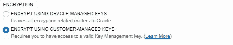

然后选择您在上一步中创建的保险库和密钥来加密这两个存储桶。

## 安装和配置 vault

使用默认的 Oracle Linux 映像创建一个计算实例，选择您的 VCN，然后确保在保险存储子网中创建保险存储实例，并使用保险存储 NSG。

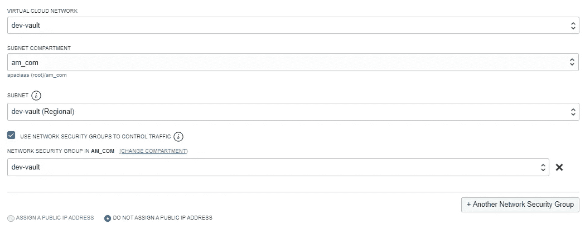

确保您还添加了您的 SSH 公钥，以便您可以访问它。

创建后，记下它的私有 ip 地址和实例 ocid:

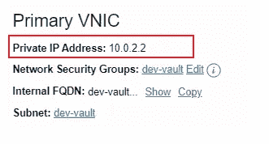

并且可以通过堡垒访问它:

```
ssh -i /path/to/private_key -J opc@<bastion_ip>  opc@10.0.2.2
```

我们现在将安装和配置 vault。

首先，安装以下软件包:

```
sudo yum install -y python3 chrony httpd socat
```

然后，以 root 用户身份安装 oci-cli:

```
sudo pip3 install oci-cli
```

配置防火墙 d:

```
firewall-offline — add-port=8200/tcp --permanent
firewall-offline — add-service=http --permanent
systemctl restart firewalld
```

现在下载并安装 vault:

```
wget [https://releases.hashicorp.com/vault/1.4.1/vault_1.4.1_linux_amd64.zip](https://releases.hashicorp.com/vault/${vault_version}/vault_${vault_version}_linux_amd64.zip)unzip vault_1.4.1_linux_amd64.zipchown root:root vaultmv vault /usr/local/binsetcap cap_ipc_lock=+ep /usr/local/bin/vaultmkdir -p /etc/vault.duseradd --system --home /etc/vault.d --shell /bin/false vault
```

在/etc/vault.d 中创建一个文件 vault.hcl，并输入以下内容:

```
api_addr = "[${api_addr}](http://0.0.0.0:8200)"cluster_name = "vault"default_lease_ttl = "5m"listener "tcp" { address       = "0.0.0.0:8200" tls_cert_file = "/path/to/fullchain.pem" tls_disable   = "true" tls_key_file  = "/path/to/privkey.pem"}log_level = "INFO"max_lease_ttl = "30m"seal "ocikms" { auth_type_api_key   = "false" crypto_endpoint     = ""  key_id              = "" management_endpoint = ""}storage "oci" { auth_type_api_key = "false" bucket_name       = "vault" ha_enabled        = "true" lock_bucket_name  = "vault_lock" namespace_name    = ""}ui = "true"
```

crypto_endpoint 和 management_endpoint 值可以在 vault 页面上获得。将鼠标悬停在它们上面，单击复制并粘贴到上面的值中。可以通过单击键并复制其 OCID 来获得 key_id。最后，对于 namespace_name，输入您的租赁名称。

设置正确的权限和所有权:

```
chmod 640 /etc/vault.d/vault.hclchown — recursive vault:vault /etc/vault.d
```

在/etc/systemd/system/vault . service 中为 vault 创建一个服务文件

```
[Unit]
Description="HashiCorp Vault - A tool for managing secrets"
Documentation=https://www.vaultproject.io/docs/
Requires=network-online.target
After=network-online.target
ConditionFileNotEmpty=/etc/vault.d/vault.hcl[Service]
User=vault
Group=vault
ProtectSystem=full
ProtectHome=read-only
PrivateTmp=yes
PrivateDevices=yes
SecureBits=keep-caps
AmbientCapabilities=CAP_IPC_LOCK
Capabilities=CAP_IPC_LOCK+ep
CapabilityBoundingSet=CAP_SYSLOG CAP_IPC_LOCK
NoNewPrivileges=yes
ExecStart=/usr/local/bin/vault server -config=/etc/vault.d/vault.hcl
ExecReload=/bin/kill --signal HUP $MAINPID
KillMode=process
KillSignal=SIGINT
Restart=on-failure
RestartSec=5
TimeoutStopSec=30
LimitNOFILE=65536
LimitMEMLOCK=infinity[Install]
WantedBy=multi-user.target
```

为 Apache 运行状况检查创建一个空白页面，并隐藏欢迎页面:

```
touch /var/www/html/status.html
touch /var/www/html/index.html
```

在启动服务之前，创建一个动态组用作 instance_principal，并添加以下规则:

```
instance.id = 'ocid1.instance.oc1.phx.anyhqljtpwxjxiqco6ludyauqasgtjoa4fkoxuy4rvvrdhn4yjgesgaujlkq'
```

您还可以使用规则构建器创建规则，并在属性下选择“匹配具有 ID 的实例”:

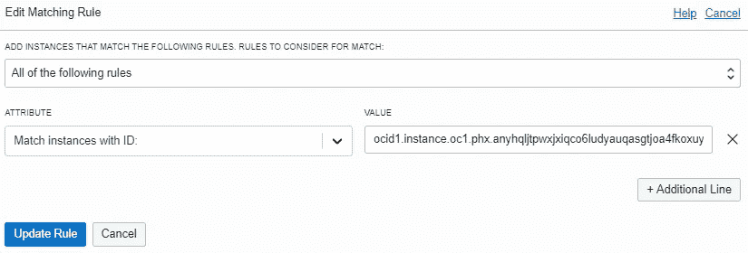

Creating a dynamic group

接下来，创建一个名为 vault-policies 的策略，并添加以下策略语句(用适当的值替换粗体的语句):

```
Allow dynamic-group **dynamic-group-name** to use keys in compartment id **compartment_id** where target.key.id = '**key_id**'
Allow dynamic-group **dynamic-group-name** to manage buckets in compartment id **compartment_id**
Allow dynamic-group **dynamic-group-name** to manage objects in compartment id **compartment_id**
Allow dynamic-group **dynamic-group-name** to use secrets in compartment id **compartment_id**
```

在根隔离专区中创建第二个 policy vault-identity-policies，并添加以下策略语句(将粗体字替换为相应的值):

```
Allow dynamic-group **dynamic-group-name** to {AUTHENTICATION_INSPECT} in tenancy
Allow dynamic-group **dynamic-group-name** to {GROUP_MEMBERSHIP_INSPECT} in tenancy
```

## 配置负载平衡器

导航到 Networking > Load Balancer，创建一个没有后端，只有一个 http 侦听器的负载平衡器。我们将分别创建后端

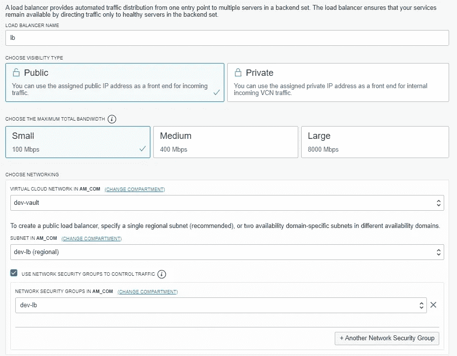

Creating a load balancer

创建 2 个后端集:http 和 https。

对于 http 后端，添加 vault 后端并将端口设置为 80。您不需要添加安全列表，因为您已经在使用 NSG。配置运行状况检查:

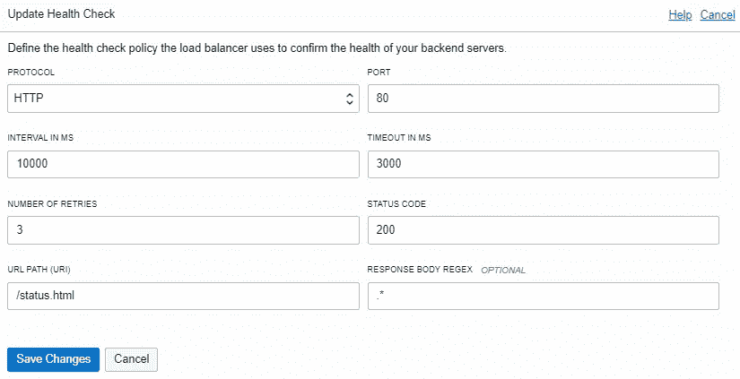

http backend health check

重复 https 后端设置，并将端口设置为 8200 和以下端口，以进行运行状况检查:

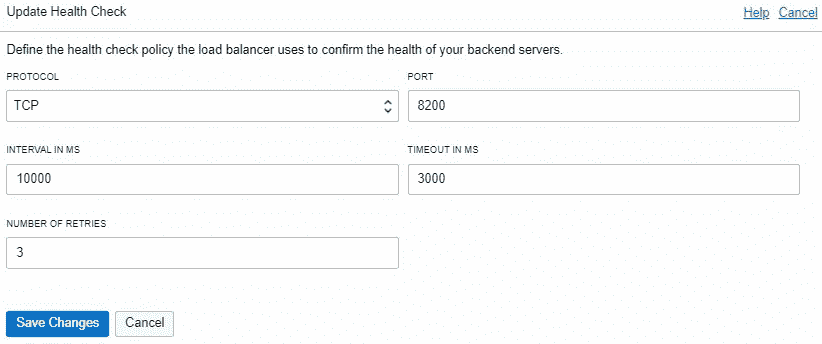

https health check

创建 http 和 https 侦听器。

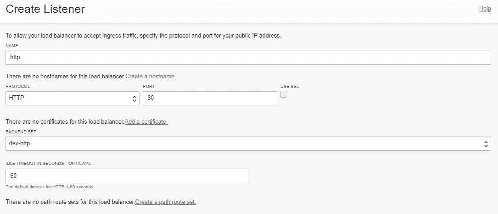

Creating an http listener

对 https 侦听器重复相同的操作:

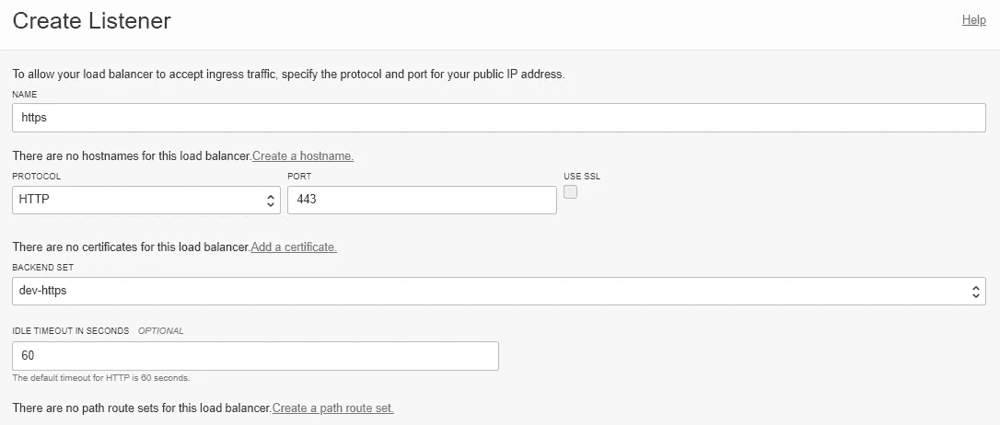

Creating an https listener

找到负载平衡器的公共 IP 地址并复制它。导航到 DNS 区域管理，并为您的域输入“A”记录。您可能想查看本文中[的“在 OCI 配置 DNS”一节。](/oracledevs/loadbalancer-service-oracle-container-engine-oke-and-oci-dns-d7b1f7b4f9bd)

## 完整的保险库配置

回到 vault 服务器，启用并启动服务:

```
systemctl enable vault
systemctl start vaultsystemctl enable httpd
systemctl start httpd
```

设置保管库地址:

```
export VAULT_ADDR=’http://127.0.0.1:8200'
```

初始化保管库:

```
vault operator init > key.txt
```

解封保管库:

```
for i in {1..3}
do
 vault operator unseal $(grep “Key $i” key.txt | awk ‘{ print $4; }’)
done
```

使用初始根令牌登录 vault:

```
export ROOT_TOKEN=$(grep ‘Initial Root Token:’ key.txt | awk ‘{print $NF}’)vault login $ROOT_TOKEN
```

启用 OCI 作为身份验证方法:

```
vault auth enable -path=oci oci
```

创建一个名为 hometenancyid.json 的文件(用实际值替换粗体显示的 tenancy_id):

```
{ "home_tenancy_id": "**tenancy_id**" }
```

设置房屋租赁:

```
curl --header "X-Vault-Token: $ROOT_TOKEN" --request PUT \--data @hometenancyid.json \[http://127.0.0.1:8200/v1/auth/oci/config](http://127.0.0.1:8200/v1/auth/oci/config)
```

创建管理员角色:

```
curl --header "X-Vault-Token: $ROOT_TOKEN" --request PUT \--data @vaultadminrole.json \[http://127.0.0.1:8200/v1/auth/oci/role/vaultadminrole](http://127.0.0.1:8200/v1/auth/oci/role/vaultadminrole)
```

## 使用“让我们加密”配置证书

安装 acme.sh:

```
curl [https://get.acme.sh](https://get.acme.sh) | sh
```

更改存储配置，以便重新启动可以正常工作

```
sudo sed -i 's/"\/path\/to\/fullchain.pem"/"\/etc\/vault.d\/fullchain.pem"/' /etc/vault.d/vault.hclsudo sed -i 's/"\/path\/to\/privkey.pem"/"\/etc\/vault.d\/key.pem"/' /etc/vault.d/vault.hclsudo sed -i 's/tls_disable = "true"/tls_disable = "false"/' /etc/vault.d/vault.hcl
```

颁发证书，更改所有权并重新启动 vault(用您在 DNS 中创建的 A 记录替换 fqdn:

```
sudo su/root/.acme.sh/acme.sh --issue -d **fqdn** -w /var/www/html/ \
--cert-file /etc/vault.d/cert.pem \
--key-file /etc/vault.d/key.pem \
--fullchain-file /etc/vault.d/fullchain.pem \
--ca-file /etc/vault.d/ca.pem \
--reloadcmd "chown vault:vault /etc/vault.d/*.pem && systemctl restart vault" --force
```

## 将负载平衡器配置为使用证书

在您之前创建的负载平衡器下，单击证书。然后点击“添加证书”

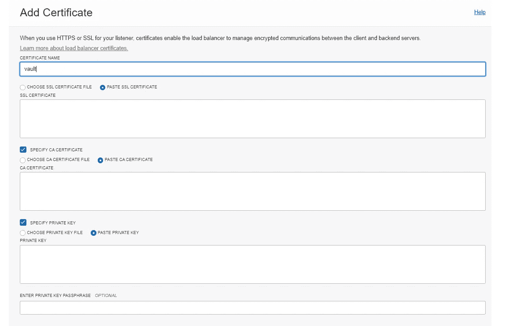

Creating a certificate

在 SSL 证书下，粘贴/etc/vault.d/fullchain.pem 的内容。

在 CA 证书下，粘贴/etc/vault.d/ca.pem 的内容。

在私钥下，粘贴/etc/vault.d/key.pem 的内容。

单击“添加证书”。

导航到“侦听器”并编辑 https 侦听器。选中“使用 SSL ”,选择证书并保存更改。

导航到“后端集”并编辑 https 后端集。选中“使用 SSL ”,选择证书并保存更改。

使用您的浏览器，导航到 [https:// **fqdn** /ui](https://fqdn/ui) (用您的 fqdn 替换)。

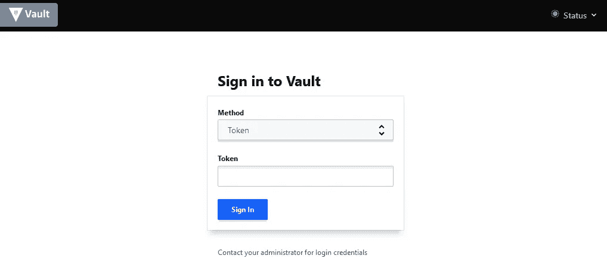

使用根令牌登录。

## **使用实例主体和用户身份进行认证**

在 vault 服务器上，创建名为 vaultadminrole.json 的文件，并输入以下内容(用 vault 实例主体动态组的 ocid 替换 ocid.dynamic.group.id):

```
{                                                                                                                                                                     
  "token_policies": "vaultadminpolicy",                                                                                                                               
  "token_ttl": "1800",                                                                                                                                                
  "ocid_list": "**ocid.dynamic.group.id**"                                                                 
}
```

编辑/etc/hosts 文件并添加(用您的文件替换 fqdn):

```
10.0.2.2 **fqdn**
```

将保管库地址设置为您的 fqdn:

```
export VAULT_ADDR='https://fqdn:8200'
```

再次登录:

```
vault login $ROOT_TOKEN
```

创建管理员角色:

```
curl --header "X-Vault-Token: $ROOT_TOKEN" --request PUT \
--data @vaultadminrole.json "${VAULT_ADDR}[/v1/auth/oci/role/vaultadminrole](http://127.0.0.1:8200/v1/auth/oci/role/vaultadminrole)"
```

使用 instance_principal 测试登录:

```
vault login -method=oci auth_type=instance role=vaultadminrole
```

您还可以使用您的 API 密匙测试[登录。您需要创建一个组，并将您的用户添加到该组中。然后将您的组 id 添加到 ocid_list(替换 group.id ),并将其保存到 devrole.json:](https://www.vaultproject.io/docs/auth/oci#manage-roles-in-the-oci-auth-method)

```
{ 
"token_policies": "devpolicy", 
"token_ttl": "1500", 
"ocid_list": "**group.id**"
}
```

添加新角色:

```
curl --header "X-Vault-Token: $ROOT_TOKEN" --request PUT \
--data @devrole.json "${VAULT_ADDR}[/v1/auth/oci/role/devrole](http://127.0.0.1:8200/v1/auth/oci/role/vaultadminrole)"
```

[安装 oci-cli](https://docs.cloud.oracle.com/en-us/iaas/Content/API/SDKDocs/cliinstall.htm) 和[配置](https://docs.cloud.oracle.com/en-us/iaas/Content/API/Concepts/sdkconfig.htm)。

最后，您可以使用您的 API 密钥登录:

```
vault login -method=oci auth_type=apikey role=devrole
```

## 摘要

请注意，本文不处理[高可用性](https://www.vaultproject.io/docs/concepts/ha)或[生产强化](https://learn.hashicorp.com/vault/operations/production-hardening)。有关这些信息，请参考 Vault 文档。

在未来的帖子中，我们还将看看在 OCI 上使用 Vault 的一些用例。

## **Gratus Aeternum**

*   [Kenneth Heung](https://github.com/heungheung)
*   阿维·米勒

## 文件和相关文章

开始使用:

[](https://learn.hashicorp.com/vault#getting-started) [## 跳马课程-哈希公司学习

### 了解如何为任何应用配置、保护、连接和运行任何基础架构。

learn.hashicorp.com](https://learn.hashicorp.com/vault#getting-started) 

[获取哈希公司保险库的根令牌](https://dev.to/v6/get-a-root-token-for-hashicorp-vault-2o9j)

[整合 OCI 认证方法](https://www.vaultproject.io/docs/auth/oci)

[整合金库和 OCI KMS](https://www.vaultproject.io/docs/configuration/seal/ocikms)

[集成金库和 OCI 对象存储](https://www.vaultproject.io/docs/configuration/storage/oci-object-storage)

[使用加密 SSL 保护 Hashicorp 保险库](/@dwdraju/securing-hashicorp-vault-with-lets-encrypt-ssl-19cad1eb294)

[Acme.sh](https://github.com/acmesh-official/acme.sh)