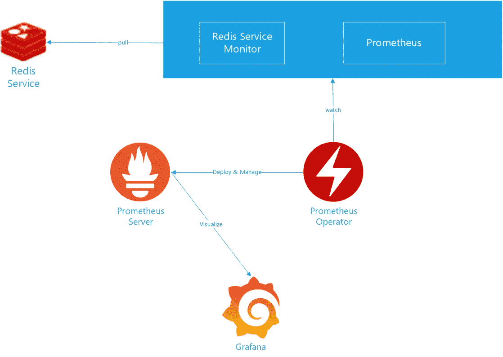
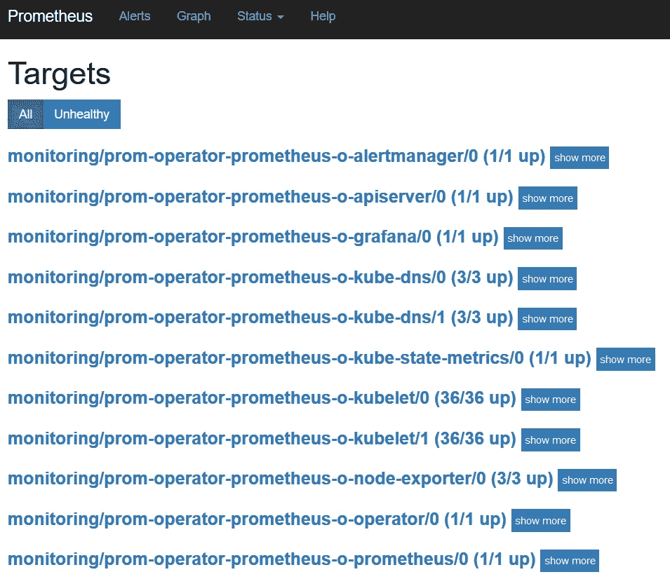
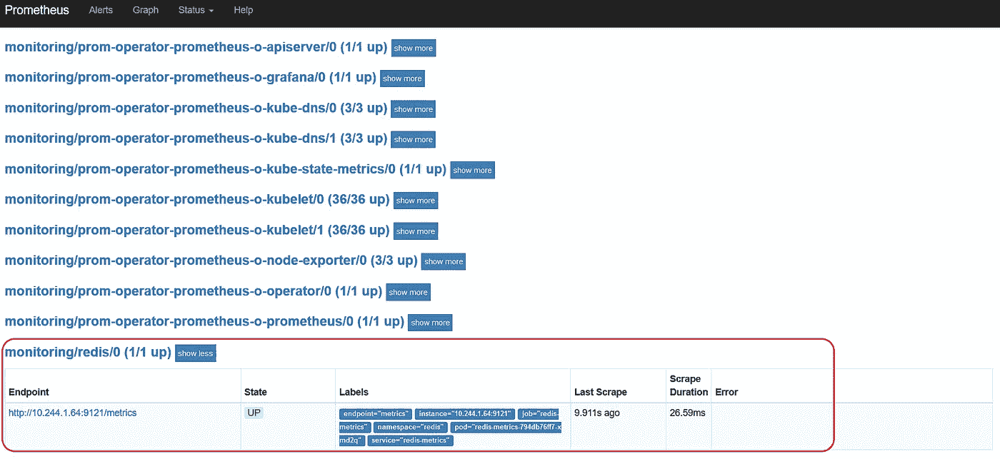
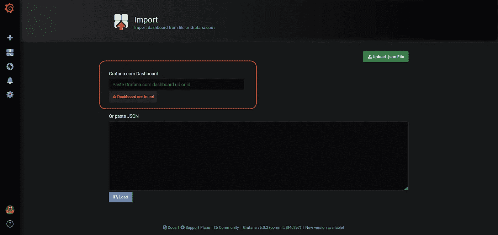
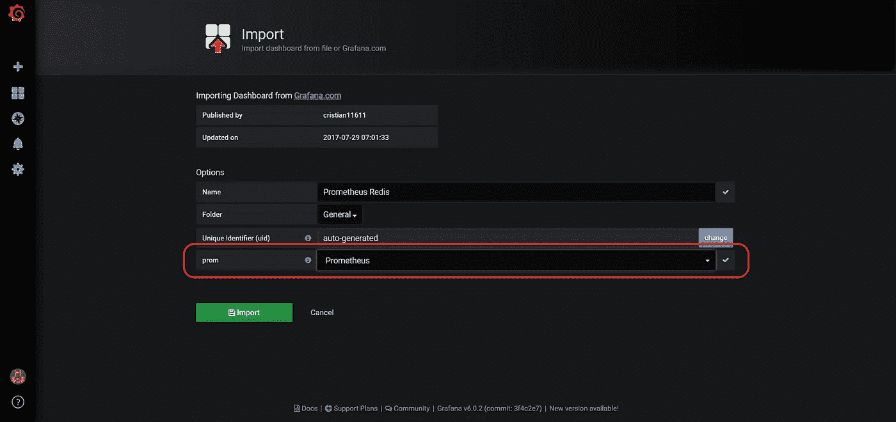
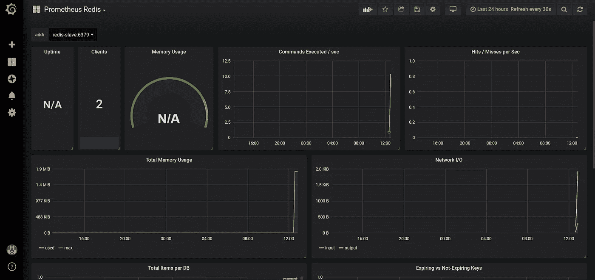
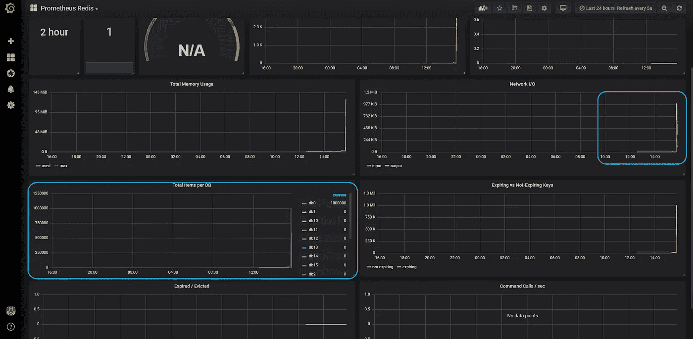

# 部署和监控 Redis 集群到 Oracle 容器引擎(OKE)

> 原文：<https://medium.com/oracledevs/deploying-and-monitoring-a-redis-cluster-to-oracle-container-engine-oke-5f210b91b800?source=collection_archive---------0----------------------->

在[之前的帖子](/@lmukadam/extending-terraform-oke-with-a-helm-chart-a51ae0df29d4)中，我们为 [terraform-oci-oke](https://github.com/oracle-terraform-modules/terraform-oci-oke) 项目添加了一个简单的扩展，以便它使用 [Redis helm chart](https://github.com/helm/charts/tree/master/stable/redis) 在 Kubernetes 上部署 Redis 集群。

在这篇文章中，我们将尝试一些更有雄心的东西:

*   像前一篇文章中一样部署一个 Redis 集群
*   用普罗米修斯监控 Redis 集群
*   使用 Redis 批量插入，用现有数据填充 Redis 集群
*   使用 Grafana 可视化体量插入过程

为了方便起见，我们将手动部署 Prometheus 和 Redis。但是，如果您使用的是 [terraform-oci-oke](https://github.com/oracle-terraform-modules/terraform-oci-oke) 模块(或者任何 Kubernetes 集群)，您可以通过使用 helm 提供程序获得相同的结果，如前一篇文章所述。

## 体系结构

从概念上讲，这就是我们正在努力做的事情:



## 部署普罗米修斯操作员

为普罗米修斯创建一个名称空间:

```
kubectl create namespace monitoring
```

如果您使用的是 terraform-oci-oke 模块，并且已经配置了 bastion 主机，则 helm 已经为您安装并预配置好了。只需登录堡垒并部署普罗米修斯操作员:

```
helm install --namespace monitoring \
stable/prometheus-operator \
--name prom-operator \
--set kubeDns.enabled=true \
**--set prometheus.prometheusSpec.serviceMonitorSelectorNilUsesHelmValues=false** \
--set coreDns.enabled=false \
--set kubeControllerManager.enabled=false \
--set kubeEtcd.enabled=false \
--set kubeScheduler.enabled=false
```

将 serviceMonitorSelectorNilUsesHelmValues 设置为 false 可确保选择所有 ServiceMonitors。

获取一份吊舱列表并识别普罗米修斯吊舱:

```
kubectl -n monitoring get pods | grep prometheusalertmanager-prom-operator-prometheus-o-alertmanager-0   2/2     Running   0          18s                                                        
prom-operator-prometheus-node-exporter-9xhzr             1/1     Running   0          24s                                                        
prom-operator-prometheus-node-exporter-qtbvv             1/1     Running   0          24s                                                        
prom-operator-prometheus-node-exporter-wjbfp             1/1     Running   0          24s                                                        
prom-operator-prometheus-o-operator-79ff98787f-4t4k7     1/1     Running   0          23s                                                        
**prometheus-prom-operator-prometheus-o-prometheus-0**       3/3     Running   1          11s
```

在另一个终端上，设置本地 KUBECONFIG 环境变量，并在本地运行 kubectl port-forward 来访问 Prometheus 表达式浏览器:

```
export KUBECONFIG=generated/kubeconfigkubectl -n monitoring port-forward prometheus-prom-operator-prometheus-o-prometheus-0 9090:9090
```

打开浏览器并访问 Prometheus Expression 浏览器，以验证 http://localhost:9090/targets 上的目标



Prometheus targets

接下来，我们要验证 Grafana 是否已经正确配置，并且已经将 Prometheus 作为数据源。获取 pod 列表并识别 Grafana pods:

```
kubectl -n monitoring get pods | grep grafanaprom-operator-grafana-77cdf86d94-m8pv5 2/2     Running   0          57s
```

在本地运行 kubectl port-forward 来访问 Grafana:

```
kubectl -n monitoring port-forward prom-operator-grafana-77cdf86d94-m8pv5 3000:3000
```

通过将浏览器指向 http://localhost:3000 来访问 Grafana

使用 admin/prom-operator 登录(默认用户名和密码，如果您没有更改它们)。您应该能够看到默认的 Kubernetes 仪表板。

## 部署 Redis 集群

为 redis 创建命名空间:

```
kubectl create namespace redis 
```

使用 helm 部署 Redis 集群:

```
helm install --namespace redis \
stable/redis \
--name redis \
--set cluster.enabled=true \
--set cluster.slaveCount=3 \
--set master.persistence.size=50Gi \
--set slave.persistence.size=50Gi \
--set metrics.enabled=true \
--set metrics.serviceMonitor.enabled=true \
--set metrics.serviceMonitor.namespace=monitoring
```

再次访问 Prometheus 表达式浏览器，并验证 Redis 现在是否列为目标之一:



Prometheus now with Redis target

## 为 Grafana 导入 Redis 仪表板

如上所述再次登录 Grafana，点击左侧菜单中的“+”图标，导入仪表板，并在 Grafana.com 仪表板字段中输入仪表板 id 2751:



加载仪表板后，选择 Prometheus 数据源:



然后点击导入。现在，Grafana 中应该有一个正常工作的 Redis 仪表板:



## 将数据批量插入 Redis

现在让我们将数据[批量插入](https://redis.io/topics/mass-insert)到 Redis 中。我发现这个[整洁的宝石](http://blog.mostafazh.me/2015/07/21/fastest-way-to-import-big-csv-to-redis/)加载一个 csv 到 redis。

给定以下格式的 csv 文件:

```
id, first name, age, gender, nickname, salary
1, John Smith, 40, Male, John, 10000
2, Marco Polo, 43, Male, Marco, 10000
….
1999999, Tom Cruse, 50, Male, Tom, 10001
```

可以使用以下命令将其导入 Redis:

```
awk -F, 'NR > 1{ print "SET", "\"employee_"$1"\"", "\""$0"\"" }' file.csv | redis-cli --pipe
```

首先，我们必须生成数据集。我们将使用[模拟](https://github.com/lk-geimfari/mimesis)包:

```
pip install mimesis
```

我们将稍微修改一下模式，这样我们就可以利用 mimesis 提供的任何东西，通过 Python 创建一个 csv 文件:

```
import csvfrom mimesis import Personfrom mimesis.enums import Genderen = Person('en')with open('file.csv',mode='w') as csv_file:field_names = ['id', 'full name', 'age', 'gender', 'username', 'weight']writer = csv.DictWriter(csv_file, fieldnames=field_names)writer.writeheader()for n in range(100000):writer.writerow({'id': str(n), 'first name': en.full_name(), 'age': str(en.age()), 'gender': en.gender(), 'username':en.username(), 'weight':str(en.weight())})
```

运行 python 脚本来生成数据:

```
python names.py
```

这将在当前目录下创建一个 file.csv 文件。您可以[配置一个 PersistentVolume](https://kubernetes.io/docs/tasks/configure-pod-container/configure-persistent-volume-storage/) 来存储和加载数据，但是出于本练习的目的，我们将通过在 bastion 中安装 redis 来做一个快速破解:

```
sudo yum install redis -y
```

这将允许我们从生成/上传 file.csv 的堡垒中使用 redis-cli。

在 bastion 上，获取 Redis pods 列表:

```
kubectl -n redis get podsNAME                             READY   STATUS    RESTARTS   AGE                                                                                
redis-master-0                   1/1     Running   0          156m                                                                               
redis-metrics-794db76ff7-xmd2q   1/1     Running   0          156m                                                                               
redis-slave-7fd8b55f7-25w8d      1/1     Running   1          156m                                                                               
redis-slave-7fd8b55f7-hvhmc      1/1     Running   1          156m                                                                               
redis-slave-7fd8b55f7-mjq8q      1/1     Running   1          156m
```

并使用端口转发到，以便您可以使用 redis-cli 访问它:

```
k -n redis port-forward redis-master-0 6379:6379
Forwarding from 127.0.0.1:6379 -> 6379
```

打开一个新的终端，登录到 bastion 并获得 Redis 密码:

```
export REDIS_PASSWORD=$(kubectl get secret --namespace redis redis -o jsonpath="{.data.redis-password}" | base64 --decode)
```

做一个快速测试，看看您能否连接到 Redis:

```
redis-cli -a $REDIS_PASSWORD127.0.0.1:6379> ping                                                                                                                                                        
PONG                                                                                                                                                                        
127.0.0.1:6379>
```

在我们导入 csv 之前，通过打开第三个终端并在本地运行 kubectl port-forward *，如上所述访问 Grafana (http://localhost:3000)。*浏览 Redis 仪表板，并将刷新频率设置为每 5 秒钟一次:

```
kubectl -n monitoring port-forward prom-operator-grafana-77cdf86d94-m8pv5 3000:3000
```

现在导入 csv 文件，如下所示:

```
awk -F, 'NR > 1{ print "SET", "\"employee_"$1"\"", "\""$0"\"" }' file.csv | redis-cli -a $REDIS_PASSWORD --pipeAll data transferred. Waiting for the last reply...                                                                                                                   
Last reply received from server.                                                                                                                                      
errors: 0, replies: 1000000
```

并观看 Grafana 的 Redis 仪表板。您可以看到网络 IO、数据库中的项目数量以及使用的内存量的快速增长。



Redis Dashboard after mass insertion

虽然我们使用 cli 手动安装了 Prometheus Operator 和 Redis 集群，但您也可以使用 Terraform helm provider 来实现。当您在 Redis 上启用监控时，您需要确保创建了相关的 CRD。当您按照上面的顺序手动操作时，这已经为您完成了。

但是，当您使用 Terraform 进行配置时，您需要按如下方式明确设置顺序:

```
resource "helm_release" "prometheus-operator" {
  ...
  ...
  ...}resource "helm_release" "redis" { depends_on = ["helm_release.prometheus-operator"]
  ...
  ...
  ...}
```

通过执行上述操作，您可以确保首先创建 prometheus-operator 版本以及 redis 版本需要的必要 CRD(例如 Alertmanager、prometheus、PrometheusRule、ServiceMonitor ),以便 Prometheus 能够监视 Redis 集群。